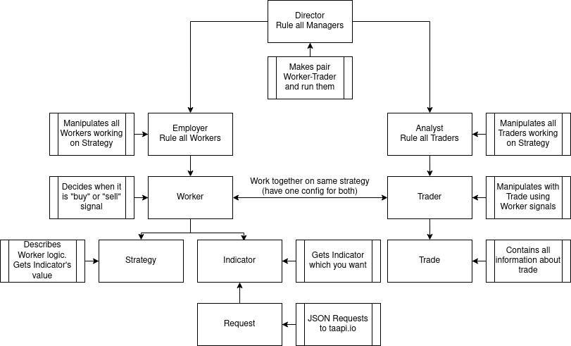
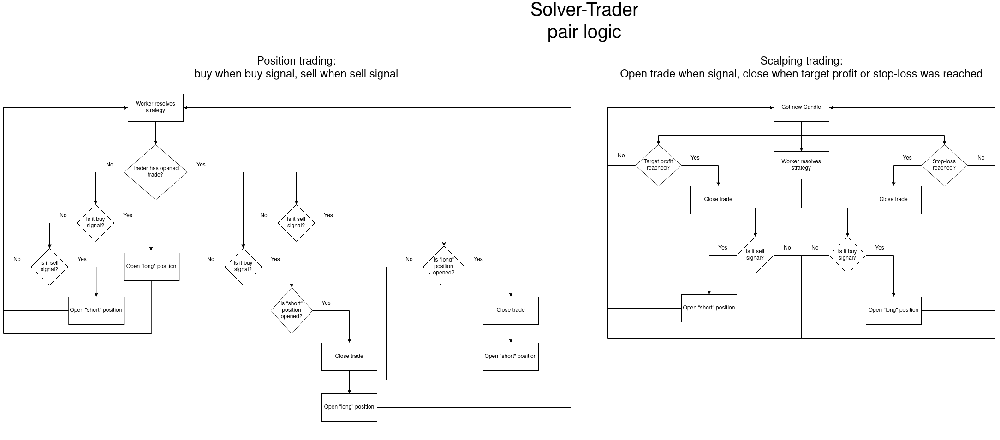

# TraderBot
## Project logic
<center></img></center>

## Solver-Trader pair logic
<center></img></center>

# Backtesting
Download data
```bash
python3 scripts/download_data.py --timeframe 12h --symbol BTCUSDT --start 2021 --end 2022
```

Download big dataset
```bash
bash scripts/download_big_data.sh
```

**WARNING:** After you have downloaded dataset you should delete last column in csv file to avoid error.

Start backtesting for strategy
```C
Tester tester(
    "../data/",
    taapi_key
);
tester.backtest<Strategies::Normalized_MACD_Cross>(
    jf["strategies"]["normalized_macd_cross"]["1"],
    10000.0
);
```
Start backtesting for indicator
```C
nlohmann::json indicator_params = {
    {"interval", "1d"},
    {"period", 30}
};
Tester tester(
    "../data/",
    taapi_key
);
tester.backtest_indicator<Indicators::Integral::SMA>(
    indicator_params,
    "BTCUSDT",
    "1d"
);
```