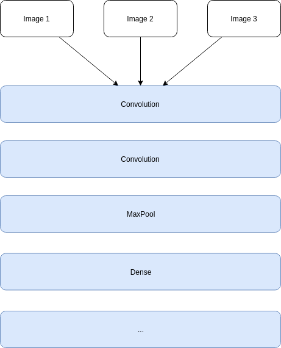
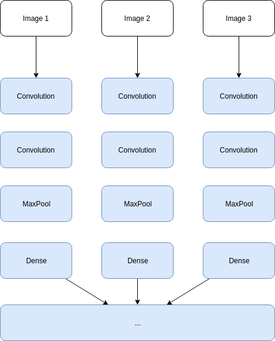
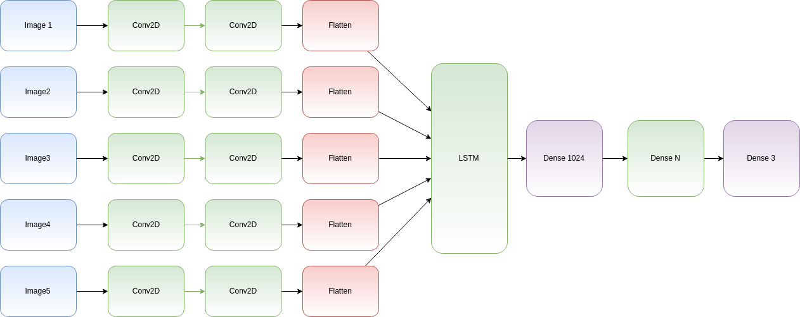
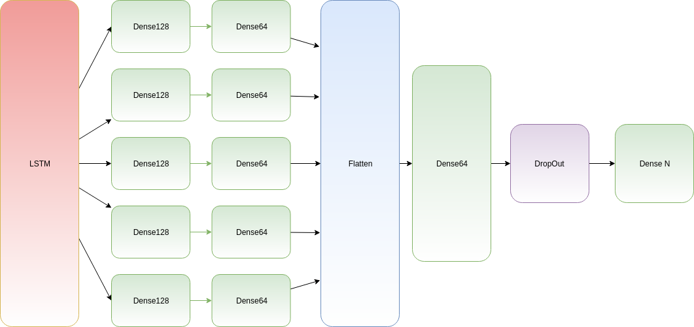

# Time Distributed data
## The problem
If you already worked with Convolution Neural Networks (C-NN), you’ve probably created models that take only one image to be classified.<br>

But what if you need to present several images that are chronologically ordered to detect movements, actions, directions…? What we need is to be able to inject a sequence as input, and to make predictions of what that sequence is showing.<br>

OK, commonly, a C-NN receives only one image and we make convolution on that one. The goal is to find features on those images that will help to make a “prediction” to guess the object on that image.<br>

For example, we present an image of a cat, and the model says “it’s a cat”.
But now, we don’t want to make that. We want… but we need to make “more” because the expected result is not “a cat”, but “a cat is jumping”.
You realize that what we need is to find features to find the cat, then use these features in “LSTM” to try to react on movements (or distortions). Finding a jumping cat now needs:
- find the cat on each frame
- then check if the cat movement corresponds to the "jumping" action
  
The problem is that we’ve got not only “one image” to manage, but we’ve also got potentially 2, 5,… 10 images to inject in the model. And we need to make convolutions for each image.<br>

The next image is what we **don't want to do**
<center></img></center>

The next image is what we **need to do**:
<center></img></center>

For example, if we need to inject 5 images that have the shape (224, 224, 3) (244x224 with 3 RGB channels): we need to add one dimension to present 5 x (224, 224, 3) — the shape is now (5, 224, 224, 3)
```python
model.add(
    TimeDistributed(
        Conv2D(64, activation='relu'),
        input_shape=(5, 224, 224, 3)
    )
)
```

Example (VGG)
```python
model = Sequential()# input, with 64 convolutions for 5 images
# that have (224, 224, 3) shape
model.add(
    TimeDistributed(
        Conv2D(64, (3,3), 
            padding='same', strides=(2,2), activation='relu')
        input_shape = (5, 224, 224, 3)
    )
)
model.add(
    TimeDistributed( 
        Conv2D(64, (3,3), 
            padding='same', strides=(2,2), activation='relu')
    )
)
model.add(
    TimeDistributed(
        MaxPooling2D((2,2), strides=(2,2))
    )
)# Second conv, 128
model.add(
    TimeDistributed(
        Conv2D(128, (3,3),
            padding='same', strides=(2,2), activation='relu')
    )
)
model.add(
    TimeDistributed( 
        Conv2D(128, (3,3),
            padding='same', strides=(2,2), activation='relu')
    )
)
model.add(
    TimeDistributed(
        MaxPooling2D((2,2), strides=(2,2))
    )
)## and so on with 512, 1024... 
## ...# then we can use Flatten to reduce dimension to 1
model.add(Flatten())## and then... merge the entire outputs to
## be able to use Dense(), and make predictions...
model.add(Dense(10))
# ...
```

## LSTM and TimeDistributed layers
There are commonly 2 possibilities:
- make convolution or other neural computation before LSTM
- make the same kind of work after LSTM

For our example, we need to check an object in motion, so we need to search the object before detecting the movement. So, here, we need to make convolutions before LSTM.<br>

For another example, as cryptocurrency evolution, you can filter input values in time with LSTM, then make some manipulation on the output to find evidence. In this case, you can usefully connect layers after LSTM block.

### TimeDistributed before LSTM
```python
model = Sequential()# after having Conv2D...
model.add(
    TimeDistributed(
        Conv2D(64, (3,3), activation='relu'), 
        input_shape=(5, 224, 224, 3) # 5 images...
    )
)
model.add(
    TimeDistributed(
        Conv2D(64, (3,3), activation='relu')
    )
)# We need to have only one dimension per output
# to insert them to the LSTM layer - Flatten or use Pooling
model.add(
    TimeDistributed(
        GlobalAveragePooling2D() # Or Flatten()
    )
)# previous layer gives 5 outputs, Keras will make the job
# to configure LSTM inputs shape (5, ...)
model.add(
    LSTM(1024, activation='relu', return_sequences=False)
)# and then, common Dense layers... Dropout...
# up to you
model.add(Dense(1024, activation='relu'))
model.add(Dropout(.5))# For example, for 3 outputs classes 
model.add(Dense(3, activation='sigmoid'))model.compile('adam', loss='categorical_crossentropy')
```

<center></img></center>

### TimeDistributed after LSTM
This time, we need to set up LSTM to produce a sequence. We can imagine that we want to inject 5 items of 10 values and make some transformation on the sequence that LSTM can produce.<br>

But this time, we want to make a fully connected computation on each filtered element. LSTM is not only a “filter”, but it also keeps each input computation in memory, so we can retrieve them to make our manipulation.<br>

That’s what the return_sequences attribute provides. LSTM will now produce 5 outputs that can be time distributed.
```python
model = Sequential()# a model with LSTM layers, we are using 5 frames of 
# shape (10, 20)
model.add(
    LSTM(1024, 
        activation='relu',
        return_sequences=True,
        input_shape=(5, 10)
    )
)# LSTM outputs 5 items 
# that is the correct shape to continue to work.
# We need to get several outputs and make the same
# process on each sequence item:
model.add(TimeDistributed(
    Dense(128, activation='relu')
))
model.add(TimeDistributed(
    Dense(64, activation='relu')
))# Flatten, then Dense... Dropout...
# note: Flatten should not be time distributed because here,
# we want to have only one dimension for the next layers
model.add(Flatten())
model.add(Dense(64))
model.add(Dropout(.5))# use N outputs
model.add(Dense(N, activation='softmax'))
```

<center></img></center>


