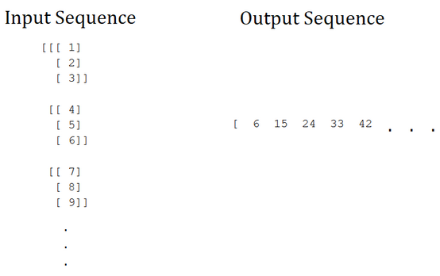
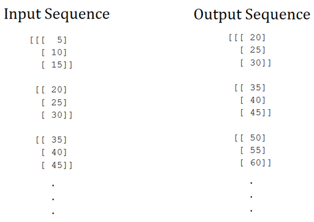

# **Models architecture**
## Stock price prediction
- ### LSTM Classic
<center></img></center>

#### **One-to-Many**
One-to-many sequence problems are sequence problems where the input data has one time-step, and the output contains a vector of multiple values or multiple time-steps. Thus, we have a single input and a sequence of outputs. A typical example is image captioning, where the description of an image is generated. Check out this amazing "Generate Meaningful Captions for Images with Attention Models" report by Rajesh Shreedhar Bhat and Souradip Chakraborty to learn more.

```python
model = Sequence()
model.add(LSTM(50, activation='relu', input_shape=(1, 1)))
model.add(Dense(2))

model.compile(optimizer="adam", loss="mse")
wandb.init(entity='ayush-thakur', project='dl-question-bank')
model.fit(
    X, Y, 
    epochs=1000, 
    validation_split=0.2, 
    batch_size=3, 
    callbacks=[WandbCallback()]
)
```

#### **Many-to-One**
In many-to-one sequence problems, we have a sequence of data as input, and we have to predict a single output. Sentiment analysis or text classification is one such use case.

<center></img></center>

```python
tf.keras.backend.clear_session()
model = Sequential()
model.add(LSTM(50, activation='relu', input_shape=(3, 1)))
model.add(Dense(1))

model.compile(optimizer='adam', loss='mse')

wandb.init(entity='ayush-thakur', project='dl-question-bank')

history = model.fit(
    X, Y, 
    epochs=1000, 
    validation_split=0.2, 
    verbose=1, 
    callbacks=[WandbCallback()]
)
```

### **Many-to-Many**
Many-to-Many sequence learning can be used for machine translation where the input sequence is in some language, and the output sequence is in some other language. It can be used for Video Classification as well, where the input sequence is the feature representation of each frame of the video at different time steps. 

<center></img></center>

```python
model = Sequential()

# encoder layer
model.add(LSTM(100, activation='relu', input_shape=(3, 1)))

# repeat vector
model.add(RepeatVector(3))

# decoder layer
model.add(LSTM(100, activation='relu', return_sequences=True))

model.add(TimeDistributed(Dense(1)))
model.compile(optimizer='adam', loss='mse')

print(model.summary())

wandb.init(entity='ayush-thakur', project='dl-question-bank')

history = model.fit(
    X, Y, 
    epochs=1000, 
    validation_split=0.2, 
    verbose=1, 
    batch_size=3, 
    callbacks=[WandbCallback()]
)
```

- ### Peephole Connections

- ### GRU

- ### Bidirectional

- ### Multiplicative LSTM

- ### LSTMs With Attention

- ### MaxPooling

- ### CNN

- ### CNN + LSTM
```python
# FIRST WAY
# define CNN model
cnn = Sequential()
cnn.add(Conv2D(...))
cnn.add(MaxPooling2D(...))
cnn.add(Flatten())
# define LSTM model
model = Sequential()
model.add(TimeDistributed(cnn, ...))
model.add(LSTM(..))
model.add(Dense(...))

# SECOND WAY
model = Sequential()
# define CNN model
model.add(TimeDistributed(Conv2D(...))
model.add(TimeDistributed(MaxPooling2D(...)))
model.add(TimeDistributed(Flatten()))
# define LSTM model
model.add(LSTM(...))
model.add(Dense(...))
```

- ### CNN + BiLSTM
- ## RLSTM
- ## TDNN

## News analyse
- ### BERT model

- ### NLP model


