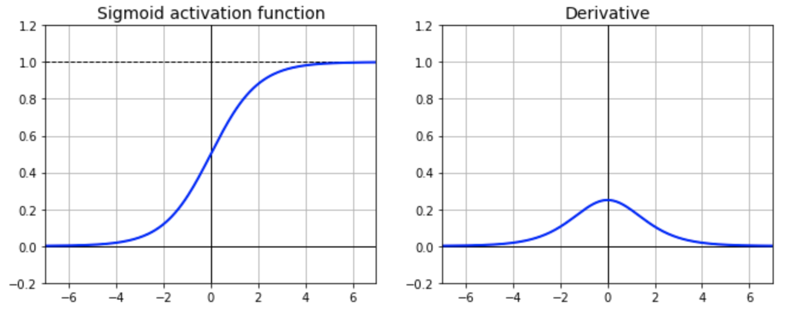
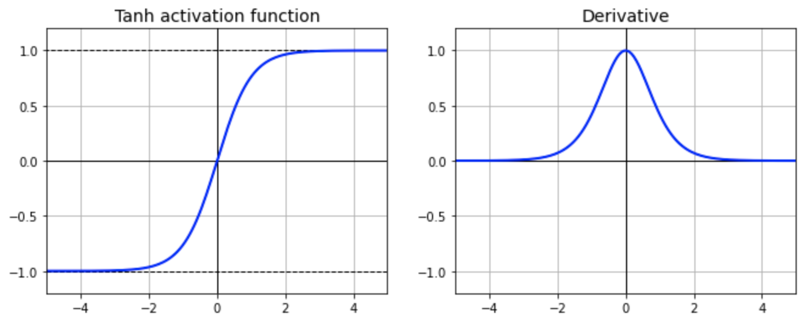
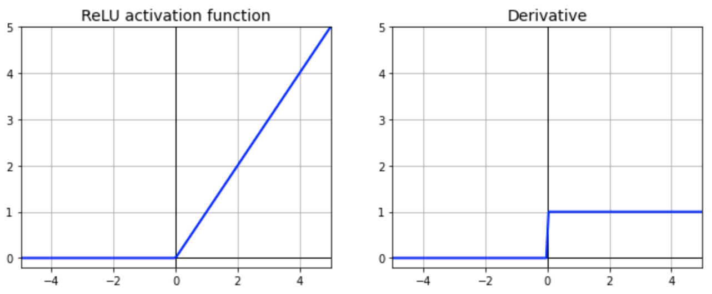
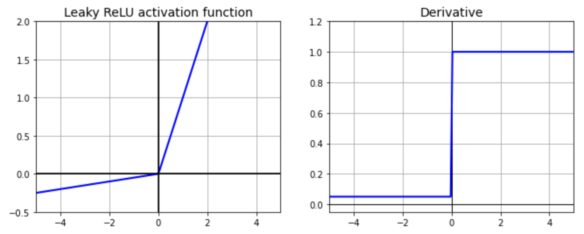
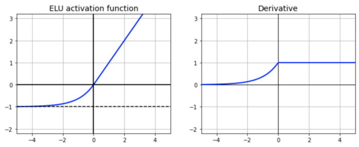
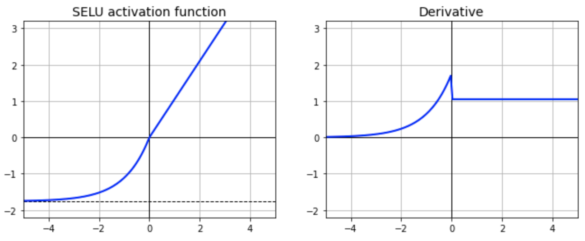

# **Activation functions**
### An activation function defines an output signal that defines it as an input signal or a set of input signals. 
**How to choose activation function**
1. Sigmoid functions and their combinations generally work better in the case of classifiers
2. Sigmoids and tanh functions are sometimes avoided due to the vanishing gradient problem
3. ReLU function is a general activation function and is used in most cases these days
4. If we encounter a case of dead neurons in our networks the leaky ReLU function is the best choice
5. Always keep in mind that ReLU function should only be used in the hidden layers
6. As a rule of thumb, you can begin with using ReLU function and then move over to other activation functions in case ReLU doesn’t provide with optimum results

- ## sigmoid
```python
Dense(10, activation="sigmoid")
```
</img>

- ## tanh
```python
Dense(10, activation="tanh")
```
</img>

- ## relu
```python
Dense(10, activation="relu")
```
</img>

- ## leaky_relu
```python
from tensorflow.keras.layers import LeakyReLU, Dense
leaky_relu = LeakyReLU(alpha=0.01)
Dense(10, activation=leaky_relu)
```
</img>

- ## Parametric Leaky ReLU
Same as leaky_relu, but parameter are trained
```python
from tensorflow.keras.layers import PReLU, Dense
para_relu = PReLU()
Dense(10, activation=para_relu)
```

- ## Exponential Linear Unit (ELU)
</img>
```python
Dense(10, activation="elu")
```

- ## Scaled Exponential Linear Unit (SELU)
```python
Dense(10, activation="relu", kernel_initializer="lecun_normal")
```
</img>