# **Loss function**
### The loss is computed to get the gradients with respect to model weights and update those weights accordingly via backpropagation. Loss is calculated and the network is updated after every iteration until model updates don’t bring any improvement in the desired evaluation metric.

- ## Binary crossentropy
Binary classification loss function comes into play when solving a problem involving just two classes. For example, when predicting fraud in credit card transactions, a transaction is either fraudulent or not.
```python
model.compile(
    loss=tf.keras.losses.BinaryCrossentropy(
        from_logits=True
    )
)
```
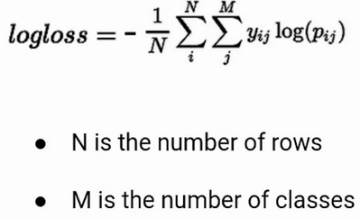</imb>

- ## Mean squared error
Use Mean Squared Error when you desire to have large errors penalized more than smaller ones. 
```python
model.compile(
    loss=tf.keras.losses.MeanSquaredError()
)
```
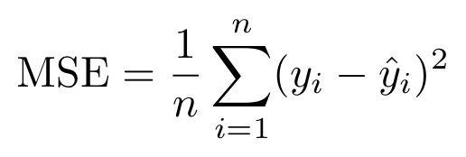</img>

- ## Mean absolute error
Consider using this loss when you want a loss that you can explain intuitively. People understand percentages easily. The loss is also robust to outliers.
```python
model.compile(
    loss=tf.keras.losses.MeanAbsoluteError()
)
```
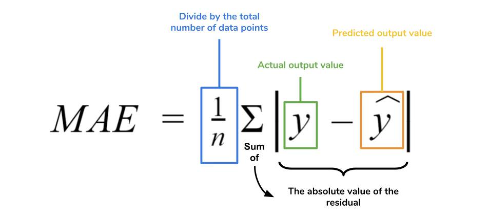</img>

- ## Mean absolute percentage error
```python
model.compile(
    loss=tf.keras.losses.MeanAbsolutePercentageError()
)
```
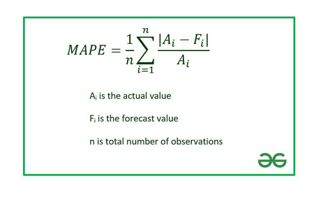</img>

- ## Mean squared logarithmic error
Mean Squared Logarithmic Error penalizes underestimates more than it does overestimates. It’s a great choice when you prefer not to penalize large errors, it is, therefore, robust to outliers. 
```python
model.compile(
    loss=tf.keras.losses.MeanSquaredLogarithmicError()
)
```
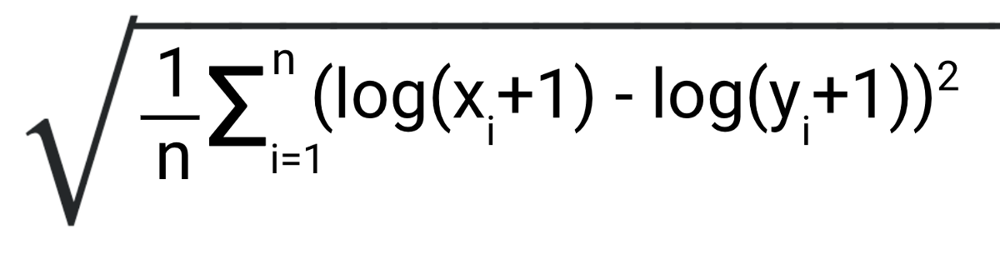</img>

- ## Cosine Similarity Loss
If your interest is in computing the cosine similarity between the true and predicted values, you’d use the CosineSimilarity class
```python
model.compile(
    loss=tf.keras.losses.CosineSimilarity(axis=1)
)
```
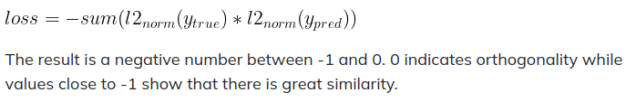</img>

- ## Huber error<br>
loss function used in robust regression, that is less sensitive to outliers in data than the squared error loss. A variant for classification is also sometimes used. For regression problems that are less sensitive to outliers, the Huber loss is used. 
```python
model.compile(
    loss=tf.keras.losses.Huber()
)
```
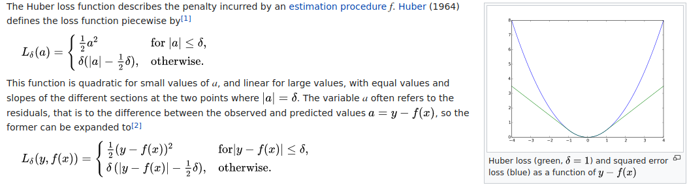</img>

- ## LogCosh
LogCosh Loss works like the mean squared error, but will not be so strongly affected by the occasional wildly incorrect prediction
```python
model.compile(
    loss=tf.keras.losses.LogCosh()
)
```
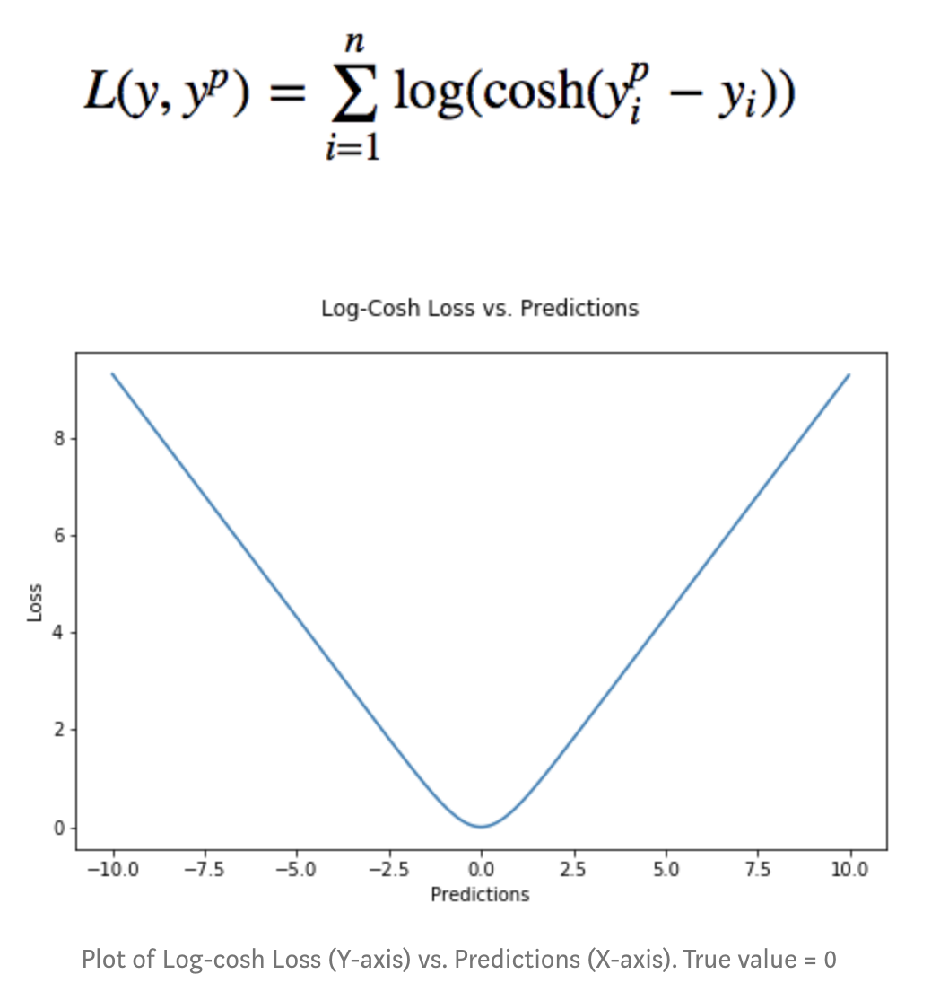</img>

- ## Hinge error
```python
model.compile(
    loss=tf.keras.losses.Hinge()
)
```
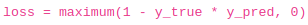</img>

- ## SquaredHinge
```python
model.compile(
    loss=tf.keras.losses.SquaredHinge()
)
```
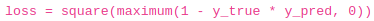</img>

- ## Categorical crossentropy
The CategoricalCrossentropy also computes the cross-entropy loss between the true classes and predicted classes.
```python
model.compile(
    loss=tf.keras.losses.CategoricalCrossentropy()
)
```
</img>

- ## Sparse categorical crossentropy
If you have two or more classes and  the labels are integers, the SparseCategoricalCrossentropy should be used
```python
model.compile(
    loss=tf.keras.losses.SparseCategoricalCrossentropy()
)
```
</img>

- ## Categorical hinge
```python
model.compile(
    loss=tf.keras.losses.CategoricalHinge()
)
```
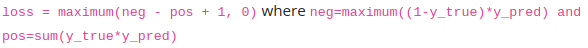</img>

- ## Poison loss
You can also use the Poisson class to compute the poison loss. It’s a great choice if your dataset comes from a Poisson distribution for example the number of calls a call center receives per hour.
```python
model.compile(
    loss=tf.keras.losses.Poisson()
)
```

- ## Kullback-Leibler Divergence loss
KL divergence is a useful distance measure for continuous distributions and is often useful when performing direct regression over the space of (discretely sampled) continuous output distributions.
```python
model.compile(
    loss=tf.keras.losses.KLDivergence()
)
```