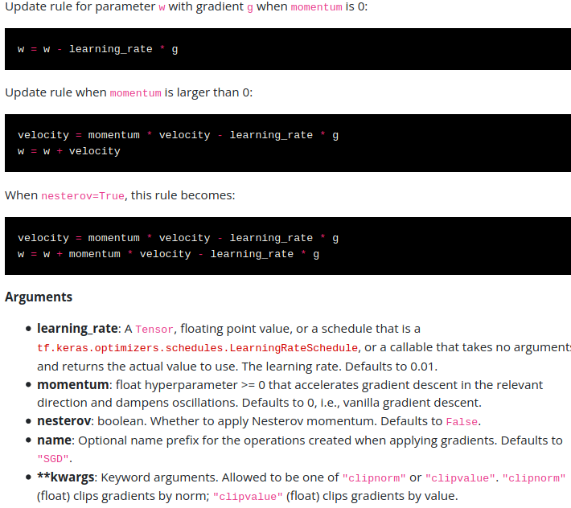
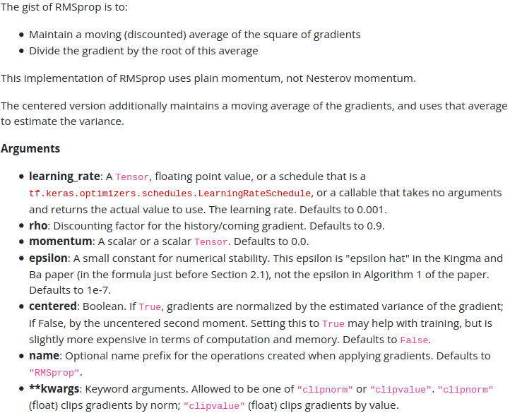
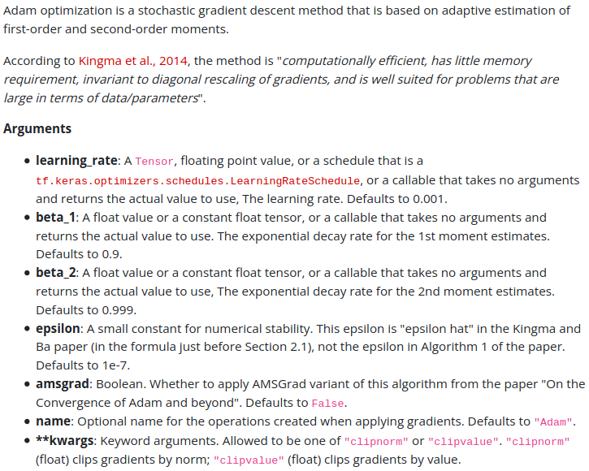
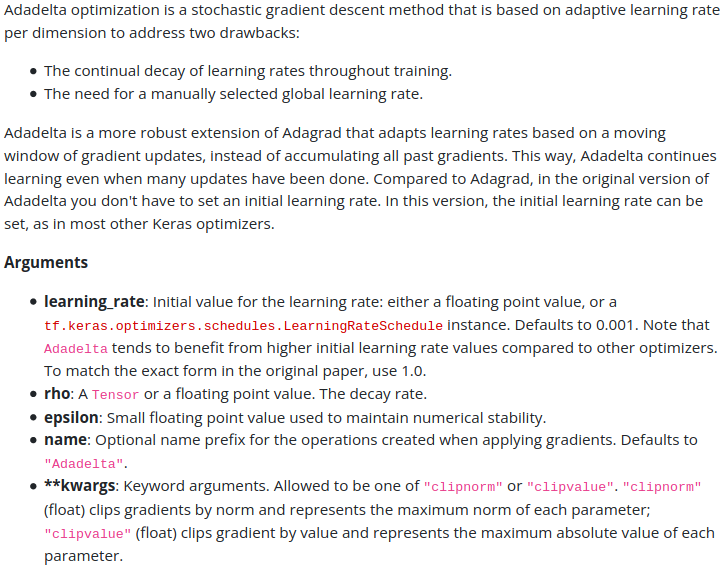
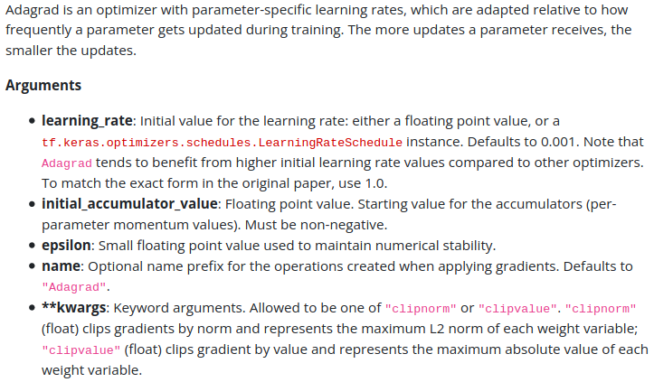
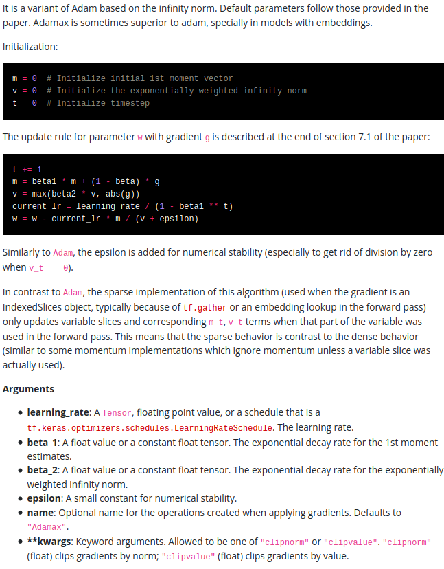
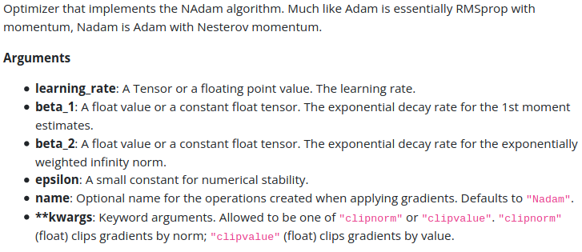
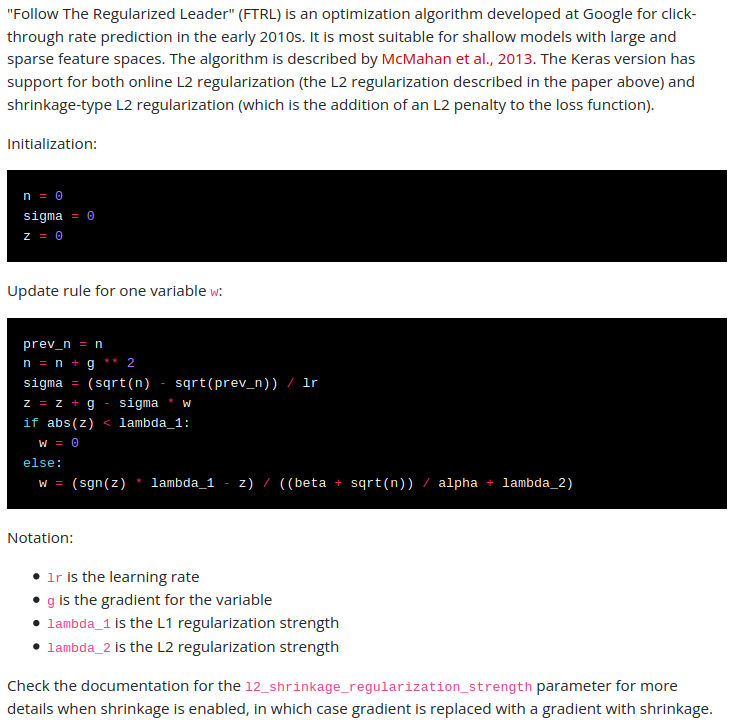
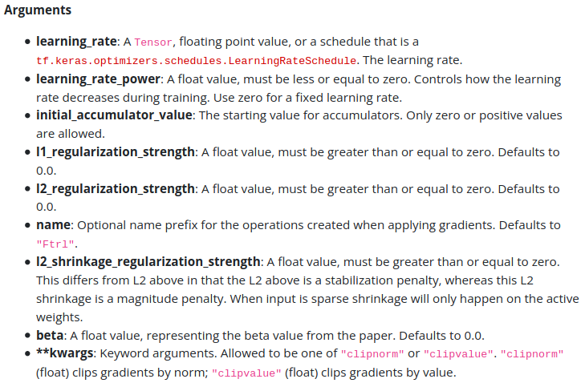

# **Optimizers**

### Optimizers are algorithms or methods used to minimize an error function (loss function) or to maximize the efficiency of production.
<br>

### Although your mileage will vary, in general SELU > ELU > leaky ReLU (and its variants) > ReLU > tanh > logistic. If the network’s architecture prevents it from self-normalizing, then ELU may perform better than SELU (since SELU is not smooth at z = 0). If you care a lot about runtime latency, then you may prefer leaky ReLU. If you don’t want to tweak yet another hyperparameter, you may just use the default α values used by Keras (e.g., 0.3 for the leaky ReLU). If you have spare time and computing power, you can use cross-validation to evaluate other activation functions, in particular, RReLU if your network is over‐fitting, or PReLU if you have a huge training set.
- ## SGD
SGD performs redundant computations for bigger datasets, as it recomputes gradients for the same example before each parameter update. It performs frequent updates with a high variance that cause the objective function to fluctuate heavily
```python
tf.keras.optimizers.SGD(
    learning_rate=0.01, 
    momentum=0.0, 
    nesterov=False, 
    name="SGD", 
    **kwargs
)
```
</img>

- ## RMSprop
It is an exclusive version of Adagrad developed by Geoffrey Hinton, now the thinking behind this optimizer was pretty straight forward: instead of letting all of the gradients accumulate for momentum, it only accumulates gradients in a specific fix window. It is exactly like Adaprop(an updated version of Adagrad with some improvement)
```python
tf.keras.optimizers.RMSprop(
    learning_rate=0.001,
    rho=0.9,
    momentum=0.0,
    epsilon=1e-07,
    centered=False,
    name="RMSprop",
    **kwargs
)
```
</img>

- ## Adam
Adam stands for adaptive moment estimation, which is another way of using past gradients to calculate current gradients, Adam utilizes the concept of momentum by adding fractions of previous gradients to the current one, it is practically accepted in many projects during training neural nets.
```python
tf.keras.optimizers.Adam(
    learning_rate=0.001,
    beta_1=0.9,
    beta_2=0.999,
    epsilon=1e-07,
    amsgrad=False,
    name="Adam",
    **kwargs
)
```
</img>

- ## Adadelta
Now like the RMSprop optimizer, Adadelta is another more improved optimization algorithm, here delta refers to the difference between the current weight and the newly updated weight. Adadelta removed the use of the learning rate parameter completely and replaced it with an exponential moving average of squared deltas. 
```python
tf.keras.optimizers.Adadelta(
    learning_rate=0.001, 
    rho=0.95, 
    epsilon=1e-07, 
    name="Adadelta", 
    **kwargs
)
```
</img>

- ## Adagrad
Adagrad adapts the learning rate specifically with individual features: it means that some of the weights in your dataset have different learning rates than others. It always works best in a sparse dataset where a lot of inputs are missing.
```python
tf.keras.optimizers.Adagrad(
    learning_rate=0.001,
    initial_accumulator_value=0.1,
    epsilon=1e-07,
    name="Adagrad",
    **kwargs
)
```
</img>

- ## Adamax
As the name suggests AdaMax is an adaptation of Adam optimizer, by the same researchers who wrote the Adam algorithm
```python
tf.keras.optimizers.Adamax(
    learning_rate=0.001, 
    beta_1=0.9, 
    beta_2=0.999, 
    epsilon=1e-07, 
    name="Adamax", 
    **kwargs
)
```
</img>

- ## Nadam
NAdam optimizer is an acronym for Nesterov and Adam optimizer. Now this Nesterov component is way more efficient than its previous implementations. Nadam used Nesterov to update the gradient. 
```python
tf.keras.optimizers.Nadam(
    learning_rate=0.001, 
    beta_1=0.9, 
    beta_2=0.999, 
    epsilon=1e-07, 
    name="Nadam", 
    **kwargs
)
```
</img>

- ## Ftrl
According to algorithm 1 of the research paper by google, This version has support for both online L2 (the L2 penalty given in the paper above) and shrinkage-type L2 (which is the addition of an L2 penalty to the loss function).
```python
tf.keras.optimizers.Ftrl(
    learning_rate=0.001,
    learning_rate_power=-0.5,
    initial_accumulator_value=0.1,
    l1_regularization_strength=0.0,
    l2_regularization_strength=0.0,
    name="Ftrl",
    l2_shrinkage_regularization_strength=0.0,
    beta=0.0,
    **kwargs
)
```
</img>
</img>