# Averages
This document contains all basic averages.

# Content Table
* [Simple Moving Average](#sma)
* [Weighted moving average](#wma)
* [Exponential Moving Average](#ema) 
* [Volume-Weighted Average Price](#vwap)
* [Moving Average Convergence Divergence](#macd)
* [Balling Band Average](#ball)

# Simple Moving Average (SMA) 
A simple moving average (SMA) is an arithmetic moving average calculated by adding recent prices and then dividing that figure by the number of time periods in the calculation average.  

For example, one could add the closing price of a security for a number of time periods and then divide this total by that same number of periods. Short-term averages respond quickly to changes in the price of the underlying security, while long-term averages are slower to react. 
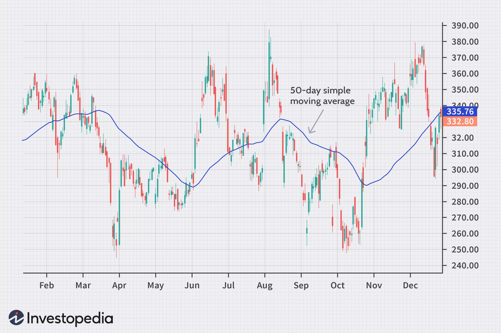</img> 
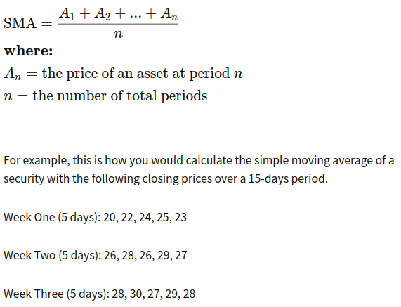</img> 

A simple moving average is customizable because it can be calculated for different numbers of time periods. This is done by adding the closing price of the security for a number of time periods and then dividing this total by the number of time periods, which gives the average price of the security over the time period. A simple moving average smooths out volatility and makes it easier to view the price trend of a security. If the simple moving average points up, this means that the security's price is increasing. If it is pointing down, it means that the security's price is decreasing. The longer the time frame for the moving average, the smoother the simple moving average. A shorter-term moving average is more volatile, but its reading is closer to the source data. 

## **Analytical Significance**
Moving averages are an important analytical tool used to identify current price trends and the potential for a change in an established trend. The simplest use of an SMA in technical analysis is using it to quickly identify if a security is in an uptrend or downtrend. Another popular, albeit slightly more complex, analytical use is to compare a pair of simple moving averages with each covering different time frames. If a shorter-term simple moving average is above a longer-term average, an uptrend is expected. On the other hand, if the long-term average is above a shorter-term average then a downtrend might be the expected outcome. 

## **How Are Simple Moving Averages (SMAs) Used in Technical Analysis?**
Traders use simple moving averages (SMAs) to chart the long-term trajectory of a stock or other security, while ignoring the noise of day-to-day price movements. This allows traders to compare medium and long term trends over a larger time horizon. For example, if the 200-day SMA of a security falls below its 50-day SMA, this is usually interpreted as a bearish death cross pattern and a signal of further declines. The opposite pattern, the golden cross, indicates potential for a market rally.

## **Simple Moving Average vs. Exponential Moving Average**
The major difference between an exponential moving average (EMA) and a simple moving average is the sensitivity each one shows to changes in the data used in its calculation. More specifically, the EMA gives a higher weighting to recent prices, while the SMA assigns an equal weighting to all values.  

The two averages are similar because they are interpreted in the same manner and are both commonly used by technical traders to smooth out price fluctuations. Since EMAs place a higher weighting on recent data than on older data, they are more reactive to the latest price changes than SMAs are, which makes the results from EMAs more timely and explains why the EMA is the preferred average among many traders. 

## **Limitations of Simple Moving Average (SMA)**
It is unclear whether or not more emphasis should be placed on the most recent days in the time period or on more distant data. Many traders believe that new data will better reflect the current trend the security is moving with. At the same time, other traders feel that privileging certain dates than others will bias the trend. Therefore, the SMA may rely too heavily on outdated data since it treats the 10th or 200th day's impact just as much as the first or second. 

# Weighted moving average (WMA) 
Weighted average is a calculation that takes into account the varying degrees of importance of the numbers in a data set. In calculating a weighted average, each number in the data set is multiplied by a predetermined weight before the final calculation is made.  

A weighted average can be more accurate than a simple average in which all numbers in a data set are assigned an identical weight.  

In calculating a simple average, or arithmetic mean, all numbers are treated equally and assigned equal weight. But a weighted average assigns weights that determine in advance the relative importance of each data point.  

A weighted average is most often computed to equalize the frequency of the values in a data set. For example, a survey may gather enough responses from every age group to be considered statistically valid, but the 18-34 age group may have fewer respondents than all others relative to their share of the population. The survey team may weight the results of the 18-34 age group so that their views are represented proportionately.  
## Weighting a Stock Portfolio
Investors usually build a position in a stock over a period of several years. That makes it tough to keep track of the cost basis on those shares and their relative changes in value. 

The investor can calculate a weighted average of the share price paid for the shares. In order to do so, multiply the number of shares acquired at each price by that price, add those values and then divide the total value by the total number of shares. 

For example, say an investor acquires 100 shares of a company in year one at $10, and 50 shares of the same stock in year two at $40. To get a weighted average of the price paid, the investor multiplies 100 shares by $10 for year one and 50 shares by $40 for year two, and then adds the results to get a total of $3,000. Then the total amount paid for the shares, $3,000 in this case, is divided by the number of shares acquired over both years, 150, to get the weighted average price paid of $20.  

Weighted moving averages assign a heavier weighting to more current data points since they are more relevant than data points in the distant past. The sum of the weighting should add up to 1 (or 100 percent). In the case of the simple moving average, the weightings are equally distributed
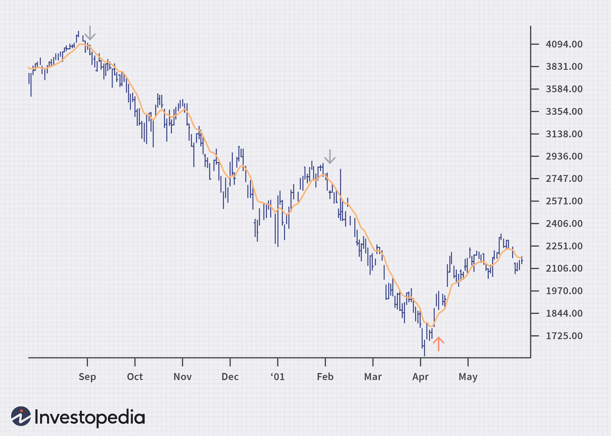</img>
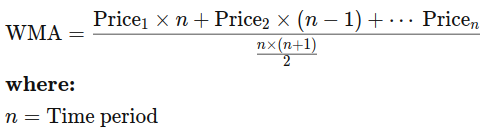</img>

## How does a weighted average differ from a simple average?
A weighted average accounts for the relative contribution, or weight, of the things being averaged, while a simple average does not. Therefore, it gives more value to those items in the average that occur relatively more.

## What are some examples of weighted averages used in finance?
Many weighted averages are found in finance, including the volume weighted average price (VWAP), the weighted average cost of capital (WACC), and exponential moving averages (EMAs) used in charting. Construction of portfolio weights and the LIFO and FIFO inventory methods also make use of weighted averages.

## How is a weighted average calculated?
You can compute a weighted average by multiplying its relative proportion or percentage by its value in sequence and adding those sums together. Thus if a portfolio is made up of 55% stocks, 40% bonds, and 5% cash, those weights would be multiplied by their annual performance to get a weighted average return. So if stocks, bonds, and cash returned 10%, 5%, and 2%, respectively, the weighted average return would be (0.55 x 10%) + (0.40 x 5%) + (0.05 x 2%) = 7.6%.

# Exponential Moving Average (EMA) 
Over the years, technicians have found two problems with the simple moving average. The first problem lies in the time frame of the moving average (MA). Most technical analysts believe that price action, the opening or closing stock price, is not enough on which to depend for properly predicting buy or sell signals of the MA's crossover action. To solve this problem, analysts now assign more weight to the most recent price data by using the exponentially smoothed moving average (EMA).  

Exponential moving averages (EMAs) are also weighted toward the most recent prices, but the rate of decrease between one price and its preceding price is not consistent. The difference in the decrease is exponential. Rather than every preceding weight being 1.0 smaller than the weight in front of it, there might be a difference between the first two period weights of 1.0, a difference of 1.2 for the two periods after those periods, and so on
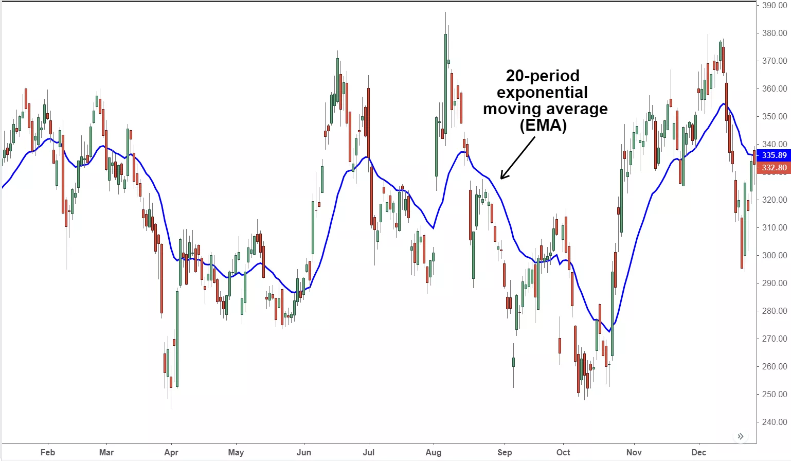</img>
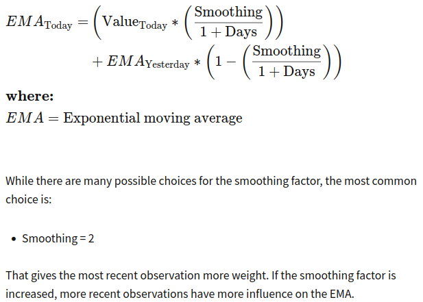</img>

## What Does the Exponential Moving Average Tell You? 
The 12- and 26-day exponential moving averages (EMAs) are often the most quoted and analyzed short-term averages. The 12- and 26-day are used to create indicators like the moving average convergence divergence (MACD) and the percentage price oscillator (PPO). In general, the 50- and 200-day EMAs are used as indicators for long-term trends. When a stock price crosses its 200-day moving average, it is a technical signal that a reversal has occurred. 
These signals can create havoc when used improperly or misinterpreted. All the moving averages commonly used in technical analysis are, by their very nature, lagging indicators

# Volume-Weighted Average Price (VWAP) 
The volume-weighted average price (VWAP) is a trading benchmark used by traders that gives the average price a security has traded at throughout the day, based on both volume and price.   
VWAP is important because it provides traders with insight into both the trend and value of a security.   
</img>
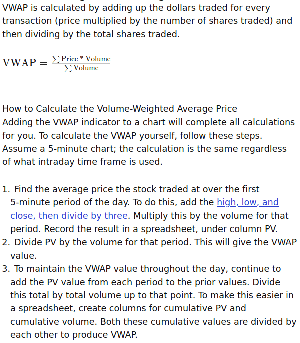</img>
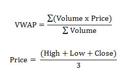</img>

## **What Does VWAP Tell You?**
Large institutional buyers and mutual funds use the VWAP ratio to help move into or out of stocks with as small of a market impact as possible. Therefore, when possible, institutions will try to buy below the VWAP, or sell above it. This way their actions push the price back toward the average, instead of away from it. 

Traders may use VWAP as a trend confirmation tool, and build trading rules around it. For example, when the price is above VWAP, they may prefer to initiate long positions. When the price is below VWAP they may prefer to initiate short positions. 

## **Limitations of Using the Volume-Weighted Average Price**
VWAP is a single-day indicator and is restarted at the open of each new trading day. Attempting to create an average VWAP over many days could mean that the average becomes distorted from the true VWAP reading as described above. 

While some institutions may prefer to buy when the price of a security is below the VWAP, or sell when it is above, VWAP is not the only factor to consider. In strong uptrends, the price may continue to move higher for many days without dropping below the VWAP at all or only occasionally. Therefore, waiting for the price to fall below VWAP could mean a missed opportunity if prices are rising quickly.  

VWAP is based on historical values and does not inherently have predictive qualities or calculations. Because VWAP is anchored to the opening price range of the day, the indicator increases its lag as the day goes on. This can be seen in the way a 1-minute period VWAP calculation after 330 minutes (the length of a typical trading session) will often resemble a 390-minute moving average at the end of the trading day. 

## **What Is the Volume-Weighted Average Price (VWAP)?**
The volume-weighted average price (VWAP) is a measurement that shows the average price of a security, adjusted for its volume. It is calculated by taking the total dollar value of trading in the security and dividing it by the volume of trades during that period.

## **Why Is the Volume-Weighted Average Price (VWAP) Important?**
The VWAP is used by traders who wish to see a smoothed-out indication of a security’s price over time. It is also used by larger traders who need to ensure that their trades do not move the price of the security they are trying to buy or sell. 

For example, a hedge fund might refrain from submitting a buy order for a price above the security’s VWAP, in order to avoid artificially inflating the price of that security. Likewise, it might avoid submitting orders too far below the VWAP, so that the price is not dragged down by its sale. 

# Moving Average Convergence Divergence (MACD) 
## **What Is Moving Average Convergence Divergence (MACD)?**
Moving average convergence divergence (MACD) is a trend-following momentum indicator that shows the relationship between two moving averages of a security’s price. The MACD is calculated by subtracting the 26-period exponential moving average (EMA) from the 12-period EMA. 

The result of that calculation is the MACD line. A nine-day EMA of the MACD called the "signal line," is then plotted on top of the MACD line, which can function as a trigger for buy and sell signals. Traders may buy the security when the MACD crosses above its signal line and sell—or short—the security when the MACD crosses below the signal line. Moving average convergence divergence (MACD) indicators can be interpreted in several ways, but the more common methods are crossovers, divergences, and rapid rises/falls. 

## **Learning From MACD**
The MACD has a positive value (shown as the blue line in the lower chart) whenever the 12-period EMA (indicated by the red line on the price chart) is above the 26-period EMA (the blue line in the price chart) and a negative value when the 12-period EMA is below the 26-period EMA. The more distant the MACD is above or below its baseline indicates that the distance between the two EMAs is growing.  

In the following chart, you can see how the two EMAs applied to the price chart correspond to the MACD (blue) crossing above or below its baseline (dashed) in the indicator below the price chart. 

MACD is often displayed with a histogram (see the chart below) which graphs the distance between the MACD and its signal line. If the MACD is above the signal line, the histogram will be above the MACD’s baseline. If the MACD is below its signal line, the histogram will be below the MACD’s baseline. Traders use the MACD’s histogram to identify when bullish or bearish momentum is high. 

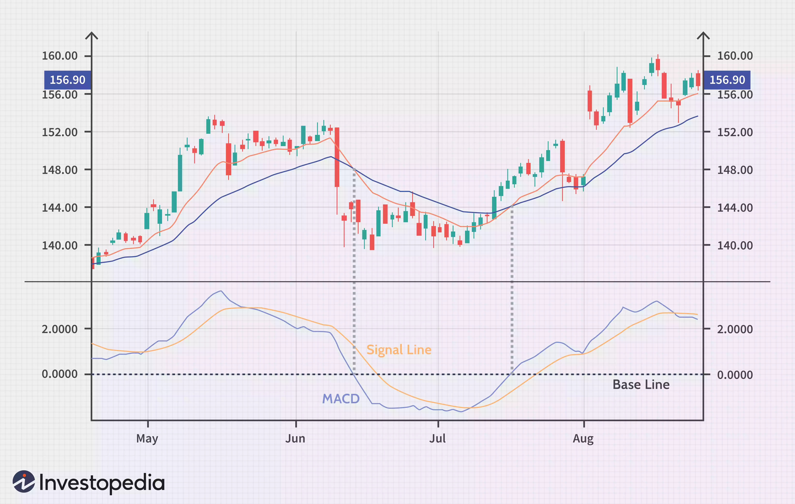</img>
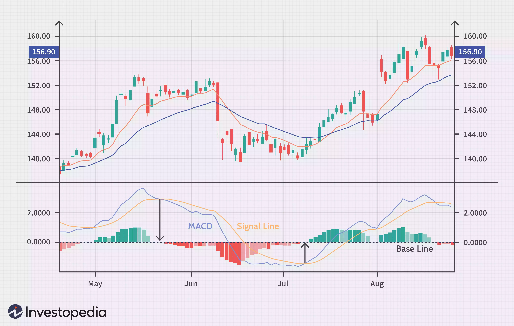</img>
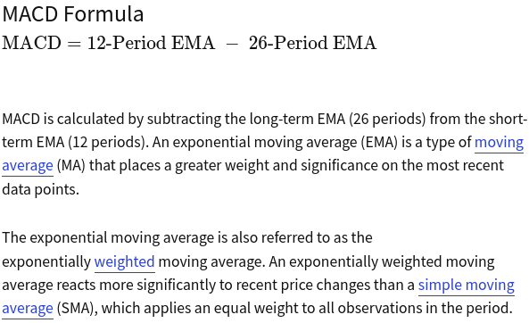</img>

## **MACD vs. Relative Strength**
 The relative strength indicator (RSI) aims to signal whether a market is considered to be overbought or oversold in relation to recent price levels. The RSI is an oscillator that calculates average price gains and losses over a given period of time. The default time period is 14 periods with values bounded from 0 to 100. 

MACD measures the relationship between two EMAs, while the RSI measures price change in relation to recent price highs and lows. These two indicators are often used together to provide analysts a more complete technical picture of a market. 

These indicators both measure momentum in a market, but, because they measure different factors, they sometimes give contrary indications. For example, the RSI may show a reading above 70 for a sustained period of time, indicating a market is overextended to the buy-side in relation to recent prices, while the MACD indicates the market is still increasing in buying momentum. Either indicator may signal an upcoming trend change by showing divergence from price (price continues higher while the indicator turns lower, or vice versa).  

## **Limitations of MACD**
One of the main problems with divergence is that it can often signal a possible reversal but then no actual reversal actually happens—it produces a false positive. The other problem is that divergence doesn't forecast all reversals. In other words, it predicts too many reversals that don't occur and not enough real price reversals. 

"False positive" divergence often occurs when the price of an asset moves sideways, such as in a range or triangle pattern following a trend. A slowdown in the momentum—sideways movement or slow trending movement—of the price will cause the MACD to pull away from its prior extremes and gravitate toward the zero lines even in the absence of a true reversal.  

## **Example of MACD Crossovers**
As shown on the following chart, when the MACD falls below the signal line, it is a bearish signal that indicates that it may be time to sell. Conversely, when the MACD rises above the signal line, the indicator gives a bullish signal, which suggests that the price of the asset is likely to experience upward momentum. Some traders wait for a confirmed cross above the signal line before entering a position to reduce the chances of being "faked out" and entering a position too early. 

Crossovers are more reliable when they conform to the prevailing trend. If the MACD crosses above its signal line following a brief correction within a longer-term uptrend, it qualifies as bullish confirmation. 

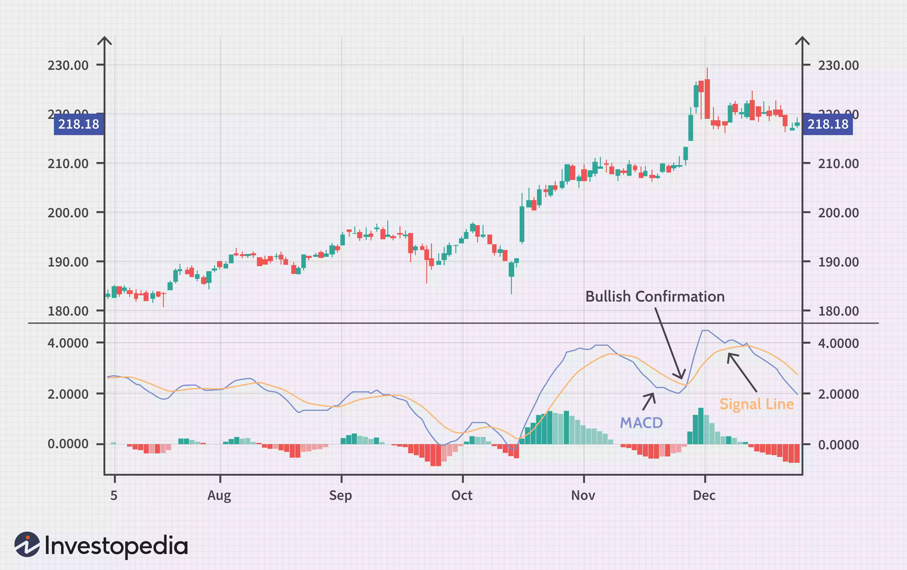</img>

If the MACD crosses below its signal line following a brief move higher within a longer-term downtrend, traders would consider that a bearish confirmation. 

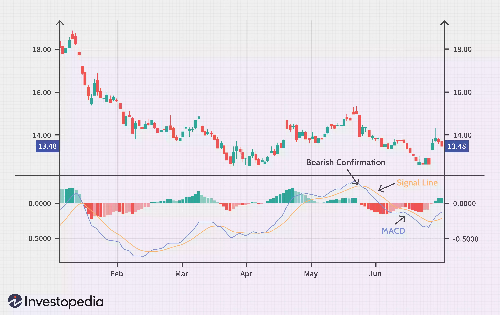</img>

## **Example of Divergence**
When the MACD forms highs or lows that diverge from the corresponding highs and lows on the price, it is called a divergence. A bullish divergence appears when the MACD forms two rising lows that correspond with two falling lows on the price. This is a valid bullish signal when the long-term trend is still positive. 

Some traders will look for bullish divergences even when the long-term trend is negative because they can signal a change in the trend, although this technique is less reliable. 

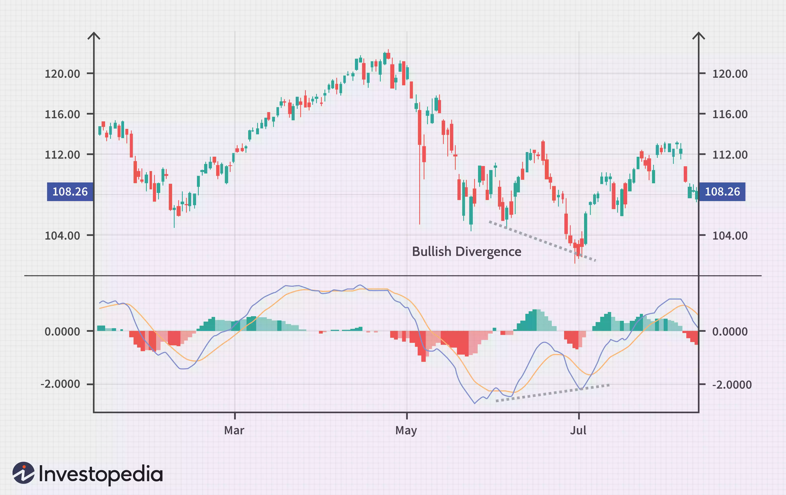</img>

When the MACD forms a series of two falling highs that correspond with two rising highs on the price, a bearish divergence has been formed. A bearish divergence that appears during a long-term bearish trend is considered confirmation that the trend is likely to continue. 

Some traders will watch for bearish divergences during long-term bullish trends because they can signal weakness in the trend. However, it is not as reliable as a bearish divergence during a bearish trend. 

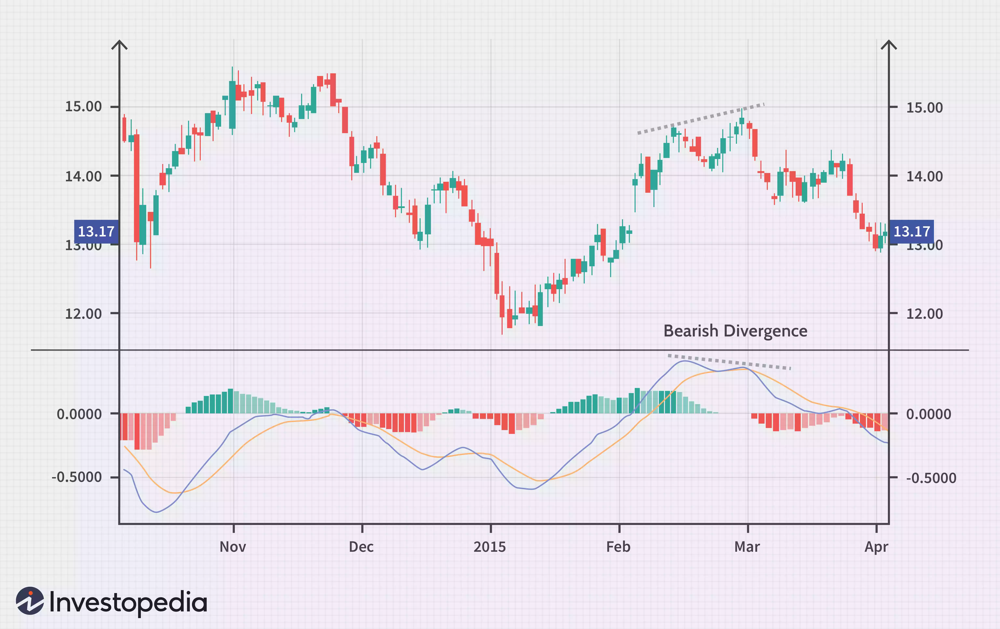</img>

## **Example of Rapid Rises or Falls**
When the MACD rises or falls rapidly (the shorter-term moving average pulls away from the longer-term moving average), it is a signal that the security is overbought or oversold and will soon return to normal levels. Traders will often combine this analysis with the relative strength index (RSI) or other technical indicators to verify overbought or oversold conditions. 

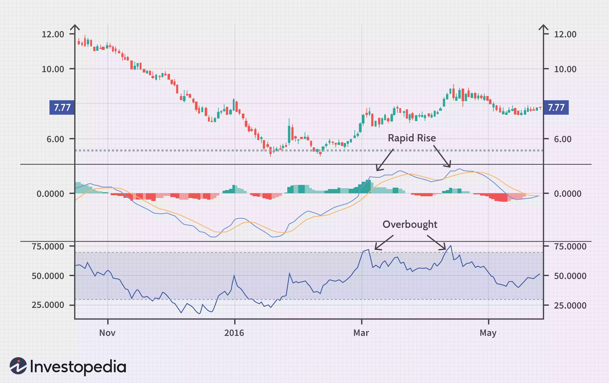</img>

It is not uncommon for investors to use the MACD’s histogram the same way they may use the MACD itself. Positive or negative crossovers, divergences, and rapid rises or falls can be identified on the histogram as well. Some experience is needed before deciding which is best in any given situation because there are timing differences between signals on the MACD and its histogram. 

## **How Do Traders Use Moving Average Convergence Divergence (MACD)?**
Traders use MACD to identify changes in the direction or severity of a stock’s price trend. MACD can seem complicated at first glance, since it relies on additional statistical concepts such as the exponential moving average (EMA). But fundamentally, MACD helps traders detect when the recent momentum in a stock’s price may signal a change in its underlying trend. This can help traders decide when to enter, add to, or exit a position.

## **Is MACD a Leading Indicator, or a Lagging Indicator?**
MACD is a lagging indicator. After all, all of the data used in MACD is based on the historical price action of the stock. Since it is based on historical data, it must necessarily “lag” the price. However, some traders use MACD histograms to predict when a change in trend will occur. For these traders, this aspect of the MACD might be viewed as a leading indicator of future trend changes.

## **What Is a MACD Positive Divergence?**
A MACD positive divergence is a situation in which the MACD does not reach a new low, despite the fact that the price of the stock reached a new low. This is seen as a bullish trading signal—hence, the term “positive divergence.” If the opposite scenario occurs—the stock price reaching a new high, but the MACD failing to do so—this would be seen as a bearish indicator and referred to as a negative divergence.  

## **Histogram**
## **What Is a Histogram?**
A histogram is a graphical representation that organizes a group of data points into user-specified ranges. Similar in appearance to a bar graph, the histogram condenses a data series into an easily interpreted visual by taking many data points and grouping them into logical ranges or bins. 

# **How Histograms Work**
Histograms are commonly used in statistics to demonstrate how many of a certain type of variable occurs within a specific range. For example, a census focused on the demography of a country may use a histogram to show how many people are between the ages of 0 - 10, 11 - 20, 21 - 30, 31 - 40, 41 - 50, etc. This histogram would look similar to the example below. 

Histograms can be customized in several ways by the analyst. The first is to change the interval between buckets. In the above example, there are 5 buckets with an interval of ten. This could be changed, for example, to 10 buckets with an interval of 5 instead. 

The other consideration is how to define the y-axis. The most basic label is to use the frequency of occurrences observed in the data, but one could also use percentage of total or density instead.  

## **Example: The MACD Histogram**
Technical traders may be familiar with the moving average convergence divergence (MACD) histogram, a popular technical indicator that illustrates the difference between the MACD line and the signal line. 

For example, if there is a $5 difference between the two lines, the MACD histogram graphically represents this difference. The MACD histogram is plotted on a chart to make it easy for a trader to determine a specific security’s momentum. 

A histogram bar is positive when the MACD line is above the signal line, and negative when the MACD line is below the signal line. An increasing MACD histogram indicates an increase in upward momentum, while a decreasing histogram is used to signal downward momentum.  

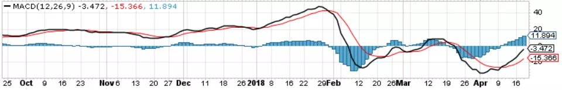</img>

## **Trading with the MACD Histogram**
Traders often overlook the MACD histogram when using this indicator to make trading decisions. A weakness of using the MACD indicator in its traditional sense, when the MACD line crosses over the signal line, is that the trading signal lags price. Because the two lines are moving averages, they do not cross until a price move has already occurred. This means that traders forego a portion of this initial move. 

The MACD histogram helps to alleviate this problem by generating earlier entry signals. Traders can track the length of the histogram bars as they move away from the zero line. The indicator generates a trading signal when a histogram bar is shorter in length than the preceding bar. Once the smaller histogram bar completes, traders open a position in the direction of the histogram’s decline. 

Other technical indicators should be used in conjunction with the MACD histogram to increase the signal’s reliability. Moreover, traders should place a stop-loss order to close the trade if the security’s price does not move as anticipated.  

# Bollinger Band Average (BOLL) 
A Bollinger Band is a technical analysis tool defined by a set of trendlines plotted two standard deviations (positively and negatively) away from a simple moving average (SMA) of a security's price, but which can be adjusted to user preferences.

Bollinger Bands® were developed and copyrighted by famous technical trader John Bollinger, designed to discover opportunities that give investors a higher probability of properly identifying when an asset is oversold or overbought.

- Bollinger Bands® are a technical analysis tool developed by John Bollinger for generating oversold or overbought signals.
- There are three lines that compose Bollinger Bands: A simple moving average (middle band) and an upper and lower band.
- The upper and lower bands are typically 2 standard deviations +/- from a 20-day simple moving average, but can be modified.

## How to calculate?
The first step in calculating Bollinger Bands® is to compute the simple moving average of the security in question, typically using a 20-day SMA. A 20-day moving average would average out the closing prices for the first 20 days as the first data point. The next data point would drop the earliest price, add the price on day 21 and take the average, and so on. Next, the standard deviation of the security's price will be obtained. Standard deviation is a mathematical measurement of average variance and features prominently in statistics, economics, accounting and finance.

For a given data set, the standard deviation measures how spread out numbers are from an average value. Standard deviation can be calculated by taking the square root of the variance, which itself is the average of the squared differences of the mean. Next, multiply that standard deviation value by two and both add and subtract that amount from each point along the SMA. Those produce the upper and lower bands. 

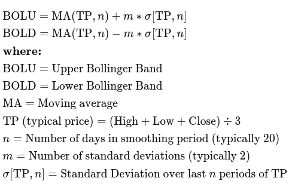</img>
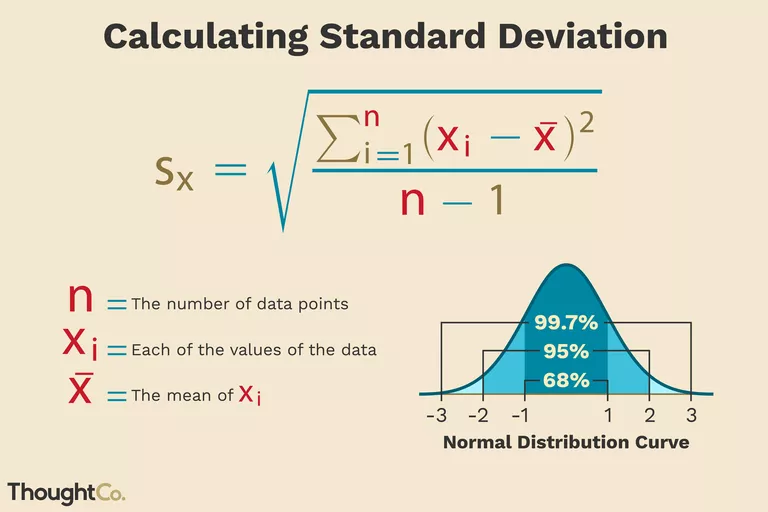</img>
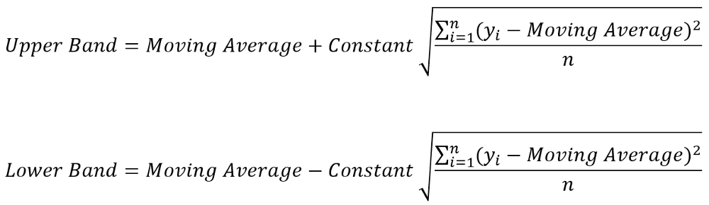</img>

##  What Do Bollinger Bands® Tell You?
Bollinger Bands® are a highly popular technique. Many traders believe the closer the prices move to the upper band, the more overbought the market, and the closer the prices move to the lower band, the more oversold the market. John Bollinger has a set of 22 rules to follow when using the bands as a trading system.2

In the chart depicted below, Bollinger Bands® bracket the 20-day SMA of the stock with an upper and lower band along with the daily movements of the stock's price. Because standard deviation is a measure of volatility, when the markets become more volatile the bands widen; during less volatile periods, the bands contract. 

