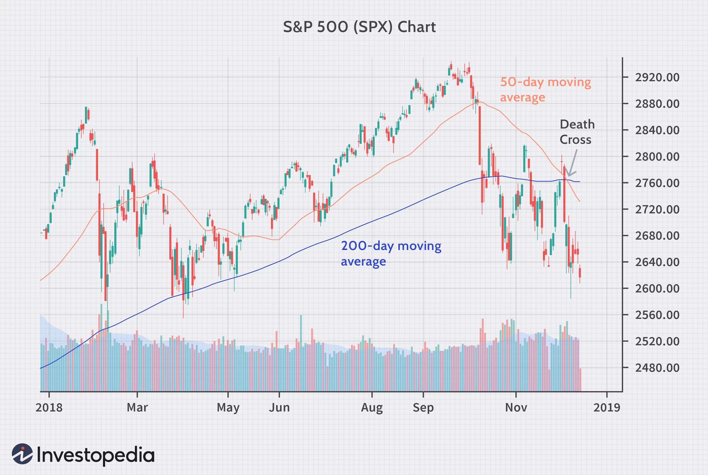
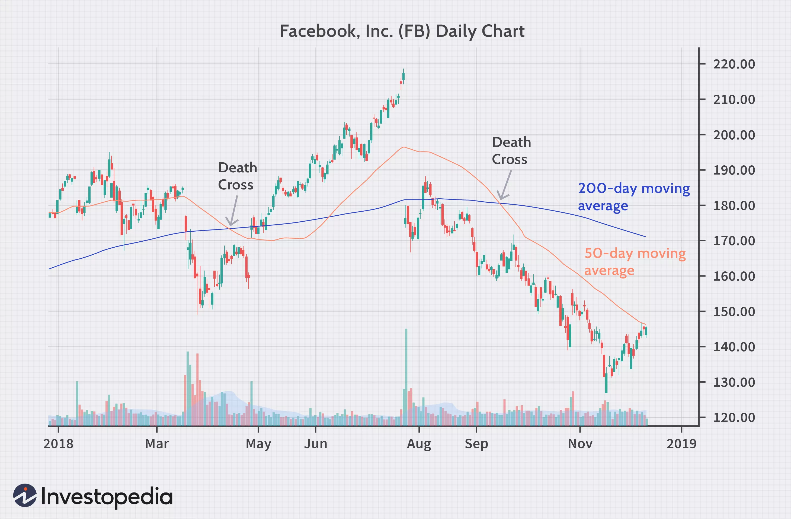

# Death Cross Definition
## **What Is a Death Cross?**
The death cross is a technical chart pattern indicating the potential for a major sell-off. The death cross appears on a chart when a stock’s short-term moving average crosses below its long-term moving average. Typically, the most common moving averages used in this pattern are the 50-day and 200-day moving averages.   

## **What Does the Death Cross Tell You?**
The death cross occurs when a short-term moving average (typically 50-day SMA) crosses over a major long-term moving average (typically 200-day SMA) to the downside and is interpreted by analysts and traders as signaling a definitive bear turn in a market. Here is an example of a death cross on the S&P 500 in December of 2018:
</img>

The death cross name derives from the X-shape created when the short-term moving average descends below the long-term moving average. Historically, the pattern precedes a prolonged downturn for both the long-term and short-term moving averages. The death cross is a signal that short-term momentum in a stock or stock index is slowing, but it is not always a reliable indicator that a bull market is about to end. There have been many times when a death cross appeared, such as in the summer of 2016, when it proved to be a false indicator. Those who got out of stocks during the summer of 2016 missed the sizable stock market gains that followed throughout 2017. The 2016 death cross example was in fact occurring during a technical correction of around 10%, which is oftentimes seen as a buy opportunity (known as "buying on the dip"). 
There is some variation of opinion as to precisely what constitutes this meaningful moving average crossover. Some analysts define it as a crossover of the 100-day moving average by the 30-day moving average, while others define it as the crossover of the 200-day average by the 50-day average. Analysts also watch for the crossover occurring on lower time frame charts as confirmation of a strong, ongoing trend. Regardless of variations in the precise definition or the time frame applied, the term always refers to a short-term moving average, which was at a higher value, crossing below a major long-term moving average. 

## **Example of the Death Cross**
The following is a historical example of two death crosses that occurred for Facebook Inc. (FB), now Meta Inc., stock in 2018. After the first one in April 2018, the stock turned around and began an extended rally. The second one in September 2018, however, signaled a prolonged bear market for the stock. 
</img>

Looking back over the most punishing bear markets of the past century, it seems the death cross holds up best once the market has already lost 20% of its value. In those instances, investors who fled stocks minimized their losses. But for smaller corrections of less than 20%, the temporary appearance of the death cross may be reflecting losses already booked, and thus indicates a buying opportunity.  

## **Death Cross vs. Golden Cross**
The opposite of the death cross occurs with the appearance of the golden cross, when the short-term moving average of a stock or index moves above the long-term moving average. Many investors view this pattern as a bullish indicator. The golden cross pattern typically shows up after a prolonged downtrend has run out of momentum. As is true with the death cross, investors should confirm the trend reversal after several days or weeks of price movement in the new direction. Much of the process of investing by following patterns is self-fulfilling behavior, as trading volumes increase with the attention of more investors who are driven in part by an increase in financial news stories about a particular stock or the movement of an index. 

## **Limitations of Using the Death Cross**
All indicators are “lagging,” and no indicator can truly predict the future. As seen in the Facebook example above, the first death cross produced a false signal, and a trader placing a short at that time would be in some near-term trouble. Despite its apparent predictive power in forecasting prior large bear markets, death crosses also do regularly produce false signals. Therefore, a death cross should always be confirmed with other signals and indicators before putting on a trade. 

