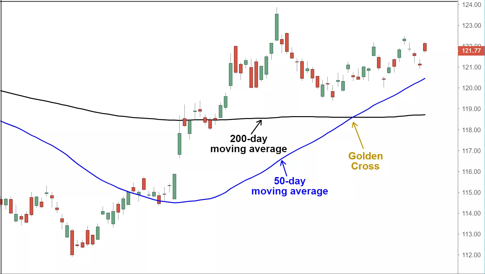

# Golden Cross Definition
## **What Is a Golden Cross?**
A golden cross is a chart pattern in which a relatively short-term moving average crosses above a long-term moving average. The golden cross is a bullish breakout pattern formed from a crossover involving a security's short-term moving average (such as the 15-day moving average) breaking above its long-term moving average (such as the 50-day moving average) or resistance level. As long-term indicators carry more weight, the golden cross indicates a bull market on the horizon and is reinforced by high trading volumes. 
</img>

## **What Does a Golden Cross Tell You?**
There are three stages to a golden cross. The first stage requires that a downtrend eventually bottoms out as selling is depleted. In the second stage, the shorter moving average forms a crossover up through the larger moving average to trigger a breakout and confirmation of trend reversal. The last stage is the continuing uptrend for the follow through to higher prices. The moving averages act as support levels on pullbacks until they crossover back down at which point a death cross may form. The death cross is the opposite of the golden cross as the shorter moving average forms a crossover down through the longer moving average.  

The most commonly used moving averages are the 50-period and the 200-period moving average. The period represents a specific time increment. Generally, larger time periods tend to form stronger lasting breakouts. For example, the daily 50-day moving average crossover up through the 200-day moving average on an index like the S&P 500 is one of the most popular bullish market signals. With a bellwether index, the motto "A rising tide lifts all boats" applies when a golden cross forms as the buying resonates throughout the index components and sectors.  

Day traders commonly use smaller time periods like the 5-period and 15-period moving averages to trade intra-day golden cross breakouts. The time interval of the charts can also be adjusted from 1 minute to weeks or months. Just as larger periods make for stronger signals, the same applies to chart time periods as well. The larger the chart time frame, the stronger and lasting the golden cross breakout tends to be.

## **Example of a Golden Cross**
As a hypothetical example, a monthly 50-period and 200-period moving average golden cross are significantly stronger and longer-lasting than the same 50, 200-period moving average crossover on a 15-minute chart. Golden cross breakout signals can be utilized with various momentum oscillators like stochastic, moving average convergence divergence (MACD), and relative strength index (RSI) to track when the uptrend is overbought and oversold. This helps to spot ideal entries and exits. 

## ** The Difference Between a Golden Cross and a Death Cross**
A golden cross and a death cross are exact opposites. A golden cross indicates a long-term bull market going forward, while a death cross signals a long-term bear market. Both refer to the solid confirmation of a long-term trend by the occurrence of a short-term moving average crossing over a major long-term moving average.  

The golden cross occurs when a short-term moving average crosses over a major long-term moving average to the upside and is interpreted by analysts and traders as signaling a definitive upward turn in a market. Conversely, a similar downside moving average crossover constitutes the death cross and is understood to signal a decisive downturn in a market. Either crossover is considered more significant when accompanied by high trading volume.  

Once the crossover occurs, the long-term moving average is considered a major support level (in the case of the golden cross) or resistance level (in the instance of the death cross) for the market from that point forward. Either cross may occur as a signal of a trend change, but they more frequently occur as a strong confirmation of a change in trend that has already taken place.   

## **Limitations of Using the Golden Cross**
All indicators are “lagging,” and no indicator can truly predict the future. Many times, an observed golden cross produces a false signal. Despite its apparent predictive power in forecasting prior large bull markets, golden crosses also do regularly fail to manifest. Therefore, a golden cross should always be confirmed with other signals and indicators before putting on a trade.  

The key to using the golden cross correctly—with additional filters and indicators—is to always use proper risk parameters and ratios. Remembering to always keep to a favorable risk-to-reward ratio and to time your trade properly can lead to better results than just following the cross blindly.

## **How Do I Identify a Golden Cross on a Chart?**

The golden cross occurs when a short-term moving average crosses over a major long-term moving average to the upside and is interpreted by analysts and traders as signaling a definitive upward turn in a market. Some analysts define it as a crossover of the 100-day moving average by the 50-day moving average; others define it as the crossover of the 200-day average by the 50-day average. Basically, the short-term average trends up faster than the long-term average, until they cross.

## **What Does a Golden Cross Indicate?**
A golden cross suggests a long-term bull market going forward. It is the opposite of a death cross, which is a bearing indicator when a long-term moving average crosses under a short-term MA.

## **Are Golden Crosses Reliable Indicators?**
As a lagging indicator, a golden cross is identified only after the market has risen, which makes it seem reliable. However, as a result of the lag, it is also difficult to know when the signal is a false one until after the fact. Traders often use a golden cross as confirmation of a trend or signal in combination with other indicators.

