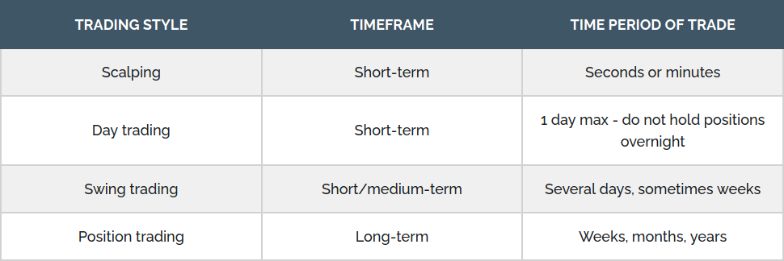

# Trading Style

</img>

## Scalping
Scalping is the most short-term form of trading. Scalp traders only hold positions open for seconds or minutes at most. These short-lived trades target small intraday price movements. The purpose is to make lots of quick trades with smaller profit gains, but let profits accumulate throughout the day due to the sheer number of trades being executed in each trading session. 

This style of trading requires tight spreads and liquid markets. As a result, scalpers tend to trade major currency pairs only (due to liquidity and high trading volume), such as EURUSD, GBPUSD, and USDJPY. 

They also tend to trade only the busiest times of the trading day, during the overlap of trading sessions when there is more trading volume, and often volatility. Scalpers look for the tightest spreads possible, simply because they enter the market so frequently, so paying a wider spread will eat into potential profits. 

The fast-paced trading environment of trying to scalp a few pips as many times as possible throughout the trading day can be stressful for many traders and is hugely time-consuming, given the fact you will need to focus on charts for several hours at a time. As scalping can be intense, scalpers tend to trade one or two pairs. 

## Day trading
For those that are not comfortable with the intensity of scalp trading, but still don't wish to hold positions overnight, day trading may suit. 

Day traders enter and exit their positions on the same day (unlike swing and position traders), removing the risk of any large overnight moves. At the end of the day, they close their position with either a profit or a loss. Trades are usually held for a period of minutes or hours, and as a result, require sufficient time to analyse the markets and frequently monitor positions throughout the day. Just like scalp traders, day traders rely on frequent small gains to build profits. 

Day traders pay particularly close attention to fundamental and technical analysis, using technical indicators such as MACD (Moving Average Convergence Divergence), the Relative Strength Index and the Stochastic Oscillator, to help identify trends and market conditions. 

## Swing trading
Unlike day traders who hold positions for less than one day, swing traders typically hold positions for several days, although sometimes as long as a few weeks. Because positions are held over a period of time, to capture short-term market moves, traders do not need to sit constantly monitoring the charts and their trades throughout the day. 

This makes it a popular trading style for those who have other commitments (such as a full-time job) and would like to trade in their leisure time. However, it is still necessary to dedicate a few hours a day to analyse the markets. 

Swing traders (as well as some day traders) tend to use trading strategies such as trend trading, counter-trend trading, momentum and breakout trading. 

## Position trading
Position traders are focused on long-term price movement, looking for maximum potential profits to be gained from major shifts in prices. As a result, trades generally span over a period of weeks, months or even years. Position traders tend to use weekly and monthly price charts to analyse and evaluate the markets, using a combination of technical indicators and fundamental analysis to identify potential entry and exit levels. 

As position traders are not concerned with minor price fluctuations or pullbacks, their positions do not need to be monitored the same way as other trading strategies, instead occasionally monitoring to keep an eye on the major trend. 

