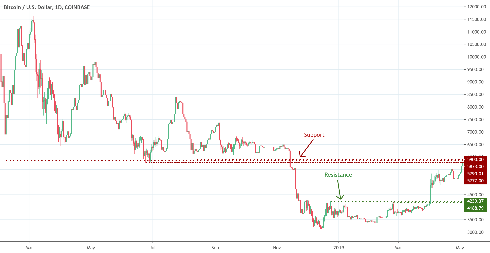

# Support and Resistance
The prices regularly stop falling and bounce back up at the support level. Where the prices stop rising and take a dip back is the resistance level. The support and resistance levels are a direct result of differences in supply and demand. As a general rule, the price rises when there are more buyers. Conversely, the prices decline when there are more sellers than buyers. A level’s reliability depends on the rate at which the prices hit a level and more reliability of a level means better ability at predicting future price movements. 

The price tends to find support at the support level while declining. That means that price will be able to bounce back at this level rather than breaching it. However, if the price break through it, it will continue to decline unless and until it finds another support level. Whereas, the price tends to face resistance at the resistance level when it rises. That means, it is more likely that price will be able to bounce back from this level. However, once the price breaks through the resistance level, it will continue to rise unless and until it finds another resistance level.

The behavior of the prices upon touching the levels also vary. If the prices jump back quickly after touching or breaking through a support or resistance level, it is just a test. On the other hand, if the prices enter any level and hold there, there are strong chances that they continue to rise or fall until a new level of support or resistance forms.

</img>

## How to identify support and resistance levels?
### **Historical data**
The historical prices and past patterns are the most helpful to identify the support and resistance level. It is important to understand the past patterns ranging from a few time periods back to the most recent activity. This familiarization and understanding make it easy for the traders to identify those past patterns when they reappear. However, it is also important to keep in mind that historical data is not always a reliable source because of the rapidly changing circumstances in the financial markets. 

Another important historical data that helps to identify the support and resistance levels is previous support and resistance levels. Traders use past support and resistance levels as a marker to enter or exit the trade. However, it should not be used as an absolute method to identify support and resistance. The prices vary from time to time before reversing making it difficult for the market to hit the same markers again and again.

### **Technical indicators**
There are certain reliable indicators that are most widely and commonly used to identify the support and resistance levels. Support and resistance indicators like moving averages, Fibonacci tools, and pivot points are among the most common to identify supply and demand zones at specific intervals and timeframes. 

### **General rules**
There are some general rules also to identify the support and resistance levels. To identify support, traders draw a straight line from bearish reversal points. If the line connects at least 3 reversal points, then the line can be considered valid historical support. Whereas, to identify resistance, traders connect all the reversal points to draw a straight line. If the line connects at least 3 points, then it becomes a valid historical resistance. 

## How to do trading with support and resistance? 
### **Range trading**
Selling and buying is the most common support and resistance trading strategy. It is also known as range trading. It takes place between support and resistance levels. Traders tend to buy when the prices close on the support level and sell when the prices close to the resistance level. Traders tend to enter long when prices bounce off support and go short resistance bounce off of prices.

### **Setting stop-loss**
Another trading strategy with support and resistance is to place stop-loss below support and above resistance. If the prices breach the support and resistance, traders close a position quickly. Technical analysts and experts also suggest deciding entry or exit points near the support and resistance levels. However, before entering a trade, it is always a prudent strategy to consider your profit targets and an acceptable level of losses. 

### **Breakout strategy**
The breakout strategy is another reliable way to do trading with support and resistance. The breakout strategy suggests waiting for the prices to move beyond support or resistance level. The movement beyond the support or resistance levels is usually fast and rapid with maximum momentum creating opportunities for the traders to take profits. However, it is important to wait for the pullback in order to avoid falling into a trap.

### **Trendline as support / resistance**
Trendline strategy is another strategy based on support and resistance. It utilizes trendline as support or resistance. Traders simply draw a line connecting two or more high points during a downward trend or two or more lows during an upward trend. Prices tend to bounce off the trendline during any strong trend and continue to move forward in the direction of the trend. It is always a wise strategy to look for entries in the direction of the trend to gain maximum profit. 

