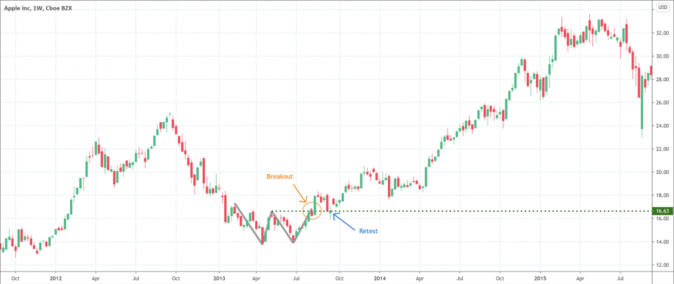

# Breakout: The Market Tells You to Take a Trade
- Breakout are trade opportunity which trigger when price crosses above or below a resistance or support level.
- It signals it can be time to open a position.
- It also helps frame where you should / could place your stop loss.

Breakout in trading means the movement of prices beyond support or resistance or violation of a trend line. Breakouts are a kind of signal alerting traders that something has changed in the market. It indicates the shifting balance of power between buyers and sellers or the resumption or reversal of a trend.  

Breakout trading strategy is one of the most popular and common trading strategies among the adept investors and traders of the forex market. Breakout deals with the identification of key price levels that traders expect prices to breakthrough. After that, traders expect to capitalize on the price break out. Whenever the market approaches the highest or lowest levels of the recent past, it means price break out is also near. Breakouts let the traders never miss an opportunity to gain when the movement of the market in one direction is strong. 

A bullish breakout happens when an up-trending market finds resistance at a horizontal level and after a few unsuccessful attempts, the market finally breaks through the resistance. A bearish breakout occurs when the market finally breaks through support, during a strong downtrend, after a few unsuccessful attempts. 

</img>

## Types of breakout 
- **Continuation breakout:** When market participants are adamant that the initial trend was the right decision and they continue to support their original decision, the prices continue to follow the same direction. The result is a continuation breakout.
- **Reversal breakouts:** After a very long uptrend or downtrend, the trend tends to take a pause or consolidation. After the consolidation, traders decide that the current trend doesn’t have the strength to continue in the same direction, they start to push prices in opposite direction. The result is a reversal breakout. 

## What are the key elements of breakout**
- **Market participation:** A sudden increase in volume is a very common element of a breakout. Whenever a price breaks through a normal constraint, it automatically attracts the attention of traders. The attraction means the debate over the value of that price. As a result, the numbers of market participants begin to increase as participants begin to enter long and short positions in an attempt to take full advantage of the price break out. 
- **Volatility:** Increased market participation leads to increased volatility. It is obvious that heavy buying or selling activities give rise to unstable market conditions. As a result, market prices begin to fluctuate with greater magnitudes. Therefore, increased volatility increases the chances of development of a strong trend.
- **Directional price movement:** Increased market participation and increased volatility bring the directional price movement. This is, in fact, a defining and most crucial element of breakout because a breakout cannot simply occur if there is no definitive price movement. 

## How to identify a breakout? 
Breakout trading strategy is one of the best trading strategies but traders should learn to correctly identify a breakout to be successful. The following are some of the most common methods to identify an upcoming breakout. 

Support and resistance areas are very helpful to identify a breakout. Support and resistance are in fact areas that contain the market. They are price constraints but once the price is able to get rid of those constraints, a break out occurs. Therefore, it is imperative to identify support and resistance first. There are many indicators such as Bollinger Bands, Fibonacci retracement, moving averages, etc. that can help traders to identify support and resistance. Traders may also employ some traditional methods such as round numbers and value areas to identify support and resistance. 

Chart patterns are also extremely helpful to identify the breakouts. There are various candlestick patterns that can assist traders in this regard.  

Market consolidation also helps traders to correctly identify a breakout. Market consolidation means a period of indecisiveness among market participants. It also indicates a potential move in prices. A tight trading range of security leads to decreasing volume. After such constraints of the trading range, the market participation increases and move prices up or down. 

Scheduled news release: A scheduled news release of market-related data or any type of economic report has all the ingredients of a catalyst to move market prices. Such release of important information brings the market participation and volatility required to maintain the directional price movement. 

## How to trade a breakout trading strategy? 
- **Entry:** Usually entry point comes after a retest of former support or resistance level. However, retest depends on the strength of the market. It is important to note that traders should enter the market only on a retest of former levels of support or resistance depending on the direction of the market. Prices closing above the resistance level indicate to take a bullish position. On the other hand, prices closing below the support level points to establishing a bearish position. 
- **Stop-loss:** It is always a wise plan to place a stop-loss below or above the candle indicating a breakout. Once the market breaks the breakout candle and subsequently retest, consider it an opportunity to go short by placing a stop-loss above the breakout candle.
- **Profit target setup:** Once the entry point and placement of stop-loss is clear, it is easy to set profit targets. Strong support areas are always viable options to target the trade setup. 

