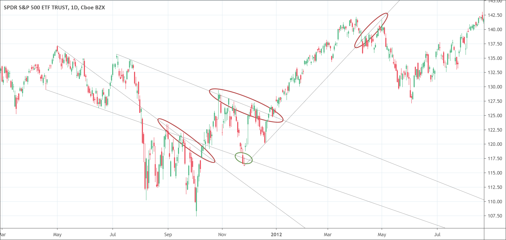

# Trendlines
- Trendlines connect two price points at least and may extend further forward to indicate support and resistance areas.
- It helps traders understand the trend and possible reversals.

Trendlines are an indicator that helps to identify and confirm trends. It is a simple but efficient tool to measure an increase in share price over a period of time. Trend lines indicate acceleration or deceleration of a trend in the market. It is different from the rest of the indicators that traders have to use their own mind instead of relying on formula calculations done on a computer. The trendline gives a clear picture of a current trend through a single line on a chart that is the greatest advantage of using trendline. 

The working of the trendline is simple. It connects two price points at least and may extend further forward to indicate support and resistance areas. A positive slope of the trendline shows support price action that means an increase in net demand. We have a bullish trend until the price action stays above the trendline. On the other hand, a negative slope of the lines indicates resistance to the price action that means an increase in net supply. The bearish trend remains in the market until the price action remains below the trendline.  

The price continues to retest a sloped line several times to break it. We may have a reversal in trend after the price is successful to break the line. It is interesting to note that a trendline gets stronger when there are more points to connect. Now, the trendline strategies can vary because they depend on the distance between the connected price points and also on the decision whether we use wicks or candle bodies to connect. However, all trendlines are destined to break. 

</img>

## What does trendlines tell traders? 
A trendline is a magnificent tool that has the potential to clearly indicate a trend as well as sideways movement. A trendline works by connecting the lowest point of a downtrend to the highest point of an uptrend. The connection of low points with highs results in an ascending line on a chart indicating an upwards trend of prices. The trendline can also indicate the angle of ascent, the strength of the prevailing trend, and the strength of the price movement when a trendline is drawn to connect the individual high points. 

Furthermore, when the price decreases, the high points also fall. Decreasing prices result in a descending line indicating a fall in prices. The descending angle and the strength of the downward price movement are indicated by drawing a line along with the swing lows.  

Generally, a single line remains in action but there is also a choice to draw multiple trendlines indicating price movements over several periods of time. This option of drawing trendlines whenever possible suits new traders. It allows them to keep themselves updated about the overall trend in the market, any corrections in that overall trend, and the small trends. 

