# Classical Pattern
This document contains all classical pattern

# Content Table
- [Classical Pattern](#classical-pattern)
- [Content Table](#content-table)
- [Overview](#overview)
- [Rounding Bottom](#rounding-bottom)
  - [Six Main Components](#six-main-components)
    - [**Prior trend**](#prior-trend)
    - [**Decline**](#decline)
    - [**Low**](#low)
    - [**Advance**](#advance)
    - [**Breakout**](#breakout)
    - [**Volume**](#volume)
  - [Profit Target](#profit-target)
  - [Rounding bottom neckline (support line)](#rounding-bottom-neckline-support-line)
  - [How to trade](#how-to-trade)
- [Rounding Top](#rounding-top)
  - [How to recognize](#how-to-recognize)
  - [Profit Target](#profit-target-1)
  - [Components](#components)
  - [Price Prediction after a Rounding Top](#price-prediction-after-a-rounding-top)
  - [Advantages of Trading Rounded Top Patterns](#advantages-of-trading-rounded-top-patterns)
  - [Disadvantages of Trading Rounded Top Patterns](#disadvantages-of-trading-rounded-top-patterns)
- [Channel Pattern](#channel-pattern)
  - [Drawing](#drawing)
  - [Bullish or rising channel pattern](#bullish-or-rising-channel-pattern)
    - [**How to trade a rising channel?**](#how-to-trade-a-rising-channel)
  - [Bearish or falling channel pattern](#bearish-or-falling-channel-pattern)
    - [**How to trade the falling channel?**](#how-to-trade-the-falling-channel)
  - [Difference between Flag and Channel Pattern](#difference-between-flag-and-channel-pattern)
- [Flag Pattern](#flag-pattern)
  - [Components](#components-1)
  - [Bullish flag pattern](#bullish-flag-pattern)
    - [**How to identify the bullish pattern?**](#how-to-identify-the-bullish-pattern)
    - [**How to trade when you see a bullish flag pattern?**](#how-to-trade-when-you-see-a-bullish-flag-pattern)
  - [Bearish flag pattern](#bearish-flag-pattern)
    - [**How to identify the bearish pattern?**](#how-to-identify-the-bearish-pattern)
    - [**How to trade when you see the bearish flag pattern?**](#how-to-trade-when-you-see-the-bearish-flag-pattern)
- [Broadening Top Patter](#broadening-top-patter)
    - [**How to identify the broadening top pattern?**](#how-to-identify-the-broadening-top-pattern)
    - [**What does the broadening top tell traders?**](#what-does-the-broadening-top-tell-traders)
    - [**How to trade when you see the pattern?**](#how-to-trade-when-you-see-the-pattern)
- [Triple Top Pattern](#triple-top-pattern)
  - [Types of Triple Tops](#types-of-triple-tops)
    - [**How to identify the Triple Top pattern?**](#how-to-identify-the-triple-top-pattern)
    - [**What does the Triple Top pattern tell traders?**](#what-does-the-triple-top-pattern-tell-traders)
    - [**How to trade when you see the Triple Top pattern?**](#how-to-trade-when-you-see-the-triple-top-pattern)
      - [**The traditional trading strategy**](#the-traditional-trading-strategy)
      - [**The aggressive trading strategy**](#the-aggressive-trading-strategy)
- [Rectangle Pattern](#rectangle-pattern)
  - [Bullish rectangle pattern](#bullish-rectangle-pattern)
  - [Bearish rectangle pattern](#bearish-rectangle-pattern)
    - [**Benefits of trading with rectangle patterns**](#benefits-of-trading-with-rectangle-patterns)
    - [**How to identify the Rectangle pattern?**](#how-to-identify-the-rectangle-pattern)
    - [**What does the Rectangle pattern tell traders?**](#what-does-the-rectangle-pattern-tell-traders)
    - [**How to trade when you see the Rectangle pattern?**](#how-to-trade-when-you-see-the-rectangle-pattern)
- [Triple Bottom Pattern](#triple-bottom-pattern)
    - [**How to identify the Triple Bottom pattern?**](#how-to-identify-the-triple-bottom-pattern)
    - [**Breakout Expectation**](#breakout-expectation)
    - [**Components of the Triple Bottom**](#components-of-the-triple-bottom)
    - [**What does the Triple Bottom pattern tell traders?**](#what-does-the-triple-bottom-pattern-tell-traders)
    - [**How to trade when you see the Triple Bottom pattern?**](#how-to-trade-when-you-see-the-triple-bottom-pattern)
      - [**It’s a strong bullish reversal pattern**](#its-a-strong-bullish-reversal-pattern)
      - [**The pattern comes to life after the confirmation**](#the-pattern-comes-to-life-after-the-confirmation)
- [Head and Shoulders Pattern](#head-and-shoulders-pattern)
    - [**How to identify the Head and Shoulders?**](#how-to-identify-the-head-and-shoulders)
      - [**Uptrend**](#uptrend)
      - [**Left shoulder**](#left-shoulder)
      - [**Head**](#head)
      - [**Right shoulder**](#right-shoulder)
      - [**Neckline**](#neckline)
    - [**What does the Head and Shoulders pattern tell traders?**](#what-does-the-head-and-shoulders-pattern-tell-traders)
    - [**How to trade when you see the Head and Shoulders?**](#how-to-trade-when-you-see-the-head-and-shoulders)
- [Bullish & Bearish Pennant Pattern](#bullish--bearish-pennant-pattern)
  - [Bearish Pennants](#bearish-pennants)
  - [Bullish Pennants](#bullish-pennants)
    - [**How to identify the Pennant pattern?**](#how-to-identify-the-pennant-pattern)
    - [**What does the Pennant pattern tell traders?**](#what-does-the-pennant-pattern-tell-traders)
    - [**How to trade when you see the Pennant pattern?**](#how-to-trade-when-you-see-the-pennant-pattern)
  - [Differences between Pennant Patterns and Symmetrical Triangles](#differences-between-pennant-patterns-and-symmetrical-triangles)
    - [**Pennant Patterns**](#pennant-patterns)
    - [**Symmetrical Triangle**](#symmetrical-triangle)
    - [**Differences**](#differences)
      - [**The Flagpole**](#the-flagpole)
      - [**Duration**](#duration)
- [Falling Wedge Pattern](#falling-wedge-pattern)
    - [**How to identify the Falling Wedge pattern?**](#how-to-identify-the-falling-wedge-pattern)
    - [**What does the Falling Wedge pattern tell traders?**](#what-does-the-falling-wedge-pattern-tell-traders)
    - [**How to trade when you see the Falling Wedge pattern?**](#how-to-trade-when-you-see-the-falling-wedge-pattern)
      - [**Opening a position**](#opening-a-position)
      - [**Taking profit**](#taking-profit)
      - [**Cutting losses**](#cutting-losses)
- [Inverse Head and Shoulders Pattern](#inverse-head-and-shoulders-pattern)
    - [**How to identify the Inverse Head and Shoulders?**](#how-to-identify-the-inverse-head-and-shoulders)
    - [**What does the Inverse Head and Shoulders tell traders?**](#what-does-the-inverse-head-and-shoulders-tell-traders)
    - [**How to trade when you see the Inverse Head and Shoulders?**](#how-to-trade-when-you-see-the-inverse-head-and-shoulders)
      - [**The neckline is the point of interest**](#the-neckline-is-the-point-of-interest)
      - [**What to focus on to increase the odds of success?**](#what-to-focus-on-to-increase-the-odds-of-success)
      - [**Aggressive trading an Inverse Head and Shoulders**](#aggressive-trading-an-inverse-head-and-shoulders)
      - [**Conservative trading an Inverse Head and Shoulders**](#conservative-trading-an-inverse-head-and-shoulders)
- [Cup and Handle Pattern](#cup-and-handle-pattern)
    - [**How to identify the Cup and Handle?**](#how-to-identify-the-cup-and-handle)
    - [**What does the Cup and Handle pattern tell traders?**](#what-does-the-cup-and-handle-pattern-tell-traders)
    - [**How to trade the Cup and Handle pattern?**](#how-to-trade-the-cup-and-handle-pattern)
- [Rising Wedge](#rising-wedge)
    - [**Identifying the Rising Wedge pattern during an uptrend**](#identifying-the-rising-wedge-pattern-during-an-uptrend)
    - [**Identifying a Rising Wedge pattern during a downtrend**](#identifying-a-rising-wedge-pattern-during-a-downtrend)
    - [**What does Rising Wedge pattern tell traders?**](#what-does-rising-wedge-pattern-tell-traders)
    - [**How to trade when you see a Rising Wedge pattern in your favorite market?**](#how-to-trade-when-you-see-a-rising-wedge-pattern-in-your-favorite-market)
      - [**First method**](#first-method)
      - [**Second method**](#second-method)
- [Ascending Triangle Pattern](#ascending-triangle-pattern)
    - [**How to identify an Ascending Triangle**](#how-to-identify-an-ascending-triangle)
    - [**What does the Ascending Triangle pattern tell traders?**](#what-does-the-ascending-triangle-pattern-tell-traders)
    - [**How to trade when you see the pattern**](#how-to-trade-when-you-see-the-pattern-1)
- [Double Top Pattern](#double-top-pattern)
    - [**How to identify the pattern?**](#how-to-identify-the-pattern)
    - [**What does the Double Top pattern tell traders?**](#what-does-the-double-top-pattern-tell-traders)
    - [**How to trade when you see the pattern?**](#how-to-trade-when-you-see-the-pattern-2)
- [Symmetrical Triangle Pattern](#symmetrical-triangle-pattern)
    - [**How to identify a Symmetrical Triangle classical pattern?**](#how-to-identify-a-symmetrical-triangle-classical-pattern)
    - [**What does the Symmetrical Triangle tell traders?**](#what-does-the-symmetrical-triangle-tell-traders)
    - [**How to trade when you see a Symmetrical Triangle?**](#how-to-trade-when-you-see-a-symmetrical-triangle)
      - [**Identifying the real breakout**](#identifying-the-real-breakout)
      - [**Setting a realistic target for your Symmetrical Triangle trade**](#setting-a-realistic-target-for-your-symmetrical-triangle-trade)
      - [**Protecting your trade with a wise stop loss**](#protecting-your-trade-with-a-wise-stop-loss)
- [Double Bottom Pattern](#double-bottom-pattern)
    - [**How to identify the Double Bottom charting pattern?**](#how-to-identify-the-double-bottom-charting-pattern)
    - [**What does the Double Bottom pattern tell traders?**](#what-does-the-double-bottom-pattern-tell-traders)
      - [**The importance of the pattern depends on the timeframe**](#the-importance-of-the-pattern-depends-on-the-timeframe)
      - [**The importance of the pattern depends on the context**](#the-importance-of-the-pattern-depends-on-the-context)
    - [**How to trade when you see the Double Bottom pattern?**](#how-to-trade-when-you-see-the-double-bottom-pattern)
- [Descending Triangle Pattern](#descending-triangle-pattern)
    - [**How to identify a Descending Triangle classical pattern?**](#how-to-identify-a-descending-triangle-classical-pattern)
    - [**What does the Descending Triangle charting pattern tell traders?**](#what-does-the-descending-triangle-charting-pattern-tell-traders)
    - [**How to trade when you see the Descending Triangle pattern?**](#how-to-trade-when-you-see-the-descending-triangle-pattern)

# Overview
Classic, traditional or common patterns refer to the same kind of patterns.
Classic chart patterns are aggregates of price drawing some well known forms.
They often form around support or resistance levels. These trend lines indicate areas where traders were interested in exchanging their assets holding and time + trades will draw these patterns.

- **Reversal pattern:** it predicts price will reverse and move in the opposite direction.
- **Continuation pattern:** it predicts price will continue its move in the same direction.

# Rounding Bottom
A rounding bottom is a chart pattern used in technical analysis. It can be recognized by various price movements that graphically makes up a U-shape. Rounding bottoms are situated at the close of an elongated downward trend. They signify a reversal in long duration price movement. The time duration for this pattern can range from weeks, to months, and many traders consider it to be a rarity.

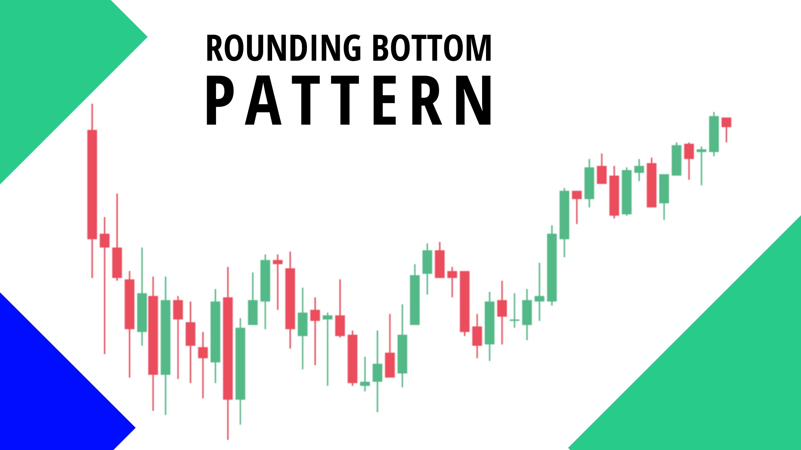</img>

## Six Main Components
### **Prior trend**
For a reversal pattern to exist, there has to be a prior trend to reverse. Usually, the base of a rounding bottom will signify a new low. There are instances when the low is registered several months earlier on the security trade flat before making up the pattern.

### **Decline**
The first part of the rounding bottom is the decline that result to the low of the pattern. This decline can appear in different forms. Some trade with a high number of highs and lows while others trade lower in a straight line.

### **Low**
The low of the rounding bottom can take the form of a ‘V’ bottom, but should not appear too sharp and must take some weeks to develop. Since prices are a long duration decline, the chances of the selling climax appears and can form a lower spike.

### **Advance**
The advance off for the lows makes the right half of the pattern and would require about the same duration of time as the prior decline. If the advance appears too sharp, then the credibility of a rounding bottom may be a problem.

### **Breakout**
Bullish affirmation exists when the pattern breaks at the top of the reaction high which shows the beginning of the decline at the initial stage of the pattern. As many resistance breakout, this line becomes a support level. Even though rounding bottom represent long duration reversal and this new support mark may not be so important.

### **Volume**
With a normal pattern, volume levels will mark the image of the rounding bottom. Volume levels are not very significant on the decline, but there should be an addition in volume on the advance and suitable on the breakout.

## Profit Target 
The rounding bottom pattern has a bullish potential. After the trend changes from bearish to bullish, the anticipated outcome is for the price to continue going higher. But will need to answer the question of how much higher. The basic answer is the Forge higher should be at least the size of the rounding bottom development.

## Rounding bottom neckline (support line)
To calculate the likely outcome of the rounding bottom, you must first figure out the support level of the pattern. To achieve this, you will draw a line running across the high bearish treasure and the bullish trend just before the break out happens. Now measure the distance between the support line and the lowest level of the pattern. Whenever the price level breaks the support line, traders should open a long position.

## How to trade
1. Verify the rounding bottom image: in order to verify this pattern, you need to locate the price decrease which gradually changes to a range succeeded by a price increase. The strongest verification occurs when the volume indicator display high volume on the decline, flat volumes on the range and a gra volume on the reversal.
2. Round Bottom Support line: as soon as you figure out the pattern, you need to draw the support line. In order to achieve this, you will draw a horizontal line running across the high of the bearish and bullish sides of the rounding bottom pattern.
3. Round Bottom Breakout: the rounded bottom breakout occurs wherever the price breaks the support line in a bullish direction. To simply put it, the trade should display strength as it cuts across the support line. This trend should appear by itself through price expansion and additional volume.
4. Round Bottom Trade Entry: a trader should be prepared to go long after the trade successfully breaks the support line.
5. Round Bottom Stop Loss: the rounding bottom pattern is somewhat dependable. But since you should never ignore the rule of protecting your capital at any point in time, it is very essential to always apply a stop loss. The stop loss should be placed at the midpoint of the pattern. A much safer approach is to place it below the low of the breakout candle. In case the trade fails, you can immediately exit your position and resolve to a better trading chance.
6. Rounding Bottom Target: the size of the pattern is equivalent to the smallest target for the pattern when added to the breakout. As soon as the price hits the target mark, you should ensure to exit the position.

# Rounding Top 
The rounded top are reversal patterns used to signal the end of a trend. It notifies traders a likely reversal point on a price chart. Rounded top pattern is represented in form of an inverted ‘u’ shape and is also known as an ‘inverse saucer’. It denotes the stop of an uptrend and the likely start of a downtrend. This simply means that the rounded top can signal a time frame to go short.

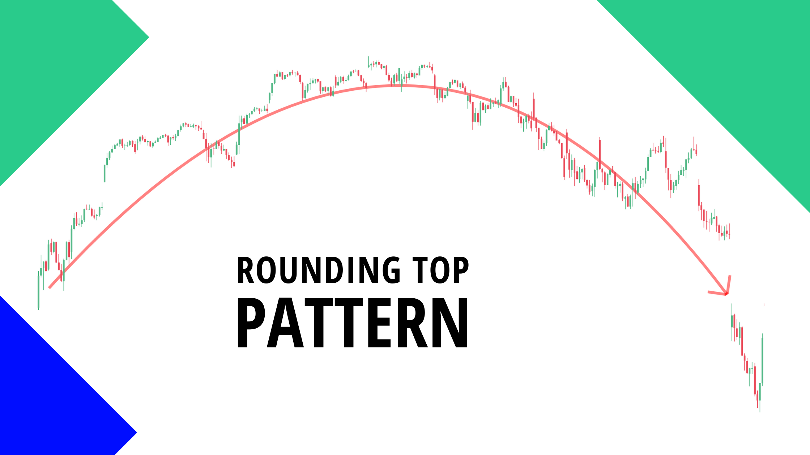</img>

## How to recognize
A rounded top pattern is made up of an uptrend, rounded top and a neckline. For this pattern to take place, the price has to initially go in the upward direction. It then stabilizes for an elongated duration, creating a rounded top. And then it financially drops down beneath the neckline of the consolidation area. At this point, this pattern is regarded to be complete. At a certain time, the rounding top pattern can equate with a double or triple top pattern. The important thing to note here is that a likely change in the trend could happen. Traders need to be cautious if they are holding long positions and might need to go short as soon as the price falls below the neckline.

## Profit Target
Watch the neckline area closely and immediately the price breaks through and a candle closes beneath the neckline, then it is time to go short, with a sell order into the market. When price goes beyond this mark, there is a reduction in the opportunity of this pattern’s functionality. It is best to leave the market at this point.

## Components
1. A rounded top shape: this is where prices trend upward, taper off and then trend downward.
2. An inverted volume pattern: it’s elongated on either end, and shorter in the middle of the pattern.
3. The neckline level: which is also referred to as the support price level located beneath the pattern. Each time traders are using the rounding top volume, they need to closely observe volume which is usually higher as price pattern increases and decreases on a downtrend.

## Price Prediction after a Rounding Top
Similarly with all technical chart patterns, the rounded top pattern is not a completely perfect forecasting device. It is simply a technical pattern that informs traders that investors in the stock market are losing their hold on the stock and may go ahead to sell off their shares in massive figures. This does not happen all the time. Whenever the price fails to head in the downtrend direction after the pattern has been formed, it has been noticed to bounce back from the neckline (support) level and begin to produce higher prices. 

Certain analyst suggest that if the price goes beyond thirty percent of the distance from the neckline level returning in the support direction, that the chances for it to hit new highs becomes higher. At this stage, the price pattern is displaying a bullish prediction until it attains the previous high.

## Advantages of Trading Rounded Top Patterns
1. This pattern has been considered to be immensely dependable at aiding with trading decisions.
2. Rounding top pattern is simple enough to go through and understand by a novice trader.
3. This pattern can proof to be very profitable when the pattern takes a successful turn and the market behaves in the manner it was forecasted.

## Disadvantages of Trading Rounded Top Patterns
1. This pattern can take an overly long period to develop
2. The breakpoint for this pattern can be difficult to pinpoint
3. This pattern can easily be mixed up with the Cup and Handle, and other closely related patterns

# Channel Pattern
- The channel pattern is a technical analysis pattern that capitalizes on the trending tendencies of the market.
- It is also known as price channel.
- This pattern appears in the market when price oscillates between two lines with the same slope.
- It can be a rising channel or a falling channel.

Channels are longer patterns that extend a month or more

The channel pattern, also known as price channel, is a technical analysis tool that capitalizes on the trending tendencies of the market. It is a continuation pattern that shows the bouncing of prices between parallel lines of resistance and support. The lower trend line indicates support while the upper trend line indicates resistance. The parallel lines of resistance and support can be sloping downward (forming falling channel), sloping upward (forming rising channel), or run horizontally. The main advantage of the channel pattern is that it works with any trading timeframe disregarding whether you are trading short or long. 

The area between the two trend lines of the channel pattern is a channel. The trend line is a line that runs over pivot lows or highs to indicate the prevailing trend in the market. The upper trend line connects price highs while the lower trend line connects the price lows. Price highs and lows represent prices reached by security before going back to the other direction. Hence, the channel pattern forms by the combination of the upper trend line and the lower trend line. These lines always remain parallel to each other and form a channel between themselves when drawn on a chart. 

The channel formation can be of two types, bullish channel and bearish channel. When the price channel pattern shows an upward movement, it is a bullish pattern or rising channel pattern. On the other hand, when the movement is downward, it is a bearish or falling channel pattern. 

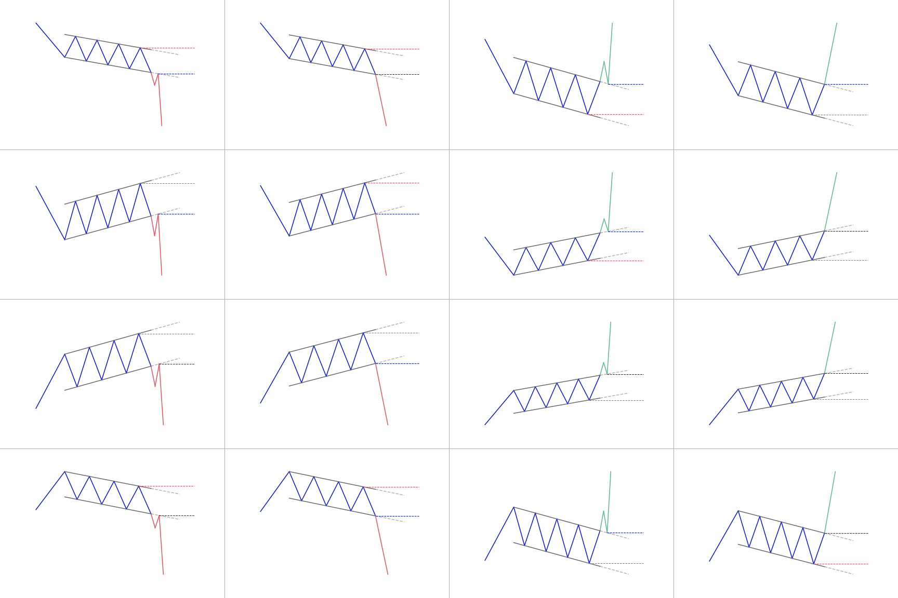</img>

## Drawing 
- Both trend lines must be parallel to each other
- Never force the price to the channels
- Sloping channel boundary at one angle while the other channel boundary sloping at another is not a correct channel pattern and it may lead to unsuccessful trades

## Bullish or rising channel pattern
A bullish or rising channel pattern forms when a price sets higher highs followed by the lower lows. The price remains within the channel support and channel resistance lines. Until the prices continue to advance and trade within the boundary of the channel, the trend remains bullish. When prices fall short of the resistance channel line, it signals an upcoming change in trend. A break below the support line provides further indication of the trend change. The break above the resistance channel line indicates the continuation of the bullish trends. 

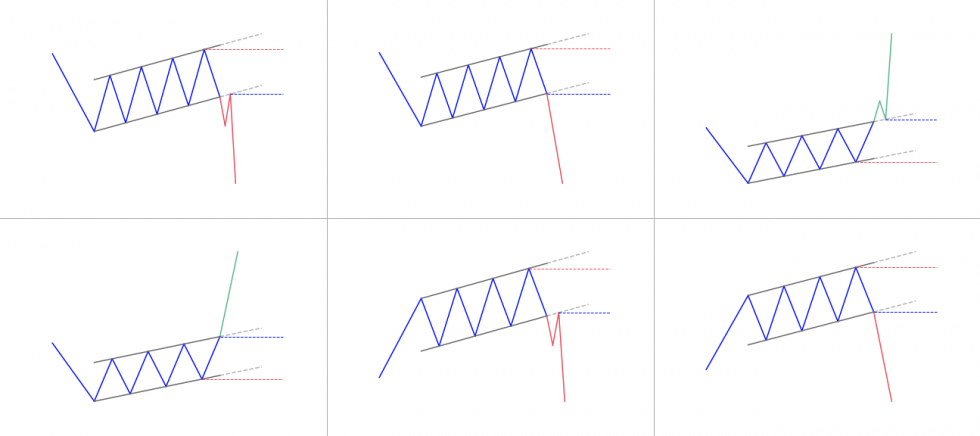</img>

### **How to trade a rising channel?**
In a rising channel, when prices touch the support trend line, some traders look to buy. Technical analysts advise taking a short position when the price breaks below the lower channel line of a rising channel. On the other hand, taking a long position is a viable option when the price touches the lower trend line of the rising channel and exit the trade when the price reaches the upper channel line. Traders can place stop-loss a little bit below the lower line to be on the safe side and avoid losses if the price abruptly reverses its direction. 

## Bearish or falling channel pattern 
A bearish or falling channel pattern forms when a stock’s price reaches lower lows followed by the higher highs. The price movement remains within the channel support and channel resistance lines. The trend remains bearish until the prices continue to decline and trade within the boundary of the channel support and channel resistance lines. When prices are not able to reach the support channel line, it is an indication of a change in trend. The price break above the resistance channel line further strengthens the indication of a change in trend. The price break below the resistance channel line indicates the continuation of the bearish trend.

</img>

### **How to trade the falling channel?**
Some traders prefer to sell or go short when the prices reach the resistance channel line in a falling channel pattern. A breakout strategy suggests buying when the price breaks above the channel. Traders suggest going short by placing stop-loss just below the highest high and go long by placing stop-loss just below the lowest low.

## Difference between Flag and Channel Pattern
Flags and channels look similar, but there are some key differences between the two patterns. First, flags are short-term patterns that typically extend 1-4 weeks. Channels are longer patterns that extend a month or more. Second, flags form after a sharp advance or decline. A bullish flag slopes down and forms after a sharp advance. A bearish flag slopes up and forms after a sharp decline. Channels are not dependent on the prior move. Third, flags represent a short correction or rest within the ongoing trend. Channels usually define the ongoing trend. The upper and lower trendlines mark support and resistance. The first chart shows SPY within a seven month channel. After the shart September advance, the ETF corrected with a falling flag and continued higher with the October breakout. SPY formed another falling flag after the sharp February surge and continued higher with the March breakout. 

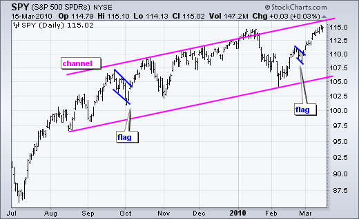</img>

# Flag Pattern
- The Flag pattern is a continuation pattern.
- Its formation is a strong sign of consolidation (price stops to trend for a while to build back momentum).
- It is identifiable with 3 components: the flagpole, the flag (the consolidation part) and the continuation.

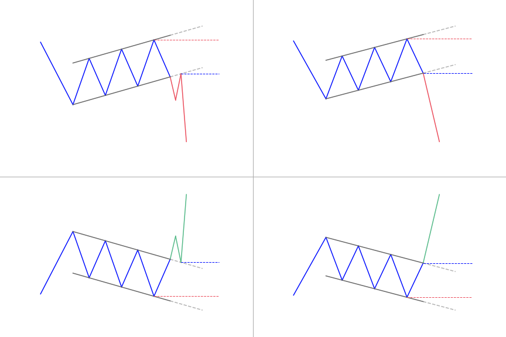</img>

The flag pattern is a powerful pattern used in technical analysis. It is a continuation pattern and it also represents consolidation. Being a continuation pattern, it predicts that the market will continue in the same direction after the end of the pattern. The flag forms after a significantly large price movement as it represents market consolidation. After a strong up or down movement, the flag formation tends to embed consolidating prices. According to the flag, prices continue in the same direction after breaking out of the formation.

## Components
- **The flagpole** represents the initial price movement and it can represent both, uptrend or downtrend. The angle of the slope is irrelevant as far as the validity of the flag formation is concerned. The overall distance of the price movement is calculated by measuring the difference between the previous low or high and the current low or high.
- **The flag** represents the consolidation of the market after a strong price movement. The formation of the flag is the key to the flag pattern. The length of the time period is irrelevant but is important to note that more aggressive breakouts occur after longer periods of consolidation. 
- **The continuation** is the point of the flag formation that shows the end of consolidation and indicates that the market is again trending in the original direction. 

## Bullish flag pattern 
The bullish flag forms during a bullish trend. The bull flag starts with a strong, almost vertical, bullish trending move which then stabilizes and then turns into a minor bearish correction with parallel tops and bottoms. The upside breakout confirms the bullish flag pattern and traders prepare for a long position. The formation of the bull flag takes short-sellers of the guard as more buyers jump into the market. The price peaks eventually, prices rise and form a pullback while the lows and highs are parallel to each other. Hence, the bull flag chart pattern resembles a rectangle or downward sloping channel because of those parallel trend lines. 

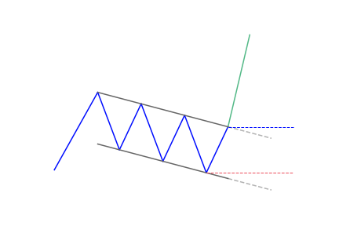</img>

### **How to identify the bullish pattern?**
- Look for a preceding uptrend making flagpole as we know that a bullish flag pattern forms during a bullish trend
- Identify the formation of the bull flag as a result of downward sloping consolidation 
- Generally, the retracement ends below the 38% threshold of the original trend. It may not be a flag pattern if the retracement goes below the 50%
- Look to enter on the breakout above the upper channel’s high or at bottom of the flag
- Wait for the price break out high with height equal to the flagpole 

### **How to trade when you see a bullish flag pattern?**
To trade the bullish flag, traders can enter the market at the bottom of the price channel or show patience for price break above the high of the upper channel. Traders then seek profit by analyzing the flagpole length preceding the flag. However, the reliability of the bull flag pattern depends on the correct identification of the pattern. It is a formidable pattern for forex trading if it is correctly identified after locating all of its components on the chart.

## Bearish flag pattern
The bearish flag is exactly the inverse of the bullish flag pattern. The bullish flag formation forms down to upside while the bear flag forms upside down. It has all the components that a bull flag has, but are the only inverse. The bear flag forms during a bearish trend in the market as a result of the price drop as sellers take control of the market. After the bounce or consolidation channel in an upward direction, parallel upper and lower trend lines then form the bear flag. 

### **How to identify the bearish pattern?**
- Look for a preceding downtrend making a flagpole as we know that the bear flag forms during a bearish or downward trend
- After the decline, the flag appears during a period of consolidation. After the consolidation, the prices may move upward retracing a portion of the initial decline
- Now look for the continuation component of the flag when the prices begin to fall to continue the original trend.

### **How to trade when you see the bearish flag pattern?**
To trade the bearish flag pattern, traders may enter the market when a candle closes below the lower level of the bear flag pattern. Traders may also place the stop-loss above the highest high of the flag. Technical analysts and experts suggest taking profit at each target level as it will maximize the profits and reduce the risks. The bear flag pattern is considered an extremely reliable pattern if all of its components are correctly identified. The successful trading of the bearish flag depends totally on the correct identification of the pattern. 

# Broadening Top Patter
- The broadening top pattern is a bearish reversal pattern.
- It’s tougher to trade than other classical patterns as lows and highs get taken out one by one.
- It can also be called the “megaphone pattern”.

The broadening top pattern is a bearish reversal pattern used in technical analysis. The broadening top predicts an upcoming reversal of the current trend. Following two widening trend lines, prices tend to progressively make lower lows and higher highs. When this happens, we have a broadening top pattern. Depending on the broken line, the price may move up or down past the pattern. Generally, it moves up because the broadening top formation appears mostly on top.

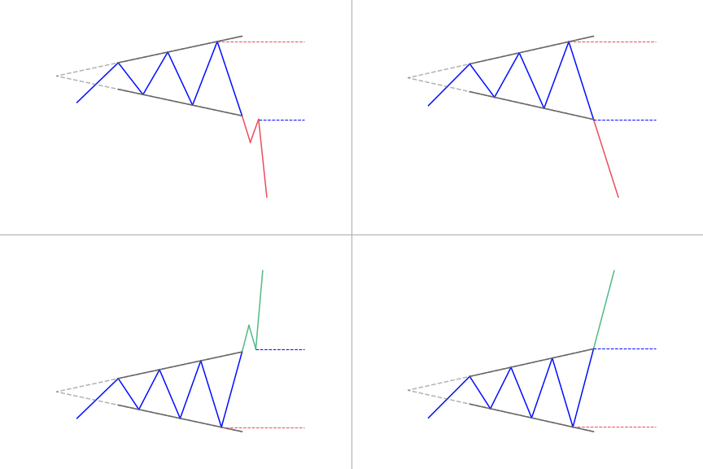</img>

### **How to identify the broadening top pattern?**
The broadening top pattern occurs after a significant upward or downward movement in the security prices’ action. The identification of the broadening top pattern is easy although it seems tough. When the two trend lines connecting widening highs and lows diverge from each other, it is an indication of the broadening top pattern. It is necessary to note that the upper trendline should be ascending while the bottom line can be descending or horizontal. The most common broadening formation occurs toward the end of a very long uptrend and it predicts a potential downtrend.

### **What does the broadening top tell traders?**
Broadening top pattern technical analysis leads to multiple revelations. The megaphone pattern occurs very rarely but traders and technical analysts consider its signals most reliable. It indicates an upcoming reversal of the prevailing trend in the market. 

### **How to trade when you see the pattern?**
There are different types of trading strategies that a trader can opt for when using the broadening top pattern as technical analysis tools. For example, day traders and swing traders may wish to trade with an uptrend when the price breaks from the broadening top pattern. A selling option is available when prices rebound off the lower trend line. Traders may go short at the highest high when price begins to fall. Similarly, a buying option is available when the price touches the bottom trend line for the thirds time. 

As we know that broadening formations rise volatility because they do not move in a single clear direction. That is the reason that broadening formations are usually bearish for most long-term traders and trend traders. On the other hand, day traders and swing traders always have great opportunities while exercising broadening top trading strategy to take profits because they seek to profit from volatility in the market by not relying on anything else. They always attempt to profit by quickly entering or exiting the markets to capitalize on short-term movements. 

# Triple Top Pattern
- The triple top pattern is a bearish reversal pattern.
- It’s created when price bounces off resistance 3 time at similar levels.
- It’s a sign the sellers are coming in the market to avoid the security price to shoot higher.

A triple top or triple peak is a bearish chart pattern. It is very dependable in stock chart patterns used in technical analysis. It is straightforward and it is defined by three clear peaks that form about the same level in the market. This pattern is a specific form of the head and shoulders pattern. Just that the three peaks top around the same price levels the same way the double top does. 

The first peak in this chart pattern is made when the prices fall back after a trending period in the market. Prices rise again to the same level as the first peak but buyers will not get sufficient momentum to drive prices up through the resistance. The third peak forms in the same way. 

There’s a chance that prices can fall short or go beyond the previous highs, as long as they all top at the same price levels. No matter what happens, every peak has to be on a decreasing volume.

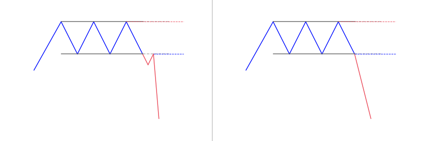</img>

## Types of Triple Tops
- The shape of the peak: The peak can look like an inverted V (called Adam troughs) or an inverted U (Eve troughs)
- The level of the second peak: The second peak could be higher, at the same level or lower than the first peak
- The level of the third peak: The third peak could be higher, at a similar level or slightly lower than the second peak

### **How to identify the Triple Top pattern?**
**Rule 1:** To have a reversal, there has to be a prior trend in the background in order. In the case of the triple top reversal, look for a bullish trend that has finally gotten into a swing high area from where we got enough selling activity to prevent the bullish trend from continuing. 

**Rule 2:** How strong the bullish trend is might determine the strength of the sell-off. 

The triple top reversal tells traders
- that buyers are getting tired
- or they are not aggressive enough to drive the price higher.

In the same instance, the sellers are beginning to become a bit more aggressive as they are planning to pay the higher price and we get to a point of equilibrium between buying and selling power. 

The pattern is a more powerful reversal pattern. By the third failed attempt to break above resistance, more sellers notice that buyers are weak and unable to drive the price higher, so they aggressively come in and then manage to drive the price lower.

### **What does the Triple Top pattern tell traders?**
The triple top pattern comes up when the price of an asset makes three peaks at almost the same price level. The area of each peak is resistance. The pullbacks between the peaks are known as the swing lows. After the third peak, if the price goes down below the swing lows, the pattern is termed complete and traders lookout for a further move to the downside. 

The three peaks create the triple top visually similar to the head and shoulders pattern; but in this instance, the midpoint is nearly the same as the other peaks rather than being higher. Also, this pattern is similar to the double top pattern, when the price gets to the resistance area twice, making a pair of high points before falling.

### **How to trade when you see the Triple Top pattern?**
Traders could enter into a short position, or leave long positions when the price of the asset falls lower than the pattern support. The support level of the pattern is the most current swing low after the second peak. Alternatively, a trader might connect the swing lows between the peaks with a trend line. When the price goes down below the trend line, the pattern is termed complete and a further decrease in price is expected. 

To further confirm the pattern, traders will look out for huge volume as the price goes down through support. Volume should pick up indicating a strong selling interest. If the volume doesn’t increase, the pattern is more likely to fail (price rallying or not falling as it should). 

The pattern gives a downside target similar to the height of the pattern subtracted from the breakout point. This target is an estimate. At times, the price will go down much lower than the target, other instances it will not reach the target. Other chart patterns and technical indicators may also be used together with the triple top.

#### **The traditional trading strategy**
- **Entry Point:** Open a short position after the neckline.
- **Stop-Loss:** The stop-loss is positioned over the neckline.
- **Advantage:** The trade has a high likelihood of success.
- **Disadvantage:** Pullbacks can overshoot the neckline due to this a stop-loss placed too close can be blindly hit. To prevent this, wait for the pullback on the neckline before opening a position. This makes it possible to place stop-loss better.

#### **The aggressive trading strategy**
- **Entry Point:** Open a short position after the second or third peak forms.
- **Stop-Loss:** The stop-loss is positioned over the highest peak.
- **Advantage:** There is a high gain and risk ratio as the stop-loss is positioned near the entry point.
- **Disadvantage:** The percentage loss is higher since the triple top pattern is not yet confirmed.

# Rectangle Pattern
- The Rectangle pattern is bullish or bearish depending on the direction of the breakout
- It forms when price oscillates between a horizontal support and resistance.

This continuation pattern forms as a trading range during a pause in the current trend. It is easy identifying the pattern because it has two comparable highs and two comparable lows. The highs and lows can be joined to make two parallel lines that form the top and bottom of a rectangle. Sometimes, rectangles are known as trading ranges, congestion areas or consolidation zones. 

A rectangle formation shows a period of indecision between sellers and buyers as they take turns throwing punches but neither has taken over. 

The price will test the support and resistance levels many times before breaking out eventually. From that point, the price could trend in the direction of the breakout, whether it is to the downside or upside.

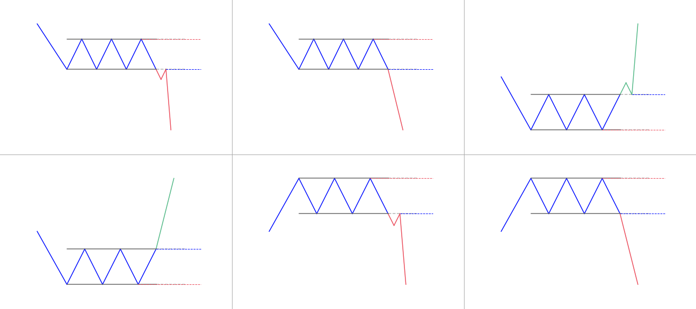</img>

## Bullish rectangle pattern
This is a continuation pattern that is seen during an uptrend, where traders look to enter into long positions once price breaks support and closes inside the breakout zone. When the pattern forms, a break to the upside would mean a continuation of the bullish trend.

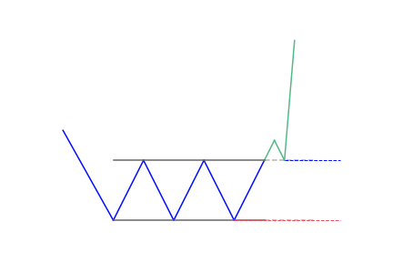</img>

## Bearish rectangle pattern
The bearish rectangular pattern is the total opposite of the bullish pattern. This pattern occurs during a downtrend, where traders look to enter into short positions when price breaks support and closes in the breakout zone. If you notice a confirmed bearish rectangle, you should open a short position when the stock breaks the bottom of the range. 

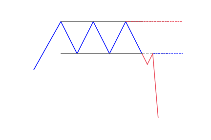</img>

### **Benefits of trading with rectangle patterns**
- They are easy to distinguish support and resistance levels in the rectangle
- Can be used in various markets
- The concept is easy to understand for new traders – identifying a consolidation pattern within a pre-existing trend and then trading the breakout
- Entry, stop and limit-levels are simple to notice and apply within the trade
- It can be used as a breakout strategy or range-bound trading strategy

### **How to identify the Rectangle pattern?**
A confirmation candle that closes outside of the lower or upper bound shows an end to the rectangle formation and indicates the breakout direction of the continuing trend. Traders have to always know potential reversals in trend by looking at the general chart, which may show bigger macro patterns.

### **What does the Rectangle pattern tell traders?**
The battle between the bears and the bulls is shown by the double-bottom reversal pattern. Inside the rectangle chart pattern, there is a consolidation that indicates that no one is in control of the market, neither the bears nor the bulls. 

Most traders like this chart pattern because they understand why it works. This method makes use of psychology in trading because you can see when other traders are in emotional and financial pain. 

The main mistake some traders make is to trade the consolidation price and put their protective stop-loss below/above. As more stops build-up above/below the chart pattern, the more important these levels become for the experienced traders who need the liquidity provided by these orders to execute their important trades. 

### **How to trade when you see the Rectangle pattern?**
1. Identify the pattern

To identify the rectangle pattern, traders will need to locate a trending stock that is having a period of consolidation. 

Traders should also see a minimum of two tops and two bottoms that are horizontal with one another. These two tops and bottoms will make the support and the resistance levels of the rectangular range. 

The pause in a trend makes the first top. The next three price swings make a bottom, a second top, and a second bottom respectively. This stock behavior shows that the price is locked inside a box. When the price action hesitates or bounces for a second time from the lower level, then the pattern is confirmed. 

2. Spot a Rectangle breakout

For a bullish rectangle, you would need to notice a breakout through the upper level of the pattern. This will confirm that the bullish move is coming back. 

For a bearish rectangle, the price would need to break the lower level of the figure to confirm its presence. In this instance, you will notice a signal on the chart that the price could initiate a new bearish move. 

3. Enter the trade

To enter the trade, traders need to first spot a rectangle breakout in the direction of the paused chart movement. Then purchase the commodity if the rectangle is bullish, or sell if you notice a bearish rectangle. 

Generally, for a sell order, it is best to see a break below support to get an entry confirmation. But before getting to this point, we also want to see a false breakout above the line of resistance. 

The false breakout is important because:
- It stops traders who went short in the direction of the current trend and put their stop-loss above the most current resistance level.
- It also traps some buyers who take the resistance breakout trade.

4. Having a stop-loss

Just like any other trading formation, never leave your rectangle trades to chance – always use a stop-loss for managing your trading positions. 

When you notice a rectangle breakout, measure the distance between the support and resistance, then you should place your stop-loss in the middle of this length. By doing this, your trade will be secured then you’ll know that the maximum you can lose from this trade is equal to half the size of the pattern. 

After buying a security on a rectangle breakout pattern, the stop-loss should be placed at the midpoint because the breakout will likely have a shakeout before continuing the trend. Thus, if you put the stop right at the breakout point, the smart money will probably hit your stop to get more shares, before beginning the run higher. 

5. Exiting the trade

When trading the rectangle pattern, there is a clearly stated rule about the minimum target. You should remain in your trade for a minimum price move equal to the size of the pattern. 

This entails that the distance between the support and the resistance of the rectangle should be placed on the chart beginning from the breakout moment. Since the stop-loss is in the midpoint of the rectangle range, it means that the target equals twice the size of the stop. This enables a win-loss ratio of 2:1.

# Triple Bottom Pattern
- The triple bottom pattern is a bullish reversal pattern.
- It’s created when price bounces off support 3 time at similar levels.
- It’s a sign the buyers are coming in the market to avoid the security price to drop lower.

The Triple Bottom chart pattern is used in technical analysis. It’s characterized by three equal lows followed by a breakout above the resistance level. 

Typically, the pattern follows a prolonged downtrend where bears are controlling the trading market. While the first bottom could simply be normal price movement, the second bottom shows that the bulls are gaining momentum and preparing for a possible reversal. The third bottom shows that there is strong support in place. Bears may capitulate when the price breaks through resistance levels. 

A triple bottom pattern is made up of many candlesticks that make three support levels or valleys that are either of equal or near-equal height. When the third valley forms, it is unable to hold support above the first two valleys and results in a triple bottom breakout.

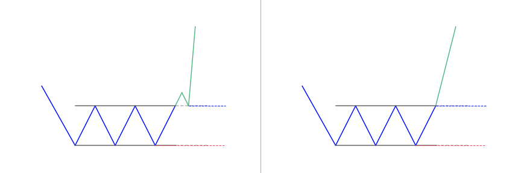</img>

### **How to identify the Triple Bottom pattern?**
The pattern looks similar to the inverse head and shoulders pattern, in that it is represented by three high highs and lows. The difference is that all three highs of the triple bottom chart pattern will be almost the same height, while in the inverse head and shoulders pattern, the second low is lower than the first and third highs. 

The triple bottom shows that a downtrend exists, and it is currently in the process of reversing into an uptrend. Selling pressure is reducing, so the downtrend is running out of strength. As with a triple top, it is generally assumed that the longer a particular trend takes to fully develop, the stronger the change in price once a breakdown occurs.

### **Breakout Expectation**
- There should be a current downtrend before the pattern occurs.
- The three lows should be almost equal in price and spaced out from each other. While the price doesn’t have to be exactly equal, it should be close to the same price, such that a trend line is horizontal.
- The volume should drop throughout the pattern to indicate that bears are losing momentum, while bullish volume should increase as the price breaks through the final resistance.

### **Components of the Triple Bottom**
- Three troughs: Also known as the three lows, they are equally spaced and help to mark vital points on the pattern. It is necessary to know that the lows don’t have to be equal but they have to be in the same range.
- Volume: This usually reduces when the pattern develops. There are instances when it will increase, particularly near the lows. Once the third low is achieved, the volume will expand at the resistance breakout.
- Price target: The distance calculated from the lows to the resistance breakout can be included in the resistance break. If the pattern has a longer development, it will lead to the ultimate breakout.
- Resistance break: This is the highest point on the pattern.
- Broken resistance: Broken resistance is equal to the potential support.

### **What does the Triple Bottom pattern tell traders?**
Triple bottom patterns can look like other patterns as they develop. It is therefore important to be able to see patterns within patterns. As it forms, you can notice a double bottom pattern before the third bottom forms. It can also be inside a descending triangle pattern. The support line is horizontal, while the resistance level makes the angle. Being able to draw support and resistance lines, as well as trend lines is very important. 

This chart pattern formation is similar to that of the double top. But three peaks are created in the triple top pattern. The price keeps fluctuating between the support and resistance of these three peaks. The traders assume that stock is expensive. Due to this, they sell stocks at the resistance levels.

### **How to trade when you see the Triple Bottom pattern?**
#### **It’s a strong bullish reversal pattern**
The triple bottom is similar to the double bottom chart pattern and may also look like descending or ascending triangles. Traders always look for confirmation of a triple bottom by applying other chart patterns or technical indicators. For instance, traders might note that the stock has an oversold RSI before a double bottom is formed, or look for a breakout to confirm that it is a triple bottom and not a descending triangle or another bearish pattern. 

By now, you are already aware that this chart pattern is a bullish reversal pattern. It means that a particular asset is trading in a downtrend and has found a strong support level. 

When the downtrend gets to the third low, it will lead to an uptrend followed by more pressure on the traders to sell the stock. Due to this, the price will get back to the initial low. Buyers will start moving back into the asset, causing the price to experience an uptrend. 

If the situation above happens again for the third time and the price falls to a new low, then the chart pattern can be said to be complete once it gets to a higher position than the resistance level.

#### **The pattern comes to life after the confirmation**
If the trader has confirmed the triple bottom pattern, he/she is supposed to set the trade trigger at the resistance line. The trader can measure the potential breakout target which allows opening the long position. 

At this point, traders have the liberty of buying the underlying security, thus benefiting from the downtrend. As the pattern closes, it will experience a price high which will lead to more selling pressure among the traders. Selling the security at this point will make it possible for short term traders to profit. 

The best exit point for triple bottoms is using the width of the respective formation added to the high or low point. However, to reap the most profits on your trading position; tighten your stops once the target is hit.

# Head and Shoulders Pattern
- The Head and Shoulders (H&S) top pattern is composed of three peaks.
- The two outside peaks are about the same height, and the middle one is the highest.
- It is a reversal pattern, from bullish to bearish.

The head and shoulders pattern is a chart figure that has a reversal character. As you can imagine, the name of the pattern comes from the visual characteristic of the pattern. It appears in the form of two shoulders and a head in between. The pattern begins with the creation of a top on the chart. The price action then makes a second top, which is higher than the first. A third head and shoulders top forms afterward, but lower than the second top and is approximately at the same level as the first top.

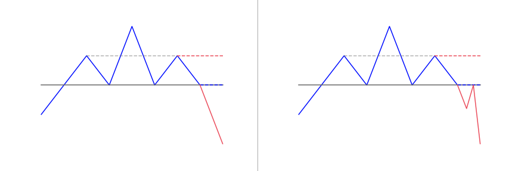</img>

### **How to identify the Head and Shoulders?**
Identifying the head and shoulders pattern on both stock and forex charts entail the exact same actions; making it a versatile tool to include in any trading strategy. 

When this pattern fully forms, it is seen as a major reversal pattern. There are five components to the head and shoulders pattern. They have to be present in order to confirm the pattern has formed.

#### **Uptrend**
This is the first part of a head and shoulders chart pattern. It is the higher extended move that eventually causes exhaustion. As a general rule, the longer the uptrend lasts, the more likely the reversal is to occur.

#### **Left shoulder**
As the market declines to form a higher low, things are beginning to come together, but we don’t quite have enough to draw the neckline. The left shoulder forms when traders pushing commodities higher lose enthusiasm temporarily.

#### **Head**
Now that the left shoulder has formed, the market makes a higher high which forms the head. But despite the bullish rally, buyers are not able to make a substantially higher low. 

At this point, we have the left shoulder and the head of the structure. The neckline is also beginning to take shape, but the right shoulder is needed before we can draw the neckline on our chart.

#### **Right shoulder**
The right shoulder is where stock price rallies once again but fails to reach its initial high before it falls again. It shows that buyers are getting tired and that the market may be gearing up for a reversal. 

As soon as it forms, we have enough to start plotting the neckline. But because the pattern isn’t complete yet, it is best to think of it as a rough draft rather than a final version.

#### **Neckline**
The neckline is considered the most important component in trading the H&S pattern because the H&S neckline acts as the trigger line for trading the pattern. 

It is formed by drawing a line beneath the troughs made just before and after the head. When the price of stocks depreciates below this trend line, it is usually a good indication that the pattern has broken and it is time to sell.  

The neckline support level is a vital component when getting into how to trade the breakout. Consider the neckline as the line in the sand between buyers and sellers. 

### **What does the Head and Shoulders pattern tell traders?**
- Price rises after a long bullish trend to a peak and subsequently goes down to form a trough.
- The price rises for a second time to make a second high, substantially over the previous peak and goes down again.
- Again, the price rises, but only to the level of the first peak, before it declines.

### **How to trade when you see the Head and Shoulders?**
Once a trader knows how to identify the standard and inverse head and shoulders patterns, it’s relatively simple to apply it for technical analysis in both equity and forex markets. 

It is important for traders to wait for the pattern to complete, because a pattern may not develop at all or a partially developed pattern may not complete in the future. Partial or nearly completed patterns should be watched, but no trades should be made until the pattern breaks the neckline. 

In the head and shoulders pattern, wait for price action to go lower than the neckline after the peak of the right shoulder. When applying the inverse head and shoulders, wait for price movement above the neckline after the right shoulder is formed. 

A trade can be initiated when the pattern is completed. Plan the trade beforehand by writing down the entry, stops-loss, and profit targets, as well as taking note of all variables that could change your stop or profit target. 

The most common entry point is when a breakout occurs – the neckline is broken and a trade is taken. Another entry point needs more patience and comes with the possibility that the move may be missed altogether. This method involves waiting for a pullback to the neckline after a breakout has already occurred. This is more conservative in that we can see if the pullback stops and the original breakout direction resumes, the trade may be missed if the price keeps moving in the breakout direction.

# Bullish & Bearish Pennant Pattern
- The pennant pattern is a continuation pattern.
- The pennant shows a time of consolidation before to (likely) continue of the same trend with a breakout.
- The consolidation period should have lower volume and the breakouts should occur on higher volume.

Some traders use the pennant pattern as an entry pattern for continuing a current trend. It usually forms after a sharp price movement that can contain gaps (referred to as the mast or pole of the pennant). The pennant represents a time of indecision in the middle of the complete move, consolidating the prior leg. The price oscillates within a small symmetrical triangle that begins wide and converges to a point as the pattern forms. They appear in any market and traders use them to predict market movements in the future.

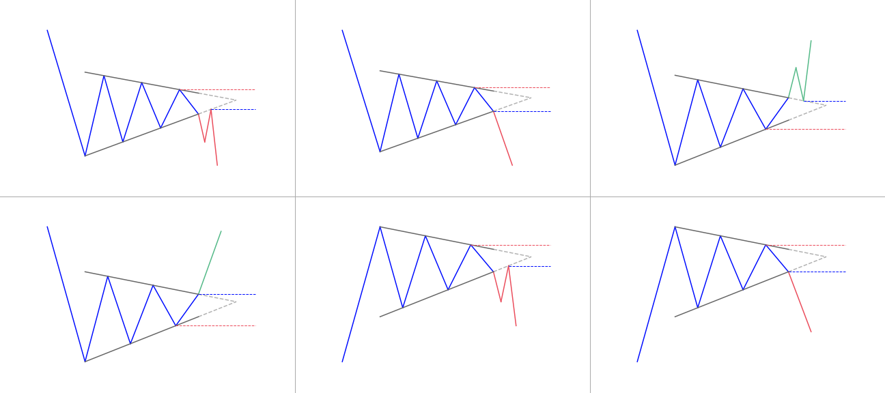</img>

## Bearish Pennants
They are continuation patterns that indicate a pause in the movement of a price halfway through a strong downtrend. It gives traders an opportunity to go short. The bearish pennant occurs just after a sharp drop in price and look like a triangular flag as the price moves sideways, gradually making lower highs and higher lows.

## Bullish Pennants
It is the total opposite of a bearish pennant. It marks a pause in the movement of a price halfway through a strong uptrend. This allows traders to go long and profit from the rest of the price rise.

### **How to identify the Pennant pattern?**
- A flagpole: A Pennant pattern always starts with a flagpole. This differentiates it from other types of patterns (like the symmetrical triangle). The flagpole is the initial strong move that comes after the symmetrical triangle.
- Breakout levels: There will be two breakouts, one at the end of the flagpole, and the other after the consolidation period, where the upward or downward trend continues.
- The Pennant itself: The Pennant is the triangular pattern. It forms when the market consolidates, between the flagpole and the breakout. The two converging trend lines form the triangle (the pennant).

### **What does the Pennant pattern tell traders?**
Pennants can be seen when a security experiences a large upward or downward movement, followed by a short consolidation, before continuing to move in the same direction. The pattern resembles a small symmetrical triangle called a pennant, which is made up of numerous candlesticks. 

Although it is similar to the triangle pattern, the pennant pattern has some vital differences that traders need to be aware of. Pennant patterns are usually described as being bearish or bullish, depending on the direction of the movement. 

Pennants, which are similar to flags in terms of structure. They both have converging trend lines during their consolidation period and can exist with any duration should possess a weak volume. It should be followed by a huge volume increase during the breakout.

### **How to trade when you see the Pennant pattern?**
A lot of traders like to enter new short or long positions after a breakout from the pennant chart pattern. For instance, a trader may see that a bullish pennant is forming and place a limit buy order just above the upper trend line of the pennant. When the security or commodity breaks out, the trader may look for above-average volume to confirm that pattern. They can hold the position until it gets to its price target. 

Often, the price target for pennants is established by using the height of the previous flagpole to the point at which the price breaks out from the pennant. For example, if a stock rises from $50.00 to $100.00 in a sharp rally, consolidates to around $80.50, and then breaks out from the pennant at $90.00, a trader might look for a $140.00 price target on the position – or $50.00 plus $90.00. The stop-loss level is often set at the lowest point of the pennant pattern, because a breakdown from these levels would invalidate the pattern and could mark the start of a longer-term reversal. 

Traders make use of pennants together with other technical indicators or chart patterns that serve as confirmation. For instance, traders may watch for relative strength index (RSI) levels to moderate during the consolidation phase and get to oversold levels which make it possible for a potential move higher. Or, the consolidation may occur near resistant levels of trend line. A breakout could make a new level of support.

## Differences between Pennant Patterns and Symmetrical Triangles
Even though both pennant pattern and symmetrical triangle are continuation patterns with a good degree of accuracy, there are two key differences between the two when it comes to their formations.

### **Pennant Patterns**
In technical analysis, a pennant is a continuation pattern. It forms when there is a big movement in a commodity or security. This is called the flagpole. Then there is a consolidation period with converging trend lines (the pennant). Then there is a breakout movement in the same direction as the initial big movement. This represents the second half of the flagpole. 

Pennants, which are similar to flags in terms of structure, have converging trend lines during their consolidation period. The volume at each period of the pennant is also important. The initial move must be met with large volume while the pennant should have weakened volume, followed by a large increase in volume during the breakout.

### **Symmetrical Triangle**
A symmetrical triangle chart pattern represents a consolidation time before the price is made to breakout or breakdown. A breakdown from the lower trend line indicates the beginning of a new bearish trend. On the other hand, a breakout from the upper trend line shows the beginning of a new bullish trend. The pattern is also referred to as a wedge chart pattern. 

The price target for a breakout or breakdown from a symmetrical triangle is the same as the distance from the low and high of the earliest part of the pattern applied to the breakout price point.

### **Differences**
#### **The Flagpole**
Both the pennant pattern and symmetrical triangle have conical bodies that form during a consolidation time. Price constantly gets to higher lows and lower highs, making two converging trend lines that make a conical shape. But the pennant has a flagpole at the start of the pattern. This is not present in the formation of the symmetrical triangle. 

The flagpole is a vital quality of the pennant. It is created when price suddenly spikes dramatically in the direction of the occurring trend, forming a line that is almost vertical. This sharp move is followed by heavy volume and indicates the start of an aggressive move within the current trend. Price then pauses, forming the body of the pennant, before breaking out in the direction of the trend with renewed motivation.

#### **Duration**
A second difference between the pennant and the symmetrical triangle is their durations. The pennant is a short-term pattern that appears for days or possibly weeks. Ideally, a pennant pattern can last between one and thirty days. A triangle pattern can take much longer, at times coming up for months or years. If a pennant pattern drags on into its 12th or 13th week, it usually becomes a triangle. 

The breakout after a pennant pattern should be present at or close to the point where the trend lines meet, called the apex. However, when dealing with a symmetrical triangle, price needs to break above or below the trend lines one-half to three-quarters of the way through the pattern. 

This shows that the pattern often never gets to its apex, creating a flat-topped cone rather than an actual triangle. A breakout eventually occurs one way or the other as the price gets close to the apex. But a breakout too early or too late may indicate a weaker pattern and a less robust continuation.

# Falling Wedge Pattern
- A falling wedge forms when two converging downward slope trendlines encapsulate the price
- It is a bullish pattern

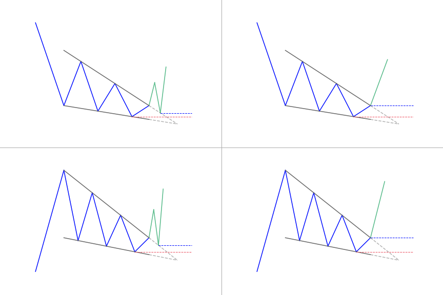</img>

### **How to identify the Falling Wedge pattern?**
The falling wedge pattern is seen as both a bullish continuation and bullish reversal pattern which gives rise to some confusion in the identification of the pattern. Both scenarios contain different market conditions that must be taken into consideration. 

The differentiating factor that separates the continuation and reversal pattern is the direction of the trend when the falling wedge appears. A falling wedge is a continuation pattern if it appears in an uptrend and is a reversal pattern when it appears in a downtrend.

- Identify an uptrend or downtrend
- Use a trend line to link lower highs and lower lows. The two lines will slope downwards and converge
- Observe for divergence between price and an oscillator
- Make use of other technical tools to confirm the oversold signal
- Look for a break above resistance for a long entry

### **What does the Falling Wedge pattern tell traders?**
When a stock or index price move has fallen over time, it can create a wedge pattern as the chart begins to converge on the way down. Traders can look to the beginning of the descending wedge pattern and measure the peak to trough distance between support and resistance to spot the pattern. 

As the price continues to slide and lose momentum, buyers begin to step in and slow the rate of decline. Once the trend lines converge, this is where the price breaks through the trend line and spikes to the upside. 

The falling wedge indicates a bullish reversal pattern in price. It has three common characteristics that traders should look for: it has converging trend lines, declining volume as the trend line progress, and finally, it will be preceded by a breakout through the upper trend line. What all these things come together, you have a falling wedge pattern, and a breakout to the upside should be anticipated. 

The wedge pattern converges to the smaller price channel. This means that the distance between where a trader would enter the trade and the price where they would open a stop-loss order is relatively tight. Here it can be very easy to get kicked out of the trade for minimum loss, but if the stock moves to the benefit of the trader, it can lead to an excellent return.

### **How to trade when you see the Falling Wedge pattern?**
#### **Opening a position**
Confirm the move before opening your position because not all wedges will end in a breakout. 

One method you can use to confirm the move is to wait for the breakout to begin. Essentially, here you are hoping for a significant move beyond the support trend line for a rising wedge, or resistance for a falling one. 

For ascending wedges, for instance, traders will mostly be mindful of a move above a former support point. On the other hand, you can apply the general rule that support turns into resistance in a breakout, meaning the market may bounce off previous support levels on its way down. Due to this, you can wait for a breakout to start, then wait for it to return and bounce off the previous support area in the ascending wedge. This will confirm the move before you open your position. 

Another common indication of a wedge that is close to breakout is falling volume as the market consolidates. A spike in volume after it breaks out is a good sign that a bigger move is nearby.

#### **Taking profit**
You can apply the general rule here – first is that the former levels of support will become new resistance levels, and vice versa. Secondly, the range of the former channel can show the size of a subsequent move.

#### **Cutting losses**
One benefit of trading any breakout is that it has to be clear when a potential move is made invalid – and trading wedges is no different. You can place a stop-loss above the previous support level, and if that support fails to turn into a new level of resistance, you can close your trade.

# Inverse Head and Shoulders Pattern
- The Inverse Head and Shoulders (iH&S) bottom pattern is composed of three peaks.
- The two outside peaks are about the same height, and the middle one is the lowest.
- It is a reversal pattern, from bearish to bullish.

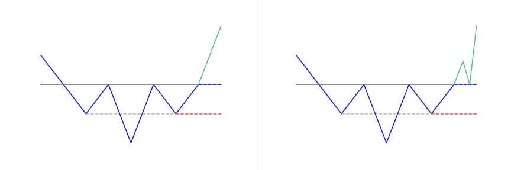</img>

### **How to identify the Inverse Head and Shoulders?**
- Left Shoulder: This is a pullback against the downtrend because of profit-taking or eager buyers stepping into the market.
- Head: Means sellers are still in control as they push the price lower. However, buyers are also stepping in, which explains the “stronger” pullback to re-test the previous swing high.
- Right Shoulder: Indicates that sellers are getting weak as they’re unable to push the price lower. Rather, the buyers are getting stronger as they continue to push the price higher, re-testing the area of resistance (which was the initial swing high).

### **What does the Inverse Head and Shoulders tell traders?**
- After long bearish trends, the price falls to a trough and then rises to make a peak.
- Again, the price falls to form a second trough below the previous low and increases yet again.
- The price falls for a third time, but only to the level of the first trough, before rising once more and reversing the trend.

### **How to trade when you see the Inverse Head and Shoulders?**
#### **The neckline is the point of interest**
Since the inverse head and shoulders are bottoming patterns after completion, traders are advised to focus on buying, or taking long positions (owning the asset). The pattern completes when the price of the asset rallies over the neckline of the pattern, or breaks through the line of resistance. 

When the price rallies above the neckline following the right shoulder, traders refer to this as a breakout, and that signals a completion of the inverse head and shoulders. 

Traditionally, you should trade the inverse head and shoulders by going into a long position when the price moves above the neckline. You should also put a stop-loss order just below the low point of the right shoulder. 

#### **What to focus on to increase the odds of success?**
The neckline works well as an entry point if the two retracements (the short intervals in the trend, or the smaller trough) in the pattern got to similar levels, or the second retracement hits slightly lower than the first. 

If the right shoulder is above the first, the trend line will angle upwards, and therefore won’t provide a good entry point (too high). In this instance, buy or enter long when the price moves above the high of the second retracement.  

Also, make use of this entry point if the second retracement high is much lower than the first. Use it as an entry point if the neckline trend gradually descends. If the neckline shows a steep angle, either up or down, apply the high of the second retracement as an entry point. 

#### **Aggressive trading an Inverse Head and Shoulders**
Traders can set a stop-buy order just above the neckline of the inverse head and shoulders pattern. This ensures a trader enters on the first break of the neckline, gaining upward momentum. Disadvantages of this strategy include the possibility of a false breakout and higher slippage to order execution.

#### **Conservative trading an Inverse Head and Shoulders**
A trader can wait for the price to close above the neckline; this is effectively waiting for confirmation that there’s a valid breakout. By applying this strategy, a trader can enter on the first close above the neckline. Alternatively, a limit order can be placed at or just below the broken neckline, attempting to get an execution on a retrace in price. Waiting for a retrace is likely to result in less slippage; however, there is the possibility of missing the trade if a pullback does not occur.

# Cup and Handle Pattern
- The cup and handle pattern is called this way because it resembles a true cup and handle where the cup is in the shape of a letter “U” and the handle has a slight downward drift.
- It is considered a bullish signal extending an uptrend.

The Cup with Handle is a bullish continuation pattern. William O’Neil created this pattern and introduced it in his book, How to Make Money in Stocks, in 1988. 

This pattern consists of two parts, the cup and the handle. The cup forms after an advance and looks like a bowl or an object with a round bottom. Trading range forms on the right-hand side as the cup is completed, and that makes the handle. A subsequent breakout from the trading range of the handle shows a continuation of the prior advance.

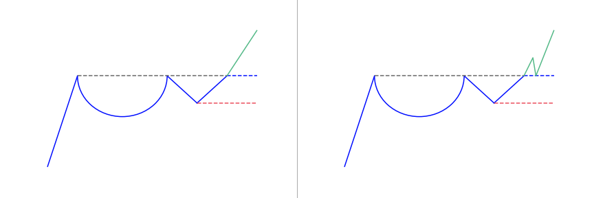</img>

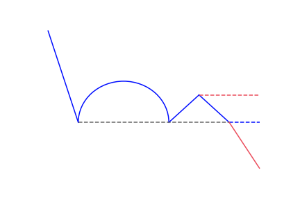</img>

### **How to identify the Cup and Handle?**
- It is seen as a bullish continuation pattern, due to this, it is essential to identify a prior uptrend. Traders can do this by making use of price action techniques or other technical indicators like the moving average.
- The cup usually forms a ‘u’ shape rather than a ‘v’, with the high points on either side of the cup being almost the same.
- The handle looks like a consolidation, which is in the form of a pennant pattern or a flag pattern. This should be sloping downwards, but it consolidates sideways at times, that looks like a rectangle pattern.
- Depending on their preference, traders see the breakout signal in various ways. Some traders view the level of resistance taken from the horizontal between the highs of the cup. When this level breaks up, traders can enter a trade. Other traders make use of a handle break trend line as a point to place a long entry.

### **What does the Cup and Handle pattern tell traders?**
- Length: Generally, cups that have longer and more U-shaped bottoms give a better signal. Avoid cups with a sharp V-shaped bottom.
- Depth: Ideally, a cut shouldn’t be too deep. Keep off handles that are also too deep, because handles should form in the upper half of the cup.
- Volume: Volume should go down as prices decrease and remain less than average at the bottom of the bowl; it should then increase when the stock starts to move higher to test the former high.

### **How to trade the Cup and Handle pattern?**
- Opening a Trade: It is best to open a trade after confirming the appearance of the pattern.
- Stop Loss: Just as it is with a lot of patterns, traders need to set up a stop-loss when trading the cup and handle patterns.
- Take Profit: The take profit targets for the cup and handle is the same as the two targets mentioned above. The first take-profit target should be found on a distance equal to the size of the handle, beginning from the breakout point. If this target is completed, you can then begin pursuing the next target. The second target should be found at a distance the same as the cup’s size, applied again from the breakout time.

# Rising Wedge
- A rising wedge forms when two converging upward slope trendlines encapsulate the price
- It is a bearish pattern

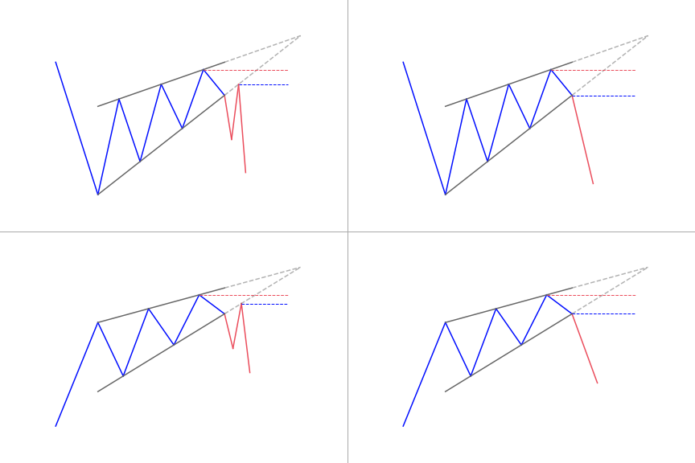</img>

### **Identifying the Rising Wedge pattern during an uptrend**
- Established uptrend
- Formation of rising wedge consolidation
- Linking higher highs with lower lows by using a trend line
- Confirmation of divergence between price and volume by using a volume function
- Confirm overbought signal by using technical tools
- Look for a break below support for short entry

### **Identifying a Rising Wedge pattern during a downtrend**
- Established downtrend
- Formation of rising wedge consolidation
- Joining higher highs and lower lows by making use of trend line assembling towards a narrowing point
- Confirmation of divergence between price and volume using volume function
- Overbought signal can be confirmed by using technical tools
- Look for break below support for a short entry

### **What does Rising Wedge pattern tell traders?**
With a consolidation in prices, traders know that a big slash is on its way, so they will expect a breakout, either to the top or bottom. When the rising wedge is formed after an uptrend, it is referred to as a bearish reversal pattern. But if it is formed during a downtrend, it could mean a continuation of the down move.
Either way, when this chart pattern is spotted, you may start to get ready with your entry orders. 

The rising wedge starts at the bottom and contracts as prices move higher and the trading range contracts. It usually occurs when the price of a security has been rising over time, but it can also happen when there’s a downward trend.

### **How to trade when you see a Rising Wedge pattern in your favorite market?**
#### **First method**
After the identification of a rising wedge pattern, whether in an uptrend or a downtrend, one way that can be used to enter the market is to place a sell order, short entry, on the break of the bottom side of the wedge. To get rid of false breakouts, wait for a candle to close below the bottom trend line before entering. 

The profit target can be measured by taking the height of the back of the wedge and by extending that distance down from the trend line breakout.

#### **Second method**
Another way of trading a rising wedge is to wait for the price to trade below the trend line, known as the broken support, as it is with the first method. After that, place a sell order on the retest of the trend line, since the broken support now becomes resistance. Usually, the stop loss would go above the new resistance area.

# Ascending Triangle Pattern
- The ascending triangle pattern is a continuation pattern.
- Price typically breakout in the direction of the prevailing trend.
- It forms between a horizontal resistance and an upward slope trendline
- It helps traders frame their trade, giving an entry, stop and target

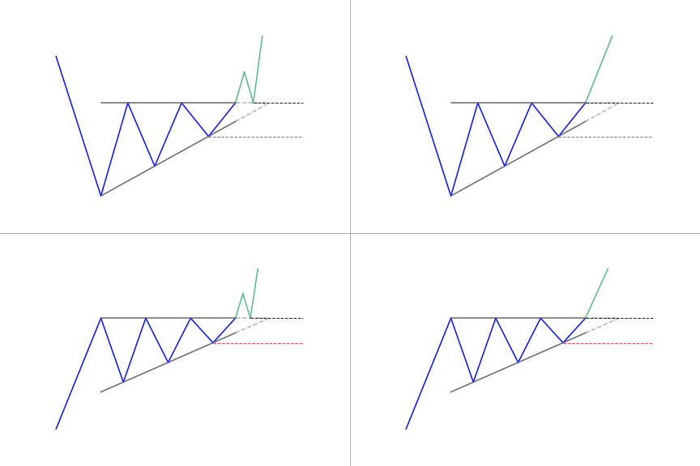</img>

### **How to identify an Ascending Triangle**
- **Uptrend:** The market has to be in an uptrend before the ascending triangle will appear. This is crucial. It emphasizes that traders should not just trade the patterns when they notice the appearance of an ascending triangle.
- **Consolidation:** This occurs when the ascending triangle begins to take its form as the market gets into the consolidation phase.
- **Rising lower trend line:** As the market consolidates, a rise in trend line can be drawn by connecting the lows. This ascending trend line indicates that buyers are gradually pushing the price upwards. This gives further support for a bullish trading bias.
- **Flat upper trend line:** The upper trend line acts as resistance. Price mostly approaches this level and bounces off until the breakout happens eventually.
- **Trend continuation:** After the price posts a strong break above the upper trend line, you should look for a confirmation of the pattern through a continued upward momentum.

### **What does the Ascending Triangle pattern tell traders?**
Generally, most traders consider an ascending triangle to be a continuation pattern, meaning that the pattern is significant if it happens within an uptrend or downtrend. Once the breakout from the triangle occurs, traders usually buy or sell the asset aggressively depending on which direction the price breaks out. Increasing the volume will help to confirm the breakout, as it indicates rising interest as the price moves out of the pattern. 

For the purpose of trading, traders can enter when the price breaks out. Buy if the breakout happens to upside, or sell if it happens to the downside. Place a stop-loss just outside the opposite side of the pattern. For instance, if a long trade develops on an upside breakout, place a stop loss just below the lower trend line.

### **How to trade when you see the pattern**
When trading the ascending triangle, traders need to identify the uptrend. Soon afterwards, the ascending triangle appears as the forex candlesticks begin to consolidate. The measuring technique can be applied once the triangle forms, as traders anticipate the breakout. 

After noticing a strong break above resistance, traders can enter a long position, setting a stop at the recent swing low and take profit target in line with the measuring technique. 

The price objective of an ascending triangle is determined by the high point of the base of the triangle, which is plotted on the break out point above the resistance. Another technique is made up of drawing a line that is parallel to the ascending triangle support line, from the first contact with the resistance.  

The pattern of the ascending triangle indicates that the buyers are more aggressive than the sellers as the price continues to make higher lows. The pattern completes itself when the price breaks out of the triangle in the direction of the overall trend.

# Double Top Pattern
- The double top looks like the letter “M”
- Price touches twice a resistance level
- The double top pattern follows an uptrend
- It signals the reversal and the beginning of a potential downtrend

A double top is a very bearish technical reversal pattern. It forms after an asset gets to a high price two consecutive times with a moderate decline between the two highs, just as its name indicates. It is confirmed once the price of the asset falls below a specific support level equal to the low between the two prior highs. 

This pattern prints two lower high points within a market which means an impending bearish reversal signal. Traders can notice a decline in price between the two high points. It shows some resistance at the price highs. After retracing a part of the first peak, the market gets back towards the high of the first peak. But, this time, strength in the market is waning and is not able to maintain a break above the first peak. 

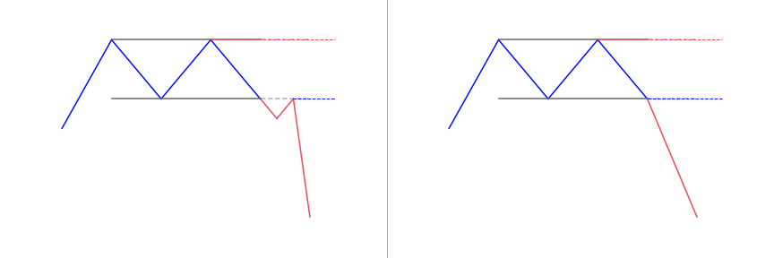</img>

### **How to identify the pattern?**
- Identify the two different peaks of similar width and height
- Distance between the peaks should not be too small, it is time frame dependent
- Confirm support/neckline price level
- Make use of other technical indicators to support double top bearish signal, such as oscillators and moving averages
- First peak: The market does a pullback; you can tell for sure if you will be a reversal as trending markets do a pullback from time to time at this point.
- Second peak: The same area rejects the market, again; it is the first sign that the market could reverse even lower.
- Break of neckline: Indicates that sellers are in control and the market could continue to decline.

### **What does the Double Top pattern tell traders?**
A double top pattern signals a medium or long-term trend change in a class of asset. They can tell traders about a possible trend reversal. However, the reversal is not confirmed until the prevailing trend has formed the second peak or second low before reversing in an opposing direction to the trend before the first peak or first low. 

Just as it is with other technical analysis and chart patterns, the double top is not certain trend indicators. Due to this, traders should always make use of this pattern alongside others to confirm the trend before opening a position.

### **How to trade when you see the pattern?**
There are two ways of trading the double top pattern: you will open a short position on a double top and a longer position on a double bottom. Before doing both however, confirm the signal with other technical analysis tools. 

After the completion of the pattern, consider exiting long positions and focus on taking short positions. The uptrend is now over and a downtrend is likely to happen. The pattern is considered complete when the price goes down below the retracement low on a double top or below both retracement lows on a triple top.  

The traditional approach for trading this pattern is to enter short (sell) when the price goes down below the retracement (lows). At times, the retracements will be at the same price point, but most times that won’t be the case. When the retracement lows are at different levels, this will give different potential entry points. 

If you draw a trend line between the two retracement lows on a triple top pattern, when the price drops below the trend line it can also be used as an entry point. This is only important if the second retracement is higher than the first. If the second retracement low is more than the low of the first, or less than the first, then the trend line will be angled awkwardly and thus not beneficial. 

Once you have initiated a short trade at any of the available entry points, place a stop-loss order. This goes above a recent swing high in price. Double top patterns give an indication of how far the price could drop once the pattern completes.

# Symmetrical Triangle Pattern
- A symmetrical triangles forms when the price of a security consolidates between two trend lines with similar slopes
- It can break in both directions, up or down
- The symmetrical triangle helps frame your entry, stop and target

Also known as a coil, the symmetrical triangle pattern forms as a continuation classical chart pattern when there is a trend. The pattern is made up of at least two lower highs and two higher lows. As the points connect, the lines come together as they are extended and the symmetrical triangle takes shape. 

They trend lines have to meet at an approximately equal slope. Those that are meeting at slopes that are not equal are referred to as a falling wedge, rising wedge, ascending triangle or descending triangle. It can also be seen as a contracting wedge – wide at the start and narrow over time.

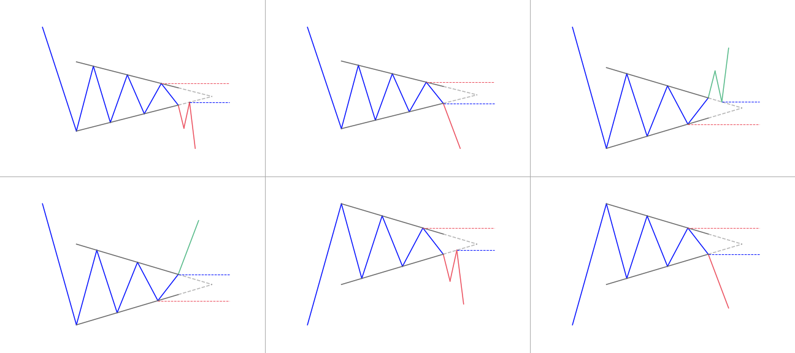</img>

### **How to identify a Symmetrical Triangle classical pattern?**
- The triangle has symmetrical or equal sides
- The triangle has lower highs AND higher lows – at least two of each
- It looks like a funnel, with the price “squeezing” from the left towards the right

### **What does the Symmetrical Triangle tell traders?**
It is the most popular triangle chart pattern. Price creates a symmetrical triangle when each swing high or swing low is less than the previous. This coiling price movement makes a structure of a symmetrical triangle. As a symmetrical triangle forms, trading activity decreases along the way until it reaches the apex of the triangle. 

Many experts believe that if a stock is rallying before the formation of a symmetrical triangle, the stock will eventually breakout to the upside. On the other hand, if a stock falls before a symmetrical triangle forms, it should continue its decline. Both of assumptions are not right. These triangles offer little or no indication regarding the direction the stock will eventually breakout. Have in mind that there is a lack of volume and price movement which gives rise to a coiling pattern. As a result of this, it is impossible to assess the direction a symmetrical triangle will inevitably breakout.

### **How to trade when you see a Symmetrical Triangle?**
#### **Identifying the real breakout**
A great trading tool for identifying breakouts is a volume indicator. Real breakouts usually occur during high trading volumes and high volatility. The fake breakouts come up during low volumes and they look more like a range rather than a breakout. Since the levels of any triangle are inclined, a ranging move sometimes brings the price outside the frames of triangles. This way, traders get tempted that there is a breakout on the chart.

#### **Setting a realistic target for your Symmetrical Triangle trade**
Each chart pattern you trade should inform you about your target for the trade. This is because chart patterns have targets, which is well-known to the more experienced traders. Have it in mind that when you trade chart patterns, your minimum target equals the size of the pattern itself. You should always have this rule at the back of your mind when you trade chart formations. 

To measure the scale of a symmetrical triangle, you would like to first extend the shorter side to match the length of the opposite side. The scale of the third side of the triangle (which is missing) is the scale of the movement in price you should go after.

#### **Protecting your trade with a wise stop loss**
Before placing any trade, always know the amount you are willing to risk. If you need to risk more than you intended, simply avoid taking the trade and move forward to a much better one. 

When trading symmetrical triangles, the right location of a stop loss is below the opposite side of the breakout. But this level is inclined, so, the more you move to stop the left, the larger the distance is between the stop and the entry price. 

So, to stop a trade, apply some simple price action rules. Observe the price action in the symmetrical triangle. If you notice a bullish breakout, place the stop below the lower level of the triangle, under a larger price bottom. But if it is a bearish breakout, put the stop loss over the upper level of the triangle.

# Double Bottom Pattern
- The double bottom looks like the letter “W”
- Price touches twice a support level
- The double bottom pattern follows a downtrend
- It signals the reversal and the beginning of a potential uptrend

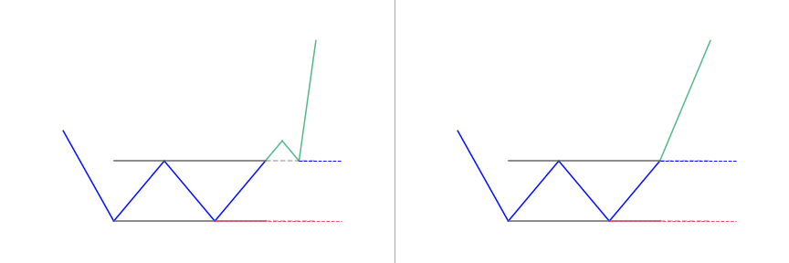</img>

### **How to identify the Double Bottom charting pattern?**
- First low (first price rejection): The market bounces higher and forms a swing low. Here, it’s likely a retracement in a downtrend.
- Second low (second price rejection): The market rejects the previous swing low. Now, there’s buying pressure, but it’s too early to tell if the market could continue higher.
- Break of neckline (an area of resistance): The price broke above the resistance and it signals that buyers are in control. The market is likely to move higher

### **What does the Double Bottom pattern tell traders?**
#### **The importance of the pattern depends on the timeframe**
Most professionals that do technical analysis believe that the advance of the first bottom should be a drop of 10 to 20 percent. The second bottom should form within 3 to 4 percent points of the previous low. Also volume on the ensuing advance should rise. 

Just as it is with other patterns, a double bottom is used best for analyzing the intermediate to longer-term view of a market. Generally, the longer the time between the two lows in the pattern, the greater the probability that the chart pattern will succeed.  

There should be a consideration of at least three months for the lows of the double bottom pattern, in order for the pattern to produce a higher probability of success. It is therefore, advisable to use daily or weekly data price charts when analyzing markets for this pattern. The higher the timeframe, the better. Though the pattern may appear on intraday price charts, it is very difficult to determine the validity of the double bottom pattern when intraday data price charts are used. 

#### **The importance of the pattern depends on the context**
The double bottom pattern always follows a minor or major downtrend in a particular security, and signals the reversal and the start of a potential uptrend. Also, the pattern has to be validated by market fundamentals for the security itself, as well as the sector that the security belongs to, and the market in general. 

The fundamentals should reflect the qualities of an upcoming reversal in market conditions. Also, you should closely monitor volume during the formation of the pattern. A rise in volume typically occurs during the two upward price movements in the pattern. This increase in volume are a strong indication of upward price pressure. It serves as further confirmation of a successful double bottom pattern. 

When the closing price is in the second rebound and is getting to the high of the first rebound of the pattern, and an expansion in volume is presently coupled with fundamentals that show market conditions that are conducive to a reversal, traders can consider to take a long position. 

### **How to trade when you see the Double Bottom pattern?**
The double bottom pattern is a good representation of seller exhaustion. When the sellers are tired, that’s the time when a trend reversal usually occurs. The strategy also gives a simple way to know your profit objectives. 

Trading with these techniques is very different than trading tops and bottoms, because you have to be patient and wait for the trade setup to develop.

- Step 1: Identify the market phase 
You need to do this because the double bottom reversal needs a downtrend. Just because you can spot the reversal that does not imply you have to jump in immediately. Have it in mind that you need the right context and everything needs to line up for a trade-able setup. So, the first step is to identify the phase or market condition. At any given time the market can be trading either up, or down, or it can go sideways.

- Step 2: Find the historical precedent or chart pattern 
You don’t want to make a trading decision without price confirmation, and in your case, use the reversal pattern. For you to effectively trade the pattern, you have to see two rounded bottoms. In technical analysis, a rounded bottom is just a price formation that comes after a downtrend; prices go downwards and then quickly rally, thereby creating a rounded bottom.

- Step 3: Allow only a small variation between both bottoms 
Don’t go after perfection. While trading, you will need to eliminate your idealistic mindset since the pattern will not appear perfect at all times. Therefore, you need to be flexible. This is why you should allow a small variation between the two bottoms.

- Step 4: Purchase when it closes above the neckline 
After identifying that the market phase and the characteristics of a good reversal, you should wait for confirmation that momentum is shifting. That indicator is a breakout candle.

- Step 5: Place a stop-loss 
Place it slightly below the support created by the double bottom reversal. You can easily identify risks by using the double bottom pattern. It gives you the change to trade with a close stop-loss, which is nice for keeping the losses at a minimum.

# Descending Triangle Pattern
- A descending triangle forms with an horizontal resistance and a descending trendline from the swing highs
- Traders can use the descending triangle pattern as a signal to enter a short position at breakdown
- The opposite technical pattern is the ascending triangle

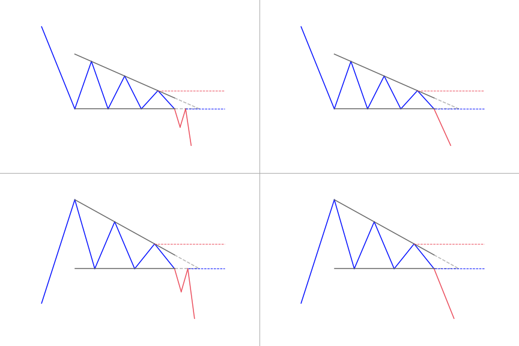</img>

Also referred to as the ‘falling triangle’, the descending triangle pattern is one of the top continuation patterns that appear in the middle of a trend. Traders anticipate the market to continue in the direction of the bigger trend and accordingly develop trading setups. 

It is a bearish chart pattern. It is used in technical analysis that is made by drawing one trend line that connects a series of lower highs and a second horizontal trend line that connects a series of lows. But it can play out as a bullish descending triangle pattern in some instances. 

Most times, traders anticipate a move below the lower support trend line. It suggests that the downward momentum is building and a breakdown is imminent. When this breakdown happens, traders enter into short positions and help to aggressively push the price of the asset even lower.

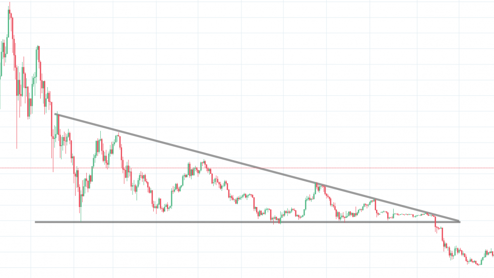</img>

### **How to identify a Descending Triangle classical pattern?**
- A flat support line
- A descending trend line that connects various lower highs
- The descending trend and the flat line of support meets at a point

It can be seen when there is a downtrend composed of a series of lower highs that are connected by a trend line sloping downwards at the top of the descending triangle chart pattern. At the bottom, price tests a strong floor of support at least 3 to 4 times; this is where the price couldn’t push any lower.

- Downtrend: The market has to be in a downtrend before the descending triangle pattern will appear. This is vital and places emphasis that traders should not just trade the pattern whenever the descending triangle comes up.
- Consolidation: The descending triangle then shows up when the market enters the consolidation phase.
- Upper trend line: While the market is consolidating, a downtrend sloping trend line can be drawn by connecting all highs. This shows that the sellers are slowly pulling the price down, which gives further support for a bearish trading bias.
- Lower trend line: This acts as support. Price mostly approaches this level and bounces off until the breakout eventually occurs.
- Trend continuation: After the price posts a strong break below the lower trend line, traders will look for confirmation of the pattern through continued downward momentum.

### **What does the Descending Triangle charting pattern tell traders?**
Descending triangle patterns are very popular among traders. It clearly shows that the demand for an asset, commodity or derivative is weakening. When the price breaks below the lower support, it is a clear indication that the downside momentum will probably continue or become even stronger. Descending triangles offer opportunities to technical traders to make great profit over a short period of time. They can form as a reversal pattern to an uptrend, but they are mostly seen as bearish continuation patterns.

### **How to trade when you see the Descending Triangle pattern?**
A lot of traders look to enter a short position following a high volume breakdown from lower trend line support in a descending triangle pattern. Generally, the price target for the chart pattern is the same as the entry price minus the vertical height between the two trend lines at the time of the break. The trend line resistance found at the top can also be a stop loss level. It allows traders to reduce any potential loss they might experience. 

When trading the descending triangle, traders have to identify the downtrend. Thereafter, the descending triangle appears as the market begins to consolidate. The measuring technique can be applied once the triangle forms, as traders look forward to the breakout. 

After observing a strong break below support, traders can enter a short position. They can set a stop at the recent swing high and take profit target in line with the measuring technique.

