# Harmonic Patterns 
This documents contains all harmonic patterns

# Content Table
- [Harmonic Patterns](#harmonic-patterns)
- [Content Table](#content-table)
- [Overview](#overview)
- [Alternate Bat Harmonic Pattern](#alternate-bat-harmonic-pattern)
    - [**How to identify the Alternate Bat harmonic pattern?**](#how-to-identify-the-alternate-bat-harmonic-pattern)
- [XABCD Harmonic Pattern](#xabcd-harmonic-pattern)
  - [The Gartley pattern](#the-gartley-pattern)
  - [The Butterfly pattern](#the-butterfly-pattern)
  - [The Crab pattern](#the-crab-pattern)
  - [The Bat pattern](#the-bat-pattern)
    - [**What does the XABCD pattern tell traders?**](#what-does-the-xabcd-pattern-tell-traders)
    - [**How to use the XABCD Pattern?**](#how-to-use-the-xabcd-pattern)
    - [**Biggest mistakes to avoid with the XABCD pattern**](#biggest-mistakes-to-avoid-with-the-xabcd-pattern)
- [5-0 Harmonic Pattern](#5-0-harmonic-pattern)
    - [**How to identify the 5-0 pattern?**](#how-to-identify-the-5-0-pattern)
  - [Bearish 5-0 pattern](#bearish-5-0-pattern)
  - [Bullish 5-0 pattern](#bullish-5-0-pattern)
    - [**What does the 5-0 pattern tell traders?**](#what-does-the-5-0-pattern-tell-traders)
    - [**How to trade when you see the 5-0 pattern?**](#how-to-trade-when-you-see-the-5-0-pattern)
- [Three Drives Harmonic Pattern](#three-drives-harmonic-pattern)
  - [Bearish Three Drives pattern](#bearish-three-drives-pattern)
  - [Bullish Three Drives pattern](#bullish-three-drives-pattern)
    - [**How to identify the Three Drives pattern?**](#how-to-identify-the-three-drives-pattern)
    - [**What does the Three Drives harmonic pattern tell traders?**](#what-does-the-three-drives-harmonic-pattern-tell-traders)
    - [**How to trade when you see the pattern?**](#how-to-trade-when-you-see-the-pattern)
- [Bat Harmonic Pattern](#bat-harmonic-pattern)
    - [**How to identify the Bat harmonic pattern?**](#how-to-identify-the-bat-harmonic-pattern)
      - [**Fibonacci ratios define the pattern**](#fibonacci-ratios-define-the-pattern)
      - [**4 legs pattern**](#4-legs-pattern)
    - [**What does the Bat pattern tell traders?**](#what-does-the-bat-pattern-tell-traders)
    - [**How to trade when you see the Bat pattern?**](#how-to-trade-when-you-see-the-bat-pattern)
      - [**Step 1: Drawing the pattern**](#step-1-drawing-the-pattern)
      - [**Step 2: Trading the pattern**](#step-2-trading-the-pattern)
      - [**Step 3: Placing a stop-loss**](#step-3-placing-a-stop-loss)
      - [**Step 4: Take-profit margin**](#step-4-take-profit-margin)
- [Shark Harmonic Pattern](#shark-harmonic-pattern)
    - [**How to identify the Shark pattern?**](#how-to-identify-the-shark-pattern)
    - [**What does the Shark pattern tell traders?**](#what-does-the-shark-pattern-tell-traders)
    - [**How to trade when you see the Shark pattern?**](#how-to-trade-when-you-see-the-shark-pattern)
      - [**Drawing the pattern**](#drawing-the-pattern)
      - [**Trading the pattern**](#trading-the-pattern)
      - [**Stop-loss**](#stop-loss)
- [Butterfly Harmonic Pattern](#butterfly-harmonic-pattern)
    - [**How to identify the Butterfly pattern?**](#how-to-identify-the-butterfly-pattern)
      - [**X-A**](#x-a)
      - [**A-B**](#a-b)
      - [**B-C**](#b-c)
      - [**C-D**](#c-d)
    - [**What does the Butterfly pattern tell traders?**](#what-does-the-butterfly-pattern-tell-traders)
    - [**How to trade when you see the Butterfly harmonic pattern?**](#how-to-trade-when-you-see-the-butterfly-harmonic-pattern)
      - [**Entry point**](#entry-point)
      - [**Stop-loss**](#stop-loss-1)
      - [**Take profit target**](#take-profit-target)
      - [**Trading a bearish butterfly harmonic pattern**](#trading-a-bearish-butterfly-harmonic-pattern)
      - [**Trading a bullish butterfly harmonic pattern**](#trading-a-bullish-butterfly-harmonic-pattern)
- [Cypher Harmonic Pattern](#cypher-harmonic-pattern)
    - [**How to identify the Cypher pattern?**](#how-to-identify-the-cypher-pattern)
    - [**What does the Cypher pattern tell traders?**](#what-does-the-cypher-pattern-tell-traders)
      - [**The ‘B’ Rule**](#the-b-rule)
      - [**Bullish and Bearish Cypher Patterns**](#bullish-and-bearish-cypher-patterns)
    - [**How to trade when you see the Cypher pattern?**](#how-to-trade-when-you-see-the-cypher-pattern)
      - [**Step 1: Drawing Cypher patterns](#step-1-drawing-cypher-patterns)
      - [**Step 2: Trading process](#step-2-trading-process)
      - [**Entry point**](#entry-point-1)
      - [**Take profit**](#take-profit)
      - [**Stop-loss](#stop-loss-2)
- [Crab & Deep Crab Harmonic Pattern](#crab--deep-crab-harmonic-pattern)
    - [**Major differences between the Crab and Deep Crab patterns**](#major-differences-between-the-crab-and-deep-crab-patterns)
    - [**How to identify the Crab & Deep Crab patterns?**](#how-to-identify-the-crab--deep-crab-patterns)
    - [**What does the Crab (and Deep Crab) harmonic pattern tell traders?**](#what-does-the-crab-and-deep-crab-harmonic-pattern-tell-traders)
    - [**How to trade when you see the pattern?**](#how-to-trade-when-you-see-the-pattern-1)
      - [**Trading a bearish Crab pattern**](#trading-a-bearish-crab-pattern)
      - [**Trading a bullish Crab pattern**](#trading-a-bullish-crab-pattern)
- [Gartley Harmonic Pattern](#gartley-harmonic-pattern)
    - [**How to identify the Gartley pattern?**](#how-to-identify-the-gartley-pattern)
      - [**X to A**](#x-to-a)
      - [**A to B**](#a-to-b)
      - [**B to C**](#b-to-c)
      - [**C to D**](#c-to-d)
      - [**A to D**](#a-to-d)
    - [**What does the Gartley pattern tell traders?**](#what-does-the-gartley-pattern-tell-traders)
    - [**What to consider to enter the trade?**](#what-to-consider-to-enter-the-trade)
      - [**Where to set your stop-loss for a Gartley trade?**](#where-to-set-your-stop-loss-for-a-gartley-trade)
      - [**What to aim for your take profit for a Gartley trade?**](#what-to-aim-for-your-take-profit-for-a-gartley-trade)
- [AB=CD Harmonic Pattern](#abcd-harmonic-pattern)
    - [**How does Fibonacci Ratios integrate with the pattern?**](#how-does-fibonacci-ratios-integrate-with-the-pattern)
    - [**What does the AB=CD trading pattern tell traders?**](#what-does-the-abcd-trading-pattern-tell-traders)
    - [**How to trade the AB=CD harmonic trading pattern?**](#how-to-trade-the-abcd-harmonic-trading-pattern)
      - [**General principle**](#general-principle)
      - [**Protect your trade**](#protect-your-trade)
      - [**Follow your strategy**](#follow-your-strategy)
      - [**Setting a profit target for your trade**](#setting-a-profit-target-for-your-trade)

# Overview
Harmonic price patterns are those that take geometric price patterns to the next level by utilizing Fibonacci numbers to define precise turning points. Unlike other more common trading methods, harmonic trading attempts to predict future movements. 

Each harmonic pattern has a dedicated detailed article. Even though these patterns are quite complex patterns, we tried to make it as simple as possible and each article goes into detailed explanation, giving you examples and data. It’ll help you clearly understand each pattern and give you the knowledge and confidence to spot them and use them in real life. No more doubt about what makes a specific pattern and how well it works.

- Harmonic trading refers to the idea that trends are harmonic phenomena, meaning they can subdivided into smaller or larger waves that may predict price direction.
- Harmonic trading relies on Fibonacci numbers, which are used to create technical indicators.
- The Fibonacci sequence of numbers, starting with zero and one, is created by adding the previous two numbers:  0, 1, 1, 2, 3, 5, 8, 13, 21, 34, 55, 89, 144, etc.
- This sequence can then be broken down into ratios which some believe provide clues as to where a given financial market will move to.
- The Gartley, bat, and crab are among the most popular harmonic patterns available to technical traders.

Harmonic price patterns are precise, requiring the pattern to show movements of a particular magnitude in order for the unfolding of the pattern to provide an accurate reversal point. A trader may often see a pattern that looks like a harmonic pattern, but the Fibonacci levels will not align in the pattern, thus rendering the pattern unreliable in terms of the harmonic approach. This can be an advantage, as it requires the trader to be patient and wait for ideal set-ups. 

Harmonic patterns can gauge how long current moves will last, but they can also be used to isolate reversal points. The danger occurs when a trader takes a position in the reversal area and the pattern fails. When this happens, the trader can be caught in a trade where the trend rapidly extends against them. Therefore, as with all trading strategies, risk must be controlled. 

- **Reversal patterns:** it predicts price will reverse and move in the opposite direction
- **Continuation patterns:** it predicts price will continue its move in the same direction

# Alternate Bat Harmonic Pattern
- The Alternate Bat pattern is popular for incorporating the 1.13XA retracement.
- Firstly, an important factor is the B point retracement that must be 0.382 retracements or it must be less of the XA leg. 
- Furthermore, it only utilizes a 2 or more BC projections. 
- The AB = CD pattern within the alternate bat pattern always extends requiring a 1.618 AB = CD calculations. 

The alternate bat pattern is a variation of the Gartley pattern. Scott Carney developed it in 2003. It is popular for incorporating the 1.13XA retracement as the defining element in the Potential Reversal Zone (PRZ). The alternate bat harmonic pattern is one of the most precise trading patterns that works exceptionally great in the relative strength index (RSI) BAMM set up. 

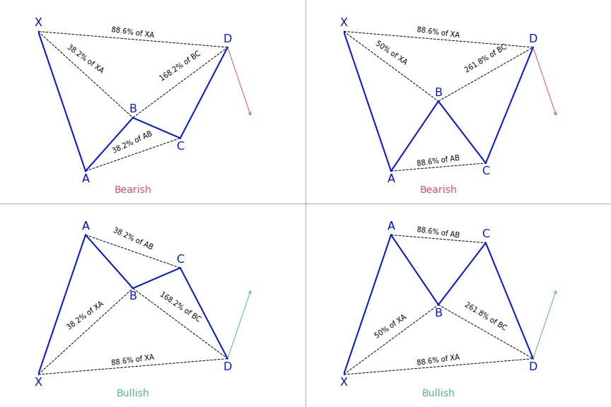</img>

### **How to identify the Alternate Bat harmonic pattern?**
- The first important factor is the B point retracement that must be 0.382 retracements or it must be less of the XA leg. 
- The alternate bat only utilizes 2.0 BC projections or greater than that. 
- The AB = CD pattern within the alternate bat pattern always extends requiring a 1.618 AB = CD calculations. 
- Generally, the best structures use 50% retracement at the midpoint. 

# XABCD Harmonic Pattern
- The XABCD harmonic is a group of reversal patterns.
- It’s a 4-legged pattern and has several variants (Gartley, Butterfly, Crab, Bat).
- Each variant has its specific fibonacci ratios

Created by Harold McKinley Gartley, XABCD harmonic pattern drawing tool makes it possible for analysts to highlight various five point chart patterns. Users can draw and maneuver the five separate points (XABCD) manually. The XABCD points make four distinct legs that come together to form chart patterns. The four legs are known as XA, AB, BC, and CD. 

Each of the five points (XABCD) show an important low or high in terms of price on the chart. Thus, the four previously mentioned legs (XA, AB, BC, CD) represent different trends or price movements which move in opposite directions.

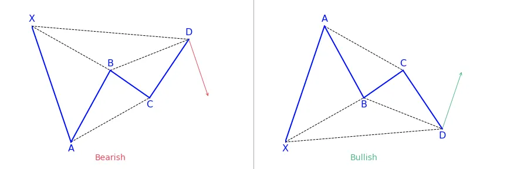</img>

## The Gartley pattern
- AB movement should be 61.8 percent retracement of XA
- BC movement has to be 38.2 percent or 88.6 percent retracement of AB
- If BC 38.2 percent retracement occurs, CD has to move 127.2 percent of BC. Thus, if BC is 88.6 percent, the CD should be expanded 161.8 percent of BC
- CD movement has to be 78.6 percent retracement of XA

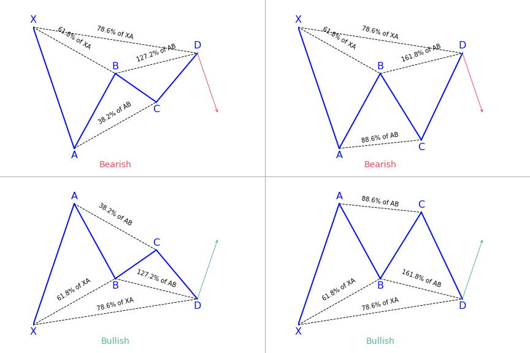</img>

## The Butterfly pattern
- The length of AB has to be 78.6 percent retracement of XA
- The length of BC might be 38.2 percent or 88.6 percent retracement move from AB
- If BC moves 38.2 percent retracement of AB, then CD should be 161.8 percent of BC. Thus, if BC is 88.6 percent going from AB, then CD has to be expanded 261.8 percent of BC
- CD has to either be 127 percent or 161.8 percent of XA

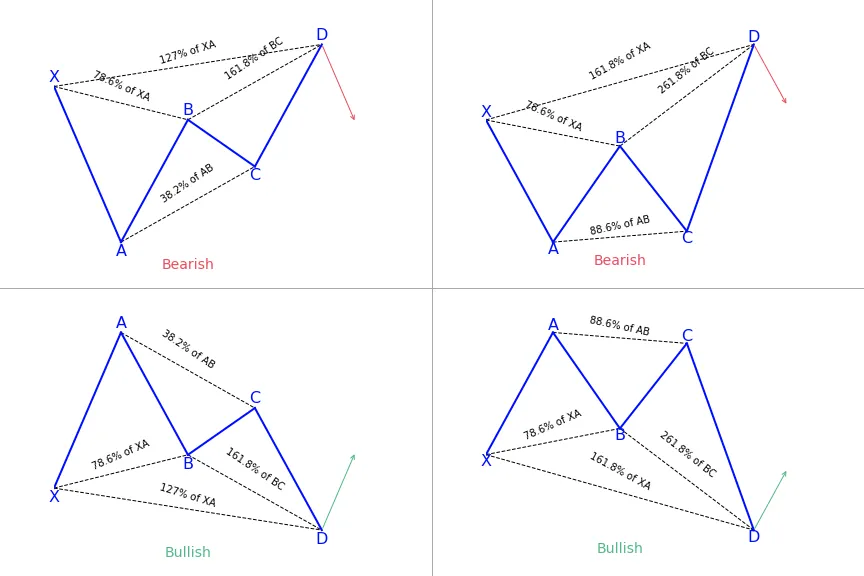</img>

## The Crab pattern
- The length of AB has to either be 38.2 percent or 61.8 percent retracement of the XA
- The length of BC might be 38.2 percent or 88.6 percent retracement of the length AB
- If the length of BC is 38.2 percent retracement of AB, CD has to be 224 percent of BC. Therefore, if the length of BC is 88.6 percent of the length of AB, then the length of the CD will be 361.8 percent of BC
- CD has to be 161.8 percent of the length of XA

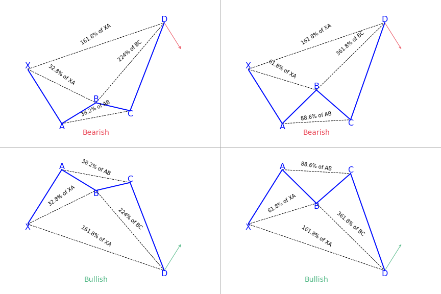</img>

## The Bat pattern
- The length of AB has to be 38.2 percent or 50.0 percent retracement of XA
- BC can either be 38.2 percent or 88.6 percent retracement of the AB
- If retracement BC 38.2 percent of AB, then CD has to be 161.8 percent of BC. Therefore, if the BC 88.6 percent moving from AB, then CD has to be 261.8 percent of BC
- CD must be 88.6 percent retracement of XA

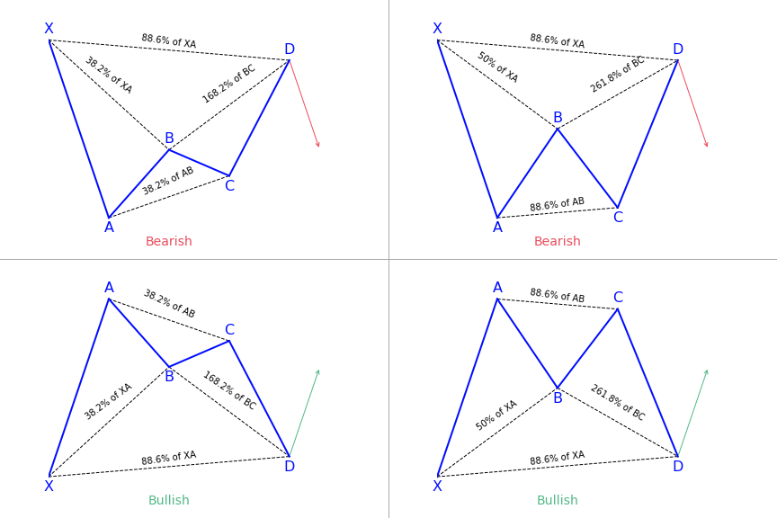</img>

### **What does the XABCD pattern tell traders?**
The XABCD harmonic pattern can be grouped into retracement, extensions and x-point patterns. Locating them can be tricky if doing it on your own and it can take a long time because there are approximately 11 ratios in every pattern to be measured. Rather, some traders do it automatically with some tools available. The pattern also work with audio alerts and other alerting systems so you don’t have to waste your time trying to locate them, but rather, just carrying out your analysis.

### **How to use the XABCD Pattern?**
XABCD harmonic pattern falls into the category of the retracement patterns, all having a D point that does not go beyond the X point of a pattern. They will have a D point (where a price reversal is preferred) close to the B point. Different retracement XABCD harmonic patterns can be used in ranges or channels, so, you have to be sure to know which one to apply in which situation.

### **Biggest mistakes to avoid with the XABCD pattern**
These patterns operate based on human emotions and there isn’t one time frame that performs better than another. That is likely because we are mapping out patterns of human emotions and the traders that are reacting to particular events react the same way if it is a shorter term move, or a longer term move. 

There are a few factors that come into play with the decision making process based off larger vs. smaller time frames, but this can be easily adaptable once you decide what to look for. 

Since XABCD patterns act based on human emotions, it would only make sense to take time into account to get a more consistent harmonic pattern structure. 

Have it in mind that if you want to make adjustments you need to ensure all the most consistent patterns possible. By doing this, you can see more clearly the impacts that your changes have on the results pushing forward.

# 5-0 Harmonic Pattern
- The 5-0 pattern is a reversal harmonic pattern.
- It follows specific fibonacci ratios (which you can read more below)

Just as it is with the shark pattern, the 5-0 harmonic pattern is a relatively new pattern. Carney discovered it and wrote about this pattern in the second book in his harmonic series, ‘Harmonic Trading: Volume Two’. 

The 5-0 pattern is easily one of the wonkiest looking patterns. Depending on the amount of knowledge you have about harmonic patterns, the 5-0 will look different, and this is mainly because the 5-0 pattern begins a 0. If you are familiar with seeing XABCD, then 0XABCD will undoubtedly look different. 

The patterns are relatively new but are getting more popular lately. It stands out from the other harmonic patterns because it is meant to begin a new trend rather than discover retracement. There are two types of this pattern, bullish and bearish. 

The convergence zones discovered with the help of the shark pattern makes it possible for us to accurately detect the rebound but doesn’t necessarily lead to the restoration of the previous trend. On the other hand, regular rollbacks aim to determine the ability of the forces dominant on the market in the previous period (bears or bulls) to get the initiative back to their disposal. If they are not sufficient, the last reversal of the previous trend occurs, but already within another pattern – 5-0 harmonic pattern.

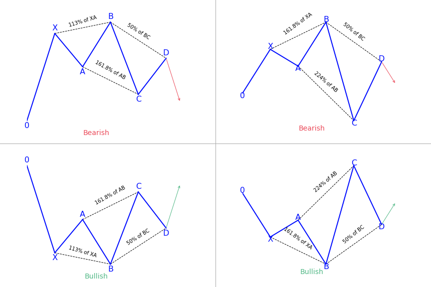</img>

### **How to identify the 5-0 pattern?**
- AB movement has to be 1.13 to 1.618 retracement of XA.
- BC movement has to be 1.618 to 2.24 retracement of an AB.
- CD movement ought to be 0.5 retracements of BC
- C should be between 0.886 and 1.13 of 0X movement

If the conditions are satisfied, some traders trade the last leg of CD. They entering at C with a stop below 2.24 of AB retracement and aiming at 50 percent correction of BC movement. 

The 5-0 harmonic pattern is traded when the price is getting to point D. The stop-loss is positioned a few ticks below/above the farthest possible D level. Unlike a lot of the other patterns, 5-0 doesn’t have specific targets because it usually begins a new trend. Here the pattern fib ratios don’t matter much. Entries might be done with a limit order or on price reversals away from point D. All entries have to be confirmed for risk/reward ratio. Entries having less risk/reward have to be taken cautiously or discarded altogether. 

A reliable indicator should automatically scan for, recognize, display, and alert emerging 5-0 and other harmonic chart patterns. It indicates the name of the pattern, when it happened, and the stop price. The pattern scanner goes through various charts in the same period and assists traders to find trading opportunities as soon as they come up.

## Bearish 5-0 pattern
To correctly identify the bearish 5-0 pattern, first, find the shark pattern, wait for the implementation of its targets at 88.6 or 113 percent, and the following rollback in the direction of 50 percent of the BC wave. The length of this wave in both graphic configurations is 161.8 to 224 percent of AB. If after the convergence zones of the shark pattern is reached, a correction in the direction of 23.6 percent, 38.2 percent, or 50 percent has followed, we can talk about the transformation of the real pattern into 5-0.

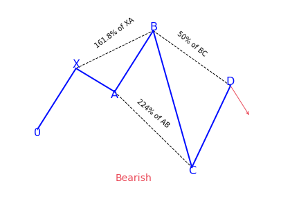</img>

## Bullish 5-0 pattern
After the target at 113 percent of the shark harmonic pattern was achieved, it was followed by a rollback in the direction of 38.2 percent of the CD wave. The trader has to search for this place for confirmation signals to create a long position. It can be both indicators, prompts from price action, or other items and techniques used for technical analysis.

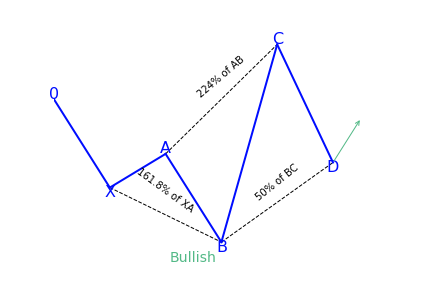</img>

### **What does the 5-0 pattern tell traders?**
The 5-0 harmonic chart pattern suggests a long entry upon completion of the pattern or confirmation of the D point of the pattern. The pattern is a unique 5-point reversal structure that typically shows the first pullback of an important trend reversal. It is a relatively new pattern that has 4 legs and particular Fibonacci measurements of each point within the structure, creating room for better flexible interpretation. The Potential Reversal Zone (PRZ) is described differently from other harmonic chart patterns. 

Conservative traders look for more confirmation before getting into a trade. Targets for this pattern can be placed at the discretion of the trader as the reversal point could be the beginning of a new trend. Common stop-loss levels are found behind a structure level beyond the D point or the next vital level for the Fibonacci sequence.

### **How to trade when you see the 5-0 pattern?**
One of the best processes of interpreting this pattern is to look at it from a tired and frustrated trader’s point of view. Taking the bullish 5-0 pattern as an example, then we can see why. The AB leg ends with B below X, making a lower low. We then get a longer move in time where the BC leg is the most prolonged move with C ending over A. 

The movement from B to C may look like a bear flag or bearish pennant. C to D indicates intense shorting pressure and a belief among bears that new lows are on the way. Rather, we get to D – the 50 percent retracement of BC. Rather than new lower lows, we get a confirmation swing forming a higher low. That move will most probably create a brand new trend reversal or significant corrective move.

# Three Drives Harmonic Pattern
- The Three Drives pattern is a harmonic reversal pattern.
- It follows specific fibonacci levels

The three drives pattern is self-sufficient, having different entry and exit points. It is a reversal pattern that is made up of three swings of the same length in the same direction. They correspond to particular Fibonacci ratios to identify potential reversal zones. The pattern can be both bearish and bullish and once discovered, it can be a precursor to strong market turns. 

The three drives pattern is a reversal pattern that is made up of various higher highs or lower lows. They complete at a 127 or 161.8 percent Fibonacci extension. It can indicate that the market is exhausted in its recent move and a reversal will probably occur on the price chart. The bullish version of the pattern can help to determine possible buy opportunities and the bearish version can help to determine possible opportunities to sell. 

The three drives pattern was first stated by Robert Prechter. It is not often used in trading because it is difficult to discover and less common than other forms of harmonic patterns. It is made up of symmetrical price movements with similar Fibonacci projections in a 5-wave structure. 

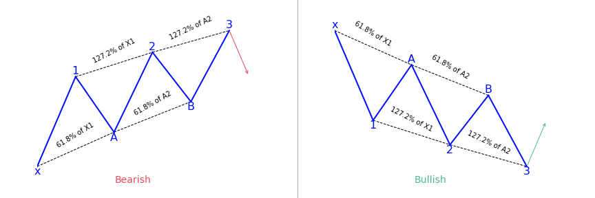</img>

## Bearish Three Drives pattern
This pattern begins with the first drive which is a bullish move. Then a lower retracement to give the A point, which should complete into the 6.18 to 78.6 percent retracement of the first drive. From here another move higher will draw, providing the second leg which completes into the 1.27 percent extension of the first drive. 

From here, a second retracement lower which should complete into 61.8 to 78.6 percent retracement of the second drive will appear, to give the B point. Lastly, we want to see one final push higher, giving us our third wave, which should complete into the 1.27 percent extension of the second drive, providing the third drive and the level which traders can look to sell.

## Bullish Three Drives pattern
The pattern begins with a bearish swing to give traders their first drive. Traders can then notice a retracement higher into the 61.8 percent level of the first drive to give traders the A point. From here, the price turns lower again to give the second drive which should complete into the 1.27 percent extension of the first drive. 

From here, the price correct higher once more. It goes back up into the 61.8 percent retracement of the second drive to give us our B point. Then there will be one final push lower with price trading down to the 1.27 percent extension of the second drive to give a third drive that completes the pattern and offers a buying zone.

### **How to identify the Three Drives pattern?**
- Correction A has to be a 61.8 percent retracement of drive 1.
- Correction B has to be a 61.8 percent retracement of drive 2.
- Drive 2 has to be a 1.272 extension of correction A.
- Drive 3 has to be a 1.272 extension of correction B.

### **What does the Three Drives harmonic pattern tell traders?**
The pattern is defined by three unique, consecutive and symmetrical drives to a top or bottom. Symmetry in both time and price is vital. It is critical to not force the pattern on the chart. If you don’t notice it, it is best not to trade it. 

A reversal will probably happen when the third drive completes. Conservative traders observe for more confirmation that price is reversing. Traders can set their targets at their discretion, but normally goes beyond the last retracement.  

If the pattern doesn’t show up, this could point to a strong continuation in the previously dominant movement. The three drives pattern can either be bearish or bullish.

### **How to trade when you see the pattern?**
To trade the 3-drive pattern effectively, traders look to taking a position in the market on the third drive. This provides the most accurate price levels of where to enter the trade. It also gives the best potential to have a profitable trade. 

The third drive mostly advances to a Fibonacci extension of 127.2 percent of the drive C. Some traders prefer to place their take-profit levels to the 161.8 percent of drive C. This is mainly a matter of personal preference and traders can set the levels to their choice as long as it provides a good risk to reward ratios set up. 

Traders can apply the pattern in various ways, such as:
- To position a pending sell or buy order at the last 127.2 percent level, while keeping the stop-loss a few pips below or above the current swing low or high.
- Wait for the market to show a rejection of the price close to the third drive. This involves observing the candlestick patterns that show price rejection such as pin bars or dojis. These rejection bars can be differentiated based on the lower wicks or long upper. After the rejection bars form, traders can then put their entry and stop-loss points at the high and the low of the bars.
- Lastly, traders can also wait for the price to break through the 127.2 percent level. They can put a pending order when the price falls lower than this high or low. Applying the previously formed swing point low or high, the stops are then based accordingly.

# Bat Harmonic Pattern
- The Bat harmonic pattern is a reversal pattern.
- It follows specific Fibonacci ratios

The pattern is a 5-point retracement structure that was discovered in 2001 by Scott Carney. It has particular Fibonacci measurements for every point within its structure. It is necessary to note that D is not a point, but rather a zone in which price is probably going to reverse. This zone is known as the Potential Reversal Zone (PRZ). 

</img>

### **How to identify the Bat harmonic pattern?**
#### **Fibonacci ratios define the pattern**
The bat harmonic pattern follows different Fibonacci ratios. One of the major ways to differentiate it from a Cypher pattern is the B point which, if it doesn’t go above the 50 percent Fibonacci retracement of the XA leg then it is a bat, otherwise it can turn into a cypher structure. 

The market strategy of the pattern is suitable for all time frames and all markets types. Traders have to keep in mind that on lower time frames using the bat pattern market strategy has some challenges because the pattern tends to appear on less frequent on lower time frames.

#### **4 legs pattern**
- X-A: In its bullish version, the first leg appears when the price sharply increases from point X to point A. This is the longest leg of the pattern.
- A-B: The A-B leg then sees the price switching direction and retracing 38.2 to 50 percent of the distance covered by the X-A leg. Have it in mind that the A-B leg can never retrace beyond point X. But if it does, the pattern is considered invalid.
- B-C: Here, the price changes direction for a second time and moves back up, retracing anything from 38.2 to 88.6 percent of the distance covered by the A-B leg. If it retraces up above the high of point A, the pattern is considered invalid.
- C-D: This is the last and most significant aspect of the pattern. As with the Gartley pattern, this is where the bat harmonic pattern ends and traders place their long (buy) trade at point D.

### **What does the Bat pattern tell traders?**
It offers traders the opportunity to enter the market at a good price, just as the pattern completes and the trend resumes. The main difference of the bat pattern to the Gartley pattern is where it completes – at an 88.6 percent Fibonacci retracement of the X-A leg. Its inner retracements are also slightly different. 

The harmonic bat pattern teaches traders how to trade the bat pattern and begin earning money with a new exciting approach to technical analysis. The market strategy of the pattern is part of the harmonic trading patterns system of trading. Just as it is with many harmonic patterns, there is a bullish and a bearish version of the bat pattern.

### **How to trade when you see the Bat pattern?**
Before trying and trading the pattern, confirm from this checklist that the pattern is real. It should include these vital elements:
- An AB=CD pattern or an extension of this pattern
- An 88.6 percent Fibonacci retracement of the X-A leg
- A 161.8 to 261.8 percent Fibonacci extension of the B-C leg

Next will be to look at how traders can trade using the bat pattern. We will make use of the bullish bat pattern as an example. For a bearish bat pattern, simply do the opposite for your orders. 

The first thing to look for when looking for this pattern is the impulsive leg or the XA leg. We are trying to identify a strong move up or down depending if we either have a bullish bat or a bearish bat pattern. 

The next thing that needs to be satisfied for an authentic bat pattern structure is a minimum 0.382 Fibonacci retracement of the XA leg and it can go as deep as 0.50 Fibonacci retracement of the XA leg, but it cannot break below the 0.618. This will form the B leg of the pattern. 

The next thing traders should do is to look for a retracement of the AB leg up to at least 38.2 percent Fibonacci ratios, but it cannot exceed the 88.6 percent, and this will form the third point C of the pattern strategy. 

The last thing to do is to establish is the D point, and to get to the D point, find the 0.886 Fibonacci ratios of the impulsive XA leg, which will lead to a deep CD leg, and finally, it will complete the entire structure of the pattern.

#### **Step 1: Drawing the pattern**
- Begin by clicking on the bat pattern indicator that is found on the right-hand side toolbar
- Identify the beginning point X, which can be any swing high or low point on the chart
- After identifying the first swing high/low point, simply follow the market swing wave movements
- You should get 4 points or 4 swings high/low points that join and form the harmonic bat pattern strategy

#### **Step 2: Trading the pattern**
The 88.6 percent Fibonacci ratio provides traders a more reliable risk/reward ratio which is why the market strategy of the bat pattern is such a very popular as a market strategy. The best entry point is the 88.6 percent Fibonacci retracement which is a very accurate market turning point. 

It is recommended that traders should enter as soon as they touch the 88.6 percent figure. Oftentimes the harmonic bat pattern strategy doesn’t go much above this level.

#### **Step 3: Placing a stop-loss**
Usually, traders should place their protective stop-loss lower than the point X of a harmonic bat pattern. That is the only logical location to hide the stop-loss because any break below will automatically invalidate the pattern.

#### **Step 4: Take-profit margin**
There can be several ways to manage your trades, but the best target for this pattern should be to use a multiple take profit formula. For this pattern strategy, take the first partial profit once you hit wave-C level and the remaining half once we break above wave-A.

By doing this you will accomplish two things:
- first, you’ll ensure that you accumulate profits,
- and secondly if the markets reverse, you ensure you’re stopped at BE and don’t lose any money.

# Shark Harmonic Pattern
- The Shark pattern is a reversal harmonic pattern.
- It follows specific Fibonacci ratios

The shark harmonic pattern shares some of the most unique conditions that can be found on some of the extreme patterns. For instance, both the shark pattern and the 5-0 are not typical M-shaped or W-shaped patterns. The shark pattern comes up before the 5-0 pattern. It also has a particular and specific Fibonacci level that the deep crab shares. 

One character that might seem abnormal to all other harmonic patterns is that the reaction to the completion of this pattern is short-lived. This is one of the most useful harmonic setups in the entire work of the creator of the pattern, especially for intraday traders, and this pattern is very much for active traders. 

This pattern is similar to the bat pattern, except for the C point going beyond the BC leg. It can point to a good counter-trend move. The potential reversal zone (PRZ) is defined by these harmonic levels: the 88.6 percent retracement of the initial leg and the 1.13 reciprocal ratio of the previous leg. Targets can be various retracements of the CD leg, all the way up to C leg. There are various means of determining where the stop should go. Some put it above the next structure level after the D point, others select the 1.41 extension of XA. 

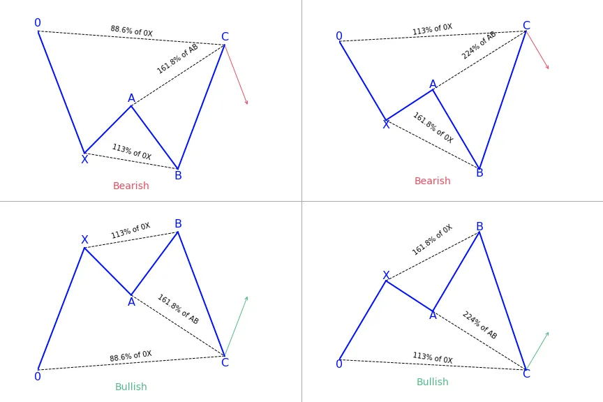</img>

### **How to identify the Shark pattern?**
The structure of a shark pattern has an impulse leg (X-A) and a retracement leg (B). In this case, the retracement has no particular value. The continuation leg (C) has to get to a Fibonacci extension of 113 percent of the B-A leg, but shouldn’t go beyond the 161.8 percent mark, a retracement for X-C follows afterward. 

The shark pattern so obtained has to get to an extension of 88.6 percent of this retracement, but should not be more than 113 percent. The next Fibonacci extension will be B-C, which is an extension of the A-X leg, within the 161.8 to 224 percent range. But as far as entering a trade goes

- The entry point should be at an extension of 88.6 percent of the O-X leg, and the stops will follow up at point C
- Targets can be at 61.8 percent of the B-C leg
- It is not difficult finding the zone to enter trades. This is the area where the X-C Fibonacci retracement and the B-C Fibonacci extension overlap

### **What does the Shark pattern tell traders?**
The pattern differentiates itself from the other harmonic patterns by its five points setup being labeled as O, X, A, B, C. Additionally, the termination point of leg B ends above wave X. It goes beyond a minimum of 1.13 and a maximum of 1.618 Fibonacci ratios.
- AB= retraces between 1.13 to 1.618 Fibonacci extension of XA leg
- BC= extends to 113 percent Fibonacci extension of 0X leg
- CD= Poses a target of 50 percent Fibonacci Retracement of BC leg

### **How to trade when you see the Shark pattern?**
#### **Drawing the pattern**
- Click on the indicator of the harmonic pattern which can be found on the right-hand side toolbar of the platform
- Determine on the chart the starting point 0, which can be any swing high or low point on the chart
- After locating the first swing high/low point, follow the market swing wave movements

Traders need to have 4 points or 4 swings high/low points that join together to form the harmonic crab pattern strategy. Each swing leg has to be validated and stick to the Fibonacci ratios of the shark pattern forex.

#### **Trading the pattern**
Buy at point D, which has to satisfy the requirement CD = 1.13 OX segment. The D to X can be found anywhere between 0.886 to 1.13, but it is best to take trades using an ideal 1.13 extension.

#### **Stop-loss**
The stop-loss can be placed below the 1.150 Fibonacci extensions of XA at point C. As the market begins to go towards the first take profit, move it after D leg. This is the best place to hide the stop-loss because any break below will automatically invalidate the Fibonacci requirements for a shark pattern. 

Just as it is with any new pattern, you need to be cautious when trading this pattern. You should only trade the best price structure that fits into all the Fibonacci ratios with great precision. Be picky! The shark harmonic trading strategy works very well as a strong counter-trend strategy.

# Butterfly Harmonic Pattern
- The Butterfly pattern is a harmonic reversal pattern.
- It follows specific fibonacci ratios

The butterfly pattern is a reversal chart pattern that is in the category of harmonic patterns. It shows price consolidation and is mostly noticed at the end of an extended price move. 

Traders can apply the butterfly pattern to determine the end of a trending move and position for the start of a correction or new trend phase. You will often see this pattern during the last wave of the impulse sequence in Elliott wave terms. 

The harmonic butterfly pattern, like all other harmonic patterns, is a reversal trading pattern that can be universally traded all the time. Some people prefer to trade them on higher time frames. 

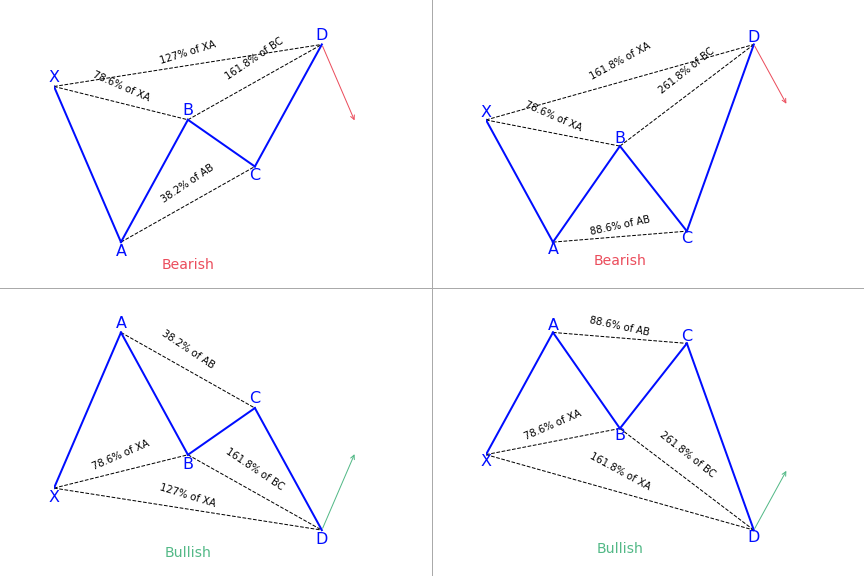</img>

### **How to identify the Butterfly pattern?**
#### **X-A**
In its bearish version, the first leg is formed when the price sharply falls from point X to A.

#### **A-B**
The A-B leg then notices the price switch direction and retraces 78.6 percent of the distance covered by the X-A axis.

#### **B-C**
In the B-C leg, the price changes direction for a second time and goes back down, retracing 38.2 to 88.6 percent of the distance covered by the A-B leg.

#### **C-D**
The C-D axis is the last and most significant part of this pattern. Just as it is with the Bat and Gartley patterns, you should also have an AB=CD structure to complete the butterfly pattern, but the C-D leg mostly extends to form a 127 or 161.8 percent extension of the A-B leg. Traders would be looking to enter at point D of the pattern. 

A big variation with the butterfly pattern over the Bat or Gartley patterns is that traders look to place their trade entry order at the point where the C-D leg has reached a 127 percent Fibonacci extension of the X-A leg. It is the longest leg of the pattern. Generally, point D should also show a 161.8 to 261.8 percent extension of the B-C leg. 

The pattern has four price swings, and its presence on the chart looks like the letter ‘M’ in downtrends, and ‘W’ in uptrends. During its formation, it can at times be mistaken for a double bottom or double top pattern.

### **What does the Butterfly pattern tell traders?**
The Butterfly is one of the most important harmonic patterns due to its nature of where it shows up. Both Carney and Pesavento emphasized that this pattern shows the important highs and lows of a trend. In fact, by using various time frame analyses, it is common to see various butterfly patterns show up in different timeframes all at the end of a trend. The pattern is an example of an extension pattern and it generally forms when a Gartley pattern is invalidated by the CD wave going pass X. 

There are two versions of this pattern that are bullish, in which traders are advised to buy, and bearish in which traders should sell. Precision is vital when it comes to applying the butterfly pattern because it allows traders to get rid of errors.

### **How to trade when you see the Butterfly harmonic pattern?**
Before trading the butterfly harmonic pattern, confirm from the following checklist that the pattern is real. It should have the following vital elements:
- AB= an ideal target of 78.6 percent of XA leg
- BC= minimum 38.2 percent and maximum 88.6 percent Fibonacci retracement of AB leg
- CD= Is a target between 1.618 to 2.618 percent Fibonacci extension of AB leg between 1.272 to 1.618 of XA leg

#### **Entry point**
Determine the place where the pattern will complete at point D – this will be at the 127 percent extension of the X-A leg.

#### **Stop-loss**
Put a stop-loss just below the 161.8 percent Fibonacci extension of the X-A leg.

#### **Take profit target**
The location for placing a take-profit target with this pattern is very subjective and depends on your trading goals as well as the conditions of the market. To have an aggressive profit target, put it at point A of the pattern. For a more conservative profit target, put it at point B.

#### **Trading a bearish butterfly harmonic pattern**
Place the sell order at point D (a 127 percent extension of the XA leg). Position the stop-loss right above an extension of 161.8 percent of the XA leg. And place the profit target at A for an aggressive move at B for a defensive move.

#### **Trading a bullish butterfly harmonic pattern**
Determine the end of the pattern at point D, which is an extension of 127 percent of the XA leg. You need to put a buy order at this point. Now, below a Fibonacci extension of 161.8 percent of the XA leg, a stop-loss can be placed. Placing a profit target depends on both market conditions and your trading goals.

# Cypher Harmonic Pattern
- The Cypher harmonic pattern is a reversal pattern
- As other XABCD patterns, it has 4 legs
- It follows strict fibonacci ratios

The cypher pattern is an advanced harmonic pattern that, when traded correctly, can have a truly outstanding strike-rate as well as a pretty good average reward-to-risk ratio. 

The cypher is a five-point pattern, composed of points XABCD. It is easy to spot on a chart due to its characteristic wave-like look, displaying either rising peaks or falling valleys. Traders can trade it like other harmonic patterns, by waiting for a reversal at the end and then using pending orders to profit from any potential breakout. 

This pattern looks like the butterfly in both its construction and where it will occur (close to the end of trends). However, the cypher pattern is rare and not one that shows up frequently. But don’t confuse rarity with being more powerful or profitable. 

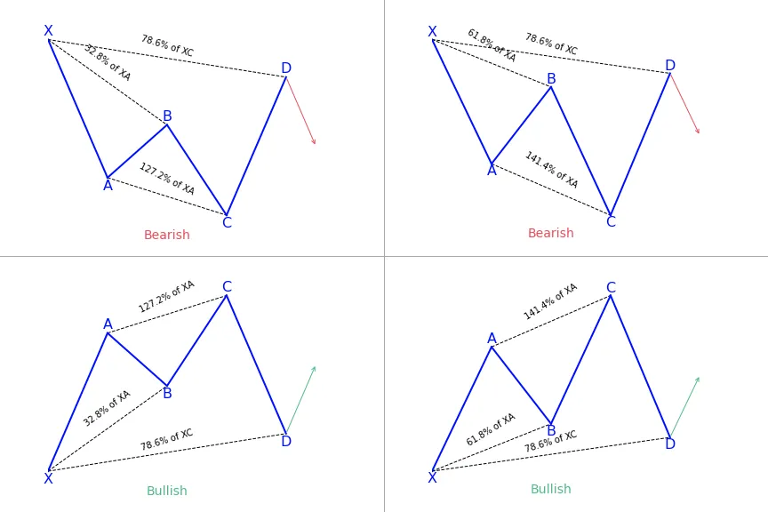</img>

### **How to identify the Cypher pattern?**
- B has to retrace to an expansive range between 38.2 and 61.8 percent of XA, at least 38.2 percent, but not exceeding 61.8 percent.
- C is an extension leg and goes beyond A – but must move to at least 127.2 percent, but it is normal for it to go as far as the 113 to 141.4 percent. It is considered invalid if it moves beyond the 141.4 percent.
- CD leg should break the 78.6 percent level of XC.
- The PRZ (potential reversal zone) of D is a wide range where the price has to get to. Price can move anywhere between 38.2 to 61.8 percent.

Cypher has less rules to follow compared to other harmonic patterns. Although its successful rate has nothing special compared to Gartley or Bat, the frequency of showing up and the ease of rules make this pattern become the favorite for all beginner traders. This pattern works best when the market is calm. In a strong trending market, especially after the news, the cypher pattern becomes less reliable. The bigger the pattern (the longer it takes to form the pattern), the stronger the support/resistance it gives.

### **What does the Cypher pattern tell traders?**
#### **The ‘B’ Rule**
Even though not many people apply it, it is an important rule. The rule basically states that B cannot touch the 78.6 percent retracement of X to C, including the candlestick wicks.

#### **Bullish and Bearish Cypher Patterns**
In any cypher, points X, C and D are the most important points. For a bullish cypher pattern, X should be the pattern low and C the pattern high. A bearish cypher pattern makes its high at X and its low at C. 

In the bullish cypher pattern, the points A and C has to make successively higher highs and point D has to be above X. In the bearish cypher points A and C have make successively lower lows and point D should be below X.

### **How to trade when you see the Cypher pattern?**
#### **Step 1: Drawing Cypher patterns
- Click on the harmonic pattern indicator located on the right-hand side toolbar of the TradingView platform.
- Identify the starting point, X, on the chart, which can be any swing low or high point.
- Once you’ve located your first swing high/low point, follow the market swing wave movements.
- Every swing leg has to be validated and abide by the cypher pattern forex Fibonacci ratios.

#### **Step 2: Trading process
Now that you know how to identify and qualify the harmonic cypher pattern, it’s time to trade the pattern. Standard methods of trading the cypher pattern include:

#### **Entry point**
The cypher pattern may be the most exciting harmonic pattern for risk management, because it has the highest winning rate. Backtesting results have continuously proven the cypher pattern forex is a very dependable harmonic pattern. 

Next, buy with a market order at the first candle preceding the completion of the D point at 0.786 Fibonacci retracement of the XC leg. Once the market touches the 0.786 level, wave D is in place, because you can’t control how far the market will go. 

When the CD leg gets to the 78.6 percent retracement level, the cypher pattern is complete and valid. However, the 78.6 percent Fibonacci retracement level of X to C also acts as the standard entry point for a valid cypher pattern trade.

#### **Take profit**
There are some ways to take profit with this pattern, but the standard method is to scale out of your position at the first take profit level and end the trade at the second take profit level. Take profit once you get to point A. To get to such levels, draw a Fibonacci retracement of the CD leg. 

The cypher patterns trading method is a reversal method. Make sure you capture as much as possible from the new trend. If you’re not a fan of reversal strategy, and you prefer a trend following strategy, follow the MACD trend following strategy-simple to learn another strategy. The strategy has attracted a lot of interest from the Forex trading community. 

Ensure you take profits once you reach point A of the pattern, because it has conservative take profit target. 

So, why should you take profit so early?

For the most part of the harmonic patterns, it’s best to lock in profits as soon as possible. Since the cypher pattern is one of the most profitable harmonic patterns, you can give it more room for the price action to breath. You have the chance to at least see a retest of the wave A. 

#### **Stop-loss
Ensure you give your trade at least 10 pips space above X in the intraday charts. While trading a bullish cypher pattern, place the stop-loss at least 10 pips lower than the low of X. For a bearish pattern, place the stop-loss at least 10 pips higher than the high of X. That’s the only logical place to hide your stop-loss, because any break below will automatically invalidate the trade.

# Crab & Deep Crab Harmonic Pattern
- The Crab & Deep Crab harmonic patterns are reversal patterns
- There are 4 legged patterns
- The crab pattern follows strict fibonacci ratios
- The deep crab pattern also follows fib ratios 

Some rules that have to be followed to confirm a crab pattern, such as:
- Following the XA leg in price, the point B is a retracement of between 38.2 to 61.8 percent. This retracement should ideally be lower than 61.8 percent
- The AB leg, is a counter trend move to the initial leg
- After point B, the next leg, BC, can run up to 38.2 to 88.6 percent Fibonacci ratios of the AB leg (C should never go beyond point A)
- Following the BC leg, price reverses once again, with the CD leg being the longest and reversing between 161.8 percent of the XA leg and an extreme 224.0 to 361.8 percent extension of the BC leg

</img>

### **Major differences between the Crab and Deep Crab patterns**
- Projection of the BC leg is not as extreme as the crab
- B has to be at least an 88.6 percent retracement. Common to move more than 88.6 percent retracement level not above/below X
- AB=CD pattern variations are more vital in the deep crab pattern
- The BC leg is a minimum of 224 percent but can extend to 361.8 percent

### **How to identify the Crab & Deep Crab patterns?**
- BC leg mostly exists within the XA leg
- C is a higher low as opposed to A in a bearish crab pattern or C is the lower high as opposed to A in a bullish crab pattern
- B makes a lower high when compared to X in a bearish crab pattern, or B makes a higher low when compared to X in a bullish crab pattern
- D is the extreme, indicating a lower low or a higher high, going beyond X

### **What does the Crab (and Deep Crab) harmonic pattern tell traders?**
Just like the butterfly, it can help traders identify when a current price move is likely getting to its end. This means traders can enter the market just as the price changes direction in the opposite way. 

The crab and deep crab represent important overbought and oversold conditions, and reaction after completion is mostly sharp and fast. It is the opinion of many analysts and traders that the crab pattern and deep crab represent some of the quickest and most profitable patterns out of all harmonic patterns.

### **How to trade when you see the pattern?**
#### **Trading a bearish Crab pattern**
To trade a bearish crab pattern, put a short (sell) order at point D (the 161.8 percent Fibonacci extension of the XA leg).
- Entry: Identify where the pattern will end at point D, and place your order
- Stop-Loss: Put your stop-loss just below point D
- Take Profit: The location of your profit target is highly subjective and depends on your objectives and market conditions. If you desire aggressive profit, place it at point A of the pattern. For a more conservative profit, place it at point B.

#### **Trading a bullish Crab pattern**
First of all, choose the crab pattern charting tool and follow all the above rules to identify the pattern. Remember that the Fibonacci ratios are very important to trade the crab pattern. If you notice the pattern on a price chart and if you find the ratios not matching with the pattern rules, it means that the pattern is not valid. So do not trade that pattern. 

When the price action confirms the pattern, immediately enter for a buy. If you are a conservative trader, ensure you wait for a couple of bullish confirmation candles before entering the trade. 

There are four targets (X, B, C, A) to place the take-profit order in the crab pattern. At the start, traders try to book full profit at point A, but when the price crosses point B, the market turns sideways. So book half of your profit at point B and then close your full positions at point A.

# Gartley Harmonic Pattern
- The Gartley pattern is a 4-legged harmonic pattern
- It can be bullish or bearish
- It follows clear fibonacci levels

The Gartley pattern is the most commonly used harmonic pattern that is based on Fibonacci numbers and ratios. This pattern offers assistance to traders in identifying reaction highs and lows. H.M. Gartley laid down the foundation for harmonic chart patterns in 1932 in his book ‘Profits in the Stock Market’. 

A harmonic pattern operates on the basis that Fibonacci sequences can be applied in building geometric structures, like retracements and breakouts in prices. The Fibonacci ratio is common in nature. It has become a famous area of focus among technical analysts that use tools. 

This is one of the most traded patterns. It is a retracement and continuation pattern that is formed when a trend temporarily changes direction before continuing in its original direction. It provides a low-risk opportunity for traders to go into the market where the pattern finishes and the trend comes back. 

</img>

### **How to identify the Gartley pattern?**
#### **X to A**
The movement begins with X to A and there are no specifics for identifying the X to A leg of the Gartley pattern. In its bullish version, this first leg gets formed when the price sharply rises from point X to point A. This is the longest leg of the pattern.

#### **A to B**
This is where Fibonacci becomes relevant to the pattern. The distance between A and B should be close the size of the movement from X to A. The A-B leg will not retrace pass point X – if it does, the pattern is considered invalid.

#### **B to C**
This movement should be a retracement of 38.2% or 88.6% of the movement of A to B. If the B to C move retraces above point A, the Gartley pattern is void

#### **C to D**
This should be an extension of the B to C leg. The difference when trading this pattern is that you will place your trade entry at the point where the C to D leg has achieved a high percentage retracement of the X to A leg.

#### **A to D**
After the completion of C-D, traders should measure the overall movement of A to D. It should be a 78.6 percent retracement of the change in price of X to A.

### **What does the Gartley pattern tell traders?**
A lot of technical analysts make use the Gartley harmonic pattern together with other chart patterns or technical indicators. For instance, the pattern can give a big picture overview of where the price is likely to go over the long-term. In the meantime, traders focus on executing short-term trades in the direction of the predicted trend. The breakout and breakdown price targets may also be used as support and resistance levels by traders. 

The best part about these types of chart patterns is that they give particular knowledge about both the timing and magnitude of price movements rather than just look at one or the other. 

Just as it is with other chart patterns, there is a bullish and a bearish version. The Gartley harmonic pattern includes the AB=CD pattern, this means that it is necessary for traders to study it before making any decision. The pattern is often known to as Gartley222 because Gartley first described it on page 222 of his book.

### **What to consider to enter the trade?**
To enter a Gartley trade you should first take note of the pattern and then confirm if it is valid or not. Outline the four price swings on the chart and check to make sure they respond to their respective Fibonacci levels to draw the Gartley pattern on your chart. Ensure you mark every price action swing with the important letters X, A, B, C, and D. By doing this, you will be able to estimate the overall size of the pattern and get a clear idea about the parameters. 

If your chat is a bullish Gartley, open a long trade after noticing these conditions:
- CD gets support at 127.2 percent or 161.8 percent Fibonacci level of the BC move.
- The price action bounces in a bullish direction from the respective Fibonacci level.

If the Gartley pattern is bearish, then you make use of the same two rules to open a trade. But in this case, your trade will to the short side.

#### **Where to set your stop-loss for a Gartley trade?**
It is always recommended that you use a stop loss order regardless of your preferred entry signal. By doing this, you will be protecting yourself from any rapid or unexpected price moves. The stop loss order of a bullish Gartley trade should be found below the D point of the chart pattern. But for a bearish Gartley trade, your stop loss order should be found above the pattern’s D point.

#### **What to aim for your take profit for a Gartley trade?**
When you open your Gartley trade and you place your stop loss order, you expect the price to move in your favor, right? And if and when it does, you should know how long you expect to stay in the trade. 

It is advisable to enter a full position after the D bounce and then scale out at different levels when trading a Gartley harmonic pattern. If the price momentum continues to show signs of strength, you can opt to keep a small portion of the trade open so as you can catch a large move. Use price action clues such as trend lines, support and resistant techniques, candle patterns and trend lines to find the right final exit point. But generally, if the price action shows no signs of interrupting the new trend, just stay in it for as long as you can.

# AB=CD Harmonic Pattern
- The AB=CD harmonic is reversal pattern
- Depending on the context, it can be bullish or bearish
- It should follow specific fibonnaci ratios :
    - BC is the 61.8 percent Fibonacci retracement of AB
    - CD is the 127.2 percent Fibonacci extension of BC

Created by Larry Pesavento and Scott Carney, after being discovered originally by H. M. Gartley, the AB=CD trading pattern has become very effective as a trading technique for technical traders. This trading pattern helps you to identify when the price is about to change direction. The idea is that you can purchase when the price is low and about to rise or sell when the price is high and is about to go down. It is a well-known harmonic group of patterns. Some traders sometimes also refer to it as ABCD pattern. 

The AB=CD pattern is considered the simplest harmonic pattern because it has significantly less requirements than most of the other harmonic setups. In addition to that, the AB=CD formation is much easier to detect on the price chart. After weeks of research, back testing and live trading, experts feel comfortable to recommend this setup to traders.

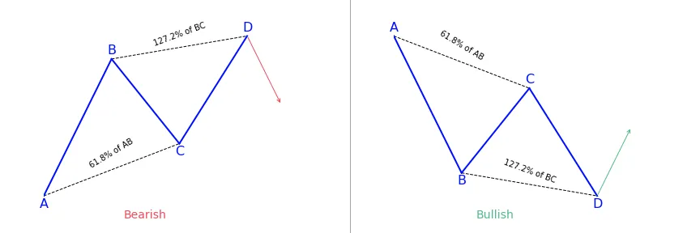</img>

### **How does Fibonacci Ratios integrate with the pattern?**
- BC is the 61.8 percent Fibonacci retracement of AB
- CD is the 127.2 percent Fibonacci extension of BC

### **What does the AB=CD trading pattern tell traders?**
Usually, the price action behavior of the ABCD pattern begins with the price going in a new direction A, which later creates a swing level B, then retraces a portion at C, and finally resumes to take out the important swing at the second position. It continues until it gets to a distance equivalent to AB or D. When the CD portion gets to an equivalent distance to AB, it is expected that there will be a reversal of the CD price move. At the same time, BC and CD will respond to particular Fibonacci levels.
When there’s a confirmation of AB=CD pattern, traders look to set entry points on the chart at the beginning of the emerging reversal after the CD move. The idea is to enter the market early enough with a trading position just after the reversal of the CD move.

### **How to trade the AB=CD harmonic trading pattern?**
#### **General principle**
Trading the ABCD pattern involves rules meant to guide people on how to enter trade, lock potential profits and exit with minimum loss if the market follows the opposite direction. The entry of a trade, whether buy or sell, triggers when the pattern is in place. 

After the AB=CD harmonic pattern has been identified, you can start looking for a trading opportunity at point D. The buy and sell signals are generated after the final C to D leg, when a reversal is expected to occur. If the pattern is trending higher, traders can look to sell or enter a short position at point D. If the pattern is trending lower, it is advisable to buy the security at point D in anticipation of a turnaround. 

#### **Protect your trade**
It is best to place stop-loss points just above or below point D, depending on the direction of the trade. If the move goes beyond that point, the chart pattern is invalidated and the reversal is less likely to happen. Take-profit points are placed by using the Fibonacci levels. For instance, traders might look for a move back to the original point A and move a trailing stop-loss to 28.2, 50, and 61.8 percent Fibonacci levels along the way.

#### **Follow your strategy**
Just as it is with other technical analysis, the AB=CD chart pattern best works when used along with other chart patterns or technical indicators. Also make use of volume as a confirmation of a reversal once the AB=CD pattern makes a prediction. 

Study the chart looking at the highs and lows of the price. Observe the price as it forms AB and BC. For a bullish ABCD pattern, C has to be lower than A and should be the intermediate high after the low at B. Point D has to be a new low below B. 

When the market gets to a point where D may be found, don’t rush into a trade. Make use of some techniques to ensure that the price reversed up, or down for a bearish ABCD. The best scenario is a reversal candlestick pattern. You can set a buy order at or over the high of the candle at point D.

#### **Setting a profit target for your trade**
One way of deciding where to take profits is by drawing a new Fibonacci retracement point from A to D of the pattern. If you are not sure the point to place your profit, set it at the 61.8 percent level, but closely observe how the price reacts around the levels. If the price finds it difficult to break through any of them, close your trade and take an early profit.

