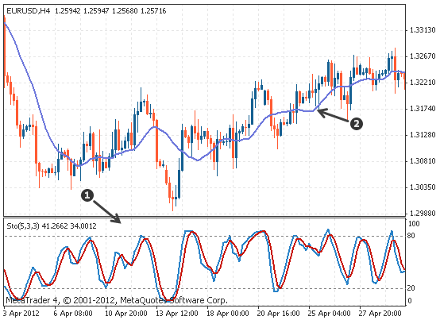

# Trading Indicators
Indicators are a set of tools applied to a trading chart that help make the market more clear. For example, they can confirm if the market is trending or if the market is ranging. Indicators can also provide specific market information such as when an asset is overbought or oversold in a range, and due for a reversal.

</img>
