# Momentum Indicators
Momentum indicators are technical analysis tools to help traders understand if price has the energy to move (hence momentum). They often are computed using price movement, closing price and current price. 

The most popular momentum indicators are RSI, Stochastic Oscillator, MACD Indicator and many more are available (more than 20 different indicators). 

Each of these technical indicators are very easy to add to your price chart using TradingView. As you likely noticed, most of the price charts visible on our site are taken from this tool

# Content Table
- [Momentum Indicators](#momentum-indicators)
- [Content Table](#content-table)
- [McClellan Oscillator](#mcclellan-oscillator)
  - [Formula](#formula)
    - [**How to Calculate the McClellan Oscillator**](#how-to-calculate-the-mcclellan-oscillator)
    - [**What Does the McClellan Oscillator Tell You?**](#what-does-the-mcclellan-oscillator-tell-you)
- [Percentage Price Oscillator](#percentage-price-oscillator)
  - [Formula](#formula-1)
  - [How the Percentage Price Oscillator (PPO) Works](#how-the-percentage-price-oscillator-ppo-works)
- [Accelerator Oscillator](#accelerator-oscillator)
  - [Formula](#formula-2)
  - [How to interpret the Accelerator Oscillator?](#how-to-interpret-the-accelerator-oscillator)
  - [How to trade with the indicator?](#how-to-trade-with-the-indicator)
- [Chande Momentum Oscillator](#chande-momentum-oscillator)
  - [Formula](#formula-3)
  - [Chande Momentum Oscillator Interpretation](#chande-momentum-oscillator-interpretation)
  - [How to trade with the CMO?](#how-to-trade-with-the-cmo)
  - [Example](#example)
- [Disparity Index indicator](#disparity-index-indicator)
  - [Formula](#formula-4)
  - [What does the disparity index indicator tell traders?](#what-does-the-disparity-index-indicator-tell-traders)
  - [How to trade with the indicator](#how-to-trade-with-the-indicator-1)
- [Stochastic Oscillator](#stochastic-oscillator)
  - [Formula](#formula-5)
  - [What Does the Stochastic Oscillator Tell You?](#what-does-the-stochastic-oscillator-tell-you)
- [True Strength Index (TSI)](#true-strength-index-tsi)
- [Formula](#formula-6)
  - [What Does the True Strength Index (TSI) Tell You?](#what-does-the-true-strength-index-tsi-tell-you)
    - [** Signal Line Crossovers**](#-signal-line-crossovers)
    - [**Centerline Crossovers**](#centerline-crossovers)
    - [**Breakouts and Divergence**](#breakouts-and-divergence)
  - [How to use the TSI indicator in trading?](#how-to-use-the-tsi-indicator-in-trading)
  - [True Strength Index indicator trading strategies](#true-strength-index-indicator-trading-strategies)
- [TRIX Indicator](#trix-indicator)
  - [What does the TRIX indicator tell traders?](#what-does-the-trix-indicator-tell-traders)
  - [How to use the TRIX indicator?](#how-to-use-the-trix-indicator)
  - [Formula](#formula-7)
  - [Trading TRIX indicator signals](#trading-trix-indicator-signals)
    - [**Zero line cross**](#zero-line-cross)
    - [**Signal line cross**](#signal-line-cross)
    - [**Divergences**](#divergences)
  - [Combining TRIX with other technical indicators](#combining-trix-with-other-technical-indicators)
    - [**TRIX and RSI**](#trix-and-rsi)
    - [**TRIX and MACD**](#trix-and-macd)
- [Chaikin Oscillator](#chaikin-oscillator)
  - [Formula](#formula-8)
  - [What Does the Chaikin Oscillator Tell You?](#what-does-the-chaikin-oscillator-tell-you)
- [Commodity Channel Index (CCI)](#commodity-channel-index-cci)
  - [Formula](#formula-9)
  - [What Does the Commodity Channel Index (CCI) Tell You?](#what-does-the-commodity-channel-index-cci-tell-you)
- [Ultimate Oscillator](#ultimate-oscillator)
  - [Formula](#formula-10)
  - [What Does the Ultimate Oscillator Tell You?](#what-does-the-ultimate-oscillator-tell-you)
  - [How to use it in trading?](#how-to-use-it-in-trading)
- [Coppock Curve Indicator](#coppock-curve-indicator)
  - [Formula](#formula-11)
  - [What Does the Coppock Curve Tell You?](#what-does-the-coppock-curve-tell-you)
  - [How to use the Coppock Curve?](#how-to-use-the-coppock-curve)
- [Money Flow Index](#money-flow-index)
  - [Formula](#formula-12)
  - [What Does the Money Flow Index Tell You?](#what-does-the-money-flow-index-tell-you)
- [Awesome Oscillator Indicator](#awesome-oscillator-indicator)
  - [Formula](#formula-13)
  - [What does the AO indicator tell traders?](#what-does-the-ao-indicator-tell-traders)
  - [How to use the Awesome Oscillator?](#how-to-use-the-awesome-oscillator)
  - [Trading the Awesome Oscillator indicator](#trading-the-awesome-oscillator-indicator)
    - [**Buy signal conditions](#buy-signal-conditions)
    - [**Sell signal conditions**](#sell-signal-conditions)
- [Williams %R Indicator](#williams-r-indicator)
  - [Formula](#formula-14)
  - [What Does Williams %R Tell You?](#what-does-williams-r-tell-you)
- [Ease of Movement Indicator](#ease-of-movement-indicator)
  - [Formula](#formula-15)
  - [What does the indicator tell traders?](#what-does-the-indicator-tell-traders)
  - [How to use the Ease of Movement indicator?](#how-to-use-the-ease-of-movement-indicator)
    - [**Opening a position**](#opening-a-position)
    - [**Closing a position**](#closing-a-position)
- [Stochastic RSI (StochRSI)](#stochastic-rsi-stochrsi)
  - [Formula](#formula-16)
  - [What Does the Stochastic RSI Tell You?](#what-does-the-stochastic-rsi-tell-you)
  - [How to use the StochRSI?](#how-to-use-the-stochrsi)
- [Rate of Change Indicator](#rate-of-change-indicator)
  - [Formula](#formula-17)
  - [What Does the Price Rate of Change Indicator Tell You?](#what-does-the-price-rate-of-change-indicator-tell-you)
  - [How to use the Rate of Change indicator?](#how-to-use-the-rate-of-change-indicator)
- [Know Sure Thing (KST) Indicator](#know-sure-thing-kst-indicator)
  - [Formula](#formula-18)
  - [Understanding](#understanding)
  - [What does the Know Sure Thing indicator tell traders?](#what-does-the-know-sure-thing-indicator-tell-traders)
  - [How to use the Know Sure Thing indicator?](#how-to-use-the-know-sure-thing-indicator)
- [Chaikin Oscillator](#chaikin-oscillator-1)
  - [Formula](#formula-19)
  - [What Does the Chaikin Oscillator Tell You?](#what-does-the-chaikin-oscillator-tell-you-1)
- [MACD Indicator](#macd-indicator)
  - [Formula](#formula-20)
  - [What does the MACD indicator tell traders?](#what-does-the-macd-indicator-tell-traders)
  - [How to use the MACD indicator?](#how-to-use-the-macd-indicator)
  - [How to trade using the MACD](#how-to-trade-using-the-macd)
- [Stochastic Oscillator](#stochastic-oscillator-1)
  - [Formula](#formula-21)
  - [What Does the Stochastic Oscillator Tell You?](#what-does-the-stochastic-oscillator-tell-you-1)
  - [How to use the Stochastic indicator?](#how-to-use-the-stochastic-indicator)
- [Relative Strength Index (RSI)](#relative-strength-index-rsi)
  - [Formula](#formula-22)
  - [What Does the RSI Tell You?](#what-does-the-rsi-tell-you)
  - [How to use the Relative Strength Index indicator?](#how-to-use-the-relative-strength-index-indicator)
    - [**Trade entry with the Relative Strength Index indicator**](#trade-entry-with-the-relative-strength-index-indicator)
    - [**Stop-loss**](#stop-loss)
    - [**Take Profit**](#take-profit)
  - [Example of RSI Divergences](#example-of-rsi-divergences)
  - [Example of RSI Swing Rejections](#example-of-rsi-swing-rejections)

# McClellan Oscillator
- The McClellan Oscillator is a market breadth indicator.
- The interpretation is similar to the MACD indicator.

The McClellan Oscillator is a technical analysis indicator. It quantifies the difference between the advancing and declining issues on a stock exchange. It is also a market breadth indicator that depicts breath thrusts (strong shifts in sentiments in the indexes). Traders often use the McClellan Oscillator for short-term and intermediate-term trading. 

The McClellan Oscillator is a market breadth indicator that is based on the difference between the number of advancing and declining issues on a stock exchange, such as the New York Stock Exchange (NYSE) or NASDAQ. 

The indicator is used to show strong shifts in sentiment in the indexes, called breadth thrusts. It also helps in analyzing the strength of an index trend via divergence or confirmation. 

- The McClellan Oscillator formula can be applied to any stock exchange or group of stocks.
- A reading above zero helps confirm a rise in the index, while readings below zero confirm a decline in the index.
- When the index is rising but the oscillator is falling, that warns that the index could start declining too. When the index is falling and the oscillator is rising, that indicates the index could start rising soon. This is called divergence.
- A significant change, such as moving 100 points or more, from a negative reading to a positive reading is called a breadth thrust. It may indicate a strong reversal from downtrend to uptrend is underway on the stock exchange.

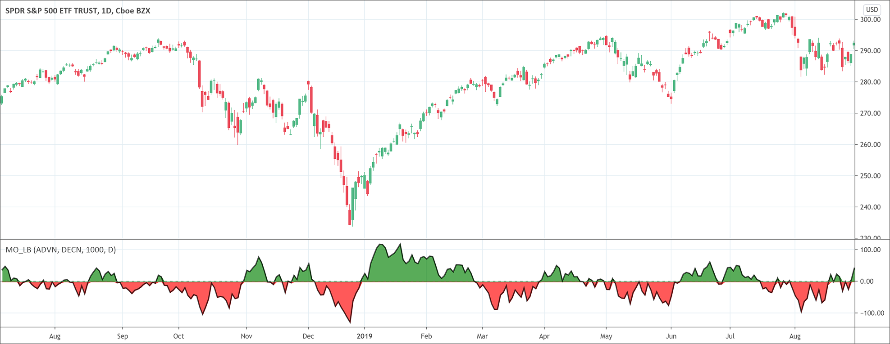</img>

## Formula
There are two formulas for the McClellan oscillator. The original formula, and one that adjusts for changes in the number of stocks listed on the stock exchange. The adjusted formula allows for a better comparison of values over longer periods of time

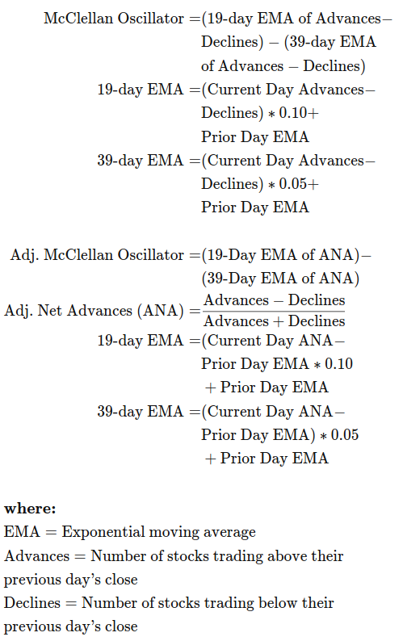</img>

### **How to Calculate the McClellan Oscillator**
1. To get the calculation started, track Advances - Declines on a stock exchange for 19 and 39 days. Calculate a simple average for these, not exponential moving average (EMA).3
2. Use these simple values as the Prior Day EMA values in the 19- and 39-day EMA formulas.
3. Calculate the 19- and 39-day EMAs.
4. Calculate the McClellan Oscillator value.
5. Now that the value has been calculated, on the next calculation use this value for the Prior Day EMA. Start calculating EMAs for the formula instead of simple averages.
6. If using the adjusted formula, the steps are the same, except use ANA instead of using Advances - Declines.

- It shows a correlation to the movements of the stock market. 
- This indicator gives us an alternative way to measure the market movements rather than just looking at the prices of the indices.

### **What Does the McClellan Oscillator Tell You?**
The McClellan Oscillator is an indicator based on market breadth which technical analysts can use in conjunction with other technical tools to determine the overall state of the stock market and assess the strength of its current trend. 

Since the indicator is based on all the stocks in an exchange, it is compared to the price movements of indexes that reflect that exchange, or compared to major indexes such as the S&P 500. 

Positive and negative values indicate whether more stocks, on average, are advancing or declining. The indicator is positive when the 19-day EMA is above the 39-day EMA, and negative when the 19-day EMA is below the 39-day EMA. 

A positive and rising indicator suggests that stocks on the exchange are being accumulated. A negative and falling indicator signals that stocks are being sold. Typically such action confirms the current trend in the index. 

Crossovers from positive to negative, or vice versa, may signal the trend has changed in the index or exchange being tracked. When the indicator makes a large move, typically of 100 points or more, from negative to positive territory, that is called a breadth thrust. It means a large number of stocks moved up after a bearish move. Since the stock market tends to rise over time, this a positive signal and may indicate that a bottom in the index is in and prices are heading higher overall. 

When index prices and the indicator are moving in different directions, then the current index trend may lack strength. Bullish divergence occurs when the oscillator is rising while the index is falling. This indicates the index could head higher soon since more stocks are starting to advance. 

Bearish divergence is when the index is rising and the indicator is falling. This means fewer stocks are keeping the advance going and prices may start to head lower.

# Percentage Price Oscillator
- The Percentage Price Oscillator is based off 2 moving averages.
- It is very similar to the MACD indicator.

The percentage price oscillator (PPO) is a technical momentum indicator that shows the relationship between two moving averages in percentage terms. The moving averages are a 26-period and 12-period exponential moving average (EMA).

- The PPO typically contains two lines: the PPO line, and the signal line. The signal line is an EMA of the PPO, so it moves slower than the PPO.
- The PPO crossing the signal line is used by some traders as a trade signal. When it crosses above from below that is a buy, and when it crosses below from above that is a sell.
- When the PPO is above zero that helps indicate an uptrend, as the short-term EMA is above the longer-term EMA.
- When the PPO is below zero, the short-term average is below the longer-term average, which helps indicate a downtrend.

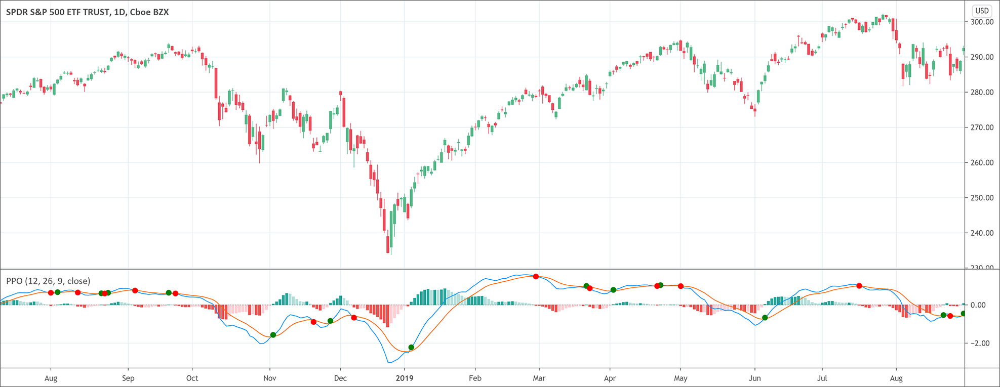</img>

## Formula

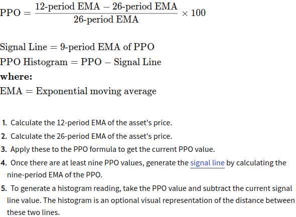</img>

## How the Percentage Price Oscillator (PPO) Works
he PPO is identical to the moving average convergence divergence (MACD) indicator, except the PPO measures percentage difference between two EMAs, while the MACD measures absolute (dollar) difference. Some traders prefer the PPO because readings are comparable between assets with different prices, whereas MACD readings are not comparable. For example, regardless of the asset's price, a PPO result of 10 means the short-term average is 10% above the long-term average. 

The PPO generates trade signals in the same way the MACD does. The indicator generates a buy signal when the PPO line crosses above the signal line from below, and generates a sell signal when the PPO line crosses below the signal from above. The signal line is created by taking a nine-period EMA of the PPO line. Signal line crossovers are used in conjunction with where the PPO is relative to zero/centerline. 

When the PPO is above zero that helps confirm an uptrend since the short-term EMA is above the longer-term EMA. Conversely, when the PPO is below zero, the short-term EMA is below the longer-term EMA, which is an indication of a downtrend. Some traders prefer to only take signal line buy signals when the PPO is above zero, or the price shows an overall upward trajectory. Similarly, when the PPO is below zero, they may ignore buy signals, or only take short-sell signals. 

Centerline crossovers also generate trading signals. Traders consider a move from below to above the centerline as bullish, and a move from above to below the centerline as bearish. The PPO crosses the centerline when the 12-period and 26-period moving average cross. 

Traders can also use the PPO to look for technical divergence between the indicator and price. For example, if the price of an asset makes a higher high but the indicator makes a lower high, it may indicate the upward momentum is subsiding. Conversely, if an asset's price makes a lower low but the indicator makes a higher low, it could suggest that the bears are losing their traction and the price could head higher soon. 

# Accelerator Oscillator
- The Accelerator Oscillator helps gauge the momentum in the market.
- It helps predict when the momentum will change.
- The Accelerator Oscillator measures the acceleration or deceleration of the current driving force in the market.

The Accelerator Oscillator (AC indicator) is a technical analysis tool that helps to gauge the momentum in the market. It also helps to predict when the momentum will change. AC indicator is a very significant indicator. Momentum is one of the most important factors in forex trading and technical analysis. The fading momentum during a downtrend indicates less interest in the financial asset. This information leads traders to profit-taking and even selling trading strategies. Conversely, the fading momentum during a downtrend suggests that buyers have entered the market and traders can go for short covering.

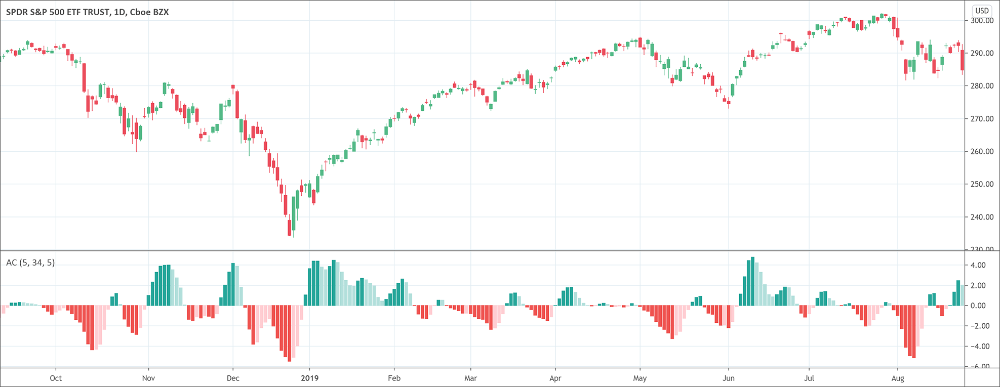</img>

## Formula
The calculations of the Accelerator Oscillator has three major steps.

1. Calculations of the Awesome Oscillator that is the difference between the two moving averages, the fast-moving average, and the slow-moving average 

Awesome Oscillator = Fast moving average – slow moving average.

2. Calculation of another 5-period simple moving average.
3. Finally, calculate the AC indicator by using the following formula:

Accelerator Oscillator = Awesome Oscillator – 5-period moving average 

## How to interpret the Accelerator Oscillator? 
Accelerator Oscillator’s interpretation is simple and very easy to understand. The AC indicator has two lines and those two lines show the acceleration or deceleration of the current driving force in the market. The values of the AC indicator higher than the zero line indicate that the uptrend will continue in the market. Conversely, the values below the zero line suggest that the downtrend will continue in the market. 

The Accelerator Oscillator gives a buy signal by printing two green bars one after another while the AC indicator is above the zero line. Conversely, when the AC indicator prints two red bars conservatively while the indicator is below the zero line, it is a sell signal.

## How to trade with the indicator? 
It is important to observe the value as well as the color of the AC indicator’s bars to effectively trade with the Accelerator Oscillator. As a simple guideline, traders should not buy when they see a red bar and they should not sell either if they see a green bar. Thus, the Accelerator Oscillator also helps traders to eliminate bad entries. 

Traders should buy when the traders see at least two consecutive green bars above zero. The momentum is against the trade when traders seek to buy while the AC indicator is below zero. Moreover, a long position entry when the AC values are negative requires an extra confirmation of three consecutive green bars. The same is the case for selling as well as a short position. Traders should sell only when the Accelerator Oscillator forms at least two consecutive red bars. When the red bars appear above the zero line, traders need at least three consecutive red bars. 

# Chande Momentum Oscillator
- The Chande momentum oscillator is a technical indicator that uses momentum to identify relative strength or weakness in a market.
- The chosen time frame greatly affects signals generated by the indicator.
- Pattern recognition often generates more reliable signals than absolute oscillator levels.
- Overbought-oversold indicators are less effective in strongly trending markets.

The Chande momentum oscillator is a technical momentum indicator introduced by Tushar Chande in his 1994 book The New Technical Trader. The formula calculates the difference between the sum of recent gains and the sum of recent losses and then divides the result by the sum of all price movements over the same period. 

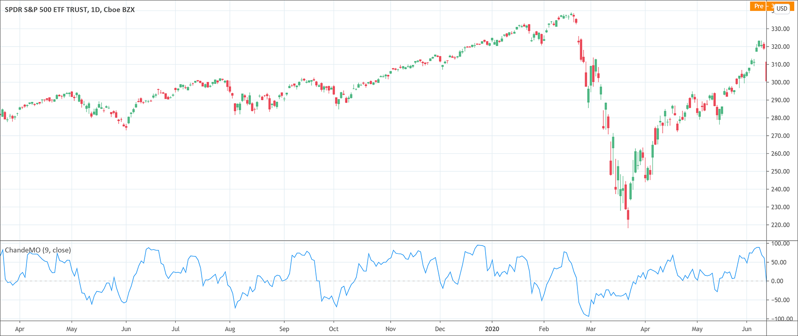</img>

## Formula

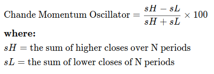</img>

1. Calculate the sum of higher closes over N periods.
2. Calculate the sum of lower closes over N periods.
3. Subtract the sum of lower closes over N periods from the sum of higher closes over N periods.
4. Add the sum of lower closes over N periods to the sum of higher closes over N periods.
5. Divide 4 from 3 and multiply by 100.

##  Chande Momentum Oscillator Interpretation
A security is deemed to be overbought when the Chande momentum oscillator is above +50 and oversold when it is below -50. Many technical traders add a 10-period moving average to this oscillator to act as a signal line. The oscillator generates a bullish signal when it crosses above the moving average and a bearish signal when it drops below the moving average. 

The oscillator can be used as a confirmation signal when it crosses above or below the 0 line. For example, if the 50-day moving average crosses above the 200-day moving average (golden cross), a buy signal is confirmed when the Chande momentum oscillator crosses above 0, predicting prices are headed higher. 

Trend strength can also be measured using the Chande momentum oscillator. In this methodology, the oscillator's value denotes the strength or weakness of the expected trend.  

## How to trade with the CMO?
The Chande Momentum Oscillator is very easy to handle for trading. Traders can go short when the CMO is above the overbought level at 50. On the other hand, traders can go long when the CMO indicator is below oversold level at – 50. Many traders also use the CMO indicator for entry signals. Traders use shorter time frames for this. They use crossovers of a signal line from a moving average of 9-periods for this purpose. The Chande Momentum Oscillator also warns of reversal through divergences between the price and the CMO. Traders can use this fruitful information for trading as well.

## Example
Traders can use the Chande momentum oscillator to spot positive and negative price divergence between the indicator and underlying security. A negative divergence occurs if the underlying security is trending upward and the Chande momentum oscillator is moving downwards. A positive divergence occurs if the price is declining but the oscillator is rising.

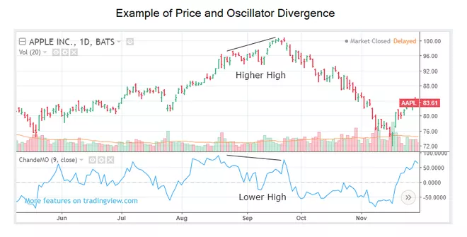</img>

In the above example, Apple made a new high in late August and another new high in late September. Instead, the oscillator made a lower high in late September, confirming a bearish divergence. A trader who decides to sell short can place a stop-loss order above the September swing high and take profits when the oscillator crosses below -50. 

# Disparity Index indicator
- The disparity index is a momentum indicator used by technical analysts that indicates the direction an asset is moving relative to a moving average.
- Large moves in either direction for the index may foreshadow that a price correction is ahead.
- Akin to Rate of Change (ROC) and other similar indicators, the disparity index is best used in conjunction with other tools.

The disparity index is a technical indicator that measures the relative position of an asset's most recent closing price to a selected moving average and reports the value as a percentage. 

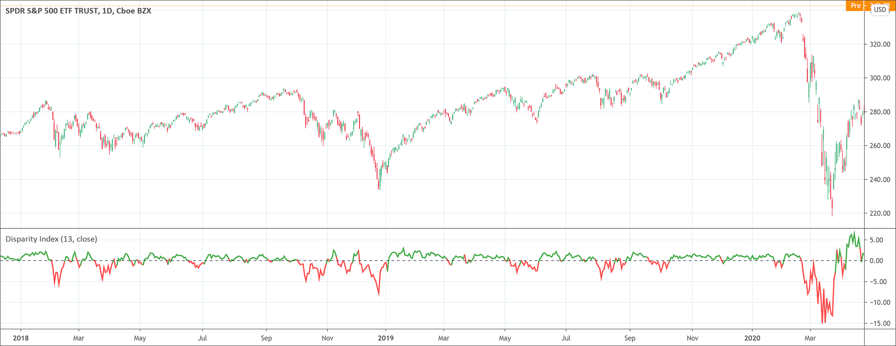</img>

## Formula

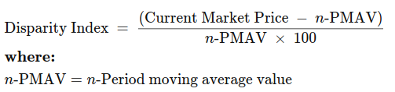</img>

## What does the disparity index indicator tell traders?
Disparity index indicator is a simple indicator but it conveys useful information to the technical analysts and traders. A positive percentage indicates rising price while the negative percentage suggests falling price. It also gives an early signal of imminent change in the trend when the crossover above the zero line happens. It is also important to note that any extreme changes in either direction predicts an upcoming price correction.

## How to trade with the indicator
Whenever the disparity index crosses the zero line, the indicator generates very useful signals. A change in the trend is imminent when the indicator crosses the 0 line. A price correction is inevitable when the indicator shows extreme values. The DI indicator shows extreme values because the assets fall into the overbought/oversold levels. Extreme values suggests to the traders that the trend reversal is on the cards and traders should not follow the trend anymore. Values above zero indicate the upward momentum while the values below zero suggest a selling pressure during the downward trend. Divergences can also be noticed with the help of the DI indicator. Whenever the indicator and the price are not moving in the same direction, it suggests a divergence. 

Precisely, the disparity index indicator is quite useful indicator when it seems dangerous proposition to follow the trend of a particular asset. Moreover, technical analysts and experts always suggest to use the DI indicator in conjunction with any other technical analysis tools for confirmation of all the assumptions.

# Stochastic Oscillator
- A stochastic oscillator is a popular technical indicator for generating overbought and oversold signals.
- It is a popular momentum indicator, first developed in the 1950s.
- Stochastic oscillators tend to vary around some mean price level, since they rely on an asset's price history.

A stochastic oscillator is a momentum indicator comparing a particular closing price of a security to a range of its prices over a certain period of time. The sensitivity of the oscillator to market movements is reducible by adjusting that time period or by taking a moving average of the result. It is used to generate overbought and oversold trading signals, utilizing a 0–100 bounded range of values. 

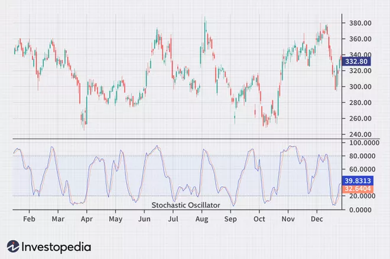</img>

## Formula

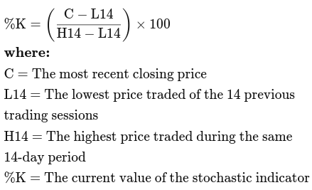</img>

Notably, %K is referred to sometimes as the fast stochastic indicator. The "slow" stochastic indicator is taken as %D = 3-period moving average of %K. 

The general theory serving as the foundation for this indicator is that in a market trending upward, prices will close near the high, and in a market trending downward, prices close near the low. Transaction signals are created when the %K crosses through a three-period moving average, which is called the %D. 

The difference between the slow and fast Stochastic Oscillator is the Slow %K incorporates a %K slowing period of 3 that controls the internal smoothing of %K. Setting the smoothing period to 1 is equivalent to plotting the Fast Stochastic Oscillator.

## What Does the Stochastic Oscillator Tell You?
The stochastic oscillator is range-bound, meaning it is always between 0 and 100. This makes it a useful indicator of overbought and oversold conditions. Traditionally, readings over 80 are considered in the overbought range, and readings under 20 are considered oversold. However, these are not always indicative of impending reversal; very strong trends can maintain overbought or oversold conditions for an extended period. Instead, traders should look to changes in the stochastic oscillator for clues about future trend shifts. 

Stochastic oscillator charting generally consists of two lines: one reflecting the actual value of the oscillator for each session, and one reflecting its three-day simple moving average. Because price is thought to follow momentum, the intersection of these two lines is considered to be a signal that a reversal may be in the works, as it indicates a large shift in momentum from day to day. 

Divergence between the stochastic oscillator and trending price action is also seen as an important reversal signal. For example, when a bearish trend reaches a new lower low, but the oscillator prints a higher low, it may be an indicator that bears are exhausting their momentum and a bullish reversal is brewing. 

# True Strength Index (TSI)
- The TSI fluctuates between positive and negative territory. Positive territory means the bulls are more in control of the asset. Negative territory means the bears are more in control.
- When the indicator divergences with price, the TSI may be signaling the price trend is weakening and may reverse.
- A signal line can be applied to the TSI indicator. When the TSI crosses above the signal line it can be used as a buy signal, and when it crosses below, a sell signal. Such crossovers occur frequently, so use with caution.
- Overbought and oversold levels will vary by the asset being traded.

The true strength index (TSI) is a technical momentum oscillator used to identify trends and reversals. The indicator may be useful for determining overbought and oversold conditions, indicating potential trend direction changes via centerline or signal line crossovers, and warning of trend weakness through divergence. 

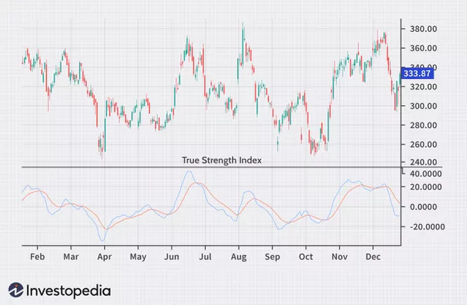</img>

# Formula

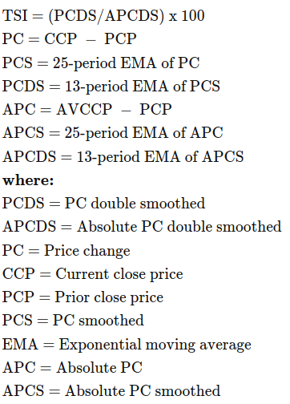</img>

1. Record price changes and absolute price changes in order to calculate an EMA for both these values.
2. Calculate the price change 25-period EMA and the absolute price change 25-period EMA.
3. Smooth both of these EMAs by applying a 13-period EMA to each of them.
4. Compute the TSI value by plugging the now double-smoothed price change and double-smoothed absolute price change into the TSI formula.

##  What Does the True Strength Index (TSI) Tell You?
The true strength index (TSI) is primarily used to identify overbought and oversold conditions in an asset's price, spot divergence, identify trend direction and changes via the centerline, and highlight short-term price momentum with signal line crossovers. 

Since the TSI is based on price movements, oversold and overbought levels will vary by the asset being traded. Some stocks may reach +30 and -30 before tending to see price reversals, while another stock may reverse near +20 and -20. 

Mark extreme TSI levels, on the asset being traded, to see where overbought and oversold is. Being oversold doesn't necessarily mean it is time to buy, and when an asset is overbought it doesn't necessarily mean it is time to sell. Traders will typically watch for other signals to trigger a trade decision. For example, they may wait for the price or TSI to start dropping before selling in overbought territory. Alternatively, they may wait for a signal line crossover. 

### ** Signal Line Crossovers**
The TSI has a signal line, which is usually a seven- to 12-period EMA of the TSI line. A signal line crossover occurs when the TSI line crosses the signal line. When the TSI crosses above the signal line from below, that may warrant a long position. When the TSI crosses below the signal line from above, that may warrant selling or short selling. 

Signal line crossovers occur frequently, so should be utilized only in conjunction with other signals from the TSI. For example, buy signals may be favored when the TSI is above the centerline (above zero). Or sell signals may be favored when the TSI is in overbought territory.

### **Centerline Crossovers**
The centerline crossover is another signal the TSI generates. Price momentum is positive when the indicator is above zero and negative when it is below zero. 

Some traders use the centerline for a directional bias. For example, a trader may decide only to enter a long position if the indicator is above its centerline. Conversely, the trader would be bearish and only consider short positions if the indicator's value is below zero.

### **Breakouts and Divergence**
Traders can use support and resistance levels created by the TSI to identify breakouts and price momentum shifts. For instance, if the indicator breaks below a trendline, the price may see continued selling. 

Divergence is another tool the TSI provides. If the price of an asset is moving higher while the TSI is dropping, that is called bearish divergence and could result in a downside price move. Conversely, if the TSI is rising while the price is falling, that could signal higher prices to come. This is called bullish divergence. 

Divergence is a poor timing signal, so it should only be used in conjunction with other signals generated by the TSI or other technical indicators.  

## How to use the TSI indicator in trading?
The use of the true strength index indicator is very simple and it bases on simple indications. TSI indicator generates a signal whenever TSI crosses the signal. When the TSI crosses above zero, it is a signal to buy. When the TSI crosses below zero, it is a signal to sell. 

The TSI indicator generates the second type of signals when the crossover between the signal line and the TSI line happens. When the TSI line crosses above the signal line, it is a buying signal. When the TSI line crosses below the signal line, it is a selling signal.  

Another way to use the TSI indicator is to take advantage of overbought/oversold market conditions. TSI indicator indicates oversold market conditions when TSI crosses below the signal line combined with TSI below -25. Conversely, the TSI indicator shows overbought market conditions when TSI crosses above the signal line and TSI is above +25. When the TSI moves back above -25 after going below, it is a signal to buy. When the TSI moves back below +25 after going above, it is a signal to sell. 

Technical analysts and experts always advise increasing the TSI settings to avoid whipsaws. Traders also get faster signals from the TSI indicator if they prefer to use shorter periods for the TSI but it increases the risks of whipsaws and unreliable signals. Traders may also use longer periods for the TSI to get fewer whipsaws and unreliable signals but at the expense of lags and lower risk/reward ratio.  

## True Strength Index indicator trading strategies 
True strength index trading strategies are quite simple but traders must need to be fully attentive and vigilant. They must recognize signal line crossover and centerline crossover. When the signal line crosses the TSI line, it is a signal line crossover and its occurrence requires a long position. It is a selling or short-selling signal when the TSI line crosses below the signal line from above. When the TSI is above the signal line, it is a buying signal and when the TSI lies in the overbought zone, it is a selling signal. 

Centerline crossovers are also equally important for trading signals. Traders decide on the basis of the indicator’s value being positive or negative. When the indicator is above zero, the price momentum will be positive, and below zero, it will be negative. When the price momentum is positive, traders prefer to enter a long position and they may prefer a short position when the price movement is negative.  

TSI indicator also helps to identify areas of support and resistance and traders use those areas to identify breakouts and changes in price momentum. The selling usually continues when the TSI indicator breaks below a trendline. The TSI indicator also helps to spot divergence. When the TSI is dropping but the price of an asset is increasing, it is a bearish divergence and may lead to a falling price movement. A bullish divergence occurs when the TSI is moving higher but the price is falling. A bearish divergence signals upcoming upwards movement in prices. However, traders and technical analysts believe that divergence is a poor signal and traders should wait for the other TSI indicator’s signal or signals from any other technical trading tool. 

# TRIX Indicator
- The Triple Exponential Moving Average (TRIX) helps investors determine the price momentum and identify oversold and overbought signals in a financial asset.
- It is composed of 3 main components: Zero line, TRIX line, Percentage Scale

The Triple Exponential Moving Average (TRIX) indicator is a strong technical analysis tool. It  can help investors determine the price momentum and identify oversold and overbought signals in a financial asset. 

Jack Hutson is the creator of the TRIX indicator . He created it in the early 1980s to show the rate of change in a triple exponentially smoothed moving average. 

The indicator has three major components:
- Zero line
- TRIX line
- Percentage Scale

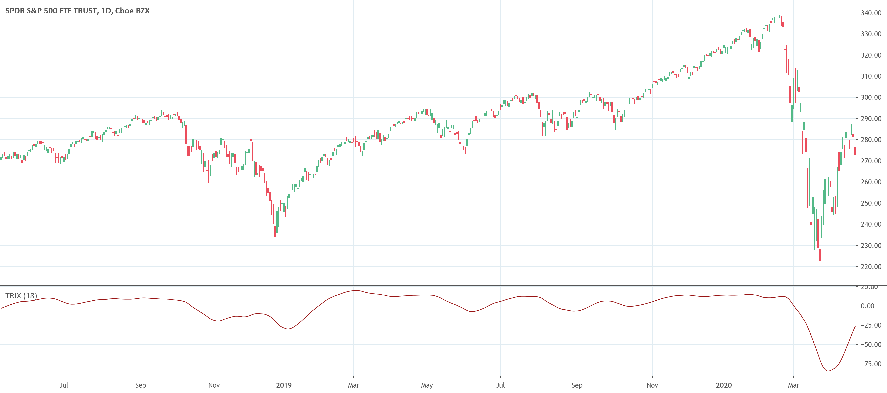</img>

## What does the TRIX indicator tell traders?
The TRIX indicator determines overbought and oversold markets, and it can also be a momentum indicator. Just as it is with most oscillators, TRIX oscillates around a zero line. Additionally, divergences between price and TRIX can mean great turning points in the market. 

TRIX calculates a triple exponential moving average of the log of the price input. It calculates this based on the time specified by the length input for the current bar.

## How to use the TRIX indicator?
When used as an oscillator, it shows a potential peak and trough price zones. A positive value tells traders that there is an overbought market while a negative value means an oversold market. When traders use TRIX as a momentum indicator, it filters spikes in the price that are vital to the general dominant trend. 

A positive value means momentum is rising while a negative value means that momentum is reducing. A lot of analysts believe that when the TRIX crosses above the zero line it produces a buy signal, and when it closes below the zero line, it produces a sell signal.

## Formula
TRIX, which is a triple smoothed EMA, is an EMA, of an EMA, therefore the “triple”. Exponential moving averages place more weight on recent price information. 

Most traders use a default 14-period when calculating TRIX. But traders can adjust the parameters based on the needs of the trader. Below are the steps used when calculating a 14-period TRIX:
- Single-smoothed EMA = 14-period EMA calculated based on the price’s close
- Double-smoothed EMA = 14-period EMA of the single-smoothed EMA
- Triple-smoothed EMA = 14-period EMA of the double-smoothed EMA
- TRIX = 1-period percent change of the triple-smoothed EMA

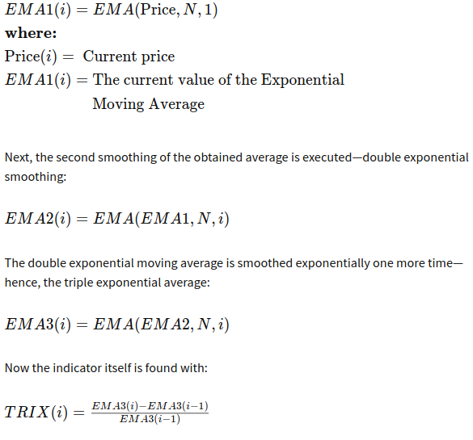</img>

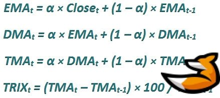</img>

## Trading TRIX indicator signals
### **Zero line cross**
TRIX can help determine the impulse of the market. With the 0 value acting as a centerline, if it crosses from below, it will be mean that the impulse is growing in the market. 

Traders can, therefore, look for opportunities to place buy orders in the market. Similarly, a cross of the centerline from above will mean a shrinking impulse in the market. Traders can, therefore, look for opportunities to sell in the market.

### **Signal line cross**
To select the best entry points, investors add a signal line on the TRIX indicator. The signal line is a moving average of the TRIX indicator, and due to this, it will lag behind the TRIX. 

A signal to place a buy order will occur when the TRIX crosses the signal line from below. In the same way, a signal to place a sell order will come up when the TRIX crosses the signal line from above. This is applicable in both trending and ranging markets. 

In trending markets, a signal line cross will indicate an end of the price retracement, and the main trend will resume. In ranging markets, a signal line confirms that resistance and support zones have been upheld in the market.

### **Divergences**
Traders can use the Triple Exponential Average can to identify when important turning points can happen in the market. They can achieve this by looking at divergences. Divergences happen when the price is moving in the opposite direction as the TRIX indicator. 

When price makes higher highs but the TRIX makes lower highs, it means that the up-trend is weakening, and a bearish reversal is about to form. When the price makes lower lows, but the TRIX makes higher lows, it means that a bullish reversal is about to happen. 

Bullish and bearish divergences happen when the security and the indicator do not confirm themselves. 

A bullish divergence can happen when the security makes a lower low, but the indicator forms a higher low. This higher low means less downside momentum that may foreshadow a bullish reversal. 

A bearish divergence happens when the commodity makes a higher low, but the indicator forms a lower high. This lower high indicates weak upside momentum that can foreshadow a bearish reversal sometimes. 

Bearish divergences do not work well in strong uptrends. Even though momentum appears to be weakening due to the indicator is making lower highs, momentum still has a bullish bias as long as it is above its centerline. 

When bullish and bearish divergences work, they work very well. The secret is to separate the bad signals from the good signals.

## Combining TRIX with other technical indicators
### **TRIX and RSI**
The Relative Strength Index (RSI) measures the momentum and strength of a trend. When joined with TRIX, RSI can help offer perfect buy and sell signals. It gives these signals mostly when the price of an underlying asset is range-bound. 

A strong buy signal will happen when both RSI and TRIX are in the oversold region and signal a potential reversal. Also, a strong sell signal forms when both RSI and TRIX are in the overbought region and indicate a potential reversal.

### **TRIX and MACD**
The Moving Average Convergence Divergence (MACD) is a momentum and trend-following indicator. Joining MACD and TRIX can give definitive signals for entering new trends and leaving when a reversal will happen. An entry signal will comes up when the TRIX crosses the zero line and a crossover of the MACD happens.

# Chaikin Oscillator
- The Chaikin Indicator applies MACD to the accumulation-distribution line rather than closing price.
- A cross above the accumulation-distribution line indicates that market players are accumulating shares, securities or contracts, which is typically bullish.

The Chaikin oscillator is named for its creator Marc Chaikin.1 The oscillator measures the accumulation-distribution line of moving average convergence-divergence (MACD). To calculate the Chaikin oscillator, subtract a 10-day exponential moving average (EMA) of the accumulation-distribution line from a 3-day EMA of the accumulation-distribution line. This measures momentum predicted by oscillations around the accumulation-distribution line. 

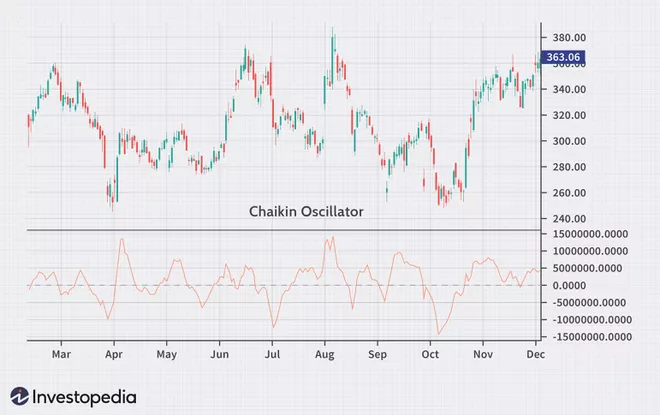</img>

## Formula

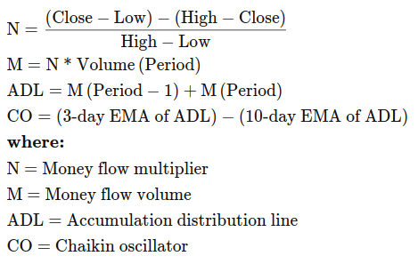</img>

1. Calculate the Money Flow Multiplier (N).
2. Multiply the Money Flow Multiplier (N) by volume to calculate Money Flow Volume (N).
3. List a running total of N to draw the accumulation-distribution line (ADL).
4. Compute the difference between 10 period and 3 period exponential moving averages to calculate the Chaikin oscillator.

##  What Does the Chaikin Oscillator Tell You?
The Chaikin oscillator is a tool for technical analysts more than for fundamental analysts, who study a company’s business performance to garner information about the future direction of its stock price. Fundamental analysts believe that the skill needed to forecast the market is about being the most informed. Technical analysts believe that all known information is already priced into stocks and that patterns in the ups and downs of equity prices can better predict the market’s movements. Technical analysts use the Chaikin oscillator to find directional trends in momentum. 

To appreciate how an oscillator is utilized, imagine that you’re at an auction. On one side of the room are accumulators or buyers. On the other side of the room are the distributors or sellers. When there are more sellers in the room than buyers, the price of the item being auctioned declines. Likewise, when buyers are in the majority, the item’s price tends to increase. 

Technical analysts believe the balance of this relationship is what drives the financial markets. They measure this balance between buyers and sellers with multiple indicators, including accumulation-distribution indicators like the Chaikin oscillator. 

# Commodity Channel Index (CCI)
- The Commodity Channel Index (CCI) is a technical indicator that measures the difference between the current price and the historical average price.
- When the CCI is above zero, it indicates the price is above the historic average. Conversely, when the CCI is below zero, the price is below the historic average.
- The CCI is an unbounded oscillator, meaning it can go higher or lower indefinitely. For this reason, overbought and oversold levels are typically determined for each individual asset by looking at historical extreme CCI levels where the price reversed from.

The Commodity Channel Index​ (CCI) is a momentum-based oscillator used to help determine when an investment vehicle is reaching a condition of being overbought or oversold. 

Developed by Donald Lambert, this technical indicator assesses price trend direction and strength, allowing traders to determine if they want to enter or exit a trade, refrain from taking a trade, or add to an existing position. In this way, the indicator can be used to provide trade signals when it acts in a certain way. 

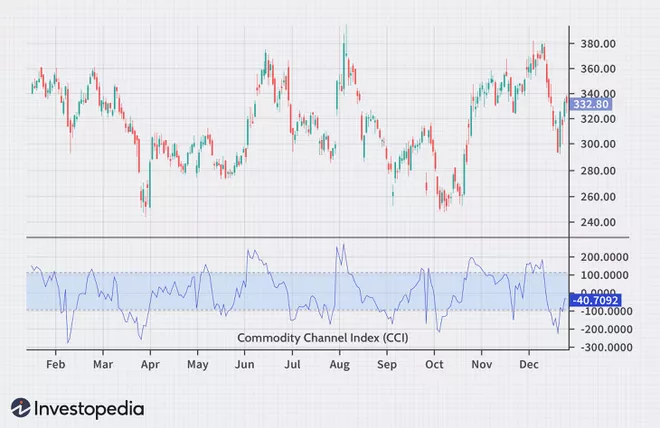</img>

## Formula

</img>

1. Determine how many periods your CCI will analyze. Twenty is commonly used. Fewer periods result in a more volatile indicator, while more periods will make it smoother. For this calculation, we will assume 20 periods. Adjust the calculation if using a different number.
2. In a spreadsheet, track the high, low, and close for 20 periods and compute the typical price.
3. After 20 periods, compute the moving average (MA) of the typical price by summing the last 20 typical prices and dividing by 20.
4. Calculate the mean deviation by subtracting the MA from the typical price for the last 20 periods. Sum the absolute values (ignore minus signs) of these figures and then divide by 20.
5. Insert the most recent typical price, the MA, and the mean deviation into the formula to compute the current CCI reading.
6. Repeat the process as each new period ends.

##  What Does the Commodity Channel Index (CCI) Tell You?
The CCI is primarily used for spotting new trends, watching for overbought and oversold levels, and spotting weakness in trends when the indicator diverges with price. 

When the CCI moves from negative or near-zero territory to above 100, that may indicate the price is starting a new uptrend. Once this occurs, traders can watch for a pullback in price followed by a rally in both price and the CCI to signal a buying opportunity. 

The same concept applies to an emerging downtrend. When the indicator goes from positive or near-zero readings to below -100, then a downtrend may be starting. This is a signal to get out of longs or to start watching for shorting opportunities. 

Overbought or oversold levels are not fixed since the indicator is unbound. Therefore, traders look to past readings on the indicator to get a sense of where the price reversed. For one stock, it may tend to reverse near +200 and -150. Another commodity, meanwhile, may tend to reverse near +325 and -350. Zoom out on the chart to see lots of price reversal points, and the CCI readings at those times. 

There are also divergences—when the price is moving in the opposite direction of the indicator. If the price is rising and the CCI is falling, this can indicate a weakness in the trend. While divergence is a poor trade signal, since it can last a long time and doesn't always result in a price reversal, it can be good for at least warning the trader that there is the possibility of a reversal. This way, they can tighten stop loss levels or hold off on taking new trades in the price trend direction. 

# Ultimate Oscillator
- The indicator uses three timeframes in its calculation: seven, 14, and 28 periods.
- The shorter timeframe has the most weight in the calculation, while the longer timeframe has the least weight.
- Buy signals occur when there is bullish divergence, the divergence low is below 30 on the indicator, and the oscillator then rises above the divergence high.
- A sell signal occurs when there is bearish divergence, the divergence high is above 70, and the oscillator then falls below the divergence low.

The Ultimate Oscillator is a technical indicator that was developed by Larry Williams in 1976 to measure the price momentum of an asset across multiple timeframes. By using the weighted average of three different timeframes the indicator has less volatility and fewer trade signals compared to other oscillators that rely on a single timeframe. Buy and sell signals are generated following divergences. The Ultimately Oscillator generates fewer divergence signals than other oscillators due to its multi-timeframe construction. 

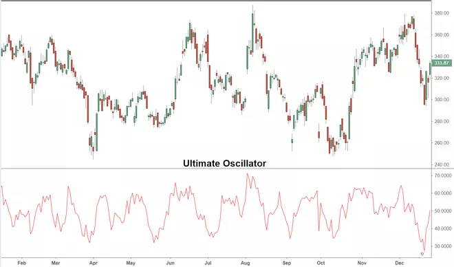</img>

## Formula

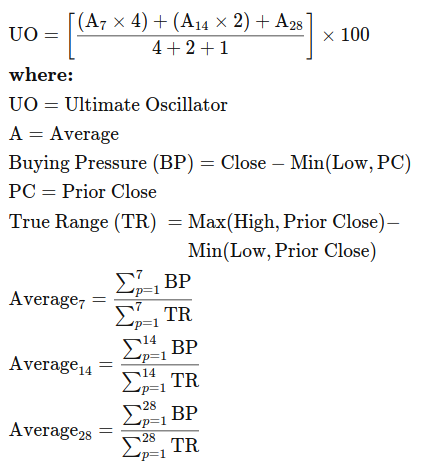</img>

1. Calculate the Buying Pressure (BP) which is the close price of the period less the low of that period or prior close, whichever is lower. Record these values for each period as they will be summed up over the last seven, 14, and 28 periods to create BP Sum.
2. Calculate the True Range (TR) which is the current period's high or the prior close, whichever is higher, minus the lowest value of the current period's low or the prior close. Record these values for each period as they will be summed up over the last seven, 14, and 28 periods to create TR Sum.
3. Calculate Average7, 14, and 28 using the BP and TR Sums calculations from steps one and two. For example, the Average7 BP Sum is the calculated BP values added together for the last seven periods.
4. Calculate the Ultimate Oscillator using the Average7, 14, and 28 values. Average7 has a weight of four, Average14 has a weight of two, and Average28 has a weight of one. Sum the weights in the denominator (in this case, the sum is seven, or 4+2+1). Multiply by 100 when other calculations are complete.

##  What Does the Ultimate Oscillator Tell You?
The Ultimate Oscillator is a range-bound indicator with a value that fluctuates between 0 and 100. Similar to the Relative Strength Index (RSI), levels below 30 are deemed to be oversold, and levels above 70 are deemed to be overbought. Trading signals are generated when the price moves in the opposite direction as the indicator, and are based on a three-step method. 

Larry Williams developed the Ultimate Oscillator in 1976 and published it in Stocks & Commodities Magazine in 1985. With many momentum oscillators correlating too heavily to near-term price movements, Williams developed the Ultimate Oscillator to incorporate multiple timeframes to smooth out the indicator's movements and provide a more reliable indicator of momentum, with fewer false divergences. 

False divergences are common in oscillators that only use one timeframe, because when the price surges the oscillator surges. Even if the price continues to rise the oscillator tends to fall forming a divergence even though the price may still be trending strongly.  

In order for the indicator to generate a buy signal, Williams recommended a three-step approach.
- First, a bullish divergence must form. This is when the price makes a lower low but the indicator is at a higher low.
- Second, the first low in the divergence (the lower one) must have been below 30. This means the divergence started from oversold territory and is more likely to result in an upside price reversal.
- Third, the Ultimate oscillator must rise above the divergence high. The divergence high is the high point between the two lows of the divergence.

Williams created the same three-step method for sell signals.
- First, a bearish divergence must form. This is when the price makes a higher high but the indicator is at a lower high.
- Second, the first high in the divergence (the higher one) must be above 70. This means the divergence started from overbought territory and is more likely to result in a downside price reversal.
- Third, the Ultimate oscillator must drop below the divergence low. The divergence low is the low point between the two highs of the divergence.

## How to use it in trading?
The ultimate oscillator indicator can be used as a measure of buying/selling pressure. The general rule tells the following: 
- When the buying pressure is strong, the indicators will go up. 
- When the buying pressure weakens, the indicators go down.

A divergence is the difference in the direction of the general trend and the oscillator itself. When the prices make new lows and the indicator doesn’t, a bullish divergence is seen. When the prices make a higher high and the indicator doesn’t, a bearish divergence is formed.

# Coppock Curve Indicator
- The Coppock Curve is a technical indicator that provides long-term buy and sell signals for major stock indexes and related ETFs based on shifts in momentum.
- The indicator is designed for use on a monthly candlestick chart, where each candle is one month.
- A reading above zero on the indicator signals a buy, while a drop below zero is a sell signal.

The Coppock Curve is a long-term price momentum indicator used primarily to recognize major downturns and upturns in a stock market index. It is calculated as a 10-month weighted moving average of the sum of the 14-month rate of change and the 11-month rate of change for the index. It is also known as the "Coppock Guide." 

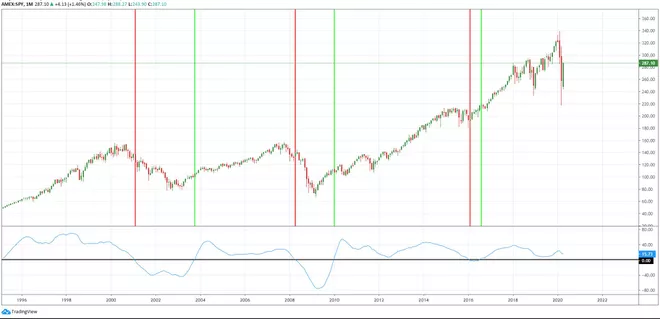</img>

## Formula

</img>

1. Calculate ROC14 using the most recent monthly closing price relative to 14 periods (months) ago.
2. Calculate ROC11 using the most recent monthly closing price relative to 11 periods (months) ago.
3. Add ROC14 to ROC11. Continue to do this each period going forward.
4. Once there are at least 10-periods of ROC14 added to ROC11, take a weighted moving average of the last 10 values. Continue to do this each period going forward.

##  What Does the Coppock Curve Tell You?
The Coppock Curve was originally implemented as a long-term buy and sell indicator for major indices such as the S&P 500 and the Wilshire 5000. Often, it is used with long-term time series such as a candlestick chart, but where each candle contains a month's worth of price information. When the indicator is above zero it indicates a hold. When the indicator drops below zero it indicates a sell, and when the indicator moves above zero it signals a buy.
- The Coppock Curve can be adjusted to get calculations of different time periods such as monthly, weekly, and even daily periods. However, its efficiency and effectiveness reduce with shorten time periods because of increased volatility in the market.
- Traders can modify the Coppock Curve to work on different metrics instead of just working on 11 and 14 days rate of changes. 
- The Coppock Curve can adjust to get multiple curves that help to spot crossovers and other events.

## How to use the Coppock Curve? 
The use of the Coppock Curve indicator is not as complex and difficult as it seems. It is a Zero-Line based indicator. The Zero-Line functions as a trade-trigger. It gives the buying signal when the Coppock Curve is above zero and selling signals when the Coppock Curve is below zero. The selling signal indicates the time to close the long-position and the selling signal tells to restart the long-position. There is another Coppock Curve strategy that may prove fruitful. Proactive traders may initiate short trading after closing the long-position when the Coppock Curve moves below zero. Furthermore, traders who prefer to trade based on the closing price curve, they should go long when the line changes from bearish (indicated by red color) to bullish (indicated by green color). Similarly, they should go-short when the line changes from bullish to bearish. 

# Money Flow Index
- The Money Flow Index (MFI) is a technical indicator that generates overbought or oversold signals using both prices and volume data.
- An MFI reading above 80 is considered overbought and an MFI reading below 20 is considered oversold, although levels of 90 and 10 are also used as thresholds.
- A divergence between the indicator and price is noteworthy. For example, if the indicator is rising while the price is falling or flat, the price could start rising.

The Money Flow Index (MFI) is a technical oscillator that uses price and volume data for identifying overbought or oversold signals in an asset. It can also be used to spot divergences which warn of a trend change in price. The oscillator moves between 0 and 100. 

Unlike conventional oscillators such as the Relative Strength Index (RSI), the Money Flow Index incorporates both price and volume data, as opposed to just price. For this reason, some analysts call MFI the volume-weighted RSI. 

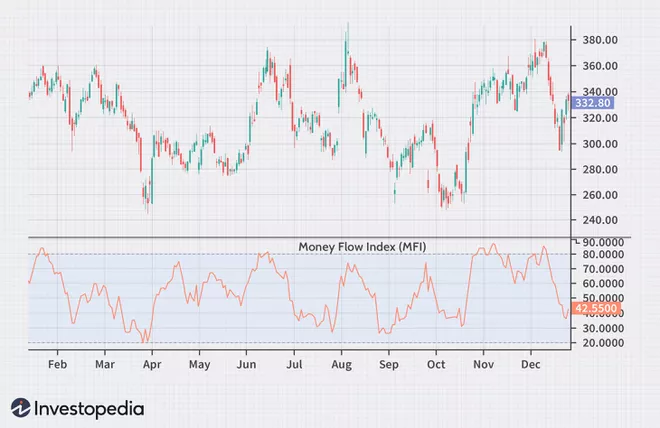</img>

## Formula

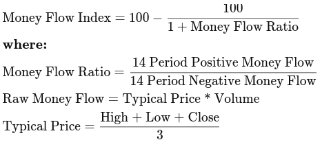</img>

1. Calculate the Typical Price for each of the last 14 periods.
2. For each period, mark whether the typical price was higher or lower than the prior period. This will tell you whether Raw Money Flow is positive or negative.
3. Calculate Raw Money Flow by multiplying the Typical Price by Volume for that period. Use negative or positive numbers depending on whether the period was up or down (see step above).
4. Calculate the Money Flow Ratio by adding up all the positive money flows over the last 14 periods and dividing it by the negative money flows for the last 14 periods.
5. Calculate the Money Flow Index (MFI) using the ratio found in step four.
6. Continue doing the calculations as each new period ends, using only the last 14 periods of data.

##  What Does the Money Flow Index Tell You?
One of the primary ways to use the Money Flow Index is when there is a divergence. A divergence is when the oscillator is moving in the opposite direction of price. This is a signal of a potential reversal in the prevailing price trend. 

For example, a very high Money Flow Index that begins to fall below a reading of 80 while the underlying security continues to climb is a price reversal signal to the downside. Conversely, a very low MFI reading that climbs above a reading of 20 while the underlying security continues to sell off is a price reversal signal to the upside. 

Traders also watch for larger divergences using multiple waves in the price and MFI. For example, a stock peaks at $10, pulls back to $8, and then rallies to $12. The price has made two successive highs, at $10 and $12. If MFI makes a lower higher when the price reaches $12, the indicator is not confirming the new high. This could foreshadow a decline in price. 

The overbought and oversold levels are also used to signal possible trading opportunities. Moves below 10 and above 90 are rare. Traders watch for the MFI to move back above 10 to signal a long trade, and to drop below 90 to signal a short trade. 

Other moves out of overbought or oversold territory can also be useful. For example, when an asset is in an uptrend, a drop below 20 (or even 30) and then a rally back above it could indicate a pullback is over and the price uptrend is resuming. The same goes for a downtrend. A short-term rally could push the MFI up to 70 or 80, but when it drops back below that could be the time to enter a short trade in preparation for another drop. 

# Awesome Oscillator Indicator
- The Awesome Oscillator indicator measures market momentum.
- Traders use it for its crossing with the zero line, and for its peaks.

The Awesome Oscillator (AO) is used to measure market momentum. It calculates the difference between a 34 Period and 5 Period Simple Moving Average. The Simple Moving Averages that are used are not calculated using closing price but rather the midpoints of each bar. AO is generally used to affirm trends or to anticipate possible reversals. 

The oscillator attempts to measure if bullish or bearish forces are regularly driving the market. It does this by comparing the recent market momentum, with the overall momentum over a broader frame of reference.

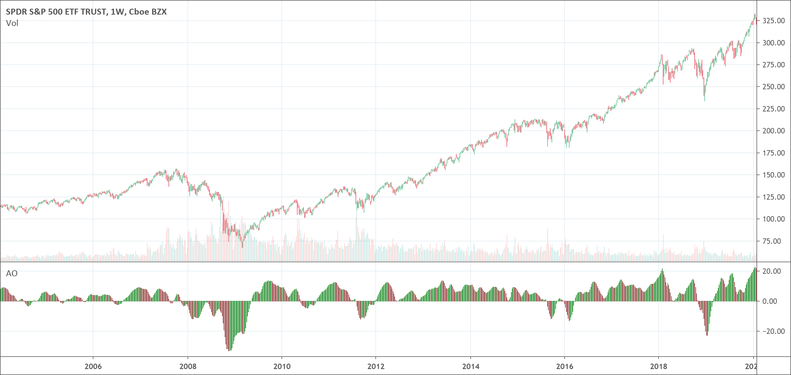</img>

## Formula

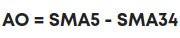</img>

To calculate the awesome oscillator indicator, you need to subtract a 34-period simple moving average of median prices from a 5-period SMA of median prices. We don't provide an accurate period for moving averages because the indicator can be applied to any period. 

## What does the AO indicator tell traders?
Because it plots the variation between a slow-moving and a fast-moving average, the indicator prints both positive and negative values. A positive reading means that the fast-moving average (5-period) is more than the slow-moving average (34-period). Also, a negative reading indicates that the slow-moving average is more than the fast-moving average. 

Therefore, the basic interpretation of the AO indicator is that a reading greater than zero means an uptrend is happening, while a reading lower than zero implies that a downtrend is happening. 

The bar colors of the AO indicator are based on indicator values within a particular time. Therefore, it is possible to have red bars over zero, and green bars lower point zero. An increasing green histogram shows that the AO value is more than the initial bar. While a falling histogram shows that the value of the AO is less than the previous bar.

## How to use the Awesome Oscillator?
The Awesome Oscillator gives a lot of signals by assisting in predicting price corrections and reversals. First, it fluctuates around the zero line. If it rises higher than 0, the signal is bullish. If AO drops lower than 0, the signal is bearish. 

Secondly, it is considered to be a bearish signal if AO indicator has formed two highs greater than 0 and the trough between them is also higher than 0. The second peak has to be less than the first, and it should be followed by a red bearish bar. Similarly, it is considered a bullish signal if AO has formed two lows below 0, and the trough between them is also lower than 0. The second peak has to be greater than the first, and should be followed by a green bullish bar. 

The third signal is referred to as a saucer. It is a pattern made up of the three bars of the indicator. A bullish saucer is made up of a red bar, followed by a smaller red bar, then by a green bar. All the bars have to be higher than 0. A bearish saucer is made up of a green bar, followed by a smaller green bar, and then followed by a red bar, all of them have to be lower than 0.

## Trading the Awesome Oscillator indicator
### **Buy signal conditions
- The Awesome Oscillator is above zero
- Two consecutive histogram bars are red (which means they are falling)
- The third histogram bar is green and higher than the second one
- Place a buy order on the open of the fourth bar

### **Sell signal conditions**
- The AO is below zero
- Two consecutive histogram bars are green (which means they are rising)
- The third histogram bar is red and below the second one
- Place a sell order on the open of the fourth bar

# Williams %R Indicator
- Williams %R moves between zero and -100.
- A reading above -20 is overbought.
- A reading below -80 is oversold.
- An overbought or oversold reading doesn't mean the price will reverse. Overbought simply means the price is near the highs of its recent range, and oversold means the price is in the lower end of its recent range.
- Can be used to generate trade signals when the price and the indicator move out of overbought or oversold territory.

Williams %R, also known as the Williams Percent Range, is a type of momentum indicator that moves between 0 and -100 and measures overbought and oversold levels. The Williams %R may be used to find entry and exit points in the market. The indicator is very similar to the Stochastic oscillator and is used in the same way. It was developed by Larry Williams and it compares a stock’s closing price to the high-low range over a specific period, typically 14 days or periods.

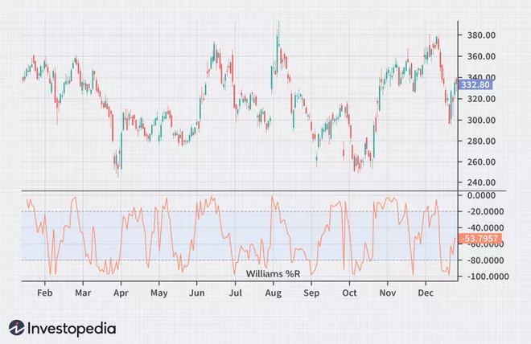</img>

## Formula

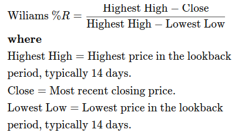</img>

1. Record the high and low for each period over 14 periods.
2. On the 14th period, note the current price, the highest price, and lowest price. It is now possible to fill in all the formula variables for Williams %R.
3. On the 15th period, note the current price, highest price, and lowest price, but only for the last 14 periods (not the last 15). Compute the new Williams %R value.
4. As each period ends compute the new Williams %R, only using the last 14 periods of data.

##  What Does Williams %R Tell You?
The indicator is telling a trader where the current price is relative to the highest high over the last 14 periods (or whatever number of lookback periods is chosen). 

When the indicator is between -20 and zero the price is overbought, or near the high of its recent price range. When the indicator is between -80 and -100 the price is oversold, or far from the high of its recent range. 

During an uptrend, traders can watch for the indicator to move below -80. When the price starts moving up, and the indicator moves back above -80, it could signal that the uptrend in price is starting again. 

The same concept could be used to find short trades in a downtrend. When the indicator is above -20, watch for the price to start falling along with the Williams %R moving back below -20 to signal a potential continuation of the downtrend. 

Traders can also watch for momentum failures. During a strong uptrend, the price will often reach -20 or above. If the indicator falls, and then can't get back above -20 before falling again, that signals that the upward price momentum is in trouble and a bigger price decline could follow. 

The same concept applies to a downtrend. Readings of -80 or lower are often reached. When the indicator can no longer reach those low levels before moving higher it could indicate the price is going to head higher.  

# Ease of Movement Indicator
- The Ease of Movement indicator shows the relationship between price and volume, and it's often used to assess the strength of an underlying trend.
- Ease of Movement calculates how easily a price can move up or down.
- The calculation subtracts yesterday's average price from today's average price and divides the difference by volume.

Richard Arms' Ease of Movement indicator is a technical study that attempts to quantify a mix of momentum and volume information into one value. The intent is to use this value to discern whether prices are able to rise, or fall, with little resistance in the directional movement. Theoretically, if prices move easily, they will continue to do so for a period of time that can be traded effectively. 

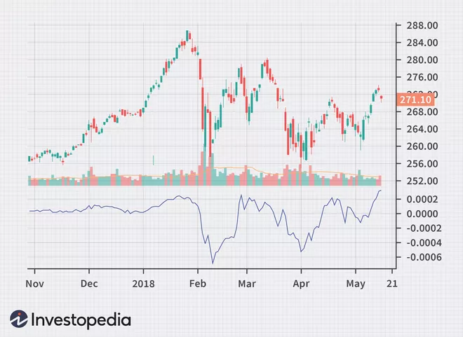</img>

## Formula

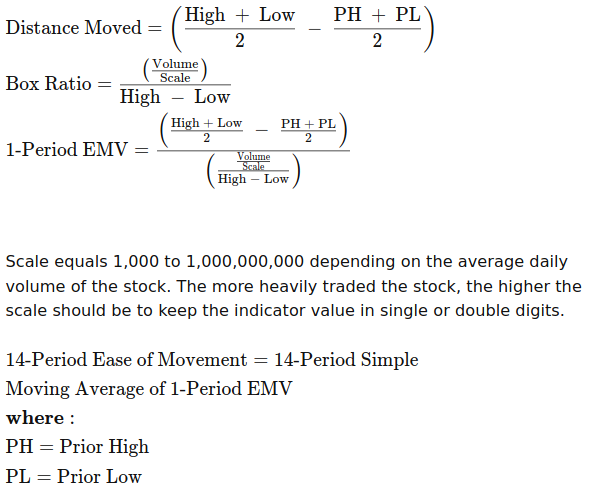</img>

## What does the indicator tell traders?
The price is rising on low volume when the ease of movement makes output values greater than zero, while falling negative values mean that the price is declining on low volume. 

Some professional traders prefer to include a moving average to the EMV line and use it as a trigger line to create trading signals. Traders may also look for divergences and convergences between this indicator and price as an indication of upcoming reversals. 

The EMV indicator can be seen as being similar to a volume-weighted momentum line because the calculations of the EMV lead to a line similar to a momentum indicator. Comparing the momentum indicator and the EMV could offer vital information about the influence of volume on price. 

A lot of traders can improve their chances of success by using the EMV together with other forms of technical analysis, including both technical indicators and chart patterns. For instance, a trader may see a bullish reversal chart pattern, see that the EMV is improving, and purchase the stock after it breaks-out from a particular price point, rather than exclusively depending on the indicator.

## How to use the Ease of Movement indicator?
### **Opening a position**
This indicator is not a standalone trading tool. One of the most common indicators to combine with the EMV is volume. Since the EMV comes from volume activity, volume is a valuable tool in validating trading signals. 

Volumes increase as the price is breaking out. This bullish price action together with strong trading volume gives a good opportunity to establish a long position. 

The EMV starts making lower highs with each subsequent rally and starts to draw closer to the zero line at the end of a bullish signal. Also, volumes continue to drop with each trading period. 

Traders can use this as a chance to exit long positions and get short once there is a bearish cross of the EMV below zero with increased volume. Traders open their short position and can ride the wave back down for another round of healthy gains.

### **Closing a position**
Every trader will know when to enter a trade with this indicator, but does it provide accurate exit signals? The answer is yes and no. 

As mentioned earlier, the EMV is not a standalone trading indicator. At the same time, the volumes indicator is good for confirming signals, but not for telling us when to enter or leave a position.

# Stochastic RSI (StochRSI)
- A StochRSI reading above 0.8 is considered overbought, while a reading below 0.2 is considered oversold. On the zero to 100 scale, above 80 is overbought, and below 20 is oversold.
- Overbought doesn't necessarily mean the price will reverse lower, just like oversold doesn't mean the price will reverse higher. Rather the overbought and oversold conditions simply alert traders that the RSI is near the extremes of its recent readings.
- A reading of zero means the RSI is at its lowest level in 14 periods (or whatever lookback period is chosen). A reading of 1 (or 100) means the RSI is at the highest level in the last 14 periods.
- Other StochRSI values show where the RSI is relative to a high or low.

The Stochastic RSI (StochRSI) is an indicator used in technical analysis that ranges between zero and one (or zero and 100 on some charting platforms) and is created by applying the Stochastic oscillator formula to a set of relative strength index (RSI) values rather than to standard price data. Using RSI values within the Stochastic formula gives traders an idea of whether the current RSI value is overbought or oversold. 

The StochRSI oscillator was developed to take advantage of both momentum indicators in order to create a more sensitive indicator that is attuned to a specific security's historical performance rather than a generalized analysis of price change. 

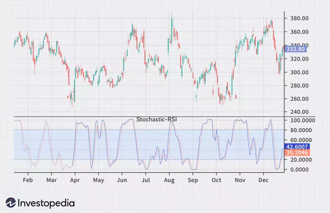</img>

## Formula

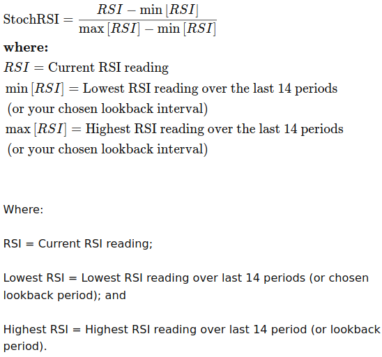</img>

1. Record RSI levels for 14 periods.
2. On the 14th period, note the current RSI reading, the highest RSI reading, and lowest RSI reading. It is now possible to fill in all the formula variables for StochRSI.
3. On the 15th period, note the current RSI reading, highest RSI reading, and lowest reading, but only for the last 14 period (not the last 15). Compute the new StochRSI.
4. As each period ends compute the new StochRSI value, only using the last 14 RSI values.

##  What Does the Stochastic RSI Tell You?
The StochRSI was developed by Tushar S. Chande and Stanley Kroll and detailed in their book "The New Technical Trader," first published in 1994. While technical indicators already existed to show overbought and oversold levels, the two developed StochRSI to improve sensitivity and generate a greater number of signals than traditional indicators could do. 

The StochRSI deems something to be oversold when the value drops below 0.20, meaning the RSI value is trading at the lower end of its predefined range, and that the short-term direction of the underlying security may be nearing a low a possible move higher. Conversely, a reading above 0.80 suggests the RSI may be reaching extreme highs and could be used to signal a pullback in the underlying security. 

Along with identifying overbought/oversold conditions, the StochRSI can be used to identify short-term trends by looking at it in the context of an oscillator with a centerline at 0.50. When the StochRSI is above 0.50, the security may be seen as trending higher and vice versa when it's below 0.50.

The StochRSI should also be used in conjunction with other technical indicators or chart patterns to maximize effectiveness, especially given the high number of signals that it generates.

In addition, non-momentum oscillators like the accumulation distribution line may be particularly helpful because they don't overlap in terms of functionality and provide insights from a different perspective. 

## How to use the StochRSI?
- A StochRSI reading of 100 shows the RSI level of the asset is at its maximum point in the last 14 points.
- A reading of 80 shows the RSI level of the asset is close to its high from the last 14 points.
- A StochRSI reading of 50 shows the RSI level of the asset is in a neutral point.
- A reading of 20 shows the RSI level of the asset is close its low from the last 14 points.
- A StochRSI reading of 0 means that the RSI level of the asset is at its least point in the past 14 periods.
- When the reading of a StochRSI of an asset drops lower than 20, it is seen as being oversold.

# Rate of Change Indicator
- The Price Rate of Change (ROC) oscillator is and unbounded momentum indicator used in technical analysis set against a zero-level midpoint.
- A rising ROC above zero typically confirms an uptrend while a falling ROC below zero indicates a downtrend.
- When the price is consolidating, the ROC will hover near zero. In this case, it is important traders watch the overall price trend since the ROC will provide little insight except for confirming the consolidation.

The Price Rate of Change (ROC) is a momentum-based technical indicator that measures the percentage change in price between the current price and the price a certain number of periods ago. The ROC indicator is plotted against zero, with the indicator moving upwards into positive territory if price changes are to the upside, and moving into negative territory if price changes are to the downside.

The indicator can be used to spot divergences, overbought and oversold conditions, and centerline crossovers. 

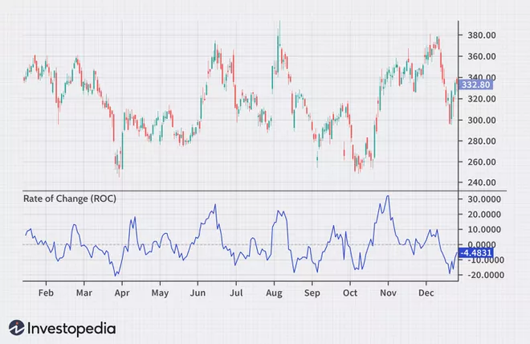</img>

## Formula

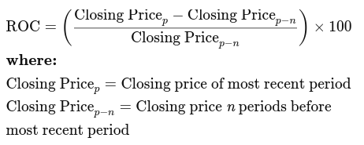</img>

1. Select an n value. It can be anything such as 12, 25, or 200. Short-term trader traders typically use a smaller number while longer-term investors use a larger number.
2. Find the most recent period's closing price.
3. Find the period's close price from n periods ago.
4. Plug the prices from steps two and three into the ROC formula.
5. As each period ends, calculate the new ROC value.

## What Does the Price Rate of Change Indicator Tell You? 
The Price Rate of Change (ROC) is classed as a momentum or velocity indicator because it measures the strength of price momentum by the rate of change. 

Like most momentum oscillators, the ROC appears on a chart in a separate window below the price chart. The ROC is plotted against a zero line that differentiates positive and negative values. Positive values indicate upward buying pressure or momentum, while negative values below zero indicate selling pressure or downward momentum. Increasing values in either direction, positive or negative, indicate increasing momentum, and moves back toward zero indicate waning momentum.

Zero-line crossovers can be used to signal trend changes. Depending on the n value used these signal may come early in a trend change (small n value) or very late in a trend change (larger n value). The ROC is prone to whipsaws, especially around the zero line. Therefore, this signal is generally not used for trading purposes, but rather to simply alert traders that a trend change may be underway.

Overbought and oversold levels are also used. These levels are not fixed, but will vary by the asset being traded. Traders look to see what ROC values resulted in price reversals in the past. Often traders will find both positive and negative values where the price reversed with some regularity. When the ROC reaches these extreme readings again, traders will be on high alert and watch for the price to start reversing to confirm the ROC signal. With the ROC signal in place, and the price reversing to confirm the ROC signal, a trade may be considered.

ROC is also commonly used as a divergence indicator that signals a possible upcoming trend change. Divergence occurs when the price of a stock or another asset moves in one direction while its ROC moves in the opposite direction. For example, if a stock's price is rising over a period of time while the ROC is progressively moving lower, then the ROC is indicating bearish divergence from price, which signals a possible trend change to the downside. The same concept applies if the price is moving down and ROC is moving higher. This could signal a price move to the upside. Divergence is a notoriously poor timing signal since a divergence can last a long time and won't always result in a price reversal. 

Its interpretation is also easy:
- When the ROC is above the Zero Line and constantly rising above, it indicates an uptrend and its speed is accelerating 
- ROC is descending and is above the Zero Line, it indicates that the speed of the downtrend is decreasing  
- When the ROC is above the Zero Line, again begins to rise, and crosses the previous highest point, it indicates that uptrend is accelerating speedily 

On the other hand:
- When the ROC is below the Zero Line and it is descending further lower, it shows that the downtrend is accelerating 
- ROC begins to ascend and is below the Zero Line, it means the downtrend is decelerating 
- When the ROC is below the Zero Line and again begins to descend, it means the downtrend is again catching speed

## How to use the Rate of Change indicator?
The Rate of Change indicator can be used to detect price divergences, confirm price movements, or track overselling or overbuying conditions. It is interesting to note that the Rate of Change indicator works well with all markets. It has no right or wrong setting. However, it is a must for every trader to make decisions by observing the volatility of the financial market and overall market conditions. 

The Rate of Change indicator is flexible with various timeframes such as 10 minutes, 2 hours, daily, 2 days, or weekly. It is simple as well as fast to calculate the values. Due to its flexibility, it can be used from short-term trading to financial analysis of any kind of financial asset. However, it is the best practice that its calculations should be used for long-term trend identification. Technical analysts and experts emphasize that it should be used for confirmation signals. Moreover, it is one of the best trading indicators that can be used to measure the strength of a trend. 

# Know Sure Thing (KST) Indicator
- The Know Sure Thing (KST) is a momentum oscillator intended to interpret rate-of-change price data.
- Trading signals are generated when the KST crosses over the signal line, but traders also look for overbought or oversold conditions.
- Traders also combine the KST with other technical analysis to maximize their odds of a successful trade.

The Know Sure Thing (KST) is a momentum oscillator developed by Martin Pring to make rate-of-change readings easier for traders to interpret. 

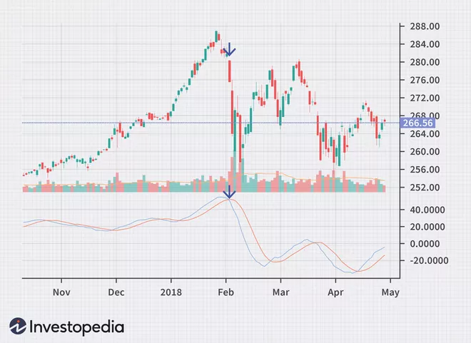</img>

## Formula

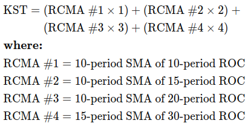</img>

## Understanding
The KST indicator can be used in the same manner as many other momentum oscillators, such as the well-known relative strength index (RSI). Trading signals are generated when the KST crosses over the signal line, but traders may also look for convergence and divergence with the price, overbought or oversold conditions, or crossovers of the center line.

Many traders combine the KST indicator with other forms of technical analysis to maximize their odds of success. For example, traders may look at other non-momentum indicators, chart patterns, or candlestick patterns to help in their decision-making. 

## What does the Know Sure Thing indicator tell traders?
The Know Sure Thing indicator serves multiple purposes such as it gives bearish and bullish signals. The presence of Know Sure Thing above the signal line means the bullish trend. The presence of the Know Sure Thing indicates the bearish trend in the market. Traders also use it to seek convergences, divergences, overbought and oversold market conditions, signal line crossovers, and centerline crossovers.

However, technical analysts advise combining the Know Sure Thing indicator with other technical analysis tools to gain the maximum. Therefore, traders prefer to use this in conjunction with other candlestick patterns, chart patterns, or other non-momentum indicators for better decision making. 

## How to use the Know Sure Thing indicator?
The Know Sure Thing continuously oscillates above or below the Zero Line. The reading is positive when the KST is above the Zero Line and it indicates that it is favoring the bulls. The reading is negative when the KST indicator is below the Zero Line and it shows that the momentum is favoring the bears. The positive readings show positive weighted and smooth values of the rate of change and increasing prices of the financial assets. The negative readings illustrate the downtrend with falling prices of the stock. 

The basic centerline and signal line crossovers are the strongest signals provided by the Know Sure Thing indicator. Traders can really capitalize on this strength. They should search for signal line crossover after witnessing the basic centerline crossover. They should also detect the general direction of the trend as well. As a general rule, the KST ascends when it is above the signal line and it descends when below the signal line. An ascending and negative Know Sure Thing line indicates the weakening of the downside momentum. A descending and positive Know Sure Thing line shows the waning upside momentum.

Moreover, bullish and bearish divergence signals are also possible but they cannot be used every time. The chartists are advised to be selective before using them. They are also encouraged to experiment with different settings because one size may not fulfill the requirements of the traders. They can also experiment with moving average settings and try mixing and matching the rate of change settings to maximize their odds of success. 

# Chaikin Oscillator
- The Chaikin Indicator applies MACD to the accumulation-distribution line rather than closing price.
- A cross above the accumulation-distribution line indicates that market players are accumulating shares, securities or contracts, which is typically bullish.

The Chaikin oscillator is named for its creator Marc Chaikin. The oscillator measures the accumulation-distribution line of moving average convergence-divergence (MACD). To calculate the Chaikin oscillator, subtract a 10-day exponential moving average (EMA) of the accumulation-distribution line from a 3-day EMA of the accumulation-distribution line. This measures momentum predicted by oscillations around the accumulation-distribution line. 

</img>

## Formula

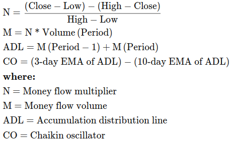</img>

1. Calculate the Money Flow Multiplier (N).
2. Multiply the Money Flow Multiplier (N) by volume to calculate Money Flow Volume (N).
3. List a running total of N to draw the accumulation-distribution line (ADL).
4. Compute the difference between 10 period and 3 period exponential moving averages to calculate the Chaikin oscillator.

## What Does the Chaikin Oscillator Tell You?
The Chaikin oscillator is a tool for technical analysts more than for fundamental analysts, who study a company’s business performance to garner information about the future direction of its stock price. Fundamental analysts believe that the skill needed to forecast the market is about being the most informed. Technical analysts believe that all known information is already priced into stocks and that patterns in the ups and downs of equity prices can better predict the market’s movements. Technical analysts use the Chaikin oscillator to find directional trends in momentum.

To appreciate how an oscillator is utilized, imagine that you’re at an auction. On one side of the room are accumulators or buyers. On the other side of the room are the distributors or sellers. When there are more sellers in the room than buyers, the price of the item being auctioned declines. Likewise, when buyers are in the majority, the item’s price tends to increase.

Technical analysts believe the balance of this relationship is what drives the financial markets. They measure this balance between buyers and sellers with multiple indicators, including accumulation-distribution indicators like the Chaikin oscillator. 

# MACD Indicator
- Moving average convergence divergence (MACD) is calculated by subtracting the 26-period exponential moving average (EMA) from the 12-period EMA.
- MACD triggers technical signals when it crosses above (to buy) or below (to sell) its signal line.
- The speed of crossovers is also taken as a signal of a market is overbought or oversold.
- MACD helps investors understand whether the bullish or bearish movement in the price is strengthening or weakening.

Moving average convergence divergence (MACD) is a trend-following momentum indicator that shows the relationship between two moving averages of a security’s price. The MACD is calculated by subtracting the 26-period exponential moving average (EMA) from the 12-period EMA.

The result of that calculation is the MACD line. A nine-day EMA of the MACD called the "signal line," is then plotted on top of the MACD line, which can function as a trigger for buy and sell signals. Traders may buy the security when the MACD crosses above its signal line and sell—or short—the security when the MACD crosses below the signal line. Moving average convergence divergence (MACD) indicators can be interpreted in several ways, but the more common methods are crossovers, divergences, and rapid rises/falls. 

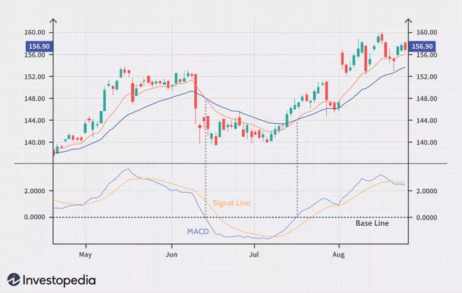</img>

## Formula

MACD = 12-Period EMA - 26-Period EMA

## What does the MACD indicator tell traders?
Understanding MACD convergence divergence is very necessary. When the price is experiencing a lower low but the MACD is making a higher low, it creates a bullish divergence. If the MACD is making a lower high, but the price is making a higher high, it creates a bearish divergence. Divergence will almost always happen right after a sudden price movement higher or lower. Divergence is just a cue that the price might reverse, traders usually confirm it by a trend line break.

## How to use the MACD indicator?
- Traders often see the MACD crossing above zero as bullish, while crossing below zero as bearish. Secondly, when MACD turns up from below zero it is bullish. When it turns down from above zero it is bearish.
- When the line crosses from below to above the signal line, traders consider it bullish. The lower the zero line the stronger the signal.
- When the MACD line crosses from above to below the signal line, the indicator is considered bearish. The further above the zero line the stronger the signal.
- During trading phase, the MACD will whipsaw with the quick line going back and forth across the line of the signal. Traders that use the MACD generally avoid trading in this situation or close positions to lower volatility within the portfolio.
- Divergence between the MACD and the price action is a better signal when it confirms the crossover signals.

## How to trade using the MACD
Because there are two moving averages with various speeds, the quicker one will obviously be faster to react to price movement than the one that is slower. When there’s a new trend, the quick line will react first and eventually cross the slower line.

When this crossover happens and the fast line begins to diverge or move away from the slower line, it mostly signifies that a new trend has been made. As the downtrend starts and the fast line moves away from the slow line, the histogram gets larger, which is a good indication of a strong trend.

Just as its name implies, the MACD is all about the convergence and divergence of two moving averages. Convergence happens when the moving averages move towards themselves. Divergence happens when the moving averages move away from each other. The shorter moving average (12-day) is quicker and responsible for most movements of MACD. The longer moving average (26-day) is less reactive and slower to price changes in the underlying security.

# Stochastic Oscillator
- A stochastic oscillator is a popular technical indicator for generating overbought and oversold signals.
- It is a popular momentum indicator, first developed in the 1950s.
- Stochastic oscillators tend to vary around some mean price level, since they rely on an asset's price history.

A stochastic oscillator is a momentum indicator comparing a particular closing price of a security to a range of its prices over a certain period of time. The sensitivity of the oscillator to market movements is reducible by adjusting that time period or by taking a moving average of the result. It is used to generate overbought and oversold trading signals, utilizing a 0–100 bounded range of values. 

</img>

## Formula

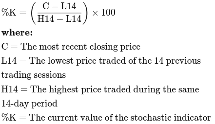</img>

##  What Does the Stochastic Oscillator Tell You?
The stochastic oscillator is range-bound, meaning it is always between 0 and 100. This makes it a useful indicator of overbought and oversold conditions. Traditionally, readings over 80 are considered in the overbought range, and readings under 20 are considered oversold. However, these are not always indicative of impending reversal; very strong trends can maintain overbought or oversold conditions for an extended period. Instead, traders should look to changes in the stochastic oscillator for clues about future trend shifts.

Stochastic oscillator charting generally consists of two lines: one reflecting the actual value of the oscillator for each session, and one reflecting its three-day simple moving average. Because price is thought to follow momentum, the intersection of these two lines is considered to be a signal that a reversal may be in the works, as it indicates a large shift in momentum from day to day.

Divergence between the stochastic oscillator and trending price action is also seen as an important reversal signal. For example, when a bearish trend reaches a new lower low, but the oscillator prints a higher low, it may be an indicator that bears are exhausting their momentum and a bullish reversal is brewing. 

## How to use the Stochastic indicator?
When using the stochastic oscillator to identify overbought and oversold market conditions, a reading above 80 means overbought market conditions and a reading lower than 20 shows an oversold market condition. The stochastic indicator itself can range only from 0 to 100, no matter how fast the price of the underlying currency pair changes. In a standard setting, a reading above 80 signifies that the pair has been trading close to the top of its trading range while a reading below 20 means that the pair has been trading near the low of its trading range.

Keep in mind, oversold readings are not necessarily bullish, just like overbought readings are not necessarily bearish. When there’s a sustained period of uptrend or downtrend, the stochastic indicator can stay in the oversold or overbought area for a long period.

It is, therefore, advised to trade in the direction of the trend and wait for occasional oversold readings during uptrends and overbought readings during downtrends.

# Relative Strength Index (RSI)
- The relative strength index (RSI) is a popular momentum oscillator developed in 1978.
- The RSI provides technical traders with signals about bullish and bearish price momentum, and it is often plotted beneath the graph of an asset’s price.
- An asset is usually considered overbought when the RSI is above 70% and oversold when it is below 30%.

The relative strength index (RSI) is a momentum indicator used in technical analysis that measures the magnitude of recent price changes to evaluate overbought or oversold conditions in the price of a stock or other asset. The RSI is displayed as an oscillator (a line graph that moves between two extremes) and can have a reading from 0 to 100. The indicator was originally developed by J. Welles Wilder Jr. and introduced in his seminal 1978 book, “New Concepts in Technical Trading Systems.”

Traditional interpretation and usage of the RSI are that values of 70 or above indicate that a security is becoming overbought or overvalued and may be primed for a trend reversal or corrective pullback in price. An RSI reading of 30 or below indicates an oversold or undervalued condition. 

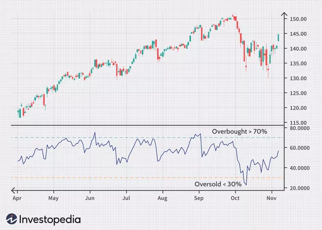</img>

## Formula

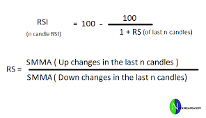</img>

The RSI is computed with a two-part calculation that starts with the following formula: 

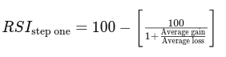</img>

The average gain or loss used in the calculation is the average percentage gain or loss during a look-back period. The formula uses a positive value for the average loss. Periods with price losses are counted as 0 in the calculations of average gain, and periods when the price increases are counted as 0 for the calculation of average losses.

The standard is to use 14 periods to calculate the initial RSI value. For example, imagine the market closed higher seven out of the past 14 days with an average gain of 1%. The remaining seven days all closed lower with an average loss of −0.8%.

Once there are 14 periods of data available, the second part of the RSI formula can be calculated. The second step of the calculation smooths the results. 

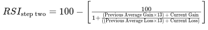</img>

##  What Does the RSI Tell You?
The primary trend of the stock or asset is an important tool in making sure the indicator’s readings are properly understood. For example, well-known market technician Constance Brown, CMT, has promoted the idea that an oversold reading on the RSI in an uptrend is likely much higher than 30% and that an overbought reading on the RSI during a downtrend is much lower than the 70% level.1

As you can see in the following chart, during a downtrend, the RSI would peak near the 50% level rather than 70%, which could be used by investors to more reliably signal bearish conditions. Many investors will apply a horizontal trendline between 30% and 70% levels when a strong trend is in place to better identify extremes. Modifying overbought or oversold levels when the price of a stock or asset is in a long-term horizontal channel is usually unnecessary.

A related concept to using overbought or oversold levels appropriate to the trend is to focus on trade signals and techniques that conform to the trend. In other words, using bullish signals when the price is in a bullish trend and bearish signals when a stock is in a bearish trend will help to avoid the many false alarms that the RSI can generate. 

## How to use the Relative Strength Index indicator?
### **Trade entry with the Relative Strength Index indicator**
To enter an RSI trade, you’ll need to see a signal from the RSI indicator. This could either be overbought or oversold RSI, or an RSI divergence pattern.

When entering an overbought/oversold signal, buy/sell the currency pair when the price action leaves the respective threshold on the RSI indicator.

As you trade divergence with the RSI indicator, enter a trade in the direction of the RSI, after the price action closes two or three candlesticks in a row in the direction of your intended trade.

### **Stop-loss**
As discussed earlier, the RSI indicator can give false or premature signals if used alone, without further confirmation. Even when using it with other confirming studies, it is important to use a stop-loss to protect losses on your trade.

The highest place for your stop-loss order is beyond a recent swing top or bottom, which appears at the time of the reversal you are trading.

### **Take Profit**
The basic rule of RSI states that you should hold your trade until getting an opposite signal from the RSI indicator. This could also be an overbought or oversold signal, as well as bearish or bullish RSI divergence. But in the practical sense, it makes sense to take your profits out early using other price action based rules or a stop-loss.

## Example of RSI Divergences
A bullish divergence occurs when the RSI creates an oversold reading followed by a higher low that matches correspondingly lower lows in the price. This indicates rising bullish momentum, and a break above oversold territory could be used to trigger a new long position.

A bearish divergence occurs when the RSI creates an overbought reading followed by a lower high that matches corresponding higher highs on the price.

As you can see in the following chart, a bullish divergence was identified when the RSI formed higher lows as the price formed lower lows. This was a valid signal, but divergences can be rare when a stock is in a stable long-term trend. Using flexible oversold or overbought readings will help identify more potential signals. 

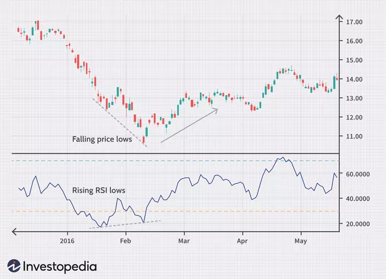</img>

##  Example of RSI Swing Rejections
Another trading technique examines the RSI’s behavior when it is reemerging from overbought or oversold territory. This signal is called a bullish “swing rejection” and has four parts:

1. The RSI falls into oversold territory.
2. The RSI crosses back above 30%.
3. The RSI forms another dip without crossing back into oversold territory.
4. The RSI then breaks its most recent high.

As you can see in the following chart, the RSI indicator was oversold, broke up through 30% and formed the rejection low that triggered the signal when it bounced higher. Using the RSI in this way is very similar to drawing trend lines on a price chart. 

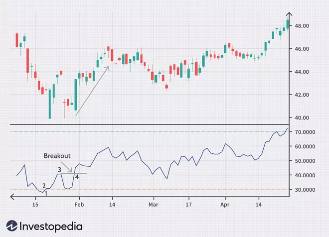</img>

