# Trend Indicators
This document contains all trend indicators

# Content Table
- [Trend Indicators](#trend-indicators)
- [Content Table](#content-table)
- [Stoller Average Range Channels (STARC)](#stoller-average-range-channels-starc)
  - [Formula](#formula)
  - [What Do STARC Bands Tell You?](#what-do-starc-bands-tell-you)
  - [How to trade with the STARC Bands?](#how-to-trade-with-the-starc-bands)
- [Detrended Price Oscillator (DPO)](#detrended-price-oscillator-dpo)
  - [Formula](#formula-1)
  - [What Does the Detrended Price Oscillator Tell You?](#what-does-the-detrended-price-oscillator-tell-you)
  - [How to use the DPO indicator for trading?](#how-to-use-the-dpo-indicator-for-trading)
  - [Example of using](#example-of-using)
- [Gator Oscillator](#gator-oscillator)
  - [Formula](#formula-2)
  - [How go interpret the Gator Oscillator?](#how-go-interpret-the-gator-oscillator)
  - [How to trade with the indicator?](#how-to-trade-with-the-indicator)
- [Polarized Fractal Efficiency Indicator (PFE)](#polarized-fractal-efficiency-indicator-pfe)
  - [Formula](#formula-3)
  - [How to interpret the PFE indicator?](#how-to-interpret-the-pfe-indicator)
  - [How to trade with the Polarized Fractal Efficiency indicator?](#how-to-trade-with-the-polarized-fractal-efficiency-indicator)
  - [PFE Example](#pfe-example)
- [Relative Momentum Index (RMI)](#relative-momentum-index-rmi)
  - [Formula](#formula-4)
  - [What does the RMI tell traders?](#what-does-the-rmi-tell-traders)
- [Trend Intensity Index (TII)](#trend-intensity-index-tii)
  - [Formula](#formula-5)
  - [How to interpret the trend intensity index indicator](#how-to-interpret-the-trend-intensity-index-indicator)
  - [How to use the TII indicator for trading?](#how-to-use-the-tii-indicator-for-trading)
- [Arnaud Legoux Moving Average (ALMA)](#arnaud-legoux-moving-average-alma)
  - [Formula](#formula-6)
  - [How to trade using the Arnaud Legoux Moving Average indicator](#how-to-trade-using-the-arnaud-legoux-moving-average-indicator)
- [Envelope Channel Indicator](#envelope-channel-indicator)
  - [Formula](#formula-7)
  - [What does the envelope indicator tell traders?](#what-does-the-envelope-indicator-tell-traders)
  - [Trend identification](#trend-identification)
- [Advance/Decline Line (A/D Line)](#advancedecline-line-ad-line)
  - [Formula](#formula-8)
  - [What Does the Advance/Decline (A/D) Line Tell You?](#what-does-the-advancedecline-ad-line-tell-you)
- [Hull Moving Average Indicator](#hull-moving-average-indicator)
  - [Formula](#formula-9)
  - [What does the Hull moving average tell traders?](#what-does-the-hull-moving-average-tell-traders)
  - [How to trade with the indicator?](#how-to-trade-with-the-indicator-1)
- [Schaff Trend Cycle (STC) Indicator](#schaff-trend-cycle-stc-indicator)
  - [Formula](#formula-10)
  - [What does the Schaff Trend Cycle indicator tell traders?](#what-does-the-schaff-trend-cycle-indicator-tell-traders)
  - [How to trade with the Schaff Trend Cycle indicator?](#how-to-trade-with-the-schaff-trend-cycle-indicator)
- [Trendlines](#trendlines)
  - [What does trendlines tell traders?](#what-does-trendlines-tell-traders)
  - [Example Using](#example-using)
- [Chande Kroll Volatility Stop Indicator](#chande-kroll-volatility-stop-indicator)
  - [Formula](#formula-11)
    - [**Indicators used**](#indicators-used)
  - [Two lines make up the Chande Kroll Stop](#two-lines-make-up-the-chande-kroll-stop)
  - [What the Chande Kroll Stop indicator tells traders**](#what-the-chande-kroll-stop-indicator-tells-traders)
  - [How to use the Chande Kroll Stop on the stock market?](#how-to-use-the-chande-kroll-stop-on-the-stock-market)
  - [Example](#example)
- [Williams Fractal Indicator](#williams-fractal-indicator)
  - [Formula](#formula-12)
  - [What the Fractal Indicator Tells You](#what-the-fractal-indicator-tells-you)
  - [How to use fractals in trading](#how-to-use-fractals-in-trading)
- [Williams Alligator Indicator](#williams-alligator-indicator)
  - [Formula](#formula-13)
  - [Example Using](#example-using-1)
- [Relative Vigor Index (RVI)](#relative-vigor-index-rvi)
  - [Formula](#formula-14)
  - [What Does the Relative Vigor Index (RVI) Tell You?](#what-does-the-relative-vigor-index-rvi-tell-you)
  - [Example of using](#example-of-using-1)
- [Mass Index Indicator](#mass-index-indicator)
  - [Formula](#formula-15)
  - [How to use the Mass Index Oscillator?](#how-to-use-the-mass-index-oscillator)
- [Pivot Point Indicator](#pivot-point-indicator)
  - [Formula](#formula-16)
  - [What Do Pivot Points Tell You?](#what-do-pivot-points-tell-you)
  - [Pivot Point levels](#pivot-point-levels)
  - [How to trade with the indicator](#how-to-trade-with-the-indicator-2)
    - [**The indicator is usable on all the timeframes**](#the-indicator-is-usable-on-all-the-timeframes)
    - [**How to use the Pivot Point indicator on the different timeframes**](#how-to-use-the-pivot-point-indicator-on-the-different-timeframes)
- [Ichimoku Cloud](#ichimoku-cloud)
  - [Formula](#formula-17)
  - [What Does the Ichimoku Cloud Tell You?](#what-does-the-ichimoku-cloud-tell-you)
- [Balance of Power Indicator](#balance-of-power-indicator)
  - [Formula](#formula-18)
  - [What does the Balance of Power indicator tell traders?](#what-does-the-balance-of-power-indicator-tell-traders)
  - [How to use the Balance of Power indicator?](#how-to-use-the-balance-of-power-indicator)
- [Average Directional Index (ADX)](#average-directional-index-adx)
  - [Formula](#formula-19)
  - [What Does the Average Directional Index (ADX) Tell You?](#what-does-the-average-directional-index-adx-tell-you)
- [Directional Movememnt Index (DMI)](#directional-movememnt-index-dmi)
  - [Formula](#formula-20)
  - [What Does the Directional Movement Index Tell You](#what-does-the-directional-movement-index-tell-you)
- [Parabolic SAR Indicator](#parabolic-sar-indicator)
  - [Formula](#formula-21)
  - [How to Trade With the Parabolic SAR](#how-to-trade-with-the-parabolic-sar)
- [Zig Zag](#zig-zag)
  - [Formula](#formula-22)
  - [Parameters of the Zig Zag indicator](#parameters-of-the-zig-zag-indicator)
    - [**Deviation**](#deviation)
    - [**Depth**](#depth)
    - [**Backstep**](#backstep)
  - [What does the indicator tell traders?](#what-does-the-indicator-tell-traders)
  - [How to use the Zig Zag indicator?](#how-to-use-the-zig-zag-indicator)
- [McGinley Dynamic Indicator](#mcginley-dynamic-indicator)
  - [Formula](#formula-23)
- [Aroon Indicator](#aroon-indicator)
  - [Formula](#formula-24)
  - [What Does the Aroon Indicator Tell You?](#what-does-the-aroon-indicator-tell-you)
  - [How to use the Aroon indicator?](#how-to-use-the-aroon-indicator)
  - [Example Using](#example-using-2)

# Stoller Average Range Channels (STARC)
- During a rising trend, when prices are making overall higher highs and higher lows, it may be favorable to buy near the lower band (STARC Band-) and sell near the upper band (STARC Band+).
- During a downtrend, it may be favorable to short near the upper band and cover near the lower band.
- When bands are breached it can signal a trend change. For example, during an uptrend, if the price falls sharply through the lower band it could signal the uptrend is over.
- When the price action is choppy or ranging, the same general guidelines apply: favor buying near the lower band, selling near the upper band, and significant breaches of either band could mean the range is over.
- The SMA length is chosen by the trader and is typically between five and 10 periods.
- The trader can also choose how far above the SMA the upper and lower bands are, based on the ATR multiple. Placing the bands at +/- two ATR is common.

Commonly called STARC Bands, Stoller Average Range Channel Bands developed by Manning Stoller, are two bands that are applied above and below a simple moving average (SMA) of an asset's price. The upper band is created by adding the value of the average true range (ATR), or a multiple of it. The lower band is created by subtracting the value of the ATR from the SMA.

The channel created by the bands can provide traders with ideas on when to buy or sell. During an overall uptrend, buying near the lower band and selling near the top band is favorable, for example. STARC bands can provide insight for both ranging and trending markets. 

</img>

## Formula

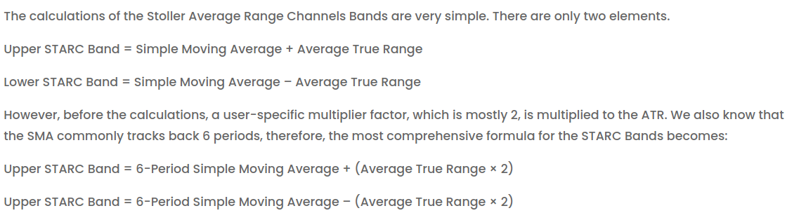</img>

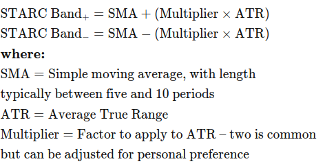</img>

1. Choose an SMA length. Five to 10 periods are common for STARC Bands.
2. Choose an ATR multiple. Two times ATR is common, although this can be adjusted as needed.
3. Calculate the SMA.
4. Calculate the ATR, and then multiply it by the multiple chosen.
5. Add the ATR x multiple to the SMA to get STARC Band+.
6. Subtract the ATR x multiple from the SMA to get STARC Band-.
7. Calculate the new values as each period ends.

##  What Do STARC Bands Tell You?
STARC bands are a type of envelope channel that provides potential support and resistance levels.

STARC bands follow a basic price channel trading methodology. The top band is considered to show the security’s resistance price level and the bottom band is considered to show the security’s support price level.

The basic trading strategy is to sell when the security’s price is near the resistance band and buy when the security’s price is near the support band. Favor this strategy when the price is in an overall uptrend or when the price is ranging. When the price is in an overall downtrend, favor shorting near the upper resistance band and covering near the lower support band.

One thing to be aware of is that the price can move along a band for extended periods of time. This may mean a trade that looks good at the moment could turn out to be quite poor as the price continues to move along the band. For example, imagine selling a long position when the price reaches the upper band, only to watch as the price and upper band continue to move higher for some time.

Traders can use various average true range multipliers to influence the width of the bands. The larger the multiple the wider the bands. The smaller the multiple the tighter the bands. Longer-term traders may prefer wider bands while shorter-term traders may prefer narrow bands in order to potentially catch more trading opportunities. 

## How to trade with the STARC Bands?
The rules for using the Stoller Average Range Channels Bands in trading are very simple. During an uptrend, traders may go for buying when the price is near the lower STARC Band. They can close the deal when the price reaches near the upper STARC Band. During a downtrend, traders may go for a sell position when the price is near to the upper STARC Band. The can close their trade when the price reaches the lower band. 

# Detrended Price Oscillator (DPO)
- The detrended price oscillator (DPO) is used for measuring the distance between peaks and troughs in the price/indicator.
- If troughs have historically been about two months apart, that may help a trader make future decisions as they can locate the most recent trough and determine that the next one may occur in about two months.
- Traders can use the estimated future peaks as selling opportunities or the estimated future troughs as buying opportunities.
- The indicator is typically set to look back over 20 to 30 periods.

A detrended price oscillator, used in technical analysis, strips out price trends in an effort to estimate the length of price cycles from peak to peak or trough to trough.

Unlike other oscillators, such as the stochastic or moving average convergence divergence (MACD), the DPO is not a momentum indicator. It instead highlights peaks and troughs in price, which are used to estimate buy and sell points in line with the historical cycle. 

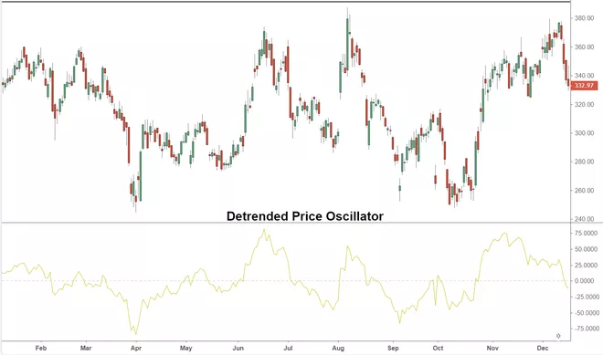</img>

## Formula

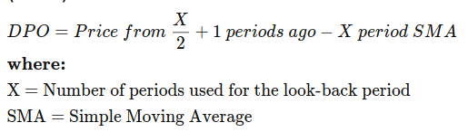</img>

1. Determine a lookback period, such as 20 periods.
2. Find the closing price from x/2 +1 periods ago. If using 20 periods, this is the price from 11 periods ago.
3. Calculate the SMA for the last x periods. In this case, 20.
4. Subtract the SMA value (step 3) from the closing price x/2 +1 periods ago (step 2) to get the DPO value.

##  What Does the Detrended Price Oscillator Tell You?
The detrended price oscillator seeks to help a trader identify an asset's price cycle. It does this by comparing an SMA to a historical price that is near the middle of the look-back period.

By looking at historical peaks and troughs on the indicator, which aligned with peaks and troughs in price, traders will typically draw vertical lines at these junctures and then count how much time elapsed between them.

If bottoms are two months apart, that helps assess when the next buying opportunity may come. This is done by isolating the most recent trough in the indicator/price and then projecting the next bottom two months out from there.

If peaks are generally 1.5 months apart, a trader could find the most recent peak and then project that the next peak will occur 1.5 months later. This projected peak/time frame can be used as an opportunity to potentially sell a position before the price retreats.

To further aid with trade timing, the distance between a trough and peak could be used to estimate the length of a long trade, or the distance between a peak and a trough to estimate the length of a short trade.

When the price from x/2+1 periods ago is above the SMA the indicator is positive. When the price from x/2 + 1 periods ago is below the SMA then the indicator is negative.

The detrended price oscillator does not go all the way to the latest price. This is because the DPO is measuring the price x/2 +1 periods relative to the SMA, therefore the indicator will only go up to the x/2 + 1 periods ago. This is OK though because the indicator is meant to highlight historical peaks and troughs.

The indicator ranges, and is also displaced into the past, and therefore isn't a real-time useful gauge for trend direction. By definition, the indicator is not be used for assessing trends. Therefore, determining which trades to take is up to the trader. During an overall uptrend, the cycle bottoms will likely present good buying opportunities, and the peaks good selling opportunities. 

## How to use the DPO indicator for trading?
- Suppose that the bottoms are two months apart, traders can easily assess when the next buying opportunity will appear. It can be done by isolating two recent lows on the DPO indicator and in price and then project the next bottom two months later.
- Suppose that the ups are two months apart, traders can easily assess when the next selling opportunity will appear. Traders can easily identify the most recent highs and then project the next high two months later.
- The distance between a high and a low can help to estimate the length of a short trade.
- The distance between a low and a high can help to estimate the length of a long trade.

## Example of using
In the example below, International Business Machines (IBM) is bottoming approximately every 1.5 to two months. Upon noticing the cycle, look for buy signals that align with this timeframe. Peaks in price are occurring every one to 1.5 months; look for sell/shorting signals that align with this cycle. 

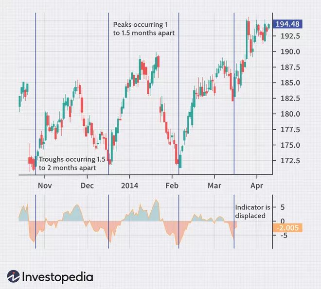</img>

# Gator Oscillator
- The Gator Oscillator helps to observe the degree of convergence/divergence of the balance lines.
- It’s supplementary tool of the Alligator Oscillator.

The Gator Oscillator works as a supplementary tool of the Alligator Oscillator. It helps to recap the following three balance lines plotted by the Alligator Oscillator. 
- Blue Alligator’s jaw is a 13-period simple moving average (SMA) 8 bar forward
- Red Alligator’s teeth is a 9-period simple moving average 5 bars forward
- Green Alligator’s lip is a 5-period simple moving average 3 bars forward 

The purpose of the GO is to show the degree of convergence/divergence of those balance lines. It shows its reading using two bars, the top bar, and the bottom bar. The top bar represents the difference between the blue jaw and red teeth lines. The bottom bar depicts the difference between the red teeth and the green lip line. The GO calculates and shifts the balance lines into the future according to the amount set by the traders. If the moving averages get plotted on the charts, the jaw will be blue, the teeth will be in red, and the lip will be green. The Gator Oscillator’s bars can be either red or green. A green bar depicts the rise while the red bar indicates a fall. It has also four stages that are also important to know about in order to interpret the indicator. 

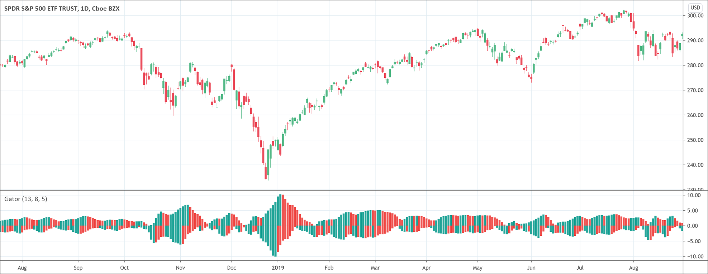</img>

## Formula

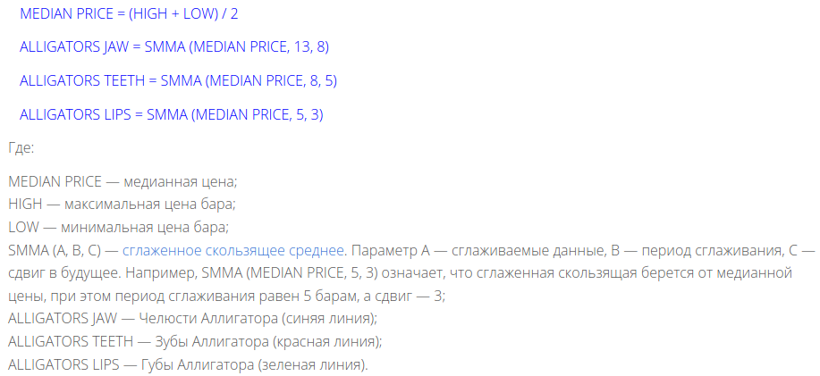</img>

## How go interpret the Gator Oscillator?
1. The Gator Oscillator is in sleeping mode when there are red bars on either side of the naught line.
2. The GO indicator is in awakening mode when one sidebar turns green while the remains red.
3. The indicator is in the eating phase when there are green bars on either side and hence the difference between the two sets of moving averages also grows.
4. The Gator Oscillator is a sated mode when one of the two sides turns red again. It generally indicates a decelerating trend and also preceded an upcoming reversal of the trend.

## How to trade with the indicator? 
The Gator Oscillator is most effective for trading in trending market conditions. Generally, traders open positions when the indicator awakes and keep through the trend exhaustion phase until both sides turn red again. Traders may also follow a more conservative strategy. They can lock in profits and exit their position when the Gator Oscillator is sated. This approach reduces the risk as well as the overall gain. 

# Polarized Fractal Efficiency Indicator (PFE)
- Polarized Fractal Efficiency (PFE) is a technical indicator that determines price efficiency over a user-defined period.
- PFE uses fractal geometry to determine how efficiently a security's price is moving.
- PFE helps traders determine the direction and strength of a trend.

The Polarized Fractal Efficiency (PFE) indicator is a technical analysis tool that helps traders and technical analysts on two aspects. It helps to identify the level of effectiveness of price movements. Secondly, the PFE indicator helps to determine how price changes chaotically or directionally behaved in the recent past. Hans Hannul was the developer of the PFE indicator. He developped it in an edition of Technical Analysis of Stocks and Commodities in 1994. 

The Polarized Fractal Efficiency is a unique indicator that measures the effectiveness of price changes based on the fundamental assumption of geometry. The most effective price change for the PFE indicator is linear. Thus, it represents the changing prices in a linear fashion rather than showing in ups and downs. The linear movement suggests a more definite and stronger trend. The values of the PFE indicator lies between the range of -100 and +100. The zero line acts as a barrier to distinguish positive and negative PFE values.

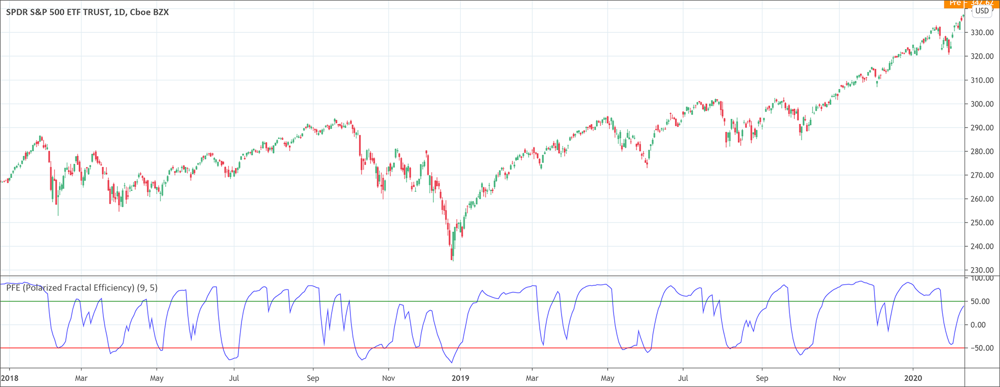</img>

## Formula

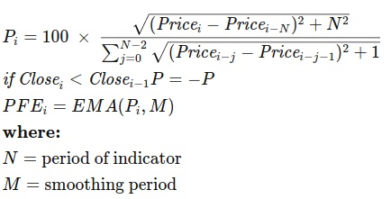</img>

## How to interpret the PFE indicator? 
The Polarized Fractal Efficiency measures the effectiveness of the price movement and the strength of a trend with the help of the zero lines. The PFE values further from the zero line indicate a more effective price movement and a stronger trend. The PFE prices exceeding zero indicate a bullish trend in the market. The higher PFE values suggest an effective upward price movement. A trend is 100% effective only when the PFE indicator shows it at a right angle and vice versa. Conversely, the PFE values lower than zero suggest a bearish trend in the market. The lower PFE values indicate a stronger and effective downtrend in the market. 

## How to trade with the Polarized Fractal Efficiency indicator?
A reversal in the direction of the PFE indicator and its movement away from zero is generally considered a buy signal. Traders should close their trading position when the PFE values reach a peak above zero. On the other hand, the PFE indicator issues a sell signal when the PFE values fall from peak to zero. Traders should cover short positions by buying after the PFE indicator forms a new low. 

However, it is important to note that every analysis tool has certain weaknesses and the Polarized Fractal Efficiency is no exception. It helps greatly when combined with other technical analysis tools such as the Simple Moving Average, Stochastic Oscillator, price action analysis, etc. Moreover, money management is also extremely important because almost every tool issues false signals and traders may lose a lot. 

## PFE Example
The PFE indicator generated a buy signal in American Tower Corporation (AMT) on July 30, 2019, when it reversed from its minimum near to zero. Subsequently, the indicator generated a signal to close positions when it reached its peak above zero on Aug. 12, 2019. Those who traded the PFE indicator in this particular example made $13.34 per share, or 6% ($221.02 sell price, $207.68 buy price). As with all technical indicators, traders should use PFE in conjunction with other forms of technical analysis. 

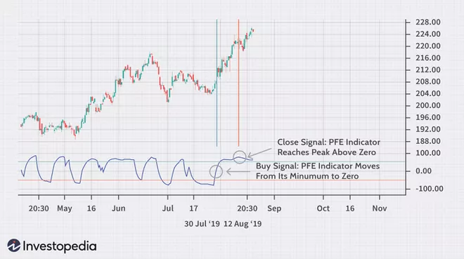</img>

# Relative Momentum Index (RMI)
- Relative Momentum Index (RMI) indicator tries to improve the reading of the RSI indicator.
- It calculates a ratio of upwards changes to downwards changes in prices over N-period bars.
- It helps to determine the overall trend in the market.

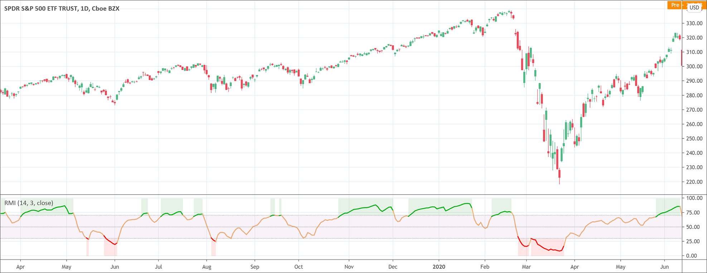</img>

## Formula

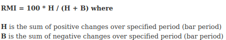</img>

## What does the RMI tell traders?
The RMI indicator is a classical momentum indicator that conveys useful information to the traders and technical analysts. It helps traders to recognize possible trading opportunities. During a downtrend, it indicates the continuation of the downtrend when the RMI values rise above 70%. The level between 70 and 90 is generally considered overbought. When the RMI values further increase, the chance of decline increases. During an uptrend, when the RMI values rise above 30%, it is an indication of the end of the price correction and an upcoming uptrend. The level between 10 and 30 is generally regarded as oversold. 

- But when the RSI rises above 70 from below.
- Close a long position when the RSI falls below 70.
- Go short when the RSI falls below 30.
- Cover shorts when the RSI rise above 30 from below.

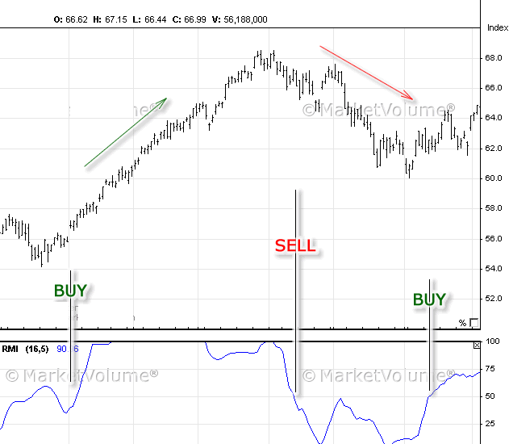</img>

# Trend Intensity Index (TII)
- The Trend intensity index (TII) indicator measures the strength of a trend in the market.
- It compares the price of the last 30 days to the 60-day moving average.

M.H. Pee developed the Trend intensity index (TII) indicator to measure the strength of a trend in the market. It uses the current 60-day moving average for the measurements. TII looks at the proportion of prices of prior 30 days being above or below today’s 60-day moving average. The purpose of the TII indicator’s measurements is to gauge the future price trend movement. 

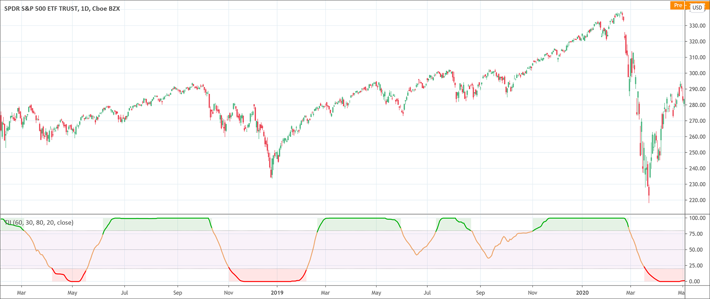</img>

## Formula
1. First, calculate Simple Moving Average (SMA) of the closing prices: 
SMA = SMA(Close, n) 
There n is SMA bar period
2. Then, calculate Positive and Negative deviation of the closing prices from SMA calculated in step 1 
Dev = Close – SMA 
IF Dev > 0 then posDev = Dev 
IF Dev < 0 then negDev = abs(Dev)//absolute value 
3. After that, calculate sum of Positive and Negative deviations for the period. And it is twice smaller than period used for SMA calculation. For instance, if you calculated 60-bar SMA then the sum is calculated for 30 bars only. 
SDpos = sum(posDev, m) 
SDneg = sum(negDev, m) 
Here, m is period twice smaller than n (period used to calculate SMA): m = n/2. If the bar period number (n) is not even then m = (n+1)/2.
4. Calculate finally Trend Intensity index (TII) 
TII = 100 * (SDpos) / (SDpos + SDneg)
5. Lastly, calculate second line (Signal line) as EMA applied to TII 
Signal Line = EMA(TII, k) 
There k is bar period of EMA applied to TII

## How to interpret the trend intensity index indicator 
The trend intensity index indicator ranges between two values 0 and 100. The value beyond 50 indicates a bullish trend while the TII indicator’s values below 50 indicate a bearish trend. The distance from the 50 points is also a measure of the trend’s strength. The TII values near 80 mean a strong bullish trend while the values near 20 suggest a strong bearish trend. 

## How to use the TII indicator for trading?
As we have already discussed that the TII indicator indicates the strength of the current trend in the market. The market is more likely to continue in the current direction when the TII indicator indicates a strong current trend. Traders can enter the market when the current trend is very strong and they should continue until the TII shows signs of a potential reversal of the current trend. Once the TII indicates a potential reversal, traders should leave their position and should get ready to initiate the trade in the opposite direction. 

The TII buy strategy involves the following steps.
- The signal line crossing from above the TII line.
- The price is above the SMA 50 while the TII value is near 20.
- Place stop-loss near swing low.
- Take profit may also be the same size as a stop-loss. 

The TII sell strategy involves the following steps.
- The signal line crossing from below the TII line.
- The price is below the SMA 50 while the TII value is near 80.
- Place stop-loss near swing high.
- Take profit may also be the same size as a stop-loss.

Moreover, if traders want to enter a long position in the next trading session, the TII should be above 80. Conversely, if traders want to enter a short position in the next trading session, the TII needs to be below the 20 points mark. However, the trend intensity index indicator is a quite simple indicator and it is always recommended to use it in conjunction with any other technical analysis tools. It will always be a fruitful strategy to enter the trade when the signals of each indicator confirm each other. 

# Arnaud Legoux Moving Average (ALMA)
- The Arnaud Legoux moving average (ALMA) indicator filters out noise from the market to help the trend stand out.
- It uses Moving Averages to filter minor variations from the price

The ALMA is a technical analysis tool that aims to give investors and traders a more reliable trading signal by reducing the noise that can interfere with traditional moving averages. It eliminates the small fluctuations in an asset price to make the trend clearer.

The ALMA reduces price lag and creates a smoother line than other moving averages. Rather than a straightforward moving average for a certain period, it applies a moving average twice – from left to right as well as right to left.

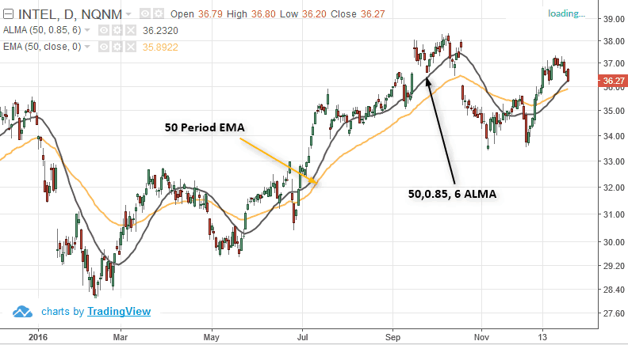</img>

## Formula

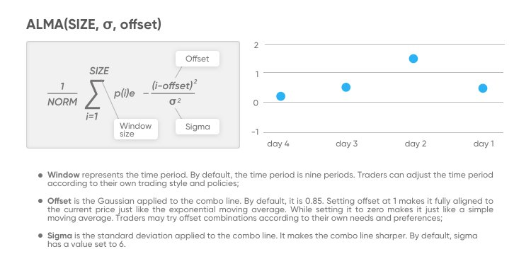</img>

## How to trade using the Arnaud Legoux Moving Average indicator
- **Support/resistance.** The Arnaud Legoux Moving Average indicator can be used to identify support and resistance levels. How does it work? When the gap between the price and the ALMA widens or narrows, you can trade breakouts from the trend and retracements. The ALMA can also confirm overbought or oversold conditions signalled by stochastics.
- **Other moving averages.** Some traders use ALMAs alongside EMAs to find buy and sell signals. For example, using the 50-day ALMA with 5-day and 10-day EMAs would indicate a buy signal with the price above the ALMA and the EMAs intersecting. Conversely, an asset price below the ALMA and the EMAs intersecting would give a sell signal.
- **Relative strength index (RSI).** By using the ALMA with the relative strength index, which indicates momentum. If the RSI shows an asset price is overbought and the ALMA moves above the price, the chart would be giving a strong sell signal. And if the RSI is oversold and ALMA below the price, it would be a strong buy signal.
- **Parabolic stop and reverse (SAR).** Traders can also use the ALMA in combination with the Parabolic SAR. If the asset price is above the ALMA and the Parabolic SAR is below the high price, it would indicate a buy signal, while an asset price below the ALMA with the Parabolic SAR above the high price would give a sell signal.
- **Bollinger bands.** The ALMA can be used alongside Bollinger bands, which move in line with market volatility. If a price reaches the lower Bollinger band and is above the ALMA, it indicates the asset is a buy. And if the price reaches the upper band with the ALMA above the price, it presents a sell signal. 

# Envelope Channel Indicator
- An envelope refers to two lines plotted above and below a security’s price.
- It is drawn by drawing a Simple Moving Average and 2 SMA around it at a fixed distance.

The Envelope or envelope channel indicator is a technical analysis tool. It helps to spot the upper and lower bands of the trading range. In technical analysis, an envelope refers to trend lines appearing on the trading chart both above and below the current price. A simple moving average and a pre-determined distance above and below the moving average generate the upper and lower bands of an envelope. It spots the upper and lower bands by drawing two moving average envelopes on the trading chart. It lifts up the first moving average envelope a certain distance above and shifts the other moving average envelope a certain distance below.

The prices show the tendency of remaining within a certain range when the market conditions are normal. When the market conditions change, the prices have the potential to move above or below the envelope bands. This is the main idea behind the envelope channel indicator. Traders consider it a selling signal when the prices reach or go beyond the upper band. On the other hand, traders consider it a buying signal when the prices reach or go beyond the lower band. The envelope indicator also helps to spot extremely overbought and oversold market conditions.

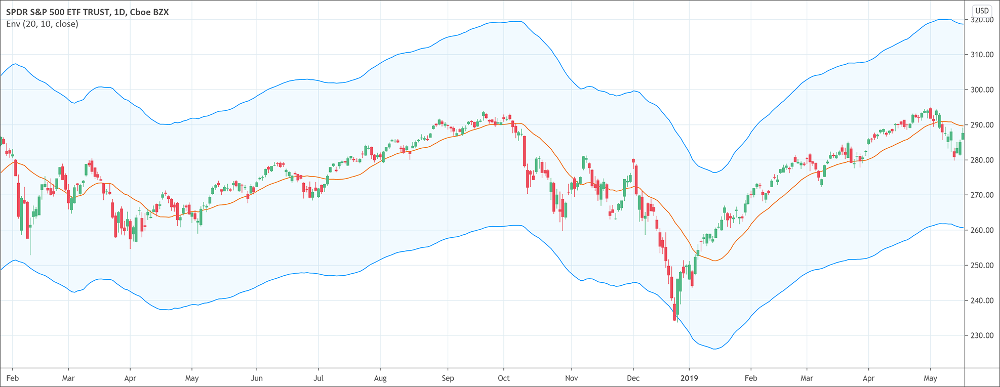</img>

## Formula
Upper envelope or upper band = (Simple moving average over a period) + (Simple moving average over a period × D^%)

Lower envelope or lower band = (Simple moving average over a period) – (Simple moving average over a period × D%)

*Where D is the deviation value showing the distance between the envelopes and moving averages. (e.g. 0.025)

## What does the envelope indicator tell traders? 
The envelope indicator tells many things to traders and is a useful technical analysis tool. It tells about the overbought/oversold market conditions and generates buying and selling signals. When the prices reach or cross the upper band, it indicates that the market condition of the security is overbought and it signals to sell. On the other hand, when the prices reach or cross the lower band, it suggests oversold market conditions and signals to buy. However, it is absolutely imperative for traders to use higher percentages to create envelope bands when they deal with securities with high volatilities. It helps greatly to avoid whipsaw trading signals. Conversely, lower percentages are enough for the securities with fewer volatilities to create enough trading signals.

## Trend identification 
- Moving averages allow us to see the broader pattern of the market by smoothing the price fluctuations. A line of moving average sloping upwards indicates prices being trending upwards and vice versa. Similarly, envelope indicator can also help us to confirm the trend. If bands of the envelope indicator are sloping upwards, it confirms an uptrend and vice versa. 
- Prices breaking above the upper band signal a potential start of a new uptrend. Conversely, when the prices break below the lower band, it is a signal of a possible new downtrend. However, traders should be alert because all breakthroughs of the prices do not lead to new trends. 

# Advance/Decline Line (A/D Line)
The advance/decline line (A/D) is a technical indicator that plots the difference between the number of advancing and declining stocks on a daily basis. The indicator is cumulative, with a positive number being added to the prior number, or if the number is negative it is subtracted from the prior number.

The A/D line is used to show market sentiment, as it tells traders whether there are more stocks rising or falling. It is used to confirm price trends in major indexes, and can also warn of reversals when divergence occurs. 

- The advance/decline line (A/D) is a breadth indicator used to show how many stocks are participating in a stock market rally or decline.
- When major indexes are rallying, a rising A/D line confirms the uptrend showing strong participation.
- If major indexes are rallying and the A/D line is falling, it shows that fewer stocks are participating in the rally which means the index could be nearing the end of its rally.
- When major indexes are declining, a falling advance/decline line confirms the downtrend.
- If major indexes are declining and the A/D line is rising, fewer stocks are declining over time, which means the index may be near the end of its decline.

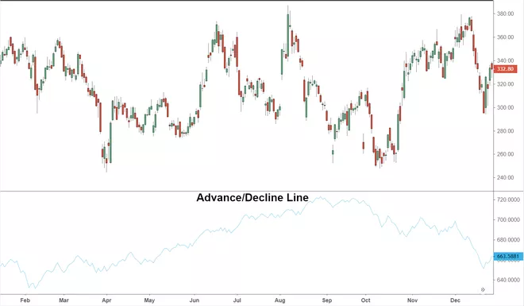</img>

## Formula

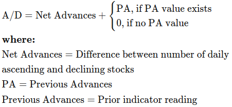</img>

1. Subtract the number of stocks that finished lower on the day from the number of stocks that finished higher on the day. This will give you the Net Advances.
2. If this is the first time calculating the average, the Net Advances will be the first value used for the indicator.
3. On the next day, calculate the Net Advances for that day. Add to the total from the prior day if positive or subtract if negative.
4. Repeat steps one and three daily.

##  What Does the Advance/Decline (A/D) Line Tell You?
The A/D line is used to confirm the strength of a current trend and its likelihood of reversing. The indicator shows if the majority of stocks are participating in the direction of the market. 

If the indexes are moving up but the A/D line is sloping downwards, called bearish divergence, it's a sign that the markets are losing their breadth and may be about to reverse direction. If the slope of the A/D line is up and the market is trending upward, then the market is said to be healthy.

Conversely, if the indexes are continuing to move lower and the A/D line has turned upwards, called bullish divergence, it may be an indication that the sellers are losing their conviction. If the A/D line and the markets are both trending lower together, there is a greater chance that declining prices will continue. 

# Hull Moving Average Indicator
- The Hull moving average indicator or HMA indicator helps to identify the current trend in the market.
- It is an extremely fast and smooth moving average.

The Hull moving average indicator or HMA indicator helps to identify the current trend in the market. Allan Hill discovered the HMA indicator. It differs from the simple moving averages in the sense that its curve is more smooth. It strictly follows the price activity because the purpose of the HMA indicator is to reduce the lag between itself and the price. That is the reason that it is an extremely fast and smooth moving average indicator. The HMA indicator suits well for the middle to long-term trading. 

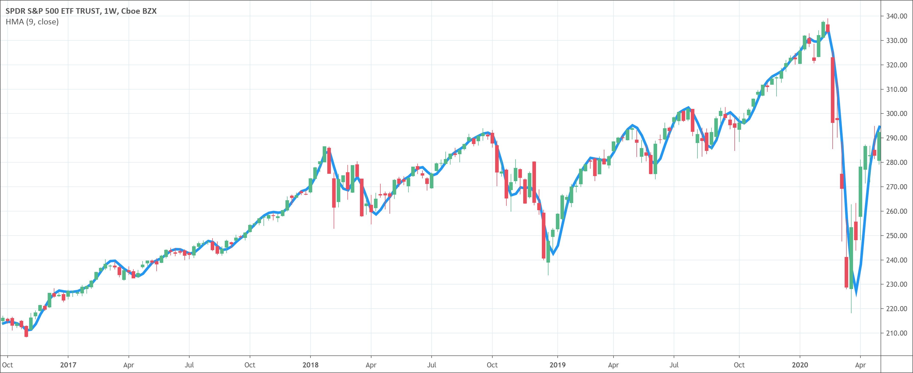</img>

## Formula

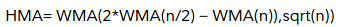</img>

1. Calculate a Weighted Moving Average with period n / 2 and multiply it by 2
2. Calculate a Weighted Moving Average for period n and subtract if from step 1
3. Calculate a Weighted Moving Average with period sqrt(n) using the data from step 2

## What does the Hull moving average tell traders?
The Hull moving average indicator is an indicator that is very easy to use. It gives traders and technical analysts an accurate reading about the current trend in the market. The higher movement of the blue line on the chart, which shows the HMA, points to an uptrend in the market. On the other hand, the lower movement of the blue line indicates a downtrend in the market. The rapid change in the direction of the line indicates a sideways trend.

## How to trade with the indicator?
- If the blue line starts to move up, it is time to buy. Traders have a choice to enter immediately or place a buy stop pending order slightly above the high of the candlestick that causes the HMA line to move up.
- On the other hand, if the blue line starts to move down, it is the best time to sell. Traders can either enter the selling market or place a sell stop just below the low of the candlestick that causes the HMA to move low.
- The Hull moving average crossover is another best strategy that works well with the Hull moving average indicator. An uptrend is there if the fast HMA crosses the slower HMA on the upside. Conversely, a downtrend is there if the fast HMA crosses the slower one on the downside. Traders should wait for the crossover to initiate a trade. It is a prudent strategy to place a buy stop order just above the high of the confirmation candlestick and to place a stop-loss a few points below its low. For a sell strategy, it is always wise to place a sell stop just below the low of the confirmation candle and place stop-loss a few points above the high of that candle.

# Schaff Trend Cycle (STC) Indicator
- The Schaff Trend Cycle (STC) indicator is an oscillator.
- It helps to identify the market trends with improved speed and accuracy.

The most interesting thing of the Schaff trend cycle indicator is that it combines leading and lagging indicators. Schaff assumed that the forex trends decelerate and accelerate in cycles. The unique blend of the stochastic and the MACD ensures that the resulting indicator will be more efficient in trend identification. The decreasing values of the STC indicator indicate the falling trend cycle while the prices being stable or may follow the cycle to the downside. On the other hand, the decreasing values of the STC indicator suggest an uptrend while prices being stable or may follow the cycle to the upside. The Schaff trend cycle indicator is popular for a general trading strategy. The strategy suggests buying when it surges above 25 level and sell when the signal lines go below the 75 level.

Doug Schaff invented the STC indicator in the 1990s. Schaff was the president and founder of FX Strategy. The STC indicator is a direct result of Schaff’s vast experience, more than 20 years, in technical analysis, exceptional understanding of the technical analysis and price actions, and trading skills in currencies. Since the release of all the information about the STC in 2008, it has become one of the widely used indicators in the technical analysis. Probably no one could have given this generation of traders and technical analysts a better intriguing and fascinating gift as Schaff did. The STC indicator is surely a masterstroke of a genius with a wealth of experience in his field.

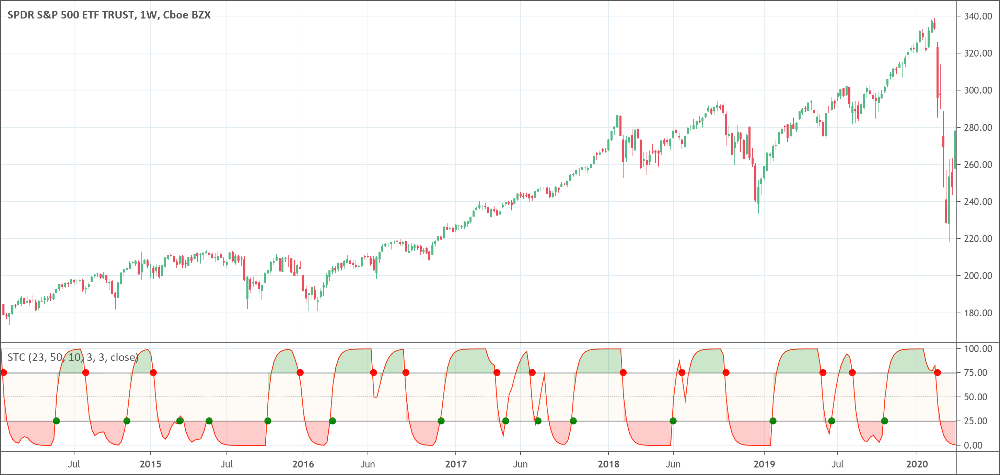</img>

## Formula

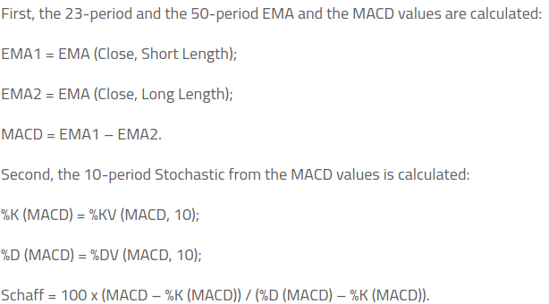</img>

## What does the Schaff Trend Cycle indicator tell traders? 
The Schaff trend cycle indicator tells traders about the prevailing trend in the market, buying and selling, overbought and oversold conditions, and pinpoints entry and exit points. It uses two thresholds to convey valuable information. The first threshold is at 25 and the second at 75. The crossing above the 25 line indicates an uptrend while the crossing below the 75 line indicates the downtrend. When the indicator lies between the two thresholds, it indicates that the trend is strengthening in either of the two directions. 

The STC indicator can only turn into a straight line when it is in the territory of the uppermost or lowermost points. When the STC indicator’s straight line is above 75 line, it means overbought market condition. On the other hand, if the straight line is below the 25 line, it indicates oversold market conditions. In both of these conditions, there is a strong possibility of a trend reversal, however, the indicator does not provide an exact timeline. 

## How to trade with the Schaff Trend Cycle indicator? 
The STC indicator is a straightforward indicator that is useful for the trading of all types of assets and all timeframes. Technical analysts and experts suggest entering a buying position when the STC goes above the 25 line because of the positive turn. Conversely, when the STC goes below the 75 line, entering a selling position is a prudent strategy. However, the opinions of the technical analysts and experts vary on when to close the deal. The majority of them believe that it is viable to close when the STC indicator turns into a straight line. However, it is crucial to move ahead only if you have confirmation. Experts suggest using other indicators that are similar in function to the STC indicator. 

# Trendlines
- Trendlines indicate the best fit of some data using a single line or curve.
- A single trendline can be applied to a chart to give a clearer picture of the trend.
- Trendlines can be applied to the highs and the lows to create a channel.
- The time period being analyzed and the exact points used to create a trendline vary from trader to trader.

Trendlines are an indicator that helps to identify and confirm trends. It is a simple but efficient tool to measure an increase in share price over a period of time. Trend lines indicate acceleration or deceleration of a trend in the market. It is different from the rest of the indicators that traders have to use their own mind instead of relying on formula calculations done on a computer. The trendline gives a clear picture of a current trend through a single line on a chart that is the greatest advantage of using trendline. 

The working of the trendline is simple. It connects two price points at least and may extend further forward to indicate support and resistance areas. A positive slope of the trendline shows support price action that means an increase in net demand. We have a bullish trend until the price action stays above the trendline. On the other hand, a negative slope of the lines indicates resistance to the price action that means an increase in net supply. The bearish trend remains in the market until the price action remains below the trendline. 

The price continues to retest a sloped line several times to break it. We may have a reversal in trend after the price is successful to break the line. It is interesting to note that a trendline gets stronger when there are more points to connect. Now, the trendline strategies can vary because they depend on the distance between the connected price points and also on the decision whether we use wicks or candle bodies to connect. However, all trendlines are destined to break. 

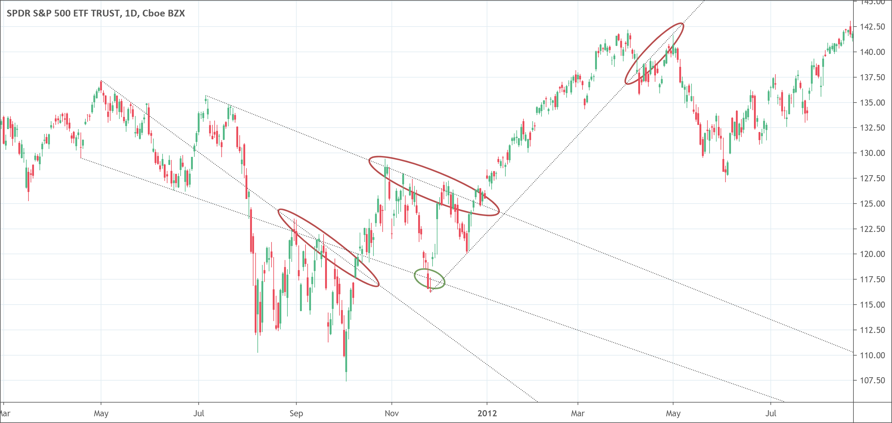</img>

## What does trendlines tell traders? 
A trendline is a magnificent tool that has the potential to clearly indicate a trend as well as sideways movement. A trendline works by connecting the lowest point of a downtrend to the highest point of an uptrend. The connection of low points with highs results in an ascending line on a chart indicating an upwards trend of prices. The trendline can also indicate the angle of ascent, the strength of the prevailing trend, and the strength of the price movement when a trendline is drawn to connect the individual high points. 

Furthermore, when the price decreases, the high points also fall. Decreasing prices result in a descending line indicating a fall in prices. The descending angle and the strength of the downward price movement are indicated by drawing a line along with the swing lows. 

Generally, a single line remains in action but there is also a choice to draw multiple trendlines indicating price movements over several periods of time. This option of drawing trendlines whenever possible suits new traders. It allows them to keep themselves updated about the overall trend in the market, any corrections in that overall trend, and the small trends. 

## Example Using
Trendlines are relatively easy to use. A trader simply has to chart the price data normally, using open, close, high and low. Below is data for the Russell 2000 in a candlestick chart with the trendline applied to three session lows over a two month period. 

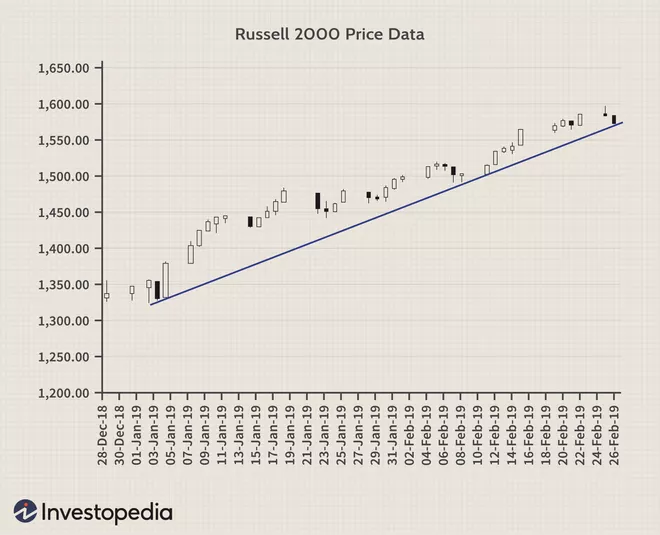</img>

The trendline shows the uptrend in the Russell 2000 and can be thought of as support when entering a position. In this case, trader may choose enter a long position near the trendline and then extend it into the future. If the price action breaches the trendline on the downside, the trader can use that as a signal to close the position. This allows the trader to exit when the trend they are following starts to weaken.

Trendlines are, of course, a product of the time period. In the example above, a trader doesn't need to redraw the trendline very often. On a time scale of minutes, however, trendlines and trades may need to be readjusted frequently. 

# Chande Kroll Volatility Stop Indicator
- The Chande Kroll Stop indicator is made of two lines.
- It automatically allows placement of protective stops based on both upward and downward volatility.

The Chande Kroll Stop indicator automatically allows placement of protective stops based on both upward and downward volatility.

As a result of this, the Chande Kroll Stop indicator depends on the Average True Range that makes it possible for traders to measure the volatility of parity. Volatility movements will not affect the stop of this indicator. This can only happen if the trend turns around.

The Chande Kroll Stop indicator comes with a long stop line (blue) and a shortstop line (red). You should place the stop under (and on) the high/low of the last “n” bars. The difference corresponds to the Average True Range on “N” bars.

The Chande Kroll Stop protects profits by making it possible for a trade to remain open, as long as it is moving in the right direction. Traders don’t have to manually reset the trailing stop because it is flexible, just as the fixed stop-loss. Close your long position should once prices drop below the blue line. On the other hand, close the short positions should if prices move above the red line.

Lastly, you can use the Chande Kroll Stop to detect trend changes. You can discover a new uptrend when the blue line crosses above the red line. You can discover a new downtrend when the red line crosses below the blue line.

The general concept for these indicators is to keep your position open as long as it moves in the right direction. These trailing stops are flexible, automatically tracking price and don’t have to reset manually. Close your positions should if the price goes against the trade by a specified amount or percentage. 

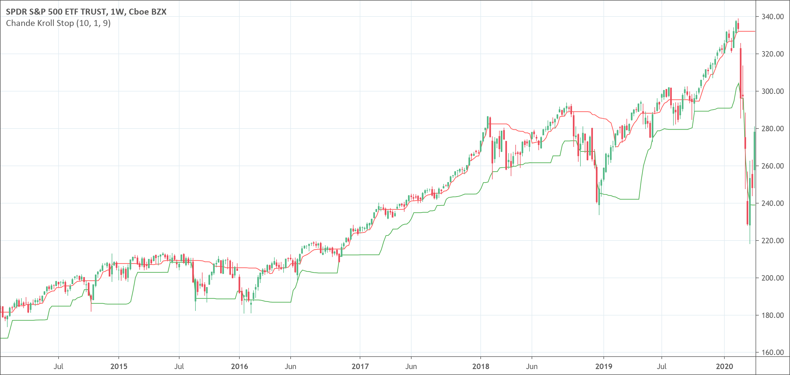</img>

## Formula
Stop on purchase = Highest of Stop preliminary to purchase on Y periods

Where, preliminary purchase stop = Highest of X periods – (Coefficient * Average True Range of X periods)

Stop sale = Lowest of Stop preliminary sale over Y periods

Where stop preliminary sale = Low of X periods + (Coefficient * Average True Range of X periods)

First, the Average True Range of the last 10 bars is calculated by applying the arithmetic mean formula. For a long stop, the highest high of the last 10 bars is determined. A preliminary stop is then calculated by subtracting a 3 x ATR multiple from the highest high. For a short stop, the lowest of the last 10 bars is determined. A preliminary short stop is then calculated by adding a 3 x ATR multiple to the lowest low.

### **Indicators used**
- **ATR period:** This parameter determines the time for calculating the volatility of the value and the preliminary stop level. The author uses 10-period ATR.
- **Stop period:** This parameter determines the calculation time of the last stop. The author uses 20 periods for this.
- **Multiplier or Coefficient:** It determines the distance at which the stop will be apart from the prices. For instance, the multiplier of 3 means that you will place the stop at 3 times the average volatility of the value.

## Two lines make up the Chande Kroll Stop
- The level of stops for long positions 
This stop is the lowest reached during the time. If the price goes in your direction, the stop will follow. But if the price drops, the stop will not change. 

- The level of stops for short positions 
This is the highest stop reached during the time. If the price goes in your direction, the stop will follow. But if the price goes down, the stop will not change.

## What the Chande Kroll Stop indicator tells traders**
As its name suggests, traders can automatically set the level of protection to stop up or down with this indicator. At the same time, it takes into account the underlying volatility of every security. 

Two lines make up the indicator; the stop level for long positions and the stop level for short positions. The highest attained by the value is the stop for long positions. Therefore, when the price progresses in your direction the stop goes up and remains fixed when the value drops. 

In the same way, the stop level for short positions, known as a short position. Its calculation depends on the lowest reached by the value. The use of the Average True Range, measures the volatility of each security. So, the stop allows traders to locate the maximum stop level, placed outside the price levels. Sudden market movements can affect it.

This is a trend-following indicator that detects the stop-loss for a short or long position by using a variation on directional movement. 

The average true range of the volatility of an instrument can calculate it. Place the stops under (and on) the high (low) of the last “n” bars. The variation is proportional to the Average True Range on the bars.

- Sell when the price crosses lower than both lines
- Buy when the price crosses higher than both lines
- Trade when the two lines cross each other

## How to use the Chande Kroll Stop on the stock market?
Generally, use the Chande Kroll Stop indicator to manage stops and open new positions. However, traders can use it to detect changes in trend. You can see a new upward trend when the blue line crosses over the red line. Also, you can see a new downtrend when the red line goes lower than the blue line.

## Example
- The long stop is the lowest value of the last 20 preliminary long stops
- The short stop is the highest value of the last 20 preliminary short stops

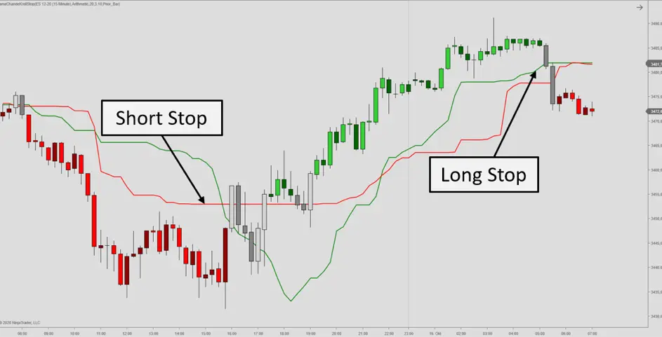</img>

# Williams Fractal Indicator
- A bullish fractal occurs when there is a low point with two higher low bars/candles on each side of it.
- A bearish fractal occurs when there is a high point with two lower high bars/candles on each side of it.
- An up arrow marks the location of a bearish fractal, while a down arrow marks the location of a bullish fractal.
- Arrows are drawn above or below the middle bar (high or low point), even though the pattern is five bars. There is no way a trader could enter a trade at the arrow because the arrow only occurs if the next two bars create the pattern.
- If someone were to trade fractal signals, the entry would be the open price of the third bar after the arrow.

The fractal indicator is based on a simple price pattern that is frequently seen in financial markets. Outside of trading, a fractal is a recurring geometric pattern that is repeated on all time frames. From this concept, the fractal indicator was devised. The indicator isolates potential turning points on a price chart. It then draws arrows to indicate the existence of a pattern. The bullish fractal pattern signals the price could move higher. A bearish fractal signals the price could move lower. Bullish fractals are marked by a down arrow, and bearish fractals are marked by an up arrow. 

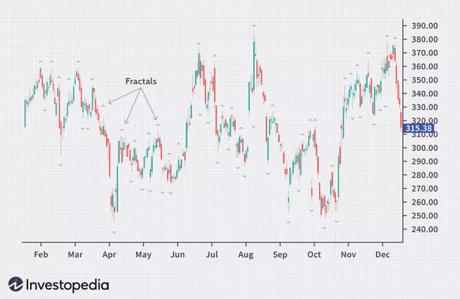</img>

## Formula

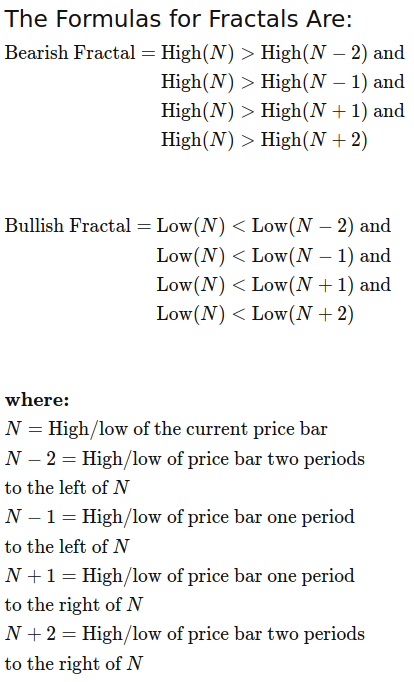</img>

1. Isolate a high/low (N) point on the chart.
2. If there are two lower highs to the left of the high or two higher lows to the left of the low (N-2 and N-1), there is a possible pattern. The pattern still needs two more bars on the right to confirm.
3. If two lower highs occur after the high then a bearish fractal is complete (N+1 and N+2). If two higher lows occur after the low a bullish fractal is complete.

##  What the Fractal Indicator Tells You
The fractal indicator will generate signals frequently. The existence of a fractal isn't necessarily important since the pattern is so common.

The fractal is indicating the possibility of a trend change. This is because fractals are essentially showing a "U-shape" in price. A bearish fractal has the price moving upward and then downward, forming an upsidedown U. A bullish fractal occurs when the price is moving down but then starts to move up, forming a U.

Because fractals occur so frequently, and many of the signals aren't reliable entry points, fractals are typically filtered using some other form of technical analysis. Bill Williams also invented the alligator indicator which isolates trends. By combining fractals with trend analysis, a trader may decide to only trade bullish fractals signals while the price trend is up. If the trend is down they may take only short trades on bearish fractal signals, for example.

Fractals could also be used with other indicators, such as pivot points or Fibonacci retracement levels. A fractal is only acted on if it aligns with one of these other indicators and potentially the longer-term price direction. For example, assume a stock is trending higher. The price is pulling back and reaches a 50% Fibonacci retracement level. Since the trend is up, and the price is near a Fibonacci retracement level, the trader will take a trade if a bullish fractal forms. 

## How to use fractals in trading
- For detection of potential stop-loss levels
- They can serve as support and resistance levels
- To know the highs and lows
- Signal potential entry points
- Fibonacci retracement levels uses them

# Williams Alligator Indicator
- The Williams Alligator indicator is a technical analysis tool that uses smoothed moving averages.
- The indicator uses a smoothed average calculated with a simple moving average (SMA) to start.
- It uses three moving averages, set at five, eight, and 13 periods. The three moving averages comprise the Jaw, Teeth, and Lips of the Alligator.
- The indicator applies convergence-divergence relationships to build trading signals, with the Jaw making the slowest turns and the Lips making the fastest turns

Legendary trader Bill Williams, an early pioneer of market psychology, developed the trend-following Alligator indicator, which follows the premise that financial markets and individual securities trend just 15% to 30% of the time while grinding through sideways ranges the other 70% to 85% of the time. Williams believed that individuals and institutions tend to collect most of their profits during strongly trending periods.

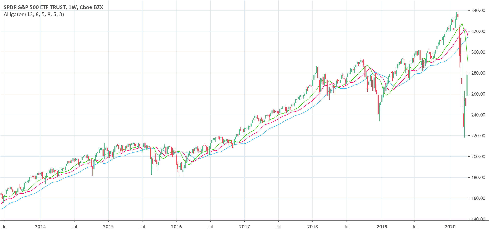</img>

## Formula

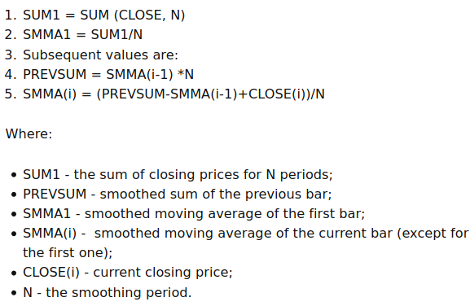</img>

1. Jaw (blue line): Starts with the 13-bar SMMA and is smoothed by eight bars on subsequent values.
2. Teeth (red line): Starts with the eight-bar SMMA and is smoothed by five bars on subsequent values.
3. Lips (green line): Starts with the five-bar SMMA and is smoothed by three bars on subsequent values.

## Example Using

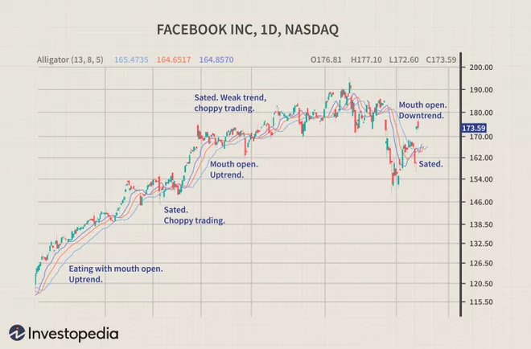</img>

Facebook, Inc. (FB) has an alligator "awakening" signal near the bottom left of the chart, then embarks on a strong uptrend that shows an alligator "eating with open mouth" phase. On the rise, the price drops to the Jawline, but the indicators do not cross each other. The trend remains up. An alligator "sated" sell signal arrives when the Lips cross below the Teeth and Jawlines and lines intertwine as the price moves sideways.

The alligator "sleeps" for some time before a new awakening signal goes off, and the uptrend commences with another "eating with an open mouth" phase. The price continues to rise but in a weak fashion. Then there is a sell-off and the mouth opens to the downside, signaling a downtrend. The lines cross again, signaling that the alligator is "sated." Until the mouth opens again, it remains on the sidelines. 

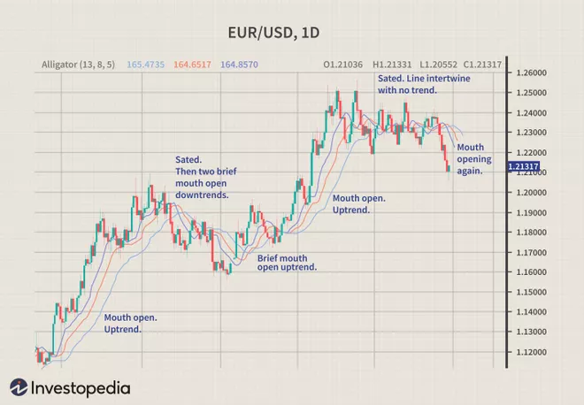</img>

In the lower-left of the chart, the Alligator opens up, and an uptrend remains in place for some time. The lines then cross, and two small downtrends develop. This is followed by a buy signal to the upside, which results in a brief uptrend. As the price pulls back, the Alligator is sated, and then it opens again for a big uptrend. This is followed by an extended sideways period, in which the indicator lines crisscross back and forth. This is a sleeping phase, and most traders are best to stay away. At the far right of the chart, the Alligator is opening its mouth again, or awakening, signaling a downtrend.

Bill Williams' Alligator indicator provides a useful visual tool for trend recognition and trade entry timing, but it has limited usefulness during choppy and trendless periods. Market players can confirm buy or sell signals with a moving average convergence divergence (MACD) or another trend identification indicator. 

# Relative Vigor Index (RVI)
- The Relative Vigor Index (RVI) is a technical momentum indicator.
- The RVI oscillates across a pre-determined center line rather than a banded trend.
- Divergences between the RVI indicator and price suggest there will be a near-term change in the trend.

The Relative Vigor Index (RVI) is a momentum indicator used in technical analysis that measures the strength of a trend by comparing a security's closing price to its trading range while smoothing the results using a simple moving average (SMA).

The RVI's usefulness is based on the observed tendency for prices to close higher than they open during uptrends, and to close lower than they open in downtrends. 

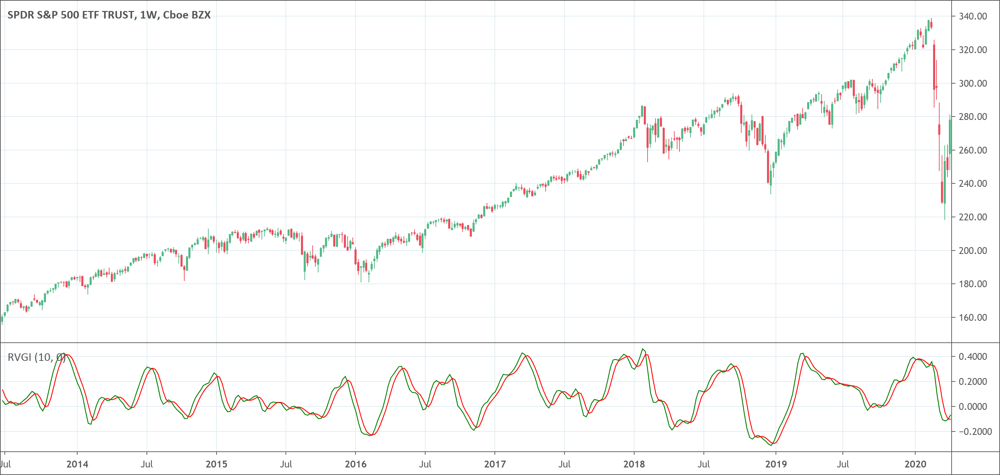</img>

## Formula

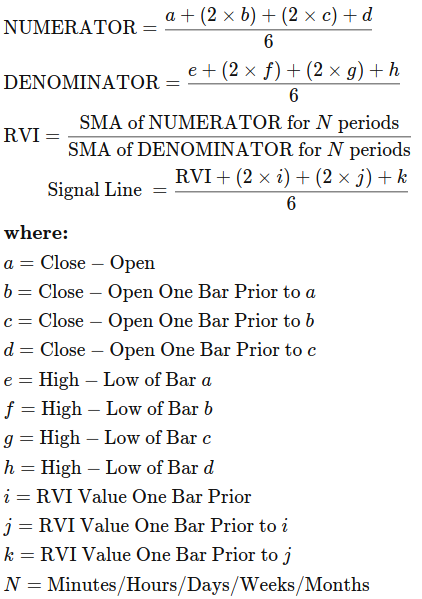</img>

1. Choose an N period to examine.
2. Identify the open, high, low, and close values for the current bar.
3. Identify the open, high, low, and close values for lookback periods prior to the current bar.
4. Calculate SMAs for NUMERATOR and DENOMINATOR over the N period.
5. Divide NUMERATOR value from DENOMINATOR value.
6. Place the result in the signal line equation and plot it on a graph.

##  What Does the Relative Vigor Index (RVI) Tell You?
The RVI indicator is calculated in a similar fashion to the stochastics oscillator but it compares the close relative to the open rather than comparing the close relative to the low. Traders expect the RVI value to rise as the bullish trend gains momentum because, in this positive setting, a security's closing price tends to be at the top of the range while the open is near the low of the range.

The RVI is interpreted in the same way as many other oscillators, such as moving average convergence-divergence (MACD) or the relative strength index (RSI). While oscillators tend to fluctuate between set levels, they may remain at extreme levels over a prolonged period of time so that interpretation must be undertaken in a broad context to be actionable.

The RVI is instead a centered oscillator and not a banded (trend-following) oscillator, which means that it's typically displayed above or below the price chart, moving around a center line rather than the actual price. It's a good idea to use the RVI indicator in conjunction with other forms of technical analysis in order to find the highest probability outcomes. 

## Example of using
- **RVI Divergences:** Divergence between the RVI indicator and price suggests there will be a near-term change in the trend in the direction of the RVI's trend. So, if a stock price is rising and the RVI indicator is falling, it predicts the stock will reverse over the near term.
- **RVI Crossovers:** Like many oscillators, the RVI has a signal line that's often calculated with price inputs. A crossover above the signal line is a bullish indicator, while a crossover below the signal line is a bearish indicator. These crossovers are designed to be leading indicators of future price direction.

# Mass Index Indicator
- The Mass Index indicator helps traders determine trend reversals.
- It examines the difference between low and high prices in a security over a period.
- It calculates with the exponential moving average (EMA) of price over a nine-days period and the exponential moving average of this average, and adding the ratio of these two over a given number of days (usually 25).

Mass index is a form of technical analysis that examines the range between high and low stock prices over a period of time. Mass index, developed by Donald Dorsey in the early 1990s, suggests that a reversal of the current trend will likely take place when the range widens beyond a certain point and then contracts.  

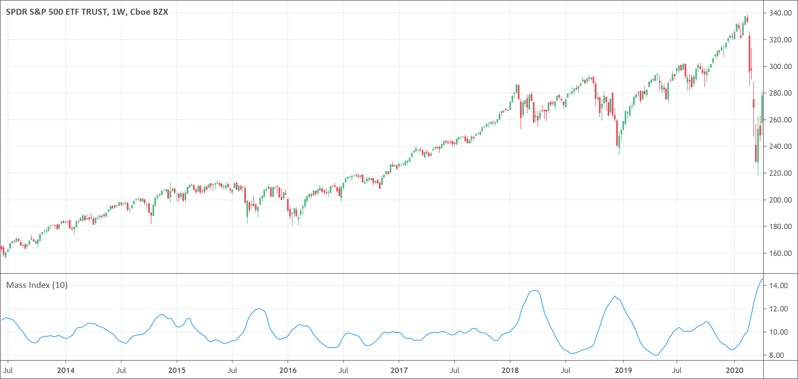</img>

## Formula

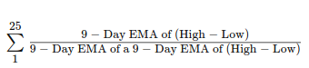</img>

To determine the mass index, first calculate the nine-day exponential moving average (EMA) of the range between the high and low prices for a period of time—typically 25 days. Then divide this figure by the nine-day exponential moving average of the moving average in the numerator. 

1. Calculating a nine-day exponential moving average (EMA) of the difference between high and low prices for any time.
2. Calculating a nine-day EMA of the moving average produced in step one
3. Dividing the EMA produced in step one by the EMA produced in step two
4. Adding the values in step three for the intended number of periods

## How to use the Mass Index Oscillator?
t is very simple to interpret the readings of this indicator. Donald Dorsey reveals that a reversal signal can be seen when there’s a reversal bulge. It is nothing more than following a combination of two trade signals.
- Max index value needs to go higher than 27 level
- Then wait for the index reading to drop less than the 26.5 level

The previous reading higher than the 27 level shows that the volatility expansion is at the extreme. You need to be nimble at this stage because the reversal signal is not yet completed. You can consider that the prevailing trend may end in a short time.

To determine a change in trend direction, the mass index reading has to drop lower than the 26.5 points. At this stage, the reversal bulge is completed and you can open a trade. But traders should use other technical tools to establish the direction of the reversal.

Usually, if a reversal bulge happens during a downtrend, it shows a bullish trend reversal. But if it happens during an uptrend, it indicates a bearish trend reversal.

# Pivot Point Indicator
- A pivot point is an intraday technical indicator used to identify trends and reversals mainly in equities, commodities, and forex markets.
- Pivot points are calculated to determine levels in which the sentiment of the market could change from bullish to bearish, and vice-versa.
- Day traders calculate pivot points to determine levels of entry, stops, and profit-taking.

A pivot point is a technical analysis indicator, or calculations, used to determine the overall trend of the market over different time frames. The pivot point itself is simply the average of the intraday high and low, and the closing price from the previous trading day. On the subsequent day, trading above the pivot point is thought to indicate ongoing bullish sentiment, while trading below the pivot point indicates bearish sentiment.

The pivot point is the basis for the indicator, but it also includes other support and resistance levels that are projected based on the pivot point calculation. All these levels help traders see where the price could experience support or resistance. Similarly, if the price moves through these levels it lets the trader know the price is trending in that direction. 

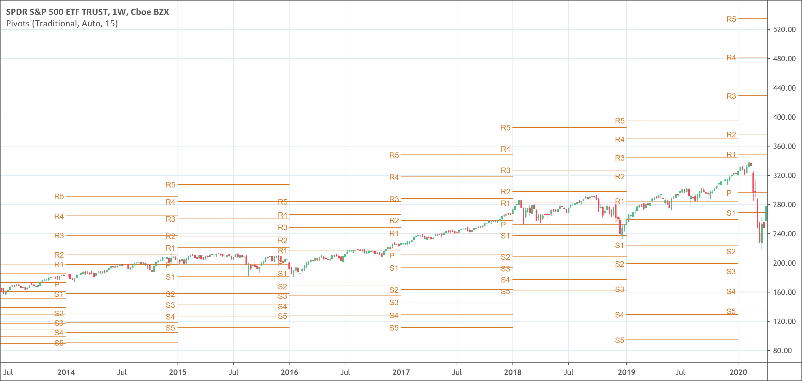</img>

## Formula

</img>

1. After the market closes, or before it opens the next day, find the day's high and low, as well as the close from the most recent previous trading day.
2. Sum the high, low, and close and then divide by three.
3. Mark this price on the chart as P.
4. Once P is known, calculate S1, S2, R1, and R2. The high and low in these calculations are from the prior trading day.

##  What Do Pivot Points Tell You?
Pivot points are an intraday indicator for trading futures, commodities, and stocks. Unlike moving averages or oscillators, they are static and remain at the same prices throughout the day. This means traders can use the levels to help plan out their trading in advance.

For example, traders know that if the price falls below the pivot point they will likely be shorting early in the session. Conversely, if the price is above the pivot point, they will be buying. S1, S2, R1, and R2 can be used as target prices for such trades, as well as stop-loss levels.

Combining pivot points with other trend indicators is common practice with traders. A pivot point that also overlaps or converges with a 50-period or 200-period moving average (MA), or Fibonacci extension level, becomes a stronger support/resistance level. 

## Pivot Point levels
- Basic Pivot Level (PP) – It is the middle and basic pivot point on the chart
- Resistance 1 (R1) – It is the first pivot level above the basic pivot level
- The Resistance 2 (R2) – The second pivot level above the basic pivot point, and the first above R1
- Resistance 3 (R3) – The third pivot level above the basic pivot point, and the first above R2
- Support 1 (S1) – It is the first pivot level below the basic pivot point
- The Support 2 (S2) – The second pivot level below the basic pivot point and the first below S1
- Support 3 (S3) – The third pivot level below the basic pivot, and the firs below S2

## How to trade with the indicator
### **The indicator is usable on all the timeframes**
They are technical indicators that show an average of the high, low, and ending prices from the previous trading day. Traders can use it to find probable support/resistance levels.

Use the hourly, daily, monthly, and weekly pivot points to locate possible support/resistance levels and increase your trading consistency.

### **How to use the Pivot Point indicator on the different timeframes**
The pivot point indicator for 1-, 5-, 10- and 15-minute patterns make use of the high, low, and close of the prior day. That is to say that pivot points for intraday charts today would be based on the high, low, and close of yesterday. Pivot points don’t change once they are set. They remain in play throughout the day.

Pivot point oscillators for 30-, 60- and 120-minute patterns use the high, low, and close of the prior week. These calculations depend on calendar weeks. At the beginning of the week, the pivot points remain constant for the whole week.

# Ichimoku Cloud 
- The Ichimoku Cloud is composed of five lines or calculations, two of which comprise a cloud where the difference between the two lines is shaded in.
- The lines include a nine-period average, a 26-period average, an average of those two averages, a 52-period average, and a lagging closing price line.
- The cloud is a key part of the indicator. When the price is below the cloud, the trend is down. When the price is above the cloud, the trend is up.
- The above trend signals are strengthened if the cloud is moving in the same direction as the price. For example, during an uptrend, the top of the cloud is moving up, or during a downtrend, the bottom of the cloud is moving down.

The Ichimoku Cloud is a collection of technical indicators that show support and resistance levels, as well as momentum and trend direction. It does this by taking multiple averages and plotting them on a chart. It also uses these figures to compute a “cloud” that attempts to forecast where the price may find support or resistance in the future.

The Ichimoku Cloud was developed by Goichi Hosoda, a Japanese journalist, and published in the late 1960s.1 It provides more data points than the standard candlestick chart. While it seems complicated at first glance, those familiar with how to read the charts often find it easy to understand with well-defined trading signals. 

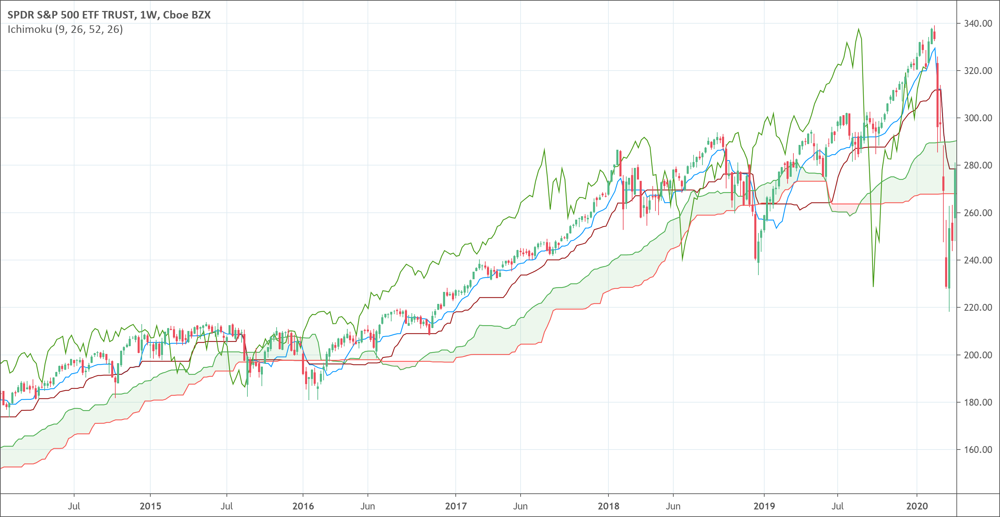</img>

## Formula

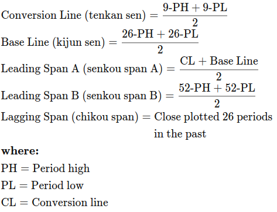</img>

1. Calculate the Conversion Line and the Base Line.
2. Calculate Leading Span A based on the prior calculations. Once calculated, this data point is plotted 26 periods into the future.
3. Calculate Leading Span B. Plot this data point 26 periods into the future.
4. For the Lagging Span, plot the closing price 26 periods into the past on the chart.
5. The difference between Leading Span A and Leading Span B is colored in to create the cloud.
6. When Leading Span A is above Leading Span B, color the cloud green. When Leading Span A is below Leading Span B, color the cloud red.
7. The above steps will create one data point. To create the lines, as each period comes to an end, go through the steps again to create new data points for that period. Connect the data points to each other to create the lines and cloud appearance.

##  What Does the Ichimoku Cloud Tell You?
The technical indicator shows relevant information at a glance by using averages.

The overall trend is up when the price is above the cloud, down when the price is below the cloud, and trendless or transitioning when the price is in the cloud.

When Leading Span A is rising and above Leading Span B, this helps to confirm the uptrend and the space between the lines is typically colored green. When Leading Span A is falling and below Leading Span B, this helps confirm the downtrend. The space between the lines is typically colored red in this case.

Traders will often use the Ichimoku Cloud as an area of support and resistance depending on the relative location of the price. The cloud provides support/resistance levels that can be projected into the future. This sets the Ichimoku Cloud apart from many other technical indicators that only provide support and resistance levels for the current date and time.

Traders should use the Ichimoku Cloud in conjunction with other technical indicators to maximize their risk-adjusted returns. For example, the indicator is often paired with the relative strength index (RSI), which can be used to confirm momentum in a certain direction. It’s also important to look at the bigger trends to see how the smaller trends fit within them. For example, during a very strong downtrend, the price may push into the cloud or slightly above it, temporarily, before falling again. Only focusing on the indicator would mean missing the bigger picture that the price was under strong longer-term selling pressure.

Crossovers are another way that the indicator can be used. Watch for the conversion line to move above the base line, especially when the price is above the cloud. This can be a powerful buy signal. One option is to hold the trade until the conversion line drops back below the base line. Any of the other lines could be used as exit points as well. 

# Balance of Power Indicator
- The Balance of Power indicator measures the strength of buyers in the market against sellers.
- It does so by assessing how able each side are to drive prices to an extreme level.
- Balance of Power = (Close price – Open price) / (High price – Low price)
- The result can be smoothed with a moving average.

The Balance of Power was first introduced by Igor Livshin in the August 2001 issue of Stocks and Commodities Magazine. Igor recommends that:
- A 14-period moving average is recommended for daily charts. Although the number of periods may vary depending on the nature of the market and timeframes.
- The level at which it clusters its bottoms and tops is considered one of the most important properties of the BOP indicator. During uptrends, its highs often touch the upper limits and never go back to the bottom level and the situation reverses during the downtrend. 
- The BOP indicator assists overbought/oversold levels, trends, and price divergences. 
- Traders take a change in the BOP trend as a warning and it is wise to confirm by a change in the direction of the price.

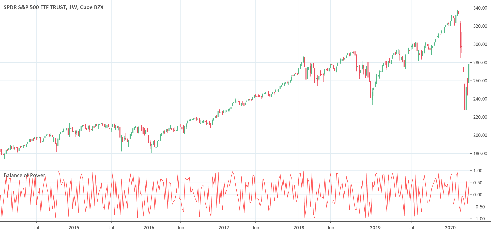</img>

## Formula

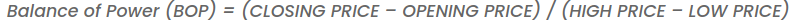</img>

## What does the Balance of Power indicator tell traders? 
The Balance of Power indicator tells traders about the underlying activity in the trading market. More specifically, it shows whether the systematic buying is going on or the systematic selling activity is on the boom. The ability to contradict price movements is the most fascinating of the BOP. Its movement totally against the price is a normal scenario. For example, when the prices make new highs, the BOP may well be making new lows at the very same time.

It has the remarkable potential to trace divergences in the market. It is this aforementioned characteristic that is unmatched by any other simple indicator. The price and the BOP tend to move side by side. When the price reaches a new high but the BOP indicator fails to confirm this movement, it is an indication of a market divergence. Moreover, its movement above and below the Zero Line does not follow the price. It has its own very unique mechanism. As a general rule, movement above the Zero Line indicates systematic buying and movement below the Zero Line shows the systematic selling.

## How to use the Balance of Power indicator? 
The use of the Balance of Power indicator is comparatively easy as compared to some other complex indicators. However, it offers a challenge as well. It is not easy to assess whether the BOP is following the price trend or not. As we have discussed earlier that it follows its own way of working rather than following the price. Most of the traders believe in the general rules mentioned before. A movement above zero is buying opportunity while a movement below zero is a selling opportunity. But the real concern is that it may not be true always. Because of its unique style of working, it may move above or below the Zero Line regardless of the current trend. Furthermore, the BOP indicator can be teamed up with other indicators, it is easier to get an unbiased picture of the market. 

# Average Directional Index (ADX)
- Designed by Welles Wilder for commodity daily charts, the ADX is now used in several markets by technical traders to judge the strength of a trend.
- The ADX makes use of a positive (+DI) and negative (-DI) directional indicator in addition to the trendline.
- The trend has strength when ADX is above 25; the trend is weak or the price is trendless when ADX is below 20, according to Wilder.
- Non-trending doesn't mean the price isn't moving. It may not be, but the price could also be making a trend change or is too volatile for a clear direction to be present.

The average directional index (ADX) is a technical analysis indicator used by some traders to determine the strength of a trend.

The trend can be either up or down, and this is shown by two accompanying indicators, the negative directional indicator (-DI) and the positive directional indicator (+DI). Therefore, the ADX commonly includes three separate lines. These are used to help assess whether a trade should be taken long or short, or if a trade should be taken at all. 

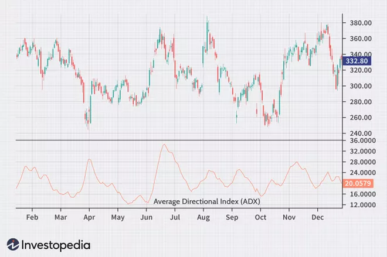</img>

## Formula

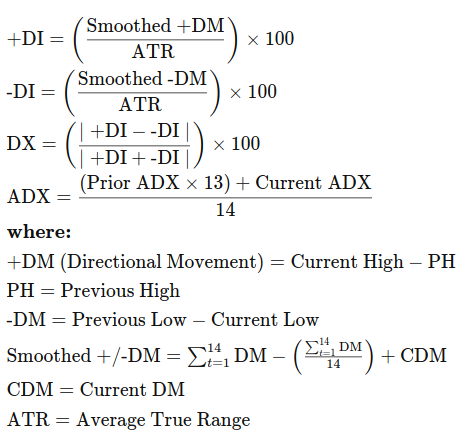</img>

1. Calculate +DM, -DM, and the true range (TR) for each period. Fourteen periods are typically used.
2. +DM = current high - previous high.
3. -DM = previous low - current low.
4. Use +DM when current high - previous high > previous low - current low. Use -DM when previous low - current low > current high - previous high.
5. TR is the greater of the current high - current low, current high - previous close, or current low - previous close.
6. Smooth the 14-period averages of +DM, -DM, and TR—the TR formula is below. Insert the -DM and +DM values to calculate the smoothed averages of those.
7. First 14TR = sum of first 14 TR readings.
8. Next 14TR value = first 14TR - (prior 14TR/14) + current TR.
9. Next, divide the smoothed +DM value by the smoothed TR value to get +DI. Multiply by 100.
10. Divide the smoothed -DM value by the smoothed TR value to get -DI. Multiply by 100.
11. The directional movement index (DMI) is +DI minus -DI, divided by the sum of +DI and -DI (all absolute values). Multiply by 100.
12. To get the ADX, continue to calculate DX values for at least 14 periods. Then, smooth the results to get ADX.
13. First ADX = sum 14 periods of DX / 14.
14. After that, ADX = ((prior ADX * 13) + current DX) / 14.

##  What Does the Average Directional Index (ADX) Tell You?
The ADX, negative directional indicator (-DI), and positive directional indicator (+DI) are momentum indicators. The ADX helps investors determine trend strength, while -DI and +DI help determine trend direction.

The ADX identifies a strong trend when the ADX is over 25 and a weak trend when the ADX is below 20. Crossovers of the -DI and +DI lines can be used to generate trade signals. For example, if the +DI line crosses above the -DI line and the ADX is above 20, or ideally above 25, then that is a potential signal to buy. On the other hand, if the -DI crosses above the +DI, and the ADX is above 20 or 25, then that is an opportunity to enter a potential short trade.

Crosses can also be used to exit current trades. For example, if long, exit when the -DI crosses above the +DI. Meanwhile, when the ADX is below 20 the indicator is signaling that the price is trendless and that it might not be an ideal time to enter a trade. 

# Directional Movememnt Index (DMI)
- The directional movement index (DMI) is a technical indicator that measures both the strength and direction of a price movement and is intended to reduce false signals.
- The DMI utilizes two standard indicators, one negative (-DM) and one positive (+DN), in conjunction with a third, the average directional index (ADX), which is non-directional but shows momentum.
- The larger the spread between the two primary lines, the stronger the price trend. If +DI is way above -DI the price trend is strongly up. If -DI is way above +DI then the price trend is strongly down.
- ADX measures the strength of the trend, either up or down; a reading above 25 indicates a strong trend.

The directional movement index (DMI) is an indicator developed by J. Welles Wilder in 1978 that identifies in which direction the price of an asset is moving. The indicator does this by comparing prior highs and lows and drawing two lines: a positive directional movement line (+DI) and a negative directional movement line (-DI). An optional third line, called the average directional index (ADX), can also be used to gauge the strength of the uptrend or downtrend.

When +DI is above -DI, there is more upward pressure than downward pressure in the price. Conversely, if -DI is above +DI, then there is more downward pressure on the price. This indicator may help traders assess the trend direction. Crossovers between the lines are also sometimes used as trade signals to buy or sell. 

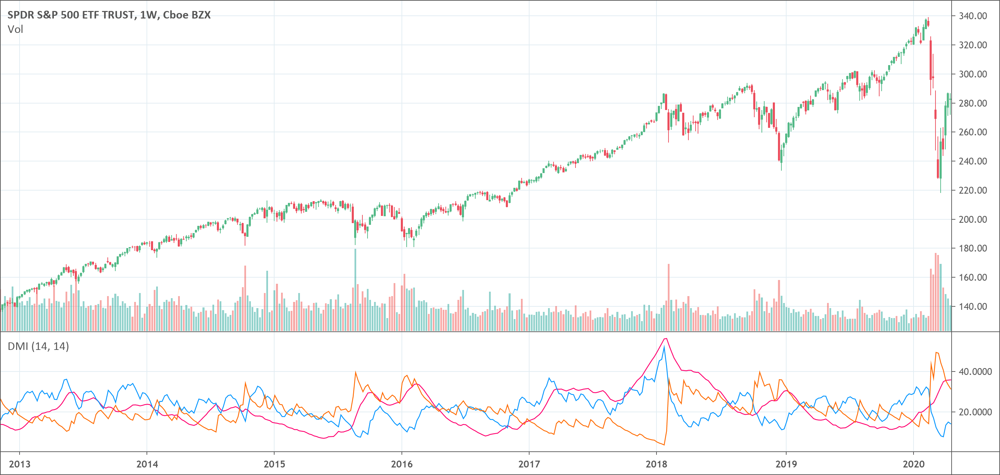</img>

## Formula

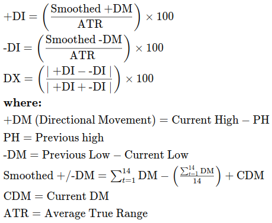</img>

1. Calculate +DM, -DM, and the true range (TR) for each period. Typically 14 periods are used.
2. +DM is the current high - previous high.
3. -DM is the previous low - current low.
4. Use +DM when the current high - previous high is greater than the previous low - current low. Use -DM when the previous low - current low is greater than the current high - previous high.
5. The TR is the greater of the current high - current low, the current high - previous close, or the current low - previous close.
6. Smooth the 14-period averages of +DM, -DM, and the TR. Below is the formula for TR. Insert the -DM and +DM values to calculate the smoothed averages of those as well.
7. First 14TR = Sum of first 14 TR readings.
8. Next 14TR value = First 14TR - (Prior 14TR/14) + Current TR
9. Next, divide the smoothed +DM value by the smoothed average true range (ATR) value to get +DI. Multiply by 100.
10. Divide the smoothed -DM value by the smoothed TR value to get -DI. Multiply by 100.
11. The optional directional index (DX) is +DI minus -DI, divided by the sum of +DI and -DI (all absolute values). Multiply by 100.
12. The average directional movement index (ADX) is a smoothed average of DX, and is another indicator that can be added to the DMI. To get the ADX, continue to calculate DX values for at least 14 periods. Then, smooth the results to get ADX.

##  What Does the Directional Movement Index Tell You
The DMI is primarily used to help assess trend direction and provide trade signals.

Crossovers are the main trade signals. A long trade is taken when the +DI crosses above the -DI and an uptrend could be underway. Meanwhile, a sell signal occurs when the +DI instead crosses below the -DI. In such cases, a short trade may be initiated because a downtrend might be underway. 

The indicator can also be used as a trend or trade confirmation tool. If the +DI is well above -DI, the trend has strength on the upside, and this would help confirm current long trades or new long trade signals based on other entry methods. Conversely, if -DI is well above +DI, this confirms the strong downtrend or short positions. 

# Parabolic SAR Indicator
- The parabolic SAR indicator, developed by J. Welles Wilder Jr., is used by traders to determine trend direction and potential reversals in price.
- The technical indicator uses a trailing stop and reverse method called "SAR," or stop and reverse, to identify suitable exit and entry points. 
- The parabolic SAR indicator appears on a chart as a series of dots, either above or below an asset's price, depending on the direction the price is moving.
- A dot is placed below the price when it is trending upward, and above the price when it is trending downward.

The parabolic SAR attempts to give traders an edge by highlighting the direction an asset is moving, as well as providing entry and exit points. In this article, we'll look at the basics of this indicator and show you how you can incorporate it into your trading strategy. 

The parabolic SAR is a technical indicator used to determine the price direction of an asset, as well as draw attention to when the price direction is changing. Sometimes known as the "stop and reversal system," the parabolic SAR was developed by J. Welles Wilder Jr., creator of the relative strength index (RSI).

On a chart, the indicator appears as a series of dots placed either above or below the price bars. A dot below the price is deemed to be a bullish signal. Conversely, a dot above the price is used to illustrate that the bears are in control and that the momentum is likely to remain downward. When the dots flip, it indicates that a potential change in price direction is under way. For example, if the dots are above the price, when they flip below the price, it could signal a further rise in price.

As the price of a stock rises, the dots will rise as well, first slowly and then picking up speed and accelerating with the trend. The SAR starts to move a little faster as the trend develops, and the dots soon catch up to the price. 

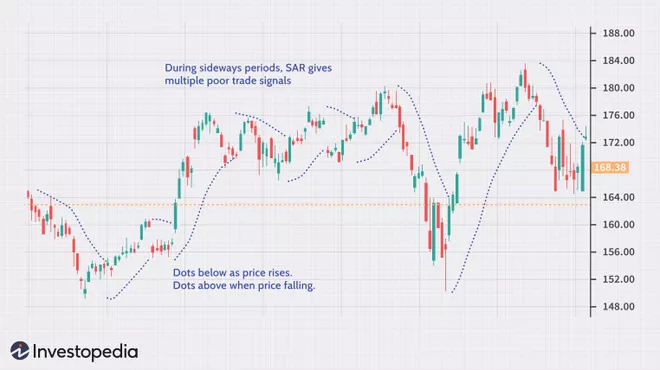</img>

## Formula

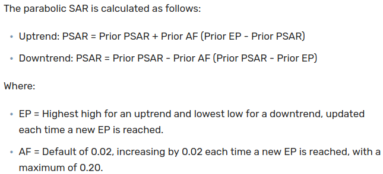</img>

##  How to Trade With the Parabolic SAR
The basic use of the Parabolic SAR is to buy when the dots move below the price bars—signaling an uptrend—and sell or short-sell when the dots move above the price bars—signaling a downtrend.

This will result in constant trade signals, as the trader will always have a position. That can be good if the price is making big swings back and forth—producing a profit on each trade—but when the price is only making small moves in each direction, these constant trade signals can produce many losing trades in a row.

Therefore, it is better to analyze the price action of the day to determine (if there is a trend) whether the trend is up or down. Another indicator, such as a moving average or trendlines, can also be used to establish the overall trend direction. If there is a trend, only take trade signals in the direction of the overall trend. For example, if the trend is down (based on your analysis), only take short trade signals—when the dots flip on top of the price bars—and then exit when the dots flip below the price bars.
In this way, the indicator is utilized for its strength: catching trending moves.

If you have established an overall trend, then hopefully you won't need to worry about the indicator's weakness: non-profitable trade signals when there isn't a trend. 

# Zig Zag 
- The Zig Zag indicator lowers the impact of random price fluctuations and is used to identify price trends and changes in price trends.
- The indicator lowers noise levels, highlighting underlying trends higher and lower.
- The Zig Zag indicator works best in strongly trending markets.

The indicator is used to help identify price trends. It eliminates random price fluctuations and attempts to show trend changes. Zig Zag lines only appear when there is a price movement between a swing high and a swing low that is greater than a specified percentage—often 5%. By filtering minor price movements, the indicator makes trends easier to spot in all time frames.

The Zig Zag indicator is often used in conjunction with Elliot Wave Theory to determine the positioning of each wave in the overall cycle. Traders can experiment with different percentage settings to see what gives the best results. For example, a setting of 4% may define waves more clearly than a setting of 5%. Stocks have their own patterns, so it is likely that traders will need to optimize the Zig Zag indicator’s percentage setting to suit those securities. 

Although the Zig Zag indicator does not predict future trends, it helps to identify potential support and resistance zones between plotted swing highs and swing lows. Zig Zag lines can also reveal reversal patterns, i.e. double bottoms and head and shoulders tops. Traders can use popular technical indicators such as the relative strength index (RSI) and the stochastics oscillator to confirm whether the price of a security is overbought or oversold when the Zig Zag line changes direction. 

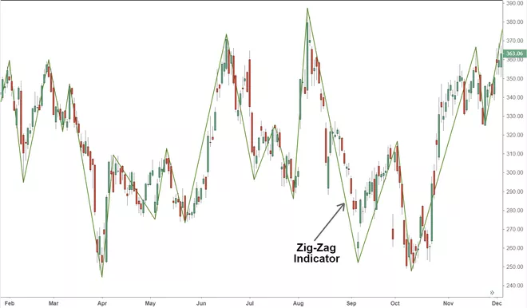</img>

## Formula

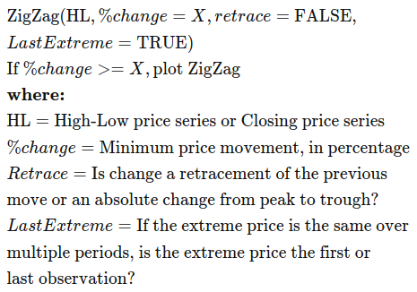</img>

## Parameters of the Zig Zag indicator
### **Deviation**
Deviation is the parameter that assists the traders to set the minimum value of pips or points for the highs or lows to form. This value is expressed in percentage and it is set to 5% by default. That means 5% or above price movements are traced by the Zig Zag indicator and other small fluctuations are ignored. 

### **Depth**
Depth is the parameter that expresses the minimum number of bars on which there will be no construction of the second maximum or minimum deviation. 

### **Backstep**
Backstep is the parameter that shows the minimum number of bars between local highs or lows. 

All these three parameters come together to make it easy for traders to plot the zig zag indicator. It is imperative to understand the working of these parameters. This understanding allows traders to understand how the Zig Zag indicator plots the values and traces the high and low points. 

## What does the indicator tell traders? 
The Zig Zag indicator is a versatile indicator that serves many purposes. It tells traders about the trade direction and the highs and lows on the classic chart. Its functioning depends on its three parameters. The traders can experiment with those parameters to get the best results. It serves best when it is used in conjunction with other analysis techniques such as the Double Top, Support and Resistance, Elliott Wave, etc. The Zig Zag indicator helps the users of Elliott Wave Theory to determine the location of each wave in the trading cycle. It is also easy with the help of the Zig Zag to identify support and resistance zones lying in between the highs and lows. It also indicates the reversal patterns like head and shoulders top. 

Technical analysts advise the traders to stay in a trade until the line of the zig zag indicator confirms in the opposite direction. For example, if the investors are looking to enter a long position, they should wait and avoid selling until the Zig Zag line confirms by turning downward. They also suggest using large timeframes to make the highest profits. Otherwise, the probability of losing trade will be quite high. This is all that makes the zig zag very versatile and only one of its kind.

## How to use the Zig Zag indicator?
As we have discussed earlier that the use of the Zig Zag indicator is comparatively easy as compared to other indicators. Traders can use it in multiple possible ways. It can be employed as a confirmation tool or as a wave counter to assist traders in Elliot Wave. It is also being used to recognize Harmonic patterns. Being a technical analysis tool, it also makes the identification of classic chart patterns easy. It also assists traders to see a larger picture of trends or patterns and the trading direction of the market. As it does not provide automatically generated signals, the traders must manually draw the patterns to visualize the current trends. Technical analysts and experts have devised the following steps to calculate the zig zag indicator. 
1. Choose a starting swing high or swing low point
2. Decide the price movement in percentage or points
3. Identify the next high or low point that deviates away from the chosen starting point
4. Trace the deviation by drawing a trendline joining the starting point to the new point
5. Repeat step 3 and 4 to the most recent low and high points

It is important to understand that a trend line can only be drawn when there is a certain deviation between a swing low and swing high. This deviation can be in terms of percentage or points. Analysts advise using a larger retracement percentage of points. It will help to ignore price noise that is insignificant for the analysis of the traders.

# McGinley Dynamic Indicator
- The McGinley Dynamic indicator is a type of moving average that was designed to track the market better than existing moving average indicators.
- This indicator solves the issue of varying market speeds by incorporating an automatic adjustment factor into its formula, which speeds (or slows) the indicator in trending, or ranging, markets.
- The McGinley Dynamic indicator improves upon conventional moving averages by minimizing price separations and volatile whipsaws so that price action is more accurately reflected.

The McGinley Dynamic indicator attempts to solve a problem inherent in moving averages that use fixed time lengths. The basic problem is that the market, being the great discounting mechanism that it is, reacts to events at a speed that a moving average will not be able to cope with. This issue is called the lag, and there is no type of moving average, whether it be simple (SMA), exponential (EMA), or weighted (LWMA), that is not affected by this. Understandably, this will call into question the reliability of that moving average. The McGinley Dynamic indicator takes into account speed changes in a market (hence, "dynamic") to show a smoother, more responsive, moving average line.

The speed of the market is not consistent; it frequently speeds up and slows down. Traditional moving averages, such as a simple moving average or an exponential moving average, fail to account for this market characteristic. The McGinley Dynamic indicator solves this problem by incorporating an automatic smoothing factor into its formula to adjust to market moves. This speeds, or slows, the indicator in trending, or ranging, markets.

This is not to say that the aforementioned issue of lag has been eradicated, only that the reaction to market movement is faster. The key point to note is that, due to its smoothing constant, it will be more market reactive than other moving averages. The user can customize this indicator through the selection of the number of periods (N). 

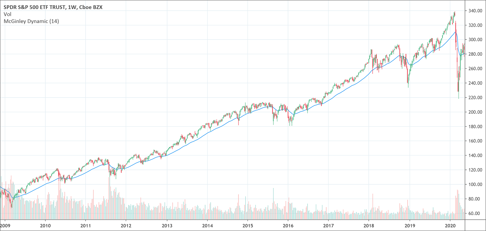</img>

## Formula

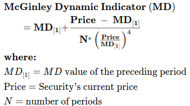</img>

# Aroon Indicator
- The Arron indicator is composed of two lines. An up line which measures the number of periods since a High, and a down line which measures the number of periods since a Low.
- The indicator is typically applied to 25 periods of data, so the indicator is showing how many periods it has been since a 25-period high or low.
- When the Aroon Up is above the Aroon Down, it indicates bullish price behavior.
- When the Aroon Down is above the Aroon Up, it signals bearish price behavior.
- Crossovers of the two lines can signal trend changes. For example, when Aroon Up crosses above Aroon Down it may mean a new uptrend is starting.
- The indicator moves between zero and 100. A reading above 50 means that a high/low (whichever line is above 50) was seen within the last 12 periods.
- A reading below 50 means that the high/low was seen within the 13 periods.

The Aroon indicator is a technical indicator that is used to identify trend changes in the price of an asset, as well as the strength of that trend. In essence, the indicator measures the time between highs and the time between lows over a time period. The idea is that strong uptrends will regularly see new highs, and strong downtrends will regularly see new lows. The indicator signals when this is happening, and when it isn't.

The indicator consists of the "Aroon up" line, which measures the strength of the uptrend, and the "Aroon down" line, which measures the strength of the downtrend. 

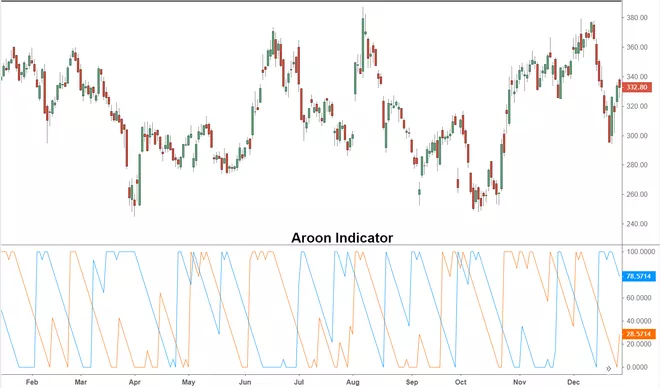</img>

## Formula

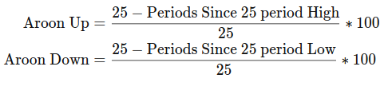</img>

1. Track the highs and lows for the last 25 periods on an asset.
2. Note the number of periods since the last high and low.
3. Plug these numbers into the Up and Down Aroon formulas.

##  What Does the Aroon Indicator Tell You?
The Aroon Up and the Aroon Down lines fluctuate between zero and 100, with values close to 100 indicating a strong trend and values near zero indicating a weak trend. The lower the Aroon Up, the weaker the uptrend and the stronger the downtrend, and vice versa. The main assumption underlying this indicator is that a stock's price will close regularly at new highs during an uptrend, and regularly make new lows in a downtrend.

The indicator focuses on the last 25 periods, but is scaled to zero and 100. Therefore, an Aroon Up reading above 50 means the price made a new high within the last 12.5 periods. A reading near 100 means a high was seen very recently. The same concepts apply to the Down Aroon. When it is above 50, a low was witnessed within the 12.5 periods. A Down reading near 100 means a low was seen very recently.

Crossovers can signal entry or exit points. Up crossing above Down can be a signal to buy. Down crossing below Up may be a signal to sell.

When both indicators are below 50 it can signal that the price is consolidating. New highs or lows are not being created. Traders can watch for breakouts as well as the next Aroon crossover to signal which direction price is going.

## How to use the Aroon indicator?
Traders can use the crossover of the Aroon up and Aroon down lines to easily know the directional movement of price. When the Aroon up crosses above the Aroon down, it creates a signal that the price is about to begin a potential bullish move. On the other hand, when the Aroon down crosses below the Aroon up line, it shows a potential bearish move.

But you should not place a sell or buy order whenever there is a new crossover, because this is shows that the existing trend has changed. Rather, you should wait for the price of the security to breakout of a range or trend line before opening a new position in the direction that the Aroon suggested.

The main idea behind the Aroon technical indicator is that strong bullish trends will probably experience new highs, and strong bearish trends will probably experience new lows. In essence, it will give you important insights when these new highs and new lows are forming.

Traders can use the technical indicator Aroon to:
- Identify new trends (uptrending or downtrending)
- Assess the strength of the trends
- Identify range zone and consolidations
- Anticipate market reversals

## Example Using

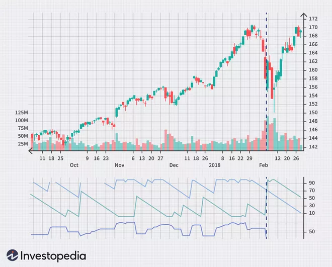</img>

In the chart above, there is both the Aroon indicator and an oscillator that combines both lines into a single reading of between 100 and -100. The crossover of the Aroon Up and Aroon Down indicated a reversal in the trend. While the index was trending, prior to the reversal, the Aroon Down remained very low, suggesting that the index had a bullish bias. Despite the rally on the far right, the Aroon indicator hasn't shown a bullish bias yet. This is because the price rebounded so quickly that it hasn't made a new high in the last 25 periods (at the time of the screenshot), despite the rally. 

