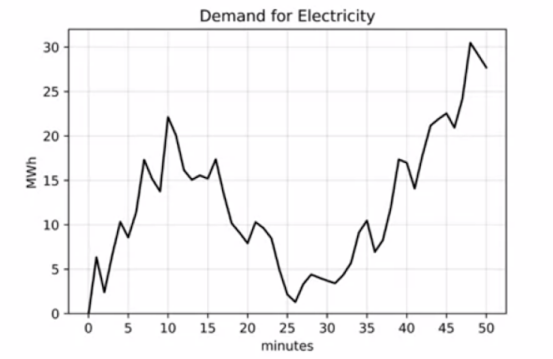
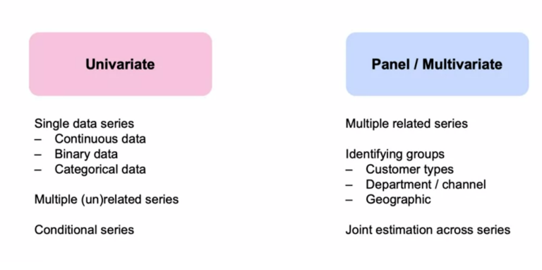

# Time Series Analysis
Time series analysis is a specific way of analyzing a sequence of data points collected over an interval of time. In time series analysis, analysts record data points at consistent intervals over a set period of time rather than just recording the data points intermittently or randomly. 

In investing, a time series tracks the movement of the chosen data points, such as a security’s price, over a specified period of time with data points recorded at regular intervals. There is no minimum or maximum amount of time that must be included, allowing the data to be gathered in a way that provides the information being sought by the investor or analyst examining the activity. 

## **Time Series Forecasting**
Time series forecasting uses information regarding historical values and associated patterns to predict future activity. Most often, this relates to trend analysis, cyclical fluctuation analysis, and issues of seasonality. As with all forecasting methods, success is not guaranteed. 

The Box-Jenkins Model, for instance, is a technique designed to forecast data ranges based on inputs from a specified time series. It forecasts data using three principles, autoregression, differencing, and moving averages. These three principles are known as p, d, and q respectively. Each principle is used in the Box-Jenkins analysis and together they are collectively shown as an autoregressive integrated moving average, or ARIMA (p, d, q). ARIMA can be used, for instance, to forecast stock prices or earnings growth. 

Another method, known as rescaled range analysis, can be used to detect and evaluate the amount of persistence, randomness, or mean reversion in time series data. The rescaled range can be used to extrapolate a future value or average for the data to see if a trend is stable or likely to reverse. 

</img>

</img>

