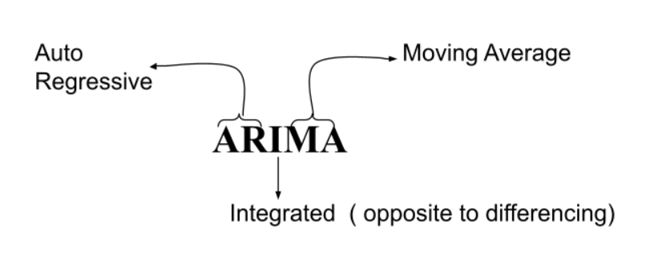
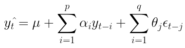

# Autoregressive Integrated Moving Average. ARIMA (p, q, d)

ARIMA is one of the most popular and widely used statistical methods for time series forecasting. 

ARIMA is an acronym that stands for AutoRegressive Integrated Moving Average. It’s a class of models that captures a suite of different standard temporal structures in time series data. It explicitly caters to a suite of standard structures in time-series data, and as such provides a simple, powerful method for making skillful time-series forecasts. It’s a generalization of the simpler AutoRegressive Moving Average, with the added notion of integration.

</img>

- **AR:** Autoregression. A model that uses the dependent relationship between observation and some number of lagged observations.
- **I:** Integrated. The use of differencing of raw observations (e.g. subtracting an observation from observation at the previous time step) to make the time series stationary.
- **MA:** Moving Average. A model that uses the dependency between an observation and a residual error from a moving average model applied to lagged observations.

Each of these components is explicitly specified in the model as a parameter. Standard notation is used of ARIMA(p,d,q), where the parameters are substituted with integer values to quickly indicate the specific ARIMA model being used. 

The parameters of the ARIMA model are defined as follows: 

- **p:** AR. The number of lag observations included in the model also called the lag order.
- **d:** I. The number of times that the raw observations are differenced, also called the degree of difference.
- **q:** MA. The size of the moving average window is also called the order of moving average.

## How does ARIME model work?
Simply put, we have 3 parameters in ARIMA(p,q,d). 

p is from Auto Regression, q is from Moving Averages, and d is from differencing. 

d can be any order of differencing. 

All three parameters are hyper-parameters that need to experiment and figure out which fits best, just like K in K-NN. If d = 2 instead of predicting yt we will use yt’’ to model. 

</img>

Here, μ is some constant + linear combination of the previous p + linear combination of the previous q errored terms + the error this time(Et).

## Summary
- p, q, d are hyper-parameters,
- ARIMA(p, q, d) is a linear regression model on previous p values and previous q errors post differencing d times.
- Also know as the Box-Jenkins model(1976)

