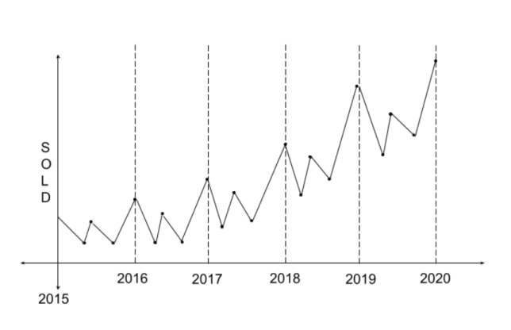

# Seasonal Autoregressive Integrated Moving-Average. SARIMA (p, q, d) (P, Q, D)m
We know the ARIMA model. AR is auto regressive, which says we want to predict the time series values based on some periods in the past. I is integrating, which is an upward or downward trend and to get rid of it, we use differencing. MA is moving average, which is informing the errors from the previous period to the next period. The new thing we see here is S – seasonality. 

The Seasonal Autoregressive Integrated Moving Average (SARIMA) method models the next step in the sequence as a linear function of the differenced observations, errors, differenced seasonal observations, and seasonal errors at prior time steps. 

It combines the ARIMA model with the ability to perform the same autoregression, differencing, and moving average modeling at the seasonal level. 

The notation for the model involves specifying the order for the AR(p), I(d), and MA(q) models as parameters to an ARIMA function and AR(P), I(D), MA(Q) and m parameters at the seasonal level, e.g. SARIMA(p, d, q)(P, D, Q)m where “m” is the number of time steps in each season (the seasonal period). A SARIMA model can be used to develop AR, MA, ARMA and ARIMA models. 

### Seasonatliy

</img>
 

The (P, D, Q) are the analogs of (p, q, d), except for the seasonal components.